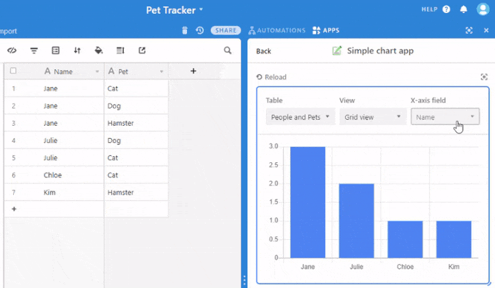
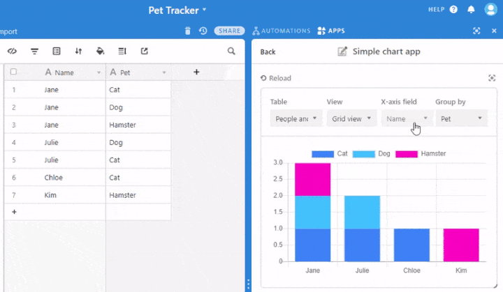
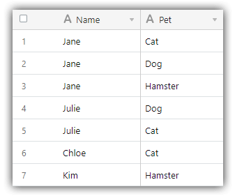
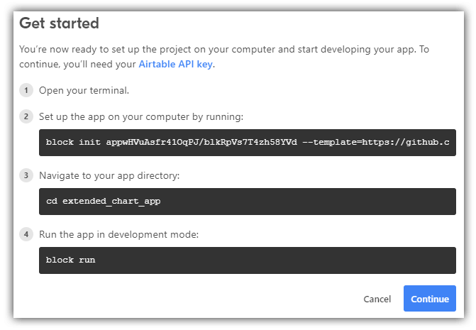
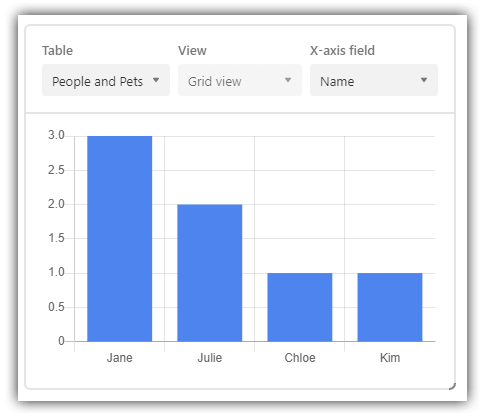
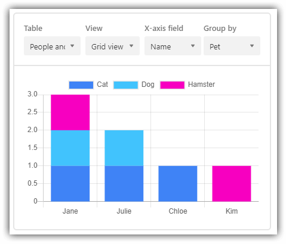

# Extending the Simple Chart App with a Stacked Bar Chart

In this tutorial, we are going to take an existing custom app (the [Simple chart app](https://github.com/Airtable/apps-simple-chart)) and extend it with additional functionality. Specifically, we will be adding a "group by" option to group our y-axis values in a stacked bar chart.

Out of the box, the provided Simple chart app provides you with the basis to create a bar chart that looks something like this:

When we are done today, you'll have extended this same app with a color-coded stacked bar chart with interchangeable x- and y-axis values:

**Let's get to work!**

> **NOTE:** If you haven't already done so, please review the [Getting started guide](https://airtable.com/developers/apps/guides/getting-started) to learn the basics of building your own custom apps!

## Step 1: Laying the groundwork

In an Airtable workspace, add a new base or open an existing base, either is fine.

In your base, create a new table. For simplicity's sake, your table should have two [single line text fields](https://support.airtable.com/hc/en-us/articles/360042311574-Single-line-text-field). Label the columns however you wish and seed the table with some sample data that can be grouped to show off a stacked bar chart. For example, here is the data I'll be working with:

With our table initialized, we can next install a new app. If the *apps pane* is not already open, click the **APPS** link in the upper-right corner, then "Install an app", and finally "Build a custom app".

In the provided dialog, enter a name for your custom app and choose the "Simple chart" example app. Click on "Create app" and follow the instructions provided to initialize your local development environment.

At this point, your local environment should be properly configured and a simple chart visible in the apps pane in your browser. If not, please verify that your table structure matches what has been outlined above.

## Step 2: Tweaking the user interface

The beauty of creating custom apps in Airtable is that they are really just standard JavaScript web apps! In fact, the chart we are creating today makes use of the open source [Chart.js](https://www.chartjs.org/) library.

> **TIP:** It may be helpful to have the [Chart.js documentation](https://www.chartjs.org/docs/latest/) open as well!

Go ahead and open `frontend/index.js` in your code editor of choice. Our first stop will be the Chart.js `Bar` component, which renders our bar chart:

    <Bar
        data={data}
        options={{
            maintainAspectRatio: false,
            scales: {
                yAxes: [
                    {
                        ticks: {
                            beginAtZero: true,
                        },
                    },
                ],
            },
            legend: {
                display: false,
            },
        }}
    />

We are going to make three minor alterations to this component. Since we are converting this to a "stacked" bar chart, we need to add `stacked: true` to both the `xAxes` and `yAxes` properties, like so:

    scales: {
      xAxes: [
        {
          stacked: true,
        },
      ],
      yAxes: [
        {
          stacked: true,
          ticks: {
            beginAtZero: true,
          },
        },
      ],
    },

Let's also add a chart legend. To do so we will simply set `display: true` in the `legend` property:

    legend: {
      display: true,
    },

The last of our UI tweaks is to add a fourth `FormField` component allowing us to choose the "Group by" column from our table. You'll notice the `Settings` function at the bottom of the page returns a `Box` component. Before the `</Box>` tag, append another `FormField` component, like so:

	{table && (
	  <FormField label="Group by" width="25%" paddingLeft={1} marginBottom={0}>
	    <FieldPickerSynced table={table} globalConfigKey={GlobalConfigKeys.Y_FIELD_ID} />
	  </FormField>
	)}

We're not quite done yet. Notice the `width="25%` attribute. Make sure the other `FormField` components have the same width value, so all of our `FieldPickerSynced` components display properly. Finally, make a note of the `globalConfigKey` attribute. We'll be focusing on that value in the beginning of the next step!

> **NOTE:** We are using `FieldPickerSynced` components instead of `FieldPicker` components because we want the selected values to sync with [GlobalConfig](https://airtable.com/developers/apps/api/models/GlobalConfig).

Don't worry if you save `index.js` and see errors in your custom app. That's to be expected at this point!

## Step 3: Setting up the "group by" field

Instead of hard-coding column names into our select elements, we can use GlobalConfig to set/get table, view, and column values. Along with the x-axis label, we also want to store the y-axis label (this will be our "group by" field). Luckily for us, an example is provided by virtue of the `X_FIELD_ID` property of our `GlobalConfigKeys` declaration:

	const GlobalConfigKeys = {
	  TABLE_ID: 'tableId',
	  VIEW_ID: 'viewId',
	  X_FIELD_ID: 'xFieldId',
	};

Since we want our newly created "group by" field to *also* load column names and persist the selected column, let's add another property: `Y_FIELD_ID`.

	const GlobalConfigKeys = {
	  TABLE_ID: 'tableId',
	  VIEW_ID: 'viewId',
	  X_FIELD_ID: 'xFieldId',
	  Y_FIELD_ID: 'yFieldId',
	};

Next, in our `SimpleChartBlock` function we need to be able to get data from GlobalConfig and assign it to a variable. Again, we can duplicate the two lines of code that begin with `const xFieldId ...` and `const xField ...` to track our y-axis (group by) fields like so:

	const yFieldId = globalConfig.get(GlobalConfigKeys.Y_FIELD_ID);
	const yField = table ? table.getFieldByIdIfExists(yFieldId) : null;

Finally, we need to pass `yField` to the `data` object to render our chart. Simply replace the `const data ...` line of code with this:

	const data = records && xField && yField ? getChartData({ records, xField, yField }) : null;

You'll notice we are verifying that `yField` is defined and passing `yField` to the `getChartData` function.

With me so far? **Great!** On to the final step.

> **NOTE:** If you get mixed up at any point, you can always consult the [completed version of this tutorial on GitHub](https://github.com/rdlauer/simple_chart_app/blob/main/frontend/index.js)!

## Step 4: Wiring up the table data to our chart

So far we have:

1. Initialized a custom simple chart app.
2. Set up a table of data.
3. Tweaked some UI elements.
4. Configured the app to set/get the column of data we want to group by.

**Now comes the fun part!** Let's update our JavaScript code to properly render our data from the table.

The `getChartData` function requires `records` from our table and the `xField` (x-axis field) to render the chart. Go ahead and add the `yField` variable here as well, so your function declaration should look like this:

	function getChartData({ records, xField, yField }) {

Next, we are using a Map object (a key-value pair) to store all table records associated with the x-axis column. To properly configure our chart's data sets (more on this in a bit) we will *also* store records associated with the y-axis column.

Let's add a `recordsByYValueString` variable along with an empty array to store Chart.js `dataset` objects for the chart. Your `getChartData` function should now start with these three lines of code:

	const recordsByXValueString = new Map();
	const recordsByYValueString = new Map();
	const chartDatasets = [];

We need to loop over all of the records in our table to determine our x-axes, y-axes, and the relationships between the two to properly display a stacked (grouped) set of data. Basically we need to determine:

1. The unique x-axis string values;
2. The unique y-axis string values;
3. The count of y-axis values by x-axis in order to group them.

Inside our first `for` loop we are going to keep the existing code the same. Before the end of the loop though, we want to get the string value of the y-axis (or group by) field from the table records provided:

    const yValue = record.getCellValue(yField);
    const yValueString = yValue === null ? null : record.getCellValueAsString(yField);

Finally, we want to load the y values into the `recordsByYValueString` Map object along with their associated table records:

    if (!recordsByYValueString.has(yValueString)) {
      recordsByYValueString.set(yValueString, [record]);
    } else {
      recordsByYValueString.get(yValueString).push(record);
    }

After our `for` loop is complete, we now have some data structures we can work with to populate our chart!

Still within the `getChartData` function, create an array of distinct x-axis values using the `keys()` method:

	const xLabels = [...recordsByXValueString.keys()];

Then let's continue by initializing a couple of variables to help us add some color to our stacked bar chart:

	const bgColors = ['#2d7ff9', '#18bfff', '#ff08c2', '#f82b60', '#ff6f2c', '#fcb400', '#20c933', '#8b46ff', '#666666'];
	let bgColorIndex = 0;

> **TIP:** Be sure to have at least as many colors in the array as distinct y-axis fields you have to display!

See this next section of code? I want you to delete it as we no longer need it!

    const labels = [];
    const points = [];
    for (const [xValueString, records] of recordsByXValueString.entries()) {
        const label = xValueString === null ? 'Empty' : xValueString;
        labels.push(label);
        points.push(records.length);
    }

Adding a "group by" option ramps up the complexity of our app a bit, so we are better off starting the next section from scratch!

Go ahead and replace the above section with the following code (we'll walk through it):

	for (const [yValueString, records] of recordsByYValueString.entries()) {
	  let chartData = [];
	
	  for (const [xValueString, records] of recordsByXValueString.entries()) {
	    let count = 0;
	    for (const record of records) {
	      if (record.getCellValue(yField) === yValueString) {
	        count++;
	      }
	    }
	    chartData.push(count);
	  }
	
	  chartDatasets.push({ label: yValueString, backgroundColor: bgColors[bgColorIndex], data: chartData });
	  bgColorIndex++;
	}

Here is pseudo-visualization of what we are accomplishing with the above code:

	We loop over `recordsByYValueString`.
	|
	|__Within the loop we iterate over `recordsByXValueString`.
	   |
	   |__We create an array of numbers in `chartData` which are *counts* of x-axis values *by* y-axis value.

We also supply the y-axis `label` and the `backgroundColor` of the stacks in our bar chart.

For example, based on the table data I used at the beginning of this tutorial, one element of my `chartDatasets` array will look like this:

	{ label: 'Cat', backgroundColor: '#2d7ff9', data: [1,1,1,0] }

> **NOTE:** The `data` array values correlate with the x-axis values in the order of the records in your table.

If you're with me so far, you've gotten through the most difficult part of this tutorial. **Congrats!** If not, head back to the beginning of this step to review any missteps (or check out a [completed version](https://github.com/rdlauer/simple_chart_app/blob/main/frontend/index.js) of the code).

Finally, we can simplify the `data` declaration by passing the x-axis `labels` and the array of `datasets` we just created:

	const data = {
	  labels: xLabels,
	  datasets: chartDatasets,
	};

## Step 5: Play around with your new bar chart!

When you save your changes locally, your custom app will reload automatically in the browser. Go ahead and choose the x-axis and y-axis columns using the provided select elements. Your new stacked bar chart should appear, color-coded by the "group by" selection.

Play around with your chart by adding/removing data from your table and swapping x- and y-axis elements.

Have fun charting with Airtable custom apps! 📊 