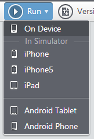
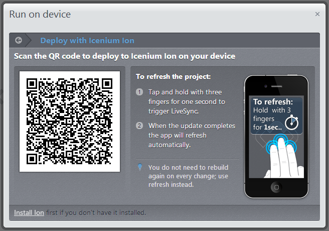

## The Beauty of Icenium Ion

**The Problem:** You are developing a new mobile app in Icenium and want to start testing it on a variety of iOS devices. Your co-worker has an iPhone 4, your friend just bought an iPhone 5, your Mom has an iPad, and you have an old 3GS laying around - or maybe you have all of these in-hand already. How do you quickly and easily deliver an app for testing on each device?

**Potential Solution #1:** Talk to everyone and get them to send you the unique identifier (UDID) for each device. Your Mom asks, "What on earth is a 'you did'?". You respond, "Don't worry about it Mom, just plug the iPad into your computer, open up iTunes, navigate to your device, click on the serial number field, and tell me what that really long string of characters is." Provided that chain events is actually successful: take that string, plug it into the new provisioning profile you have created on the Apple Developer Center web site, download and install the profile. Oh, and then, if you don't have the devices in person, you'll also need to either look into a third party testing service or work on an Ad-Hoc distribution.

**Potential Solution #2:** Use Icenium Ion. Send a QR Code to all of your testers. Have them scan the code with a QR code reader. Start testing.

Thanks, and I'll take #2 please!

In this post I'll tell you everything you need to know about Icenium Ion - what it is and how you use it. By the end I hope you'll be as convinced as I am of the beauty of Icenium Ion.

### Icenium Ion - What It Is

Ion itself is an app [available for free from the Apple App Store](https://itunes.apple.com/us/app/icenium-ion/id527547398?mt=8). It provides a "shell" for your Icenium apps to run on your iOS device. You simply deploy test builds of your app via the Graphite or Mist IDEs to Ion and the app runs exactly like any other app. Ion does not interfere in any way - you can rest assured the way in which your app performs while testing with Ion is exactly the same way it would perform if installed manually on your device.

### Icenium Ion - Which Problems It Solves

Why is Ion such a big deal? I propose that it solves three potential stumbling blocks for mobile app developers:

#### Issue #1 - Mobile Device Provisioning

If you test an iOS app in the traditional manner, there is a multiple step process of creating what is called a "provisioning profile" within the iOS Developer Center. This basically links one or more devices to your Apple developer account. This is not necessarily a difficult process, technically speaking (once you figure it out). However, it can be a logistical problem acquiring all of the UDIDs from all of the different devices on which you want to test. More importantly, any devices you want to test on must be physically connected to your computer (try testing on an iPhone 3GS/4/4S/5 and iPad 1/2/3 by plugging them in one at a time - not fun!) or you have to work on an Ad-Hoc distribution with Xcode.

This leads us to the next issue that Ion helps us to overcome - remote testing:

#### Issue #2 - Remote Testing

Normally testing an iOS app remotely is not an easy process. While it is possible and there are some nice third party testing tools available, you still have to go through the provisioning process for each device.

Ion, on the other hand, allows you to simply deliver a QR code (say, via email) to your testers anywhere in the world. They scan the code and voila, the app is on their device and available for testing.

#### Issue #3 - Apple iOS Developer Account

Every method of testing requires you to have an iOS developer account (since you need an account to create a provisioning profile). What if you are a new iOS developer and don't want to spend the $99/year required just to try it out? What if you are ready to test your app but don't want to wait a few days to get your developer account approved by Apple? In either case, Ion is a good solution for you.

There is no requirement to have an iOS developer account to use Icenium Ion. You can test on a virtually unlimited number of devices without ever having to touch the developer center web site. You will of course need a developer account eventually should you want to publish your app on the Apple app store.

At this point I think we are in agreement that Icenium Ion is a powerful testing tool, to say the least. We know what Ion is and which problems it helps us overcome. Lets take a moment to see how we actually use it:

### Icenium Ion - How It Works

You have the ability to utilize the testing features of Ion within either the [Graphite](http://www.icenium.com/get-started) or [Mist](http://www.icenium.com/get-started) clients. The processes are similar, but worth going over separately:

#### Testing in Mist

After you open up your project in Mist, from the main menu choose **Run -> On Device**. *You do not need your iOS device to be connected to your computer for this to work!*

From there you will be presented with a dialog that allows you to choose your testing option. For the purposes of this post, we are focusing on Ion, so choose that option:

Now you are provided with a QR code. Depending on where the device(s) are that you want to test with, you have a couple of options.

1. If you haven't done so already, make sure Ion is installed on all of your testing devices. It's available for free from the Apple app store.
2. You (and/or your testers) will also need a QR code reader. There are many options available, personally I recommend [QRReader](https://itunes.apple.com/us/app/qr-reader-for-iphone/id368494609?mt=8).
3. Using your QR code reader, scan the provided code. That's it! Your app should load successfully and be ready for testing. No provisioning required!

If your testers are not readily available, you can also easily send them the QR code a couple different ways:

1. Take a [screenshot](http://www.take-a-screenshot.org/) of the QR code and send that to your users.
2. Right-click on the QR code image and copy/paste the URL of the image into an email ("Copy Image URL" with Chrome, "Copy Image Location" with Firefox, and, well, "E-mail Picture" in IE).

One key thing to remember with Ion is that you can refresh your project at any time by holding down three fingers at the same time anywhere on the app. This will request the latest saved version from Icenium and automatically load it in your device. How awesome is that!?

#### Testing in Graphite

If you thought setting up Ion via Mist was difficult (yes, I am kidding) then you will love Graphite even more. To use Ion from Graphite you simply:

1. Connect your iOS device to your computer (remember that it does not have to be provisioned!)
2. Open up Ion on your device. Your app will automatically load and be available for testing.
3. Done!

There are a couple of additional advantages to using Ion from within Graphite: LiveSync and access to the debugging tools.

**LiveSync** allows you to view changes made to your app the instant they are saved in Icenium. No need to do the three-finger refresh. If LiveSync is enabled you will see those changes made right away (and yes, it is enabled by default). *In a future post we're going to dive much deeper into this amazing feature of Icenium!*

In addition, you always have access to the **device log**, which is incredibly useful if you want to output some variables or log a message to verify that certain functions are performing as expected:

Finally, if you are using an iOS 6 device that **is already provisioned**, you can access the full suite of debugging features of the built-in **web inspector**. You simply enable the web inspector in Mobile Safari's options (in your iOS settings). Take a look at [this short video](http://screencast.com/t/uJLxaqSA4) to see the feature in action.

### Conclusion

In this post we examined Icenium Ion from front to back - what it is, which issues it overcomes, and how we actually use it. I hope you found this useful and start using Ion as an integral part of your iOS testing story!