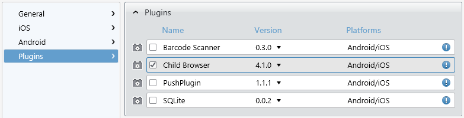
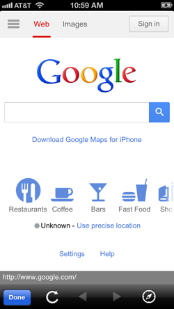

## ChildBrowser Plugin - External Web Content Inside Your App

Arguably the most popular Cordova plugin since it was first released, the ChildBrowser plugin is both a remarkably useful and easy to use addition. If you aren't familiar with ChildBrowser, it provides you with a way to display external web content within the context of your app. As the name implies, it spawns a child browser window that runs inside of your app. ChildBrowser is so popular, in fact, that as of version 2.3 of Cordova, similar functionality is included by default (called InAppBrowser). In this post I hope to show you everything you need to get started with both ChildBrowser and InAppBrowser.

### ChildBrowser or InAppBrowser - Which to Choose?

ChildBrowser and InAppBrowser are more alike than they are different. As noted above, InAppBrowser is included as part of Cordova, while ChildBrowser is an external plugin. However, ChildBrowser is included as part of Icenium, so setup is also a breeze. When InAppBrowser was first released, it was much more limited than ChildBrowser. Since that time, though, InAppBrowser has caught up to be nearly feature-identical. What I'm essentially saying is: you can't go wrong either way. If you have an existing app that uses ChildBrowser (and you like it) - keep using it. If you are starting a new app, you might want to give InAppBrowser a try.

Lets take a little time to go through how we configure and utilize both ChildBrowser and InAppBrowser. Maybe then you'll get an idea of which solution is right for you.

### ChildBrowser Setup

Lets start a new project within Graphite and see what it takes to get going with the ChildBrowser plugin. If you aren't yet familiar with the Graphite IDE, take a look at the multi-part [Deep Dive into Icenium Graphite](http://www.icenium.com/community/blog/icenium-team-blog/2013/04/05/diving-into-icenium-graphite-part-1-of-3) series.

First things first, I'm going to include the ChildBrowser plugin in my Icenium project. Navigate to your project properties by double-clicking on the **Properties** option in the **Project Navigator**.

Navigate to the **Plugins** pane and check the box next to the **ChildBrowser** plugin. Save your changes and you are all set - ChildBrowser is ready to be used in your project!

Finally, add a reference to the ChildBrowser JavaScript file:

	

Now we're ready to write some code!

### ChildBrowser Example

At it's very simplest, we can open a ChildBrowser window with an input (in this case a Kendo UI Mobile touch widget that responds to tap events) which is then tied to a little JavaScript function.

	<a id="btnCB" data-role="touch" data-tap="openChildBrowserWindow" class="km-button">Try ChildBrowser</a>

	function openChildBrowserWindow() {
	    window.plugins.childBrowser.showWebPage("http://google.com/");
	}

When we touch the "Try ChildBrowser" button, we get the following result:

ChildBrowser offers a few options that you can optionally pass when initiating the window:

* showLocationBar - shows or hides the location bar (default true)
* showAddress -  show or hides the address bar (default true)
* showNavigationBar - shows or hides the entire navigation bar (default true)

Example usage:

	window.plugins.childBrowser.showWebPage("http://google.com/", { showLocationBar: false });

You may close your ChildBrowser window by calling the **close** method:

	window.plugins.childBrowser.close();

**Android Note:** If you are using ChildBrowser with an Android device, you can use the **openExternal** method in place of **showWebPage**. This allows you to use the built-in Android browser, which is useful for displaying PDFs or YouTube videos.

Finally, ChildBrowser allows you to **subscribe to events** associated with the browser window. For example, you can call a function when the ChildBrowser window is closed or when the location changes:

	window.plugins.childBrowser.onClose = function () {
	    console.log("The window was closed");
	};

	window.plugins.childBrowser.onLocationChange = function (url) {
		console.log("The location has changed to: " + url);	    
	};

At this point we've seen how easy it is to use the ChildBrowser plugin. Can it get any simpler? Well, yes, if we use the InAppBrowser instead!

### InAppBrowser Example

One nice feature of InAppBrowser is that there is no setup or configuration at all, it just works as part of Cordova 2.3 and later. So lets get right to a simple example use:

	<a id="btnIA" data-role="touch" data-tap="openInAppBrowserWindow" class="km-button">Try InAppBrowser</a>

	function openInAppBrowserWindow() {
	    window.open("http://google.com/", "_blank");
	}

Touching the "Try InAppBrowser" button provides us with the following result (looks similar to the ChildBrowser window, no?):

As with ChildBrowser, you can hide the location bar if you so desire:

	window.open("http://google.com/", "_blank", "location=no");

You can also close your InAppBrowser window by calling the **close** method:

	function openInAppBrowserWindow() {
		var win = window.open("http://google.com/", "_blank");
		win.close();
	}

**Android Note:** If you are using InAppBrowser with an Android device and want to display a PDF or YouTube video (for example), you can specify a target of "_system" which will bring up the built-in browser:

	window.open("http://google.com/", "_system");

Finally (and again, like ChildBrowser), InAppBrowser allows you to **subscribe to events** associated with loading and exiting the browser window.

	function openInAppBrowserWindow() {
		var win = window.open("http://google.com/", "_blank");
		
		win.addEventListener('loadstart', function(e) { 
			console.log(e.type + ' - ' + e.url);
		});

		win.addEventListener('loadstop', function(e) {
			console.log(e.type + ' - ' + e.url);
		});
		
		win.addEventListener('loaderror', function(e) {
			console.log(e.type + ' - ' + e.url + ' - ' + e.code + ' - ' + e.message);
		});
		
		win.addEventListener('exit', function(e) {
			console.log(e.type);
		});
	}

## Conclusion

The ability to spawn a browser window inside of your hybrid mobile app is a really easy win that provides you, as an app developer, additional flexibility. I hope you've seen how easy it is to integrate either the ChildBrowser plugin or the built-in InAppBrowser into your Icenium projects.