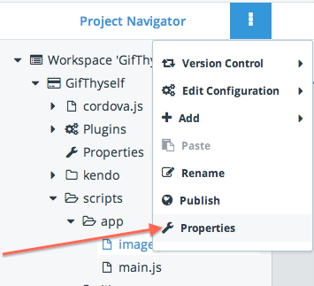
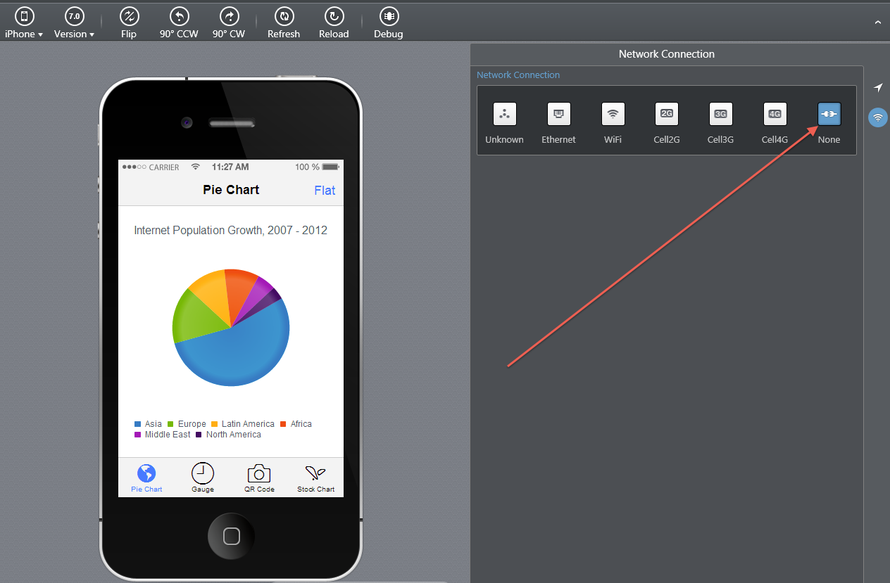
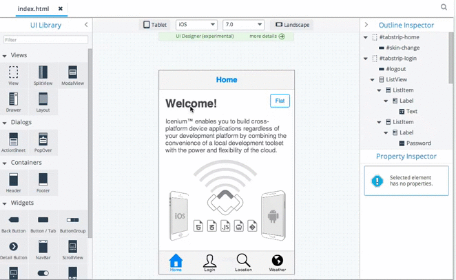

# December Icenium Updates: A New Look For Mist, Cordova 3.2, And More

Today we're happy to announce a new release of Icenium with a number of new features, updated library support, and stability improvements. There's a lot to cover so let's dive right in.

#### Overview of This Release

* [A New Look for Mist](#mist)
* [Support for Apache Cordova 3.2](#cordova)
* [Updated Visual Studio Extension](#visual-studio-extension)
* [Improved UI Mobile Designer](#ui-mobile)

<h3 id="mist">A New Look For Mist</h3>

[Icenium Mist](https://app.icenium.com/Mist/), our cloud based development suite has been redesigned from the ground up for a cleaner look and an improved user experience.

All menus, popup messages, dialogs, and wizards have been reworked to provide more context-sensitive information to help you complete tasks. For instance the build dialog now gives you additional help text on the various build options Icenium provides.

We'd love to hear your thoughts on the new look and whether there's anything else we can do to improve.

<h3 id="cordova">Support for Apache Cordova 3.2</h3>

Apache Cordova released version 3.2 in late November with a [number of bug fixes and enhancements](http://cordova.apache.org/announcements/2013/11/22/cordova-320.html) - including one for the dreaded [status bar in iOS7](/blog/icenium-team-blog/2013/11/07/everything-hybrid-web-apps-need-to-know-about-the-status-bar-in-ios7).

All Icenium project templates and sample applications have been updated to target Apache Cordova 3.2. To update your existing projects go to its project properties shown below.

Then update the "Cordova Version" accordingly.

*Note: To get to the same dialog in Visual Studio right click on the project in the Solution Explorer and select "Properties".*

In addition to this, Icenium now comes with integrated support for the [StatusBar](https://github.com/apache/cordova-plugins/blob/master/statusbar/README.md) and [Keyboard](https://github.com/apache/cordova-plugins/blob/master/keyboard/README.md) plugins for iOS.

<h3 id="visual-studio-extension">Updated Visual Studio Extension</h3>

Out latest release also brings a number of enhancements to Icenium's extension for Visual Studio, including:

* **Support for on-device debugging of iOS apps.** For devices that run iOS6 or later, and apps that have a provisioning profile for iOS development, you can now do on-device debugging directly within Visual Studio.
* **Improved support for the connection API in the device simulator.** Within Visual Studio's simulator, setting the connection type to *None* now disables all network requests - perfect for testing the offline capabilities of your apps. 
* **Improved build process** To help debug potential issues, the Icenium Extension for Visual Studio now uploads temporary build data. You can remove this data at any time by selecting **Icenium -> Remove <project name> Data from Cloud** in the menu bar.

<h3 id="ui-mobile">Improved UI Mobile Designer</h3>

Finally, this release adds a number of powerful new features to our UI Mobile Designer in Mist and Graphite.

From within the UI Mobile Designer, you can now switch between tablet and phone simulators, switch iOS versions, and even change the device orientation between portrait and landscape.

We've also made the UI designer easier to use with an integrated widget filter and some context sensitive help that links to [Kendo UI Mobile's API documentation](http://docs.kendoui.com/api/mobile/) appropriately. You can see these new enhancements below.

### What's Next?

We're hard at working getting our next set of features ready for the new year, but what we really want to know is what's important to you? We'd love to hear about what features would make your life easier in our [feedback portal](http://feedback.telerik.com/Project/87).