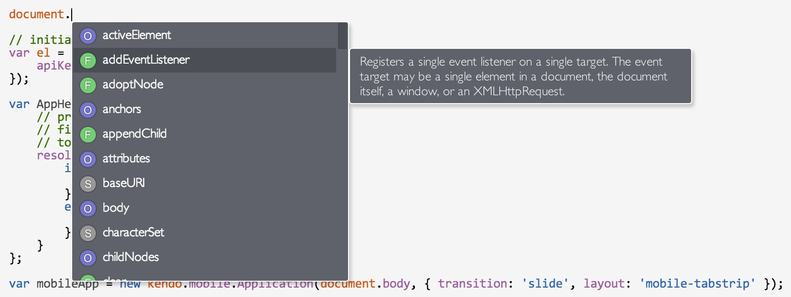
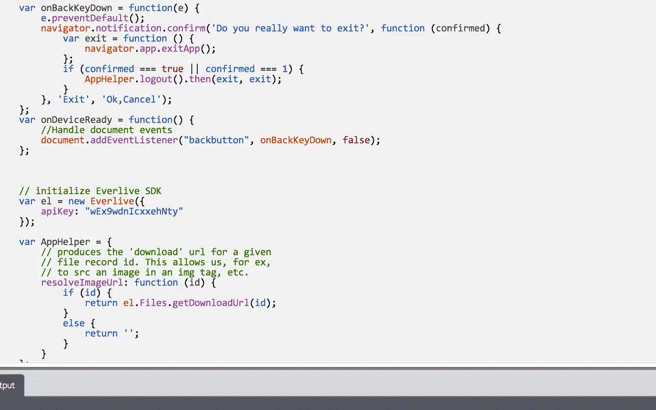
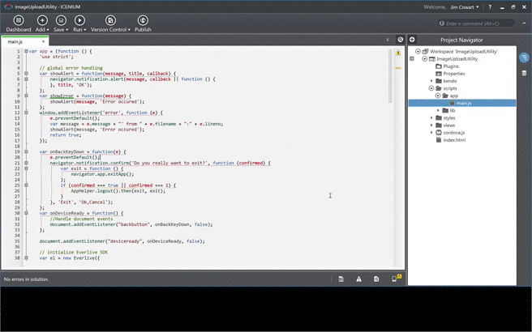
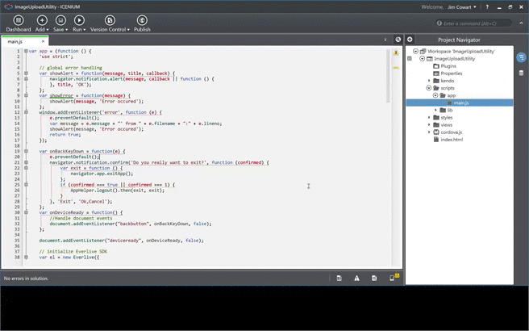

Last week the Icenium engineering team wrapped up another sprint and rolled out version 1.7. I'm very excited about this release because it includes some [tern.js](http://ternjs.net/) integration with [Icenium Mist](http://www.icenium.com/product/mist). This enables code completion as well as nice finishing touches like auto completion for brackets and parentheses. Also, if you're an [Icenium Graphite](http://www.icenium.com/product/graphite) (our Windows desktop IDE) user, you can now further personalize your development experience by customizing the editor settings. Let's take a quick peek at some of these features.

##Tern.js in Icenium Mist
Can't remember the name of the method or property you need? No worries, just hit `Ctrl` + `Spacebar` after the dot:

As you scroll/arror up and down on the list of members, you'll see a description out to the right for the selected item. You'll also notice that members are marked with their general "type": `F` for functions, `O` for objects, `S` for strings and `1` for numeric values.

You can also hit `Ctrl` + `I` to get variable type checking and parameter hints. In the example below, I'm typing `Ctrl` + `Spacebar` as soon as I type "document.add", and since the only member that matches that would be `addEventListener`, it auto-completes the member name for me. Then I hit `Ctrl` + `I` to view information on the `addEventListener` method. As soon as I type the opening parentheses for the method, you see the parameter hints appear:

##Customizing Icenium Graphite
Customizing your development environment isn't just about style - it's about removing the little barriers that get in the way of optimal productivity. We've supported several features to enable tighter control over code formatting for a while now. You can see some of these by going to Options, then the Advanced tab:

So what did we add? If you open up Options and go to General, then expand the "TextEditor" portion, you'll see that we can change tab and font settings, as well as the ability to automatically insert closing tags in HTML, and what IDE mode to open HTML files with (code view, designer, etc.):

You'll notice that you can import themes. You can grab a few theme options from us by cloning [this repository](https://github.com/Icenium/color-schemes) (or downloading them directly). Importing a theme is quite simple:

If you were to peek into one of these themes, you'll notice that it's just JSON! So it's easy to modify an existing one or create your own (though Graphite allows you to clone themes, etc from within the Color Schemes settings as well).

##What Else?
This release also introduced the ability to include platform-specific files. Support for platform-specific files is still at an early stage (they don't currently work in our simulator, or in the UI Designer), but future releases will continue to improve this.

We've also updated our Kendo UI support. You'll see the latest Kendo UI Mobile and DataViz versions in the project templates, and you'll see that the sample apps in those templates have been updated to showcase the updates to Kendo UI. We've also made it possible to switch between native and Flat UI themes while you're running these project templates (whether you're on a device or using the simulator).

If you haven't checked out Kendo UI Mobile yet, now's a great time to dive in. Of course, you can build with any framework when you use Icenium, but we're especially proud of how well Icenium and Kendo UI work together, and think you'll be impressed as well.
