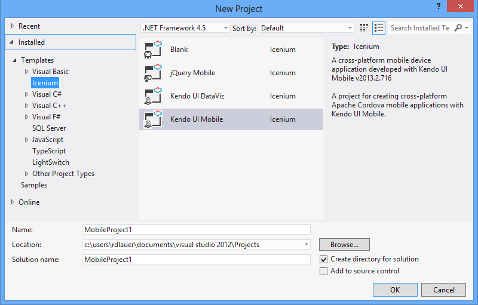
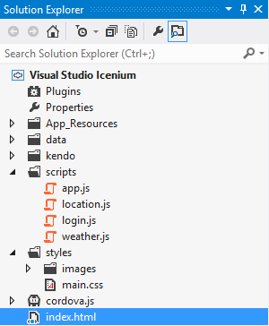
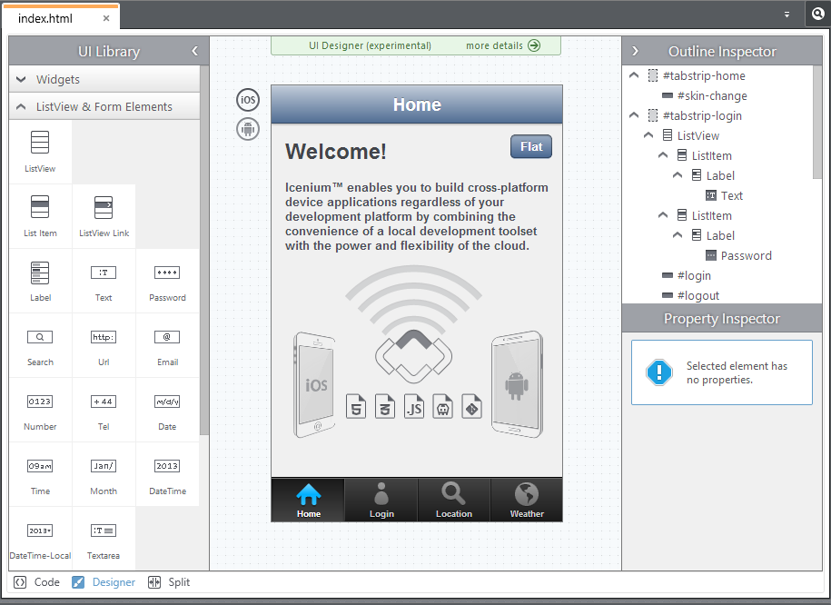

## Announcing the Icenium Extension for Visual Studio!

As a long time user of [Microsoft's Visual Studio](http://www.microsoft.com/visualstudio/eng/products/visual-studio-overview) (since the dark ages of Visual InterDev if you must know) I was initially hesitant to switch gears and use one of the two provided IDEs for Icenium: the browser-based Mist or the native Windows client, Graphite. A short time later my skepticism was fully squashed as I truly enjoyed the development experience provided by these tools. However, truth be told, I have missed some parts of Visual Studio. I have too many years invested, too many settings tweaked, and too many collaboration/source control tools in place to completely divest myself of this time-tested IDE. That's why today is extra special to me, as we get to announce the release of one of the most anticipated Icenium features: Visual Studio integration! Starting today, you can build iOS and Android hybrid mobile apps directly within Visual Studio and utilize the best of what Icenium has to offer.

That's not the only new feature, not by a long shot. We are also proud to announce:

- Availability of [Cordova 3.0](http://cordova.apache.org/)
- Enhancements to the popular [Kendo UI Designer](http://docs.icenium.com/creating-your-project/designing-ui/run-configure) in Icenium
- Significant improvements to both the [Mist](http://www.icenium.com/product/mist) and [Graphite](http://www.icenium.com/product/graphite) clients

Before we get into the details, though, be sure to register for the [release keynote](https://event.on24.com/eventRegistration/EventLobbyServlet?target=registration.jsp&eventid=677882&sessionid=1&key=5143F94E0EB48E0A135CF9FB055E95B7) coming up on Thursday, September 26th which will cover all of this and more (with the opportunity to win some cool mobile devices). With all of this to talk about, let's get started!

For those of you who just want to skip right to it, you can [**download the Icenium Extension for Visual Studio**](http://cdn.icenium.com/live/vs/Icenium.vsix). For rest of you, read on:

### Icenium Extension for Visual Studio (Beta)

Telerik has a proud history of involvement with the .NET community, and while we have certainly expanded our reach with HTML5/JavaScript tools such as [Kendo UI](http://kendoui.com), we also realize that many of our customers are committed users of Visual Studio. We heard your feedback loud and clear. This is why Visual Studio integration was made such a high priority - and why your experience of using Icenium within Visual Studio was considered at every step of the way. This is not a cobbled-together Visual Studio add-in - nearly everything you have been doing inside of Graphite or Mist you will be able to do within Visual Studio. In addition, you get to enjoy all the productivity enhancements you have come to love in Visual Studio such as:

- Popular Visual Studio extensions that support TypeScript, CoffeeScript, LESS, SASS and others
- Integration with a preferred source control system such as TFS (Team Foundation Server), Subversion, and Git to allow for advanced team collaboration
- Advanced code editing features such as IntelliSense and built-in code snippets

### How It Works

In future posts we will take a deep-dive into using the Icenium Extension for Visual Studio, but for now let's have a quick look at how we can get up and running in just a few minutes:

- Close all running instances of Visual Studio (better safe than sorry!) and install the **Icenium Extension for Visual Studio**. The installation should take all of one minute or so.

- **Open up Visual Studio and create a new project** with Ctrl-Shift-N or by choosing "File -> New Project". You can now browse the new Icenium project templates which include the four familiar options you are used to seeing already: Blank Project, [jQuery Mobile](http://jquerymobile.com/), [Kendo UI DataViz](http://www.kendoui.com/dataviz.aspx), and [Kendo UI Mobile](http://www.kendoui.com/mobile.aspx).

- Upon creating a new Icenium project, you are provided with all of your application assets as you would expect in the **Visual Studio Solution Explorer**. At this point you can edit/debug code, add images, include your favorite JavaScript libraries - all as you would expect when developing any other application within Visual Studio! This goes without saying, but since you are in Visual Studio you also get to take advantage of other extensions you may have installed like code analysis tools such as [JustCode](http://www.telerik.com/products/justcode.aspx). How cool is that?

- Once you have a project started, you'll probably want to use the **Icenium Device Simulator**. Luckily for you, the simulator is built right into Visual Studio. By accessing the "Icenium -> Run [Project] in Simulator" menu option, you have full access to the familiar device simulator.

**What about project collaboration?** Many .NET shops are fully invested in other collaboration and code repository systems such as Team Foundation Server, Bitbucket, GitHub, or Subversion. Since you are developing within Visual Studio, you have access to these now as well. All of your work inside of Visual Studio is done offline, so if you don't have a network connection, not a problem.

We have so much more to show you (and many new features to share as time goes on) with the Icenium Extension for Visual Studio. Your time is precious though and we can't forget about the other new improvements with this release:

### Cordova 3.0 Support

The **latest release of Cordova** is now included as part of Icenium. All of the project templates and sample apps have been updated to include this new version. If you're curious about the nuts and bolts of what has been updated in Cordova, check out the [iOS](http://shazronatadobe.wordpress.com/2013/07/19/whats-new-in-cordova-ios-3-0-0/) and [Android](http://www.infil00p.org/introducing-cordova-3-0-0-for-android/) release notes.

### Updates to Mist and Graphite

Code analysis in Mist is getting a boost with improved analysis of JavaScript within HTML files and better definitions for Cordova, Kendo UI Mobile, and Kendo UI DataViz. Mist also gets its own diff tool this time around. Graphite's diff tool gets an upgrade as well to help you better determine what has changed from version to version in your app.

Last, but certainly not least, there are numerous improvements to the ever popular **Kendo UI Designer** within Mist and Graphite. You now have the ability to use drag and drop "invisible" widgets like the DataSource, ModalView, Drawer, Layout, and Form elements:

### Conclusion

If you can't already tell, we are extremely excited about this new release as we think it will directly benefit all of our users, but most significantly those of us who are regular Visual Studio users. [Start using the Icenium Extension for Visual Studio](http://cdn.icenium.com/live/vs/Icenium.vsix) and let us know what you think. We will be releasing new features for Visual Studio (and of course for Mist and Graphite) frequently so the best way to impact the direction of Icenium is to sound off on our [feedback portal](http://feedback.telerik.com/Project/87). Finally, don't forget to register for the [release keynote on September 26th](https://event.on24.com/eventRegistration/EventLobbyServlet?target=registration.jsp&eventid=677882&sessionid=1&key=5143F94E0EB48E0A135CF9FB055E95B7) (and win some cool mobile devices while you're at it!).