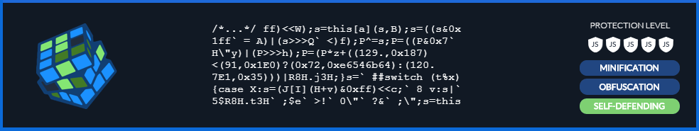

## Telerik AppBuilder – Some Simple, Effective Methods for Securing Your Source Code

You've spent countless hours developing your app. You've nurtured it from its inception as an idea, held it through its grueling testing and debugging, and finally, watched it progress into a full-featured mobile app ready to be distributed to the world.

The only lingering question is this: How do you protect all of your invested time, money, and hard work from being copied, altered or otherwise used for free?

**If this sounds about right, then you're in luck!**

In this article, we’ll discover:

- why security is so important
- how [Telerik AppBuilder](http://www.telerik.com/appbuilder) can eliminate much of the pain of creating cross-platform mobile applications by offering you a way to create apps for iOS, Android, and Window Phone – all with a single, familiar codebase
- how AppBuilder helps keep your source code secure
- additional security methods for those seeking some additional peace of mind

### Why Protect Your Code?

Protecting your intellectual property is more important than ever, especially when you consider the exponential advancement of companies moving from their traditional brick-and-mortar stores selling physical goods, to the online world of downloadable products and services.

Of course, you can always rely on the copyright laws in place to protect your intellectual property, but think about it: doesn’t it seem much more efficient to, rather than waiting until *after* your rights have been violated, *prevent* this from happening in the first place?

### Telerik AppBuilder

**[Telerik AppBuilder](http://www.telerik.com/appbuilder) allows programmers to use their current knowledge of web development languages – HTML, CSS, and JavaScript – to develop cross-platform mobile applications.**

How, you ask? Using AppBuilder – with options ranging from an [In-Browser Client](http://www.telerik.com/appbuilder/in-browser-client), to a [native Windows Client](http://www.telerik.com/appbuilder/windows-client), to an [extension for Visual Studio](http://www.telerik.com/appbuilder/visual-studio-extension), to a full-featured [Command-Line Interface](http://www.telerik.com/appbuilder/command-line-interface), and a [Sublime Text package](http://www.telerik.com/appbuilder/sublime-text-package) – you can create powerful mobile applications using only your web programming skills!

This single codebase is then pushed to the application "wrapper" installed on an end user’s device, which essentially functions as a web browser stripped of all functionality, except those you code into it. In the end, it looks, feels, and behaves just like a native app.

### How it Works

Telerik AppBuilder is backed by [Apache Cordova's](https://cordova.apache.org/) extensive collection of device APIs to provide this functionality.

This collection of APIs allows the web programming code that you push to the wrapper to interact with the device’s software and hardware – just like a native application would.

### Security

The first line of defense here comes from how this browser-like "wrapper" works. Even though it is essentially an empty browser shell, the wrapper actually strips away all the features that you would normally find in a browser, leaving you with just an empty window, a blank canvas on which to create your masterpiece.

For example, in a desktop browser, an end user would be able to right-click and open the DOM Explorer, giving him or her access to all the code that makes the web page tick – including your JavaScript. This wrapper simply doesn't have those features anymore.

### The Limitations

While this level of protection does offer some protection, it's important to keep in mind that, although users will be prevented from viewing your source code in this browser shell, they could still be decompiled or unpackaged outside of the device.

What can you do to prevent this or, at least, make it more difficult for this to happen? Well, here are a couple simple ways to get you started:

### Keeping Your Business Secrets, Secret – Storing Sensitive Resources on the Server

Storing your sensitive proprietary information on the server is just a good practice, the basic rule of thumb being: If your user doesn't absolutely need an asset, don't include it in the downloadable resources. Rather, use an API (Application Programming Interface) to send the necessary information to the server. Then, after the server performs the computation, return the results to your application.

While the advantage of this method is that it does keep your business logic secure, keep in mind that it also makes it an absolute requirement for a user to be connected to the internet in order to access that resource. *In other words, it may not be the best option for apps designed for offline use or for users in areas with a spotty connection.*

### Obfuscation – Making Your Code Indecipherable to the Naked Eye

An alternative method of protection is obfuscation. JavaScript, by its nature, is a client-side scripting language. That is, it must be readable by the browser in order to be of any use. Because of this, it is wide open to being read – and copied and reused or modified – by end users.

What obfuscation does is take your existing code and translate it into a format that a browser can read, but humans can't read without having an extremely difficult time. One such product is JScrambler:

### JScrambler

The [JScrambler](https://jscrambler.com/en/) software takes a multi-level approach to not only obfuscating your source code, but also providing additional features such as code compression and optimization, and adding code traps.

**The first level of this software's approach is to optimize your code.** It does this by compressing your code by removing unnecessary white space and characters and enhancing its processing performance. This, in turn, reduces your file size, making for faster load times and better processing speeds.

**The next level is obfuscation.** This part takes that optimized code and makes it virtually unreadable to the naked eye. While it's still *technically* readable, it reduces the number of people willing to copyright infringe to only those with technical expertise and determination.

**The final level of protection comes in the form of code traps.** Code traps are added to your existing code, allowing you to do things such as set expiration dates for an application's functionality (great for trial periods, for example), as well as preventing normal browser debugging functionality. This means that, even if someone were able to successfully unpackage your application, the code itself would shut down if it were run outside a permitted list of operating systems or browsers.

### Summary

The combination of [Telerik AppBuilder](http://www.telerik.com/appbuilder) and [JScrambler](https://jscrambler.com/en/) offers developers an incredibly robust development solution. JScrambler gives you the power to take your precious code - compress, optimize, and protect your application’s logic - and seamlessly integrate it with AppBuilder, where that single codebase can be used to publish your mobile application to all of your favorite app stores!