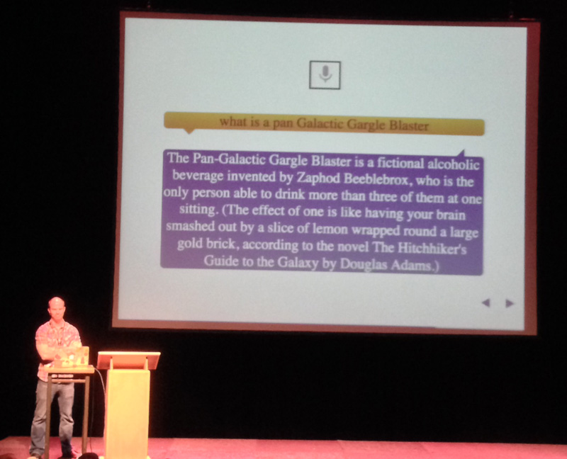

## Live from PhoneGap Day EU 2013

Last week the PhoneGap team held their 2nd annual European conference in the vibrant city of Amsterdam. Appropriately named [PhoneGap Day EU](http://pgday.phonegap.com/eu2013/), this was a conference perfectly crafted for every level of hybrid mobile app developer who uses the Cordova/PhoneGap framework.

The organizers picked a wonderful venue for the conference as well: the [Compagnietheater](http://www.compagnietheater.nl/compagnietheater.html). Centrally located in an older section of Amsterdam, it was a great spot for a conference that showcases some of the best of what the open source movement has brought to hybrid mobile app development.

### PhoneGap Day EU

PhoneGap Day conferences are relatively unique in that there is only one track for attendees. Each session is only 20 minutes long (10 minutes for vendor sessions - and let me tell you, does that get interesting). This format is definitely a double-edged sword: if you get bored you only have to wait a few minutes for the next speaker, but more likely, the speakers will leave you wanting more!

Day one of the conference was filled with workshops geared towards every level of PhoneGap developer. [Christophe Coenraets](https://twitter.com/ccoenraets) and [Holly Schinsky](https://twitter.com/devgirlFL) led a series of workshops that took you from a beginner PhoneGap developer to architecting more advanced apps (and what you can do with Cordova plugins). Google and Microsoft also gave workshops on how to develop Chrome Packaged Apps and Windows Phone 8 apps using the Cordova framework - separately of course :).

### My Session on App Store Rejection

I personally had the privilege of not only attending the conference, but speaking as well. My session was on app store rejection - tips and tricks on how to avoid rejection, especially on the iOS app store. For those of you who are curious, my [slides](https://www.dropbox.com/s/fuzl0n2zfqbap06/rejected.pptx) and [notes](https://www.dropbox.com/s/kaalu5ory8owghx/rejected_notes.docx) are available for download. This talk was loosely based on my Icenium [blog post on the same subject](http://www.icenium.com/blog/icenium-team-blog/2013/05/16/ios-app-store-approval-tips-and-tricks).

(Thanks to Vincent Hoogsteder for the picture and thanks to Reddit for the slide idea!)

### Other Session Highlights

Every speaker did a great job, and no I'm not just saying that. I'd like to take a moment to recognize the speakers here and encourage you to follow them on Twitter and/or look into their topics more closely:

1. [Vincent Hoogsteder](https://twitter.com/hoogsteder) from Distimo gave one of the more interesting talks on tracking app revenue. I learned that if you really want to monetize your apps you need to consider Asia (33% of worldwide app revenue) and go the free app + in-app purchase route (95% of app revenue comes from in-app purchases now).
2. [Greg Avola](https://twitter.com/gregavola) of [untappd](https://untappd.com/) fame presented a great example of a web application that had to go mobile. He chose the Cordova framework and had an app ready to go in about 12 hours of development time - something you would struggle to do with native tools, to say the least.
3. Masahiro Tanaka gave a fascinating talk about using the [monoca framework](https://github.com/monaca) which allows you to use native iOS and Android UI elements and transitions in your Cordova app.
4. [Kristofer Joseph](https://twitter.com/dam) showed off the always impressive [topcoat](http://topcoat.io/) CSS framework, which is very much focused on performance in mobile apps.
6. Google's [Andrew Grieve](https://twitter.com/grieveandrew) was (eventually!) able to demonstrate some impressive [Chrome plugins for Cordova](https://github.com/MobileChromeApps/mobile-chrome-apps). This is definitely a space to watch as Google invests in these plugins and we're able to use more Chrome APIs in Cordova.
7. [Simon MacDonald](https://twitter.com/macdonst) gave a slick presentation on speech recognition in hybrid mobile apps - the demos really showcased how easy it can be to include speech in your apps (take a look at his [plugin](https://github.com/macdonst/SpeechShim) if you don't believe me).

The list goes on and on: [Michael Brooks](https://twitter.com/mwbrooks) on the PhoneGap CLI was great and showcased the power of the CLI, [Fil Maj](https://twitter.com/filmaj) showed off a really interesting end-to-end testing platform called [appium](http://appium.io/), and [Ally Ogilvie](https://twitter.com/allyogilvie) dove into the impressive [Ejecta](http://impactjs.com/ejecta) framework for developing performant HTML5 games with Cordova.

### What About Icenium?

You may be asking, what does all of this have to do with Icenium? Well, Icenium uses the Cordova framework at its core, so everything that has to do with PhoneGap directly applies to what we are all building with Icenium. In fact, with the [latest release of Icenium](http://www.icenium.com/blog/icenium-team-blog/2013/09/23/announcing-the-icenium-extension-for-visual-studio), we are now using the latest version of Cordova and include the [Icenium Extension for Visual Studio](http://cdn.icenium.com/live/vs/Icenium.vsix) as another development option!

### Conclusion and Thanks

If you are considering attending a future PhoneGap Day conference, trust me when I say it is well worth the time. It doesn't matter if you are a complete beginner or a seasoned hybrid mobile app developer, you will get something out of this conference and meet some cool people as well.

I'd like to send a big thanks out to some of the organizers, including [Colene](https://twitter.com/colene), [Brian](https://twitter.com/brianleroux), [Martijn](https://twitter.com/Martijnvduuren), and [PPK](https://twitter.com/ppk). Without them this never would have been possible.
