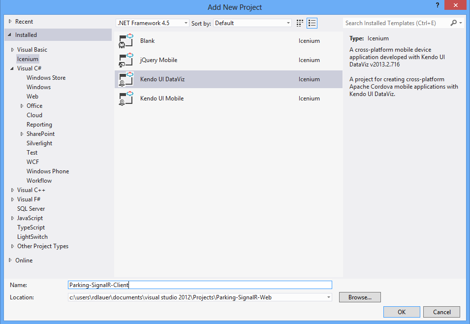

## Real-Time Reporting with SignalR, Kendo UI DataViz, and Icenium Part 2

In the [first part of this series](http://www.icenium.com/blog/icenium-team-blog/2013/10/16/real-time-reporting-with-signalr-kendo-ui-dataviz-and-icenium-part-1), we created our SignalR hub and added a simple web form that allowed us to push data to our client apps in real-time. With our server-side code and hub complete, we now need to get into Icenium and create the most important part of our project - the hybrid mobile app. For this exercise we are going to stay inside of Visual Studio and use the new [Icenium Extension for Visual Studio](http://cdn.icenium.com/live/vs/Icenium.vsix).

If you missed it, please read through the [first part](http://www.icenium.com/blog/icenium-team-blog/2013/10/16/real-time-reporting-with-signalr-kendo-ui-dataviz-and-icenium-part-1) just so we're all on the same page. In that post we talk about what [SignalR](http://signalr.net/) is and what it can do for us as hybrid mobile app developers.

### Implementing our Hybrid Mobile App

Building off of our first project, let's go ahead and add a new Icenium project to our Visual Studio solution. From the **File** menu in Visual Studio we can choose **New Project...** and select **Icenium** to see a list of Icenium project templates. Since we are going to use [Kendo UI DataViz](http://www.kendoui.com/dataviz.aspx) for our data visualizations, let's choose that as our project type:

Just like when you use any other non-blank Icenium template, you're going to get a lot of boilerplate content. Usually this is useful, but for our example, we can get rid of a lot of these extra assets. Let's start with the **index.html** file. We are going to create a really simple app that has only one view. This view is going to show us a radial gauge of how many parking spots are available and which spots are available. Here is our markup:

	<!DOCTYPE html>
	<html>
	    <head>
	        <title></title>
	        <meta charset="UTF-8" />
	        <link href="kendo/styles/kendo.dataviz.mobile.min.css" rel="stylesheet" />
	        <link href="kendo/styles/kendo.dataviz.flat.min.css" rel="stylesheet" />
	        <link href="styles/main.css" rel="stylesheet" />
	
	                
	        
	        
	        
	        
	        
	    </head>
	    <body>
	
	        

	            
	            

	                

	                    Parking Availability
	                

	            

	
	            

	                

	            

	            
	            

	                Available Spots:
	                 
	                
	            

	
	        

	
	    </body>
	</html>

Most of this markup should be pretty familiar to you already. We are referencing the mobile Kendo UI DataViz stylesheet along with the new Kendo UI flat skin stylesheet. We also reference some standard javascript assets for this project (jQuery and Kendo UI DataViz). The CSS for our app is going to go into the existing **main.css** file. You can replace everything currently in there with this:

	body, html
	{
	    margin: 0;
	    height: 100%;
	    width: 100%;
	}
	
	.view-content
	{
	    text-align: center;
	    padding: 1em;
	    margin: 0 auto;
	}
	
	#available-wrapper
	{
	    border: 1px solid;
	    margin-bottom: 70px;
	    padding: 15px 15px 15px 25px;
	    background-repeat: no-repeat;
	    background-position: 10px center;
	    font-size: 22px;
	    font-weight: bold;
	    display: block;
	    color: #4F8A10;
	    background-color: #DFF2BF;
	}

You'll also notice that we are referencing the same two SignalR javascript libraries that we used in our web form. Make sure you copy over the **signalR-1.1.3.js** file from your other project into this one.

Finally, we have some content placeholders for our [Kendo UI DataViz radial gauge](http://demos.kendoui.com/dataviz/radial-gauge/index.html) and a span to insert the actual parking spots available. The markup here is quite straightforward.

Let's wire everything up now!

Open up the existing **app.js** file and replace everything in there with the following code (don't sweat it, we'll walk through all of this):

	$(function () {
	
	    // initialize our kendo ui mobile application
	    var kui = new kendo.mobile.Application(document.body, { skin: "flat" });
	
	    // initialize our signalr connection
	    $.connection.hub.url = "http://localhost/parking-signalr-web/signalr";
	    var chat = $.connection.parkingHub;
	
	    $.connection.hub.start()
	        .done(function () { console.log('Now connected, connection ID=' + $.connection.hub.id); })
	        .fail(function () { console.log('Could not Connect!'); });
	
	    chat.client.broadcastMessage = function (result) {
	        var arr = $.parseJSON(result);
	        app.gauge.drawGauge(arr.length);
	        $("#available-spots").text(arr.toString().replace(/,/g, ", "));
	    };
	    
	});

There are two main initialization tasks going on here. First of all we are setting up our Kendo UI Mobile application with one line of javascript. This allows us to easily apply the flat skin to our app. Secondly we are initializing a connection to our SignalR hub. Notice this line in particular:

	$.connection.hub.url = "http://localhost/parking-signalr-web/signalr";

This line MUST be a valid URL to connect to the SignalR hub we just created. In my case I'm simply testing on localhost. If this were in production, I would point it at the production URL of my SignalR hub.

Finally, we are logging some messages to make sure that our connection was either successful or a failure - and, most importantly, we are tying into the **broadcastMessage** method of our **ParkingHub** class.

**THIS is where the SignalR magic happens!**

	chat.client.broadcastMessage = function (result) { ...

When a new message is received from our hub, the **result** variable contains the string which we then convert to an array for processing. Just a few lines of code to do something so powerful!

So we have all of our markup, all of our styles. We have initialized our application and connected to the SignalR hub. What's left? The only other thing we have to do is draw our Kendo UI DataViz radial gauge. We can go ahead and add the following code to our **app.js** file:

	(function (global, $) {
	    var gauge,
	        $gauge,
	        app = global.app = global.app || {};
	
	    app.gauge = {
	        
	        // initialize our kendo ui dataviz radial gauge
	        createGauge: function () {
	            $gauge = $("#gauge");
	            app.gauge.drawGauge(0);
	        },
	
	        // re-draw the gauge based on the data we are passing to it
	        drawGauge: function (count) {
	            gauge = $gauge.kendoRadialGauge({
	                theme: "silver",
	                renderAs: "svg",
	                pointer: {
	                    value: count
	                },
	                scale: {
	                    minorUnit: 1,
	                    startAngle: -30,
	                    endAngle: 210,
	                    max: 10,
	                    ranges: [
	                        {
	                            from: 6,
	                            to: 10,
	                            color: "#c0c0c2"
	                        }, {
	                            from: 4,
	                            to: 6,
	                            color: "#ffc700"
	                        }, {
	                            from: 2,
	                            to: 4,
	                            color: "#ff7a00"
	                        }, {
	                            from: 0,
	                            to: 2,
	                            color: "#c20000"
	                        }
	                    ]
	                }
	            }).data("kendoRadialGauge");
	        }
	
	    };
	})(window, jQuery);

The two functions I want you point you to are **createGauge** and **drawGauge**. The createGauge function is executed when our view is initialized. If you look back at our HTML, you'll see this property added to our content div:

	 data-init="app.gauge.createGauge"

This HTML5 data- attribute tells Kendo UI to execute this function when this view is first initialized. At that point, drawGauge is then executed, which is what actually renders our gauge using the count of the number of available parking spots as its data source. Everything else in the drawGauge function is used to style the gauge itself. Feel free to play around with the settings to get a better feel for how the radial gauge works.

You know what? We're done! At this point we should have a fully-functional app. Go ahead and start up the Icenium device simulator. Using the **ICENIUM** menu option in Visual Studio, choose, **Run [project] in Simulator**. This will bring up the familiar Icenium device simulator. (Did you know you can also just use the classic Visual Studio Start button to do the same thing?)

### The Point at Which It Gets Cool

Go ahead and open up your web form at this time. With one window showing the list of available parking spots and with the Icenium device simulator open at the same time, we can now watch the magic of SignalR in action! Go ahead and check one or more of the parking spots as being occupied. You should INSTANTLY see your simulator update to reflect the change! The gauge should redraw based on the quantity of parking spots available and you should see a list of available spot numbers. How cool is that?

After you occupy some parking spots, your mobile app should look something like this:

### Where Do We Go From Here?

What we have accomplished here is obviously just the tip of the iceberg. We have created two simple applications with Icenium and Visual Studio that can talk to each other using the power of SignalR - all the while showcasing how easy it is to integrate gorgeous data visualizations with Kendo UI DataViz. If you'd like, the full source for both applications is available [here](https://github.com/rdlauer/Parking-SignalR-Web/). I encourage you to build off of this example and work on some real-time mobile reporting tools of your own using Icenium and Kendo UI DataViz!
