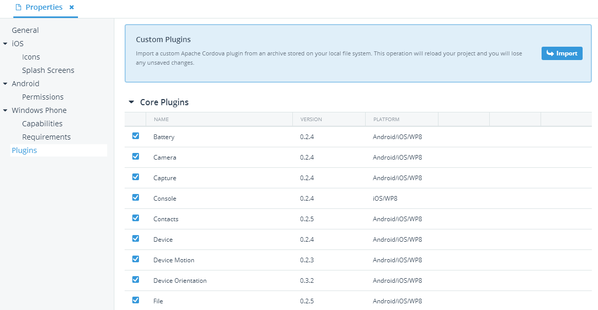

## Which Core PhoneGap/Cordova Plugins Do I Need?

The release of Cordova 3.0 brought with it a much lighter core due to the absence of basic API features such as access to the device camera, file system, and the InAppBrowser. Now of course these features didn't disappear into thin air, rather they are now separately installable as plugins. Along with the benefit of a lighter Cordova footprint, these "core" plugins are now updated outside of regular Cordova releases as needed. The downside is that we hybrid mobile developers must now try to figure out which of these core plugins we need in our apps and how to include them. In this post I will give you a quick summary of each core plugin and how easy they are to enable in your apps (especially when using [Telerik AppBuilder](http://www.telerik.com/appbuilder)).

### What Exactly Is a Core Plugin?

A core PhoneGap/Cordova plugin is an API that was included in PhoneGap prior to 3.0, but is no longer part of the base installation. These are generally APIs that allow for direct interaction with the device itself - such as accessing geolocation data, the contacts database, camera, image library, and so on.

Now, when confronted with the question of *"Which core plugins do I need in my project?"* the answer is not quite as clear as one would first think. Sure, if I'm accessing the camera, it's pretty obvious that I need the camera plugin. But do I need the `Connection` plugin for my app to use a network connection? And if I want to use HTML5 Local Storage on my device, do I need the `File` plugin? (The answer is "no" to each of those questions, but feel free to read on.)

The next obvious question is, *"Why wouldn't I just install all of the core plugins?"*. The answer to that is - you can! However, there are reasons why that may not be such a great idea. The three biggest reasons to selectively install core plugins are:

- Decreased build times (the fewer core plugins you use, the faster your builds are generated).
- Less worry about maintenance and updating to the latest core plugin versions (although with AppBuilder, these updates happen for you!).
- Slightly smaller app package size.

### How Do I Install a Core Plugin?

Included with each plugin description below is the [Cordova CLI](http://cordova.apache.org/docs/en/edge/index.html) command to install the appropriate plugin (since of course, they are all [plugman-compatible](http://blogs.telerik.com/appbuilder/posts/13-10-14/how-to-make-your-apache-cordova-plugins-plugman-compatible)).

If you are an AppBuilder user though, you'll find the process significantly easier! Simply double-click on your project's **Properties** and navigate to the **Plugins** panel. There you will be provided with the following menu that allows you to easily enable or disable any core plugins that you desire. This is also where you'll find our **verified integrated plugins**, such as the [Barcode Scanner](http://blogs.telerik.com/appbuilder/posts/13-07-03/using-the-barcode-scanner-plugin-with-icenium), [PushPlugin](http://blogs.telerik.com/appbuilder/posts/14-01-14/let's-get-push-notifications-working-in-phonegap-and-ios) for push notifications, [SQLite Plugin](http://blogs.telerik.com/appbuilder/posts/13-05-28/adding-dynamic-data-with-the-sqlite-plugin), the [Telerik Analytics](http://www.telerik.com/analytics) plugin, and the [Telerik Mobile Testing](http://www.telerik.com/mobile-testing) plugin.

**Here at Telerik have much more in store for Cordova plugins this Summer as well, so stay tuned!**

Let's go through each of the core plugins and briefly describe what they do, who needs them, and how you install them with the Cordova CLI.

### Battery

Do you perform an action in your app when the device battery reaches a low or critical state? Do you notify your users of the state of their battery charge? If so, you may very well find yourself in need of the battery plugin. You can handle events related to when the battery charge increases/decreases and when the device is connected/disconnected from a power source. [[API Docs](https://github.com/apache/cordova-plugin-battery-status/blob/master/doc/index.md)]

`cordova plugin add org.apache.cordova.battery-status`

### Camera

This is an easy one. If your app uses the device's camera to take pictures, or if you want to view the device's image library, you'll want to add the camera plugin. [[API Docs](https://github.com/apache/cordova-plugin-camera/blob/master/doc/index.md)]

`cordova plugin add org.apache.cordova.camera`

### Capture (a.k.a. Media Capture)

Similar to the camera plugin, the media capture plugin allows you to access the device's audio and video capturing capabilities. So, if you are creating an app that captures hilarious cat videos, yes, you will need this plugin. [[API Docs](https://github.com/apache/cordova-plugin-media-capture/blob/master/doc/index.md)]

`cordova plugin add org.apache.cordova.media-capture`

### Console

If you are developing an iOS app and would like to view any `console.log()` output in your [Xcode](https://developer.apple.com/xcode/) console, you will need to include the console plugin. [[API Docs](https://github.com/apache/cordova-plugin-console/blob/master/doc/index.md)]

`cordova plugin add org.apache.cordova.console`

### Contacts

Does your app interact with the contacts database on the device? Maybe you need to add/remove/edit or even just view individual contacts? If so, you'll want to add the contacts plugin ASAP. [[API Docs](https://github.com/apache/cordova-plugin-contacts/blob/master/doc/index.md)]

`cordova plugin add org.apache.cordova.contacts`

### Device

If your app needs to know any meta data about the device it is running on, you will most likely need to include the device plugin. This includes data that helps to describe the hardware and OS running on the device itself (like the model, name, and platform). [[API Docs](https://github.com/apache/cordova-plugin-device/blob/master/doc/index.md)]

`cordova plugin add org.apache.cordova.device`

### Device Motion (a.k.a. Accelerometer)

The device motion plugin is going to allow you to capture device movement in the x, y, and z planes. If your app is monitoring device motion and rotation (commonly used in games for instance), then you may need this plugin. [[API Docs](https://github.com/apache/cordova-plugin-device-motion/blob/master/doc/index.md)]

`cordova plugin add org.apache.cordova.device-motion`

### Device Orientation (a.k.a. Compass)

Another slightly obvious one, the device orientation plugin allows you to access the device's built-in compass. Building the next great [geocaching](http://www.geocaching.com/) app? Yeah, you'll want to include this plugin. [[API Docs](https://github.com/apache/cordova-plugin-device-orientation/blob/master/doc/index.md)]

`cordova plugin add org.apache.cordova.device-orientation`

### File (a.k.a. FileSystem)

The file plugin gives you complete access to the HTML5 File API. Does your app need to navigate the file system? Create files? Delete files? Or even just read a file? The file system plugin is a powerful addition to any hybrid mobile project when you want to delve into the device's file system. [[API Docs](http://docs.phonegap.com/en/edge/cordova_file_file.md.html)]

`cordova plugin add org.apache.cordova.file`

### File Transfer

The file transfer plugin is key for any app that wants to upload or download files to/from the device's file system. Combined with the file plugin, you can create an app that is able to handle nearly every aspect of document management. [[API Docs](http://docs.phonegap.com/en/edge/cordova_file_file.md.html)]

`cordova plugin add org.apache.cordova.file-transfer`

### Geolocation

Are you creating any kind of mapping application or displaying location using latitude and longitude? What about providing map-based directions to your users or consuming online map data from Google or Bing (shameless plug for my post on [Mobile-Friendly Mapping Options for PhoneGap/Cordova Apps](http://blogs.telerik.com/appbuilder/posts/13-12-12/mobile-friendly-mapping-options-for-phonegap-cordova-apps))? If you are into mapping, you will most definitely want the geolocation plugin to make your app location-aware. [[API Docs](https://github.com/apache/cordova-plugin-geolocation/blob/master/doc/index.md)]

`cordova plugin add org.apache.cordova.geolocation`

### Globalization

If your app is released in countries outside of the US, you may want to represent values of various objects (like currency, time, and dates) in their local formats. An easy shortcut to doing this is to use the globalization plugin, which takes a lot of the pain in determining not only where someone is, but formatting the objects for you based on their location. [[API Docs](https://github.com/apache/cordova-plugin-globalization/blob/master/doc/index.md)]

`cordova plugin add org.apache.cordova.globalization`

### InAppBrowser

The InAppBrowser plugin allows you to spawn a web browser window inside of your app, granting your user access to resources that you are unable or unwilling to include in the app itself. [TJ VanToll](https://twitter.com/tjvantoll) has a nice summary of [InAppBrowser functionality](http://blogs.telerik.com/appbuilder/posts/13-12-23/cross-window-communication-with-cordova's-inappbrowser) as well. (To avoid confusion InAppBrowser replaced the old ChildBrowser plugin - but they basically perform the same function.) [[API Docs](https://github.com/apache/cordova-plugin-inappbrowser/blob/master/doc/index.md)]

`cordova plugin add org.apache.cordova.inappbrowser`

### Keyboard (iOS Only)

If you would like to customize the device keyboard in iOS, you may want to check out the keyboard plugin. This plugin is commonly used to shrink your app's web view when the keyboard is displayed (giving it more of a native feel). [[API Docs](https://github.com/apache/cordova-plugins/tree/master/keyboard)]

`cordova plugin add org.apache.cordova.keyboard`

### Media

The media plugin is a bit of a misnomer as it applies only to recording and playing back audio files on the device. Similar to the capture plugin, but the media plugin allows for audio playback as well. [[API Docs](https://github.com/apache/cordova-plugin-media/blob/master/doc/index.md)]

`cordova plugin add org.apache.cordova.media`

### Network Information (a.k.a. Connection)

When developing mobile apps, it's often necessary to determine the online/offline state of a device. You don't want your app to hang when it is trying to download a big data set or posting form data do you? You'll want to use the network information plugin to provide you with more details about device connectivity, including whether or not it is online and what the quality of the connection is. While we're on the subject, you should check out [Jim Cowart's](https://twitter.com/ifandelse) epic posts on [managing online/offline connectivity](http://blogs.telerik.com/appbuilder/posts/13-04-23/is-this-thing-on-(part-1)). [[API Docs](https://github.com/apache/cordova-plugin-network-information/blob/master/doc/index.md)]

`cordova plugin add org.apache.cordova.network-information`

### Notification (a.k.a. Dialogs)

If you want to provide in-app notifications, confirmations, prompts, or vibrations to your users then the notification plugin is for you. The nice thing is that instead of using an ugly JavaScript `alert` or a custom notification, you can take advantage of the native device notification methods by using this plugin. [[API Docs](https://github.com/apache/cordova-plugin-dialogs/blob/master/doc/index.md)]

`cordova plugin add org.apache.cordova.dialogs`

### Splashscreen

While the utility of a splashscreen is in question as devices get faster and app launch time decreases, you may have a need to programmatically hide or show the splashscreen. If you fall into this camp, this is the plugin for you. [[API Docs](https://github.com/apache/cordova-plugin-splashscreen/blob/master/doc/index.md)]

`cordova plugin add org.apache.cordova.splashscreen`

### StatusBar (iOS Only)

With the release of iOS7, Apple threw our lives into turmoil by allowing for customization of the status bar. There were some unfortunate side effects of this, but with the StatusBar plugin, you now have the ability to control this implementation in a much more consistent way. Be sure to check out [TJ VanToll's](https://twitter.com/tjvantoll) blog post on [Everything Hybrid Web Apps Need to Know About the Status Bar in iOS7](http://blogs.telerik.com/appbuilder/posts/13-11-07/everything-hybrid-web-apps-need-to-know-about-the-status-bar-in-ios7). [[API Docs](https://github.com/apache/cordova-plugins/tree/master/statusbar)]

`cordova plugin add org.apache.cordova.statusbar`

### Vibration

Ah, the blink tag of the mobile device world! If your device needs to alert (or annoy) your user by utilizing the vibration capabilities, this is your plugin. [[API Docs](https://github.com/apache/cordova-plugin-vibration/blob/master/doc/index.md)]

`cordova plugin add org.apache.cordova.vibration`

### Conclusion

Hopefully you have seen how easy it can be to migrate to PhoneGap/Cordova 3.x by including the appropriate core plugins required by your apps. Plugins are key to the proliferation of hybrid mobile apps in general and provide far more native device interaction than would otherwise be available. Try them out in [Telerik AppBuilder](http://www.telerik.com/appbuilder) or with the Cordova CLI and best of luck!