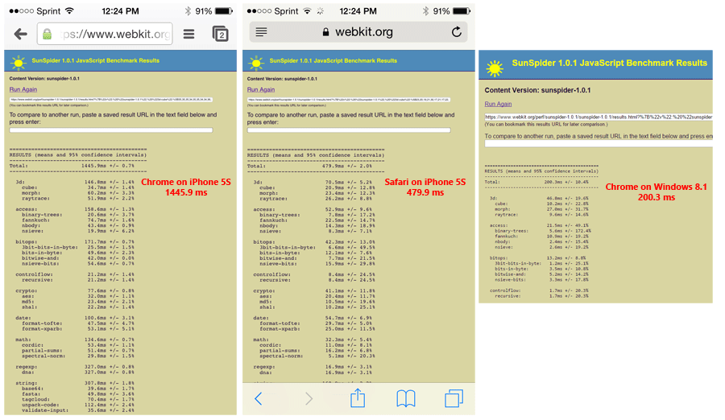
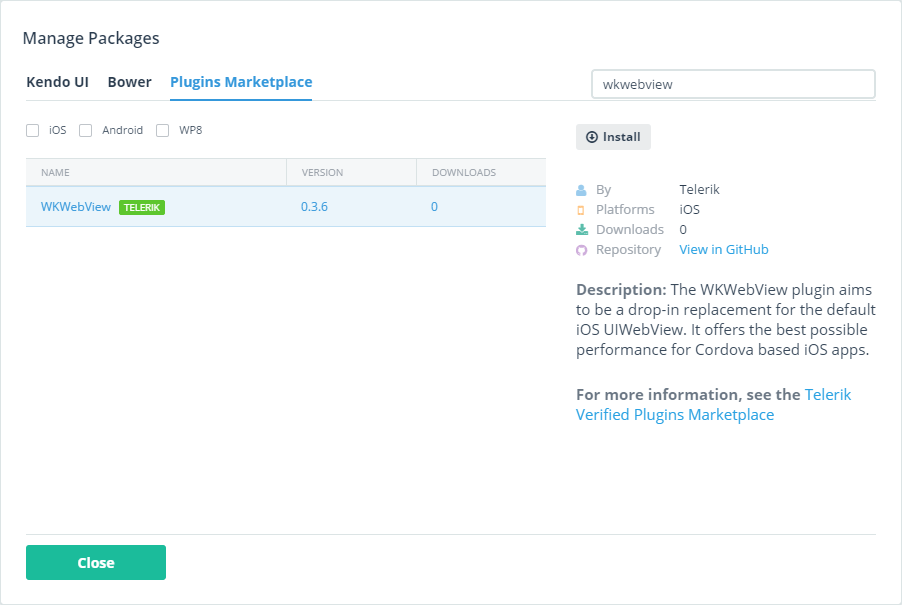

## Using the iOS 8 WKWebView with Telerik AppBuilder

Much ado has been made about the inclusion of Apple's new web view (WKWebView) in iOS 8. PhoneGap/Cordova developers especially were keen to take advantage of this new high performing web view in their apps - which is now possible today with [Telerik AppBuilder](http://www.telerik.com/appbuilder).

### What is the WKWebView?

When you develop a hybrid mobile app with PhoneGap/Cordova, your app runs within the mobile platform's web view (whether it be iOS, Android, or Windows Phone). Historically on iOS, this meant invoking the UIWebView which, while quite powerful, lacked certain performance features such as JavaScriptCore (a.k.a. Nitro) for extremely fast JavaScript compilation and execution. With iOS 8, however, Apple introduced a brand new web view called WKWebView (short for "WebKit WebView").

In the context of hybrid apps, the biggest takeaway regarding WKWebView is that it includes Nitro, which brings us to:

### Why should I care about WKWebView?

WKWebView brings an amazing performance boost to the execution of JavaScript in hybrid mobile apps. Using [SunSpider](http://www.webkit.org/perf/sunspider-1.0.1/sunspider-1.0.1/driver.html) tests with Chrome (which uses UIWebView) and Safari (which uses WKWebView) on iOS 8, we are seeing a **300% performance gain** (bringing WKWebView to within striking distance of even a desktop browser!).

The other advantage of leveraging WKWebView is a decrease in memory and CPU usage on the device. **Our tests have shown a 50% to 80% decrease in both memory consumption and CPU usage.** Your individual results may vary of course, but this looks very promising!

> For a more detailed analysis of the WKWebView and what it means for hybrid developers, check out [TJ VanToll's post](http://developer.telerik.com/featured/why-ios-8s-wkwebview-is-a-big-deal-for-hybrid-development/) on the Telerik Developer Network.

### How do I use WKWebView in my app?

Leveraging WKWebView in Telerik AppBuilder couldn't be much simpler thanks to the [Verified Plugins Marketplace](http://plugins.telerik.com/). If you haven't heard of the Verified Plugins Marketplace until now, it's a curated set of high value Cordova/PhoneGap plugins that have been thoroughly tested, documented, and verified to work with AppBuilder. And yes, the [WKWebView plugin is available now](http://plugins.telerik.com/plugin/wkwebview) in the marketplace!

> Tip: Make sure you are targeting Cordova 3.7+ in AppBuilder, this will make sure your build uses the latest iOS SDK!

**To use the WKWebView plugin in your AppBuilder app you have two choices:**

1) On the plugin detail page, click the [Try Plugin in AppBuilder](https://platform.telerik.com/#appbuilder/clone/https%3a%2f%2fgithub.com%2fTelerik-Verified-Plugins%2fWKWebView-DemoApp) button. This will clone our WKWebView demo app in AppBuilder for you, so you can get up and running immediately.

2) If you have an existing AppBuilder app, the easiest way to include a Cordova plugin is by using our Package Manager:

- In the **Project Navigator**, right click your project and choose **Manage Packages**.
- Choose the **Plugins Marketplace** tab.
- Search for **WKWebView** and click Install.

*Alternatively, you may use the AppBuilder CLI or Cordova CLI by issuing the following commands:*

AppBuilder CLI: `appbuilder plugin add "WKWebView Polyfill"`

Cordova CLI: `cordova plugin add https://github.com/Telerik-Verified-Plugins/WKWebView`

**Try out the WKWebView Cordova plugin on the Verified Plugins Marketplace and [notify us of any issues](https://github.com/Telerik-Verified-Plugins/WKWebView/issues). Good luck!**