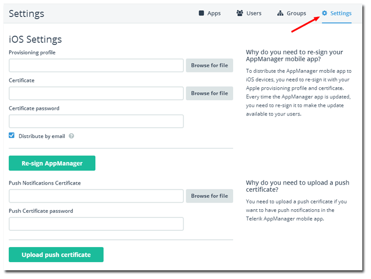

## Telerik AppManager Release: Return of the iOS Mobile App

From day one, the goal of [Telerik AppManager](http://www.telerik.com/appmanager) has been to provide an easy way for you to distribute and manage access to mobile apps for your testers and end users. We started out by providing AppManager for iOS and AppManager for Android - two robust mobile apps that your users could install and use as a "private app store". Unfortunately, due to Apple's restrictions, we weren't able to fully deliver on our iOS promise, until today.

### Return of the iOS Mobile App

Starting today our [Telerik Platform Business subscribers](http://www.telerik.com/purchase/platform) have the ability to re-sign AppManager for iOS using their own provisioning profiles and certificates. We provide you the means to generate your own version of AppManager for iOS using our simple self-service tools! You simply upload your profile and certificate and we do the rest (including providing easy ways for you to notify your users that they can download and install the app!).

*For your own convenience, if it's an option, we recommend using an [Enterprise provisioning profile](https://developer.apple.com/programs/ios/enterprise/gettingstarted/) from Apple as you then don't have to worry about managing device id's!*

Of course, AppManager for Android is available on [Google Play](https://play.google.com/store/apps/details?id=com.telerik.AppManager&hl=en) for Telerik Platform Business subscribers as well.

### "What if I don't have a Telerik Platform Business subscription?"

That's the obvious next question! We have been working hard to make sure ALL of our Telerik Platform users are able to get the most out of AppManager. In the last release we opened the doors to provide a variety of ways for you to securely manage and distribute your apps:

- **Email-Based Distribution:** Telerik Platform Developer (and higher)
- **Mobile Web Catalog:** Telerik Platform Professional (and higher)
- **AppManager for iOS and AppManager for Android:** Telerik Platform Business

For more details on these options, take a quick look at our [last release blog post](http://blogs.telerik.com/appmanager/posts/14-06-16/telerik-appmanager-the-grand-opening-of-your-private-app-store).

### Improvements

There is a lot more going on behind the scenes in this release. We have a laser focus on making sure the core value of AppManager is robust and bug-free. We have spent a lot of time making sure your experience is as flawless as possible! With this release we logged 28 fixes and 18 significant improvements including performance boosts, squashed bugs, and numerous stability enhancements.

### What's Next?

**We have a big, no, GIANT, release planned for later this summer!** This is when AppManager takes its next big step as we address issues with iOS provisioning profile confusion (which still confounds even the most seasoned iOS developers!) and add support for Windows Phone. Want to impact the roadmap? Have any feature ideas? Be sure to sound off on our [feedback portal](http://feedback.telerik.com/Project/129)!

