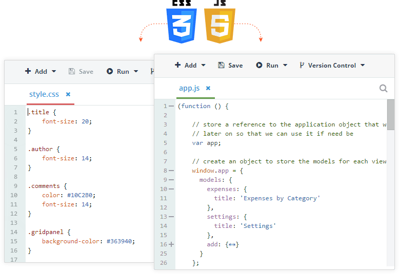
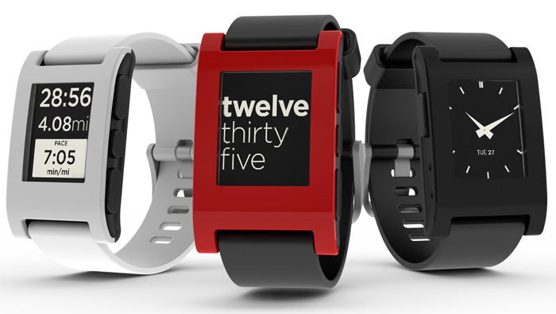
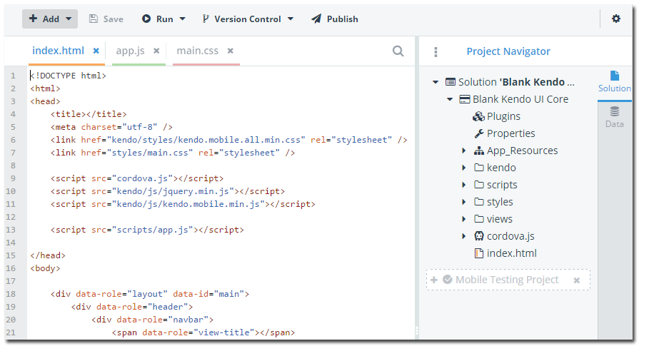

## Telerik AppBuilder Early 2015 Roadmap

Here at Telerik we strive to be as transparent as possible when it comes to releasing roadmap details for our products. We want to make sure our product direction is in perfect alignment with your needs. This is why I'm happy to unveil our high level roadmap for the first half of 2015!

### How a roadmap comes to life...

Since [Telerik AppBuilder](http://www.telerik.com/appbuilder) has an aggressive release schedule (usually every 6-8 weeks), our roadmap is flexible enough to adjust to the ever-evolving mobile landscape. But how do we get to a real plan? Well, we take in feedback from a variety of sources, including:

- One-on-one customer interviews
- Forum posts
- Support tickets
- Surveys
- [Telerik Platform feedback portal](http://feedback.telerik.com/Project/129)

We also look at industry trends and - with the help of our product management team, marketing, and engineering - combine all of this data to hash out a solid plan. **Long story short, YOU directly impact the roadmap, so sound off on the feedback portal to make your voice heard.**

Let's dive right into the roadmap details for the first half of 2015:

### NativeScript Support

It should be no surprise that a big part of 2015 is providing you full support for [NativeScript](http://www.telerik.com/nativescript) which will allow you to develop completely native mobile apps using JavaScript and CSS. From development to testing to publishing, AppBuilder will support your native, hybrid, and web app development needs.

### ScreenBuilder

If you missed the [last Telerik Platform webinar](http://www.telerik.com/webinars/platform/more-speed-more-devices-less-time), you missed the announcement of [ScreenBuilder](http://www.telerik.com/screenbuilder) - which is a new way of visually developing your apps without touching code. Look for the ScreenBuilder beta to drop soon!

### Wearables

A big part of the 2015 consumer space is certainly going to be wearables. Whether it be [Apple Watch](https://www.apple.com/watch/), [Android Wear](http://www.android.com/wear/), or even the [Pebble Smartwatch](https://getpebble.com/) - we have a laser focus on this segment and are coming up with some big plans for how you'll be able to expand your app development to include accessing these new devices via custom Cordova plugins.

### Cloud-Based Emulation

While our cloud-based device simulator is great, there are times when you need perfect emulation of your app (i.e. if you are using custom Cordova plugins or need pixel-perfect rendering). Historically you have been able to use our provided [native emulator support](http://docs.telerik.com/platform/appbuilder/testing-your-app/running-in-emulators/android-emulator) or even deploy your app to a connected device. But what about the best of both worlds? In the coming months we plan on releasing cloud-based emulators that provide 100% accurate device simulation by utilizing true iOS and Android emulators.

### The Last Mile

What exactly do I mean by "last mile"? We all know the advantage of hybrid is that it provides a rapid development environment using the same web skills we've honed over the years. But we tend to get bogged down in the "last mile" of development - whether it be performance issues, iOS provisioning profile struggles, or debugging and tweaking apps running on physical devices. We plan on addressing each of these issues directly in upcoming releases within AppBuilder.

### Continuous Integration

A lot of you have been asking for a way to integrate AppBuilder's build process in your CI workflow. We've been considering how to approach this for some time, and I'm pleased to let you know that this is a high priority for us in the coming months!

### In-Browser Client Coming to a Chrome App

Mac developers rejoice! While you've been able to use our [Command-Line Interface](http://www.telerik.com/appbuilder/command-line-interface) for some time now, 2015 will bring the AppBuilder development experience to a new cross-platform IDE in the form of a performant Chrome App. Stay tuned for details.

### TelerikNEXT

I would be remiss if I didn't mention our new developer conference coming up in early May in Boston, [TelerikNEXT](http://www.telerik.com/teleriknext). We will have some fantastic product announcements and unveilings there, you won't want to miss it!

### Disclaimer

We operate in a dynamic environment, and things are subject to change. The information provided on these and related pages is intended to outline the general Telerik product direction. It is intended for informational purposes only and should not be relied upon when making any purchasing decision. We may decide to add new features at any time depending on our capability to deliver products meeting Telerik quality standards. The development, releases and timing of any features or functionality described for Telerik products remains at the sole discretion of Telerik. These roadmaps do not represent a commitment, obligation or promise to deliver any products to the customer at any time.