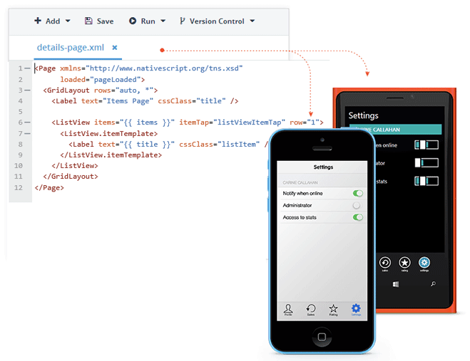
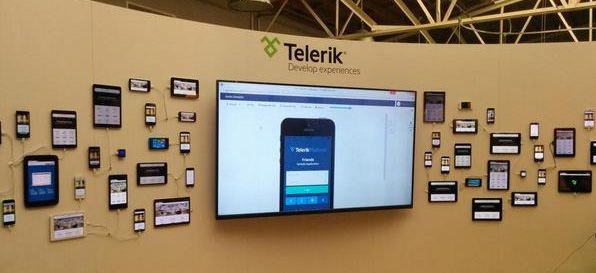

## Telerik AppBuilder H2 2015 Roadmap

After weeks of planning, I'm pleased to release our public [Telerik AppBuilder](http://www.telerik.com/appbuilder) roadmap for the second half of 2015! We've been in touch with many of you so far this year - and these conversations have directly impacted our roadmap and helped us to continue to deliver the best possible set of mobile development tools and services.

Before we look at what is coming later this year, let's take a quick look back at the big features we have delivered so far this year:

### Recap of H1 2015

We have had a great first half of 2015, delivering numerous features and updates (and bug fixes of course!). Here is just a small sample of what we have provided:

- Support for building native apps with our [NativeScript framework](https://www.nativescript.org/)
- Full integration with the [Verified Plugins Marketplace](http://plugins.telerik.com/cordova)
- Enabling [WKWebView](http://plugins.telerik.com/cordova/plugin/wkwebview) on iOS, [Crosswalk](http://www.telerik.com/blogs/telerik-appbuilder-with-cordova-4-and-crosswalk-support) on Android, and full support for Windows Phone 8.1
- A new option to create responsive mobile web sites
- [AppManager LiveSync](http://www.telerik.com/blogs/telerik-appbuilder-may-release-update-a-published-app-in-seconds) - a new way to update your apps without going through app store approval
- And [Screen Builder](http://www.telerik.com/screenbuilder), an epic new functional design tool that allows you to generate the bulk of your app without touching code!

### How a Roadmap is Created

Our roadmap has always been (and will continue to be) flexible enough for us to adjust to the ever-evolving mobile development world. That being said, we have sketched out a very solid plan for the second half of 2015 by factoring in a variety of inputs:

- One-on-one customer interviews *(interesting in participating? drop me a line via twitter [@rdlauer](https://twitter.com/rdlauer))*
- [Forum](http://www.telerik.com/forums/appbuilder) posts
- Support tickets
- Product surveys
- [Telerik Platform feedback portal](http://feedback.telerik.com/Project/129)

We also look at industry trends and - with the help of our product management team, marketing, and engineering - combine all of this data to hash out a solid plan. **Long story short, YOU directly impact the roadmap, so sound off on the feedback portal to make your voice heard.**

Enough chatter, let's dive into the roadmap details for the second half of 2015:

### NativeScript Improvements

We can't say enough about [NativeScript](https://www.nativescript.org/) and what this new framework means for the mobile development community. This is why we have big plans to continue to improve upon our NativeScript support in all of the AppBuilder clients. This means better debugging, improved code-completion, support for NPM modules, and more.

*Tip: Follow the [NativeScript roadmap](https://www.nativescript.org/roadmap) to get a taste of what is coming from the framework itself!*

You can also count on more features and options in our functional design tool (Screen Builder) to create native apps (with the NativeScript framework of course) without touching a single line of code.

Finally, look for NativeScript plugin support to drop in our [Verified Plugins Marketplace](http://plugins.telerik.com/).

### Apple Watch Support

Have your [Apple Watch](https://www.apple.com/watch/) yet? If not, now is the time to jump on the bandwagon as we will be bringing support for Apple Watch apps soon!

### Local App Builds

One of the big advantages of leveraging AppBuilder is the ability to create builds of your apps in the cloud (meaning you don't need a Mac to create an iOS app, nor do you need a Windows PC to create a Windows Phone app). Some developers have been vocal in wanting to leverage the speed and security of creating builds locally, which we aim to provide in H2.

### Visual Studio Cloud Integration

We know A LOT of you utilize the [AppBuilder extension for Visual Studio](http://www.telerik.com/appbuilder/visual-studio-extension). You've also noted that the Visual Studio experience doesn't feel integrated enough with the rest of our Telerik Platform services. Have no fear. In the coming months we will be releasing updates to our Visual Studio extension that allow you to leverage your cloud-based projects and Telerik Platform services easier than ever before.

### Continuous Integration

A lot of you have been asking for a way to integrate AppBuilder's build process in your CI workflow (think Jenkins, TFS, etc). We have a plan in place and the team is working on a solution - look for an announcement soon!

### Cloud-Based Native Emulators

While our device simulator is great, there are times when you need perfect emulation of your app (i.e. if you are using custom Cordova plugins or need pixel-perfect rendering). Historically you have been able to use our provided [local native emulator support](http://docs.telerik.com/platform/appbuilder/testing-your-app/running-in-emulators/android-emulator) or even deploy your app to a connected device. But what about the best of both worlds? In the coming months we plan on releasing cloud-based emulators that provide 100% accurate device simulation by utilizing true native emulators.

*And no, we aren't actually leveraging our device wall to offer cloud-based emulation!*

### One More Thing...

Here at Telerik we love Mac developers, and while you've been able to use our [Command-Line Interface](http://www.telerik.com/appbuilder/command-line-interface) with a [Sublime Text package](http://www.telerik.com/appbuilder/sublime-text-package) for some time now, you've been vocal about wanting a truly integrated AppBuilder development experience.

**Enter a new AppBuilder client, codenamed "Proton"!** There are some clues to be found in the codename and much more to be announced soon. In the meantime, we will be looking for beta testers, so contact me on twitter [@rdlauer](https://twitter.com/rdlauer) if you are interested!

### Disclaimer

We operate in a dynamic environment, and things are subject to change. The information provided on these and related pages is intended to outline the general Telerik product direction. It is intended for informational purposes only and should not be relied upon when making any purchasing decision. We may decide to add new features at any time depending on our capability to deliver products meeting Telerik quality standards. The development, releases and timing of any features or functionality described for Telerik products remains at the sole discretion of Telerik. These roadmaps do not represent a commitment, obligation or promise to deliver any products to the customer at any time.