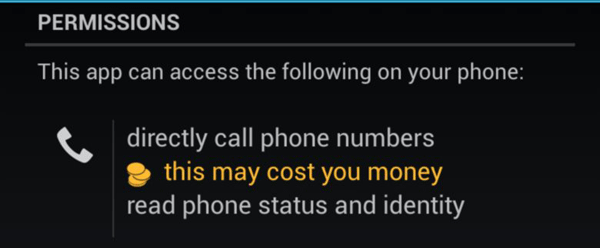
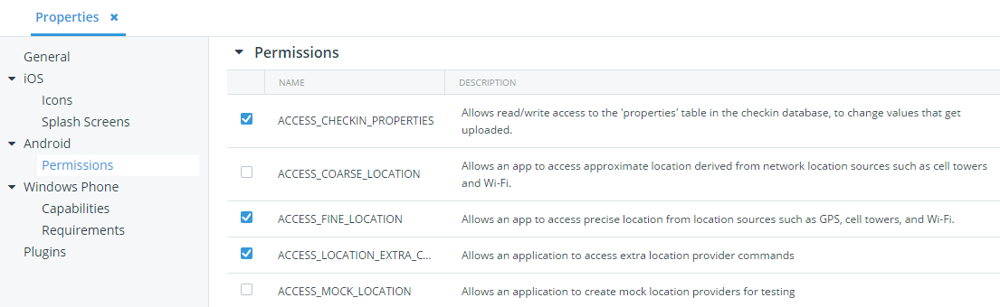

## Android Permissions Explained

When you develop an Android app, your users will justifiably be concerned if your app requests access to a myriad of device features and personal information. You are risking decreased app installations and increased suspicions of your app's motives if you ask your users for personal data, contacts, access to their phone, SMS messages, and so on. In this article I hope to pull back the curtains on Android permissions and help you develop and distribute your apps more efficiently, without raising the ire of your customers.

### Android Permissions and What They Really Mean

There are a lot of permissions to sort through on the Android platform. Did I say a lot, because I mean: ***A LOT***. In the interest of space and time, I've provided you a handy chart you may use to look up any Android permission along with a plain English description of what that permission really means:

INSERT CODE HERE

### Permissions to Avoid

Now that you know what all of the permissions mean, you should next focus on limiting your exposure to certain ones. **As a rule of thumb, you should only request a permission that your app literally NEEDS to run properly.** At the same time, you should by all means avoid requesting the following permissions - as these are major red flags when it comes to securing your end user's privacy:

- `CALL_PHONE`: *Allows an application to initiate a phone call without going through the Dialer user interface for the user to confirm the call being placed.*
- `RECEIVE_SMS`: *Allows an application to monitor incoming SMS messages, to record or perform processing on them.*
- `SEND_SMS`: *Allows an application to send SMS messages.*
- `READ_CONTACTS`: *Allows an application to read the user's contacts data.*
- `ACCESS_FINE_LOCATION`: *Allows an app to access precise location from location sources such as GPS, cell towers, and Wi-Fi.*

Basically any permission that brings up the dreaded "this may cost you money" notification, you'll want to avoid if at all possible.

### Cordova Plugins and Related Permissions

Now we get to the important part for those of you who develop hybrid mobile apps with Cordova/PhoneGap. Say you've gone through and eliminated as many Android permissions as you possibly can. However, when you deploy your app on a device, the app STILL asks for permissions you didn't specify! What is going on here!?

The issue is that certain core Cordova plugins also enable some Android permissions by default. For your convenience, here is another handy list:

> Unsure of which core Cordova plugins you need in your mobile app? [Check out this guide](http://developer.telerik.com/featured/which-core-phonegapcordova-plugins-do-i-need/).

- [Battery](https://github.com/apache/cordova-plugin-battery-status/blob/master/doc/index.md): Does not set additional permissions.
- [Camera](https://github.com/apache/cordova-plugin-camera/blob/master/doc/index.md): Sets the `WRITE_EXTERNAL_STORAGE` permission.
- [Capture](https://github.com/apache/cordova-plugin-media-capture/blob/master/doc/index.md): Sets the `RECORD_AUDIO`, `RECORD_VIDEO`, and `WRITE_EXTERNAL_STORAGE` permissions.
- [Contacts](https://github.com/apache/cordova-plugin-contacts/blob/master/doc/index.md): Sets the `READ_CONTACTS`, `WRITE_CONTACTS`, and `GET_ACCOUNTS` permissions.
- [Device](https://github.com/apache/cordova-plugin-device/blob/master/doc/index.md): Does not set additional permissions.
- [Device Motion](https://github.com/apache/cordova-plugin-device-motion/blob/master/doc/index.md): Does not set additional permissions.
- [Device Orientation](https://github.com/apache/cordova-plugin-device-orientation/blob/master/doc/index.md): Sets the `ACCESS_COARSE_LOCATION` and `ACCESS_FINE_LOCATION` permissions.
- [File](https://github.com/apache/cordova-plugin-file/blob/master/doc/index.md): Sets the `WRITE_EXTERNAL_STORAGE` permission.
- [File Transfer](https://github.com/apache/cordova-plugin-file-transfer/blob/master/doc/index.md): Sets the `WRITE_EXTERNAL_STORAGE` permission.
- [Geolocation](https://github.com/apache/cordova-plugin-geolocation/blob/master/doc/index.md): Sets the `ACCESS_COARSE_LOCATION` and `ACCESS_FINE_LOCATION` permissions.
- [Globalization](https://github.com/apache/cordova-plugin-globalization/blob/master/doc/index.md): Does not set additional permissions.
- [InAppBrowser](https://github.com/apache/cordova-plugin-inappbrowser/blob/master/doc/index.md): Does not set additional permissions.
- [Media](https://github.com/apache/cordova-plugin-media/blob/master/doc/index.md): Sets the `RECORD_AUDIO`, `MODIFY_AUDIO_SETTINGS`, `WRITE_EXTERNAL_STORAGE`, and `READ_PHONE_STATE` permissions.
- [Network Information](https://github.com/apache/cordova-plugin-network-information/blob/master/doc/index.md): Sets the `ACCESS_NETWORK_STATE` permission.
- [Notification](https://github.com/apache/cordova-plugin-dialogs/blob/master/doc/index.md): Does not set additional permissions.
- [SplashScreen](https://github.com/apache/cordova-plugin-splashscreen/blob/master/doc/index.md) - Does not set additional permissions.
- [StatusBar](https://github.com/apache/cordova-plugin-statusbar/blob/master/doc/index.md): Does not set additional permissions.
- [Vibration](https://github.com/apache/cordova-plugin-vibration/blob/master/doc/index.md): Sets the `VIBRATE` permission.

Also, if you are a [Telerik AppBuilder](http://www.telerik.com/appbuilder) user, you may be using one of these plugins:

- [Telerik Push Notifications](http://plugins.telerik.com/plugin/pushnotification): Sets the `ACCESS_NETWORK_STATE`, `GET_ACCOUNTS`, `WAKE_LOCK` and `VIBRATE` permissions.
- [Telerik Analytics](http://www.telerik.com/analytics): Sets the `INTERNET` and `ACCESS_NETWORK_STATE` permissions.
- [Telerik AppFeedback](http://www.telerik.com/appfeedback): Sets the `INTERNET` permission.
- [Telerik Mobile Testing](http://www.telerik.com/mobile-testing): Does not set additional permissions.

### Managing Android Permissions in Telerik AppBuilder

And yes, of course we make it as easy as possible to manage your Android permissions in all of the [AppBuilder clients](http://www.telerik.com/appbuilder/in-browser-client). With a simple toggle next to each permission (along with a basic description), you can easily maintain permissions for your app:

