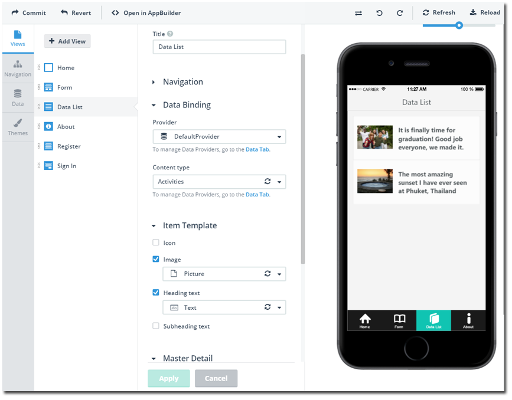
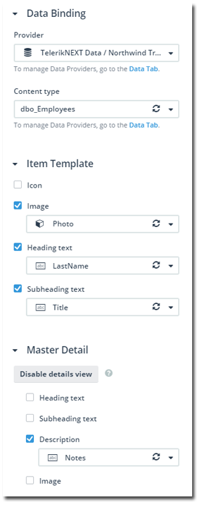
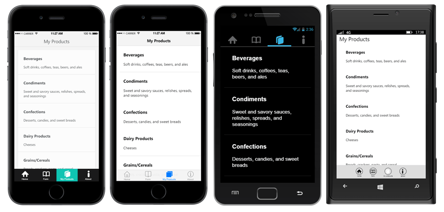
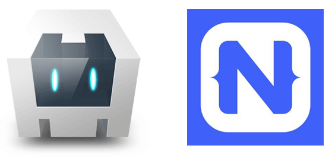

## Announcing Screen Builder

More than ever before, the heat is on to develop and deliver mobile apps. Not just any mobile apps though - apps that consume data, apps that are gorgeous, and apps that are a pleasure to use. Yesterday, creating a cross-platform mobile app meant learning new languages, new frameworks, and new tools. Not to mention the time it takes to scaffold up new apps or attempt to re-use the same set of business templates. Today, however, everything changes as we announce a new offering from the Telerik Platform, the functional app designer we call Screen Builder.

### What is Screen Builder?

[Screen Builder](http://www.telerik.com/screenbuilder) is a functional designer for the [Telerik Platform](http://www.telerik.com/platform) that provides a zero code development environment for quickly generating mobile business apps with reusable screen templates. It's not just about templates though, Screen Builder also allows you to bind data to a variety of data sources, manage your app navigation, and apply UI themes to your app - all without touching code! And the code that Screen Builder generates behind the scenes is clean and easy for even the most novice developer to read.

Let's learn more about Screen Builder by breaking it down into three sections: [pre-wired screens](#screens), [no-code data binding](#data), and [UI themes](#themes):

> We are hosting an online encore of TelerikNEXT keynote where you can see Screen Builder in action. Come learn about Telerik’s future vision for it, see demos and new features. We’ll also host a live Q&A session with a full panel of Telerik experts to answer your question. Register now for May 13th (11:00 AM ET) online keynote – [www.telerik.com/TelerikNEXTOnline](http://www.telerik.com/TelerikNEXTOnline)

### Pre-Wired Screens

Call them "views", call them "screens", call them "pages" - whatever you want to call them, they are representations of the individual screens of your app. Screen Builder comes with a variety of pre-wired screens (a.k.a. "view types") that you can choose from when building your mobile app. Today, Screen Builder supports screens such as:

- **Data List** (for binding data to a list in your app)
- **Form** (allowing you to create a highly customizable data input form)
- **Sign In** (to provide a sign-in screen for your users)
- **Register** (to allow your users to register to use the app)
- **About** (to present an "about" screen for your app)
- **Empty** (a blank view for you to customize)

 ...with many more to come!

The screens you create from these view types can then be chained together using navigation that you specify - it's amazingly easy to link one screen to another.

### No-Code Data Binding

It's one thing for a no-code tool to allow you to add screens, link them, and theme an app, but what about data? **Screen Builder also provides a code-free way to bind data from a variety of remote data sources to your app.** For example, if you use a sign in or register screen, those can be automatically linked with your backend services provider. Likewise, by using a data list view type, you can choose individual content types (a.k.a. database tables or views) and bind fields from those content types directly to your view!

This provides even non-developers the ability to generate screens, link them together, and bind data to the screens - all without touching code!

### UI Themes

The harsh reality of mobile business apps today is that user experience is often an afterthought. With Screen Builder though, we are doing the heavy lifting for you by providing pixel-perfect layouts in every view type we provide. In addition, today you have the ability to choose between a consistent, flat UI that works and feels the same on every platform OR a UI that conforms to each native platform's UI standards.

### What About Hybrid vs Native?

Are you concerned about developing a hybrid app (a.k.a. [Cordova](https://cordova.apache.org/) or PhoneGap) versus developing a native app? No worries. Screen Builder provides full support for both hybrid and native routes for developing your apps. Whether you desire the ease of extending a hybrid app with your web skills or the rich experience a native app built with [NativeScript](https://www.nativescript.org/) provides, we have you covered.

### But How Do I "Finish" My App?

**We estimate that for most business apps, Screen Builder will cut your development time by up to 80%!** And yes, Screen Builder is just the first step of your app development process. This is why you can easily start your app with Screen Builder and then load that same project into [Telerik AppBuilder](http://www.telerik.com/appbuilder) to edit your code, [add custom plugins](http://plugins.telerik.com/cordova), [test](http://www.telerik.com/mobile-testing), debug, and [publish](http://www.telerik.com/appmanager) it.

And yes, you can even go back and forth between AppBuilder and Screen Builder (for instance, if you want to add some new views to an existing project).

### Can I Use Screen Builder Today?

**The answer is an emphatic "YES"!** For the first 60 days after the public release of version 1.0, Screen Builder will be available for all Telerik Platform (and AppBuilder) users. After the initial grace period of 60 days is over, Screen Builder will STILL be available for all Telerik Platform users and all AppBuilder users. The only exception is those who hold the AppBuilder "Developer" license, who will still be able to edit and build in AppBuilder the apps they have built with Screen Builder - and if they switch to a higher priced license of AppBuilder or to a Telerik Platform license, they will be able to edit those apps once again in Screen Builder. [Start your Telerik Platform trial today!](https://platform.telerik.com/)

### What's Next?

We have only just gotten started with Screen Builder. In coming releases we plan on adding more and more view types to represent the most common business scenarios that you help us to define. We are also looking at dramatically expanding our UI theme section to provide more gorgeous ways for your app to look and feel. Stay tuned to the [Telerik blogs](http://blogs.telerik.com/) for more details and remember to [sound off on our feedback portal](http://feedback.telerik.com/Project/129) if you have specific requests for the future of Screen Builder!

And remember to join as at the online encore of our TelerikNEXT keynote where you can see Screen Builder in action – [www.telerik.com/TelerikNEXTOnline](http://www.telerik.com/TelerikNEXTOnline).

