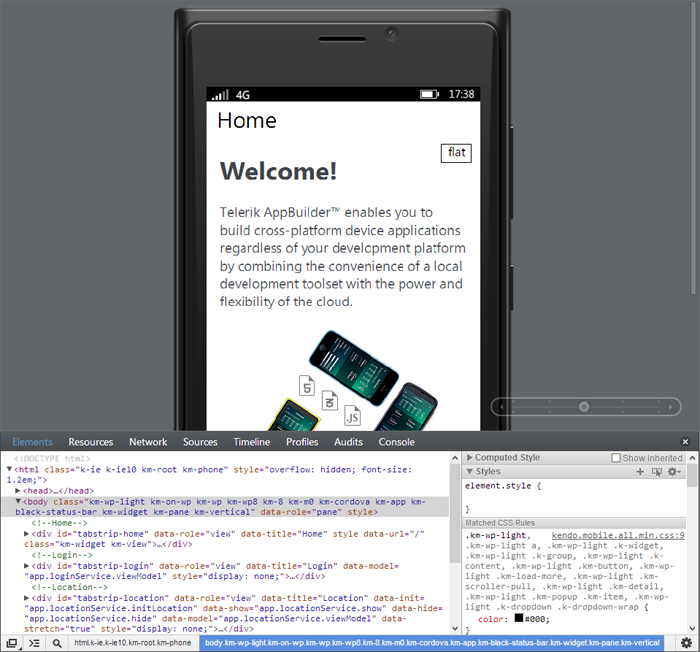
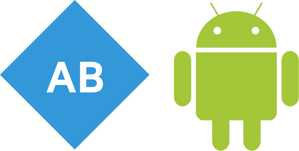

## AppBuilder April Release: Visual Studio Extension for Pros, Windows Phone 8, Companion App for Android, and More!

I know what you're thinking, didn't we *just* have a major AppBuilder release [a few weeks ago](http://blogs.telerik.com/appbuilder/posts/14-03-13/appbuilder-march-release-a-full-cli-windows-phone-8-support-sublime-text-integration-and-more)? The answer is yes! But of course we never stop improving and wanted to get the latest updates out to you as soon as possible. Today I'm proud to announce the next [Telerik AppBuilder](http://www.telerik.com/appbuilder) release, which brings our Visual Studio extension to more users, builds upon our Windows Phone 8 development story, and adds significant value to our cross-platform tooling options.

Here is a quick overview of what you can expect out of this new release:

### Overview

- [AppBuilder Extension for Visual Studio Now in "Professional" Account Level](#vs)
- [Windows Phone 8 Improvements](#wp8)
- [Companion App for Android](#companion)
- [Support for Sublime Text 3](#st3)

For a full list of updates, be sure to check out our [release notes](http://docs.telerik.com/platform/appbuilder/release-notes/v2-1). And without further ado, let's dive into the details:

### AppBuilder Extension for Visual Studio Now in "Professional" Account Level

I am excited to announce that now our [Professional](http://www.telerik.com/purchase/appbuilder) level AppBuilder and [Telerik Platform](http://www.telerik.com/platform) subscribers now have full access to the AppBuilder extension for Visual Studio! Our existing Business-level account holders have had so much success using the Visual Studio extension that we wanted to broaden the availability and allow everyone access.

**If you haven't tried the [AppBuilder extension for Visual Studio](http://www.telerik.com/appbuilder/visual-studio-extension), now is the time!**

### Windows Phone 8 Improvements

In our [March release](http://blogs.telerik.com/appbuilder/posts/14-03-13/appbuilder-march-release-a-full-cli-windows-phone-8-support-sublime-text-integration-and-more) we focused a lot of energy into bringing you the Windows Phone 8 development experience you've been asking for. Over the last few weeks we have been listening to your feedback and are happy to announce across-the-board improvements for Windows Phone 8 developers. Aside from numerous bug fixes, we have new features to announce:

- **LiveSync with Windows Phone 8 Devices**
- **Improvements to the Integrated Device Simulator**
- **Support for WP8 in the [Command Line Interface](http://www.telerik.com/appbuilder/command-line-interface)**

Keep your eyes peeled on the [blogs](http://blogs.telerik.com/appbuilder/posts) as we have A LOT more in store for Windows Phone 8 developers in upcoming releases as well!

### Companion App for Android

For a while now our iOS developers have had all of the fun when it comes to deploying an app to testers with our [Companion App](http://www.telerik.com/appbuilder/companion-app). It brings us great joy to announce that those of you developing for Android will now be able to take advantage of the same tool with this release.

If you haven't used the Companion App yet on either platform, take a look at our [docs](http://docs.telerik.com/platform/appbuilder/testing-your-app/running-on-devices/using-appbuilder-companion-app) to see how easily you can share test builds with remote users - now on both iOS and Android! We haven't left our iOS Companion App users behind either, as the latest iOS version contains an improved design and a better-performing barcode scanner.

Download the app on your Android device from [Google Play](https://play.google.com/store/apps/details?id=com.telerik.AppBuilder).

### Support for Sublime Text 3

You asked for it, you got it. Hot on the heels of our new [Sublime Text package](http://www.telerik.com/appbuilder/sublime-text-package), our updated version now supports Sublime Text 3. In case you missed it in our March release, this means that you can now **develop hybrid mobile apps using Sublime Text**!

Remember that the Sublime Text package, along with our [Command Line Interface](http://www.telerik.com/appbuilder/command-line-interface), are supported in both Mac and Windows environments.

### What's Next?

As I mentioned before, at Telerik we never stop improving our tools and services. And when it comes to new features, the first person we listen to is you, our faithful customers. You provide us with the guidance we need to help develop these great tools. Please [sound off on our feedback portal](http://feedback.telerik.com/Project/129) and help us determine what the next steps of AppBuilder should be. Also, stay tuned to the [AppBuilder blogs](http://blogs.telerik.com/appbuilder/posts) as next week we unveil our Q2 2014 roadmap!