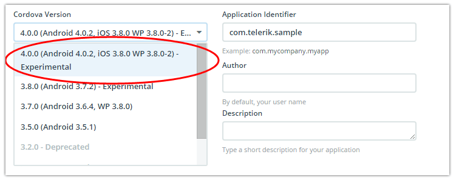
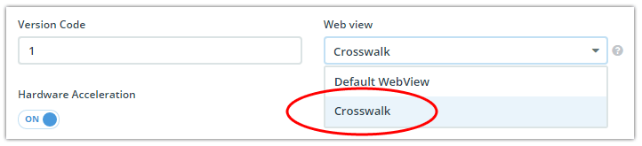
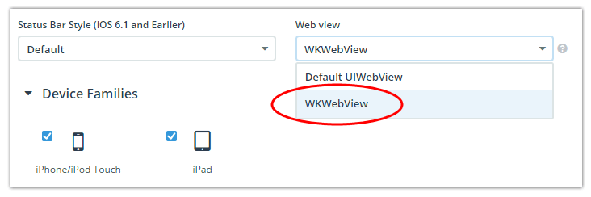
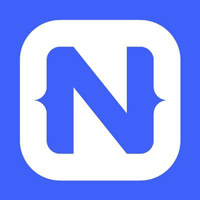

## Telerik AppBuilder June Release: Cordova 4.0 and Crosswalk Support

Hot off the heels of our [last major update](http://www.telerik.com/blogs/telerik-appbuilder-may-release-update-a-published-app-in-seconds), we have a new and highly anticipated release for you. Today we are pleased to announce full support for Cordova Android 4.0 and Crosswalk! This means major performance improvements and HTML5 compatibility for your Android apps.

> Be sure to examine the [latest release notes](http://docs.telerik.com/platform/appbuilder/release-notes/v2-10) to see all of the changes for this release. And take advantage of our [feedback portal](http://feedback.telerik.com/Project/129) to influence the Telerik Platform roadmap going forward.

### Cordova Android 4.0

Recently the [Apache Cordova](https://cordova.apache.org/) team decided to release platform-specific versions of the Cordova framework. This is why, in the Telerik AppBuilder clients, you'll see that when you choose to use Cordova 4.0, it really means:

- Cordova-Android 4.0.2
- Cordova-iOS 3.8.0
- Cordova-WP8 3.8.0-2

The important piece to focus on for this release is Cordova Android. Why? Because Cordova Android 4.0.2 brings with it an important feature called "pluggable WebViews". This means we can now easily swap in a new WebView (which is what your hybrid app runs in on the device) to replace the awful, slow, antiquated Android system WebView. **This leads us to the primary benefit of leveraging Cordova-Android 4.0: [Crosswalk](https://crosswalk-project.org/).**

### What is Crosswalk?

Crosswalk is an Android WebView, based on the [Chromium project](https://www.chromium.org/Home). It is an open source project sponsored by Intel, and it brings a modern, stable, and fast WebView to all users of Android (back to Android 4.0).

**Did you say fast?** Indeed, Crosswalk outperforms the stock system WebView by a factor of 10 on older Android devices (4.0-4.3).

**Did you say modern?** Yes, in fact by using Crosswalk you can take advantage of the latest HTML5 features including WebRTC, WebGL, WebAudio, IndexedDB, and CSS3 features like flexbox.

**Most importantly, your app will perform identically on 94% of all Android devices!** This is because Crosswalk levels the playing field across all Android 4.0+ devices [[source](https://developer.android.com/about/dashboards/index.html)].

**Is there a downside to using Crosswalk?** Well, the size of your Android app package will increase by about 10-15 MB. Also, you'll want to make sure that any Cordova plugins you use are compatible with Cordova Android 4.0 and Crosswalk.

> Rest assured we have already made sure all of the Android plugins in the [Verified Plugins Marketplace](http://plugins.telerik.com/cordova) are compatible!

### Great, So How Do I Use Crosswalk?

You can leverage Crosswalk from any AppBuilder client. Using the **Properties** window, you simply:

1) Make sure you have selected Cordova 4.0.0 in the **General** tab:

2) Navigate to the **Android** tab, and choose the Crosswalk WebView:

**That's it!** You can now create a build for Android and test it on your device. Use the Crosswalk WebView along with our [Native Page Transitions plugin](http://plugins.telerik.com/cordova/plugin/native-page-transitions) for a truly native feel on Android.

### What About iOS?

We've also made it easier for you to leverage the more powerful WKWebView (an alternative native WebView from Apple) on iOS. Again, choosing the WKWebView versus the default iOS WebView is done via the AppBuilder iOS **Properties** page:

> You can [consult this blog post](http://developer.telerik.com/featured/using-ios-8-wkwebview-telerik-appbuilder/) on how using the WKWebView can dramatically speed up your iOS apps.

### NativeScript Updates

With this release of AppBuilder, we have also updated the version of [NativeScript](https://www.nativescript.org/) that we support to 1.0.1. This will let you develop, test, and build truly native apps using the JavaScript skills you know and love while leveraging the latest from the NativeScript team.

### Command-Line Interface Improvements

There are a [host of updates](http://docs.telerik.com/platform/appbuilder/release-notes/v2-10#features-and-updates-in-the-command-line-interface-and-the-package-for-sublime-text) to the AppBuilder CLI that you should read up on.

Arguably the most underrated part of AppBuilder, our CLI is widely praised by Mac and Windows developers alike as a great way to supplement their existing IDE with AppBuilder services to build hybrid and native apps.

You can get started by downloading the AppBuilder CLI [here](https://www.npmjs.com/package/appbuilder).

### What's Next?

You'll see another big release of AppBuilder coming your way in another month or so. Right now we are working on implementing some exciting ideas on the wearables front, along with improving your experience managing all of your icons and screenshots. We also have some exciting improvements planned for our Companion Apps and our mobile web developers are sure to be pleased with what we have coming, so stay tuned.

**As usual, [sound off on our feedback portal](http://feedback.telerik.com/Project/129) with any feature requests or other ideas!**