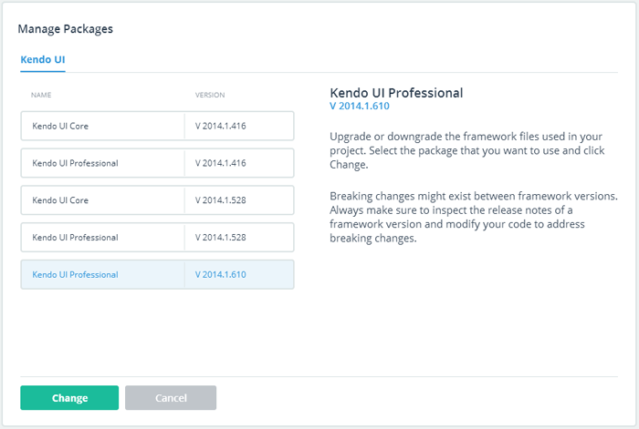

## Telerik AppBuilder: WP8 Improvements, TypeScript Support, Kendo UI Updates, Mobile Chrome Apps, and More

The [Telerik AppBuilder](http://www.telerik.com/appbuilder) team has been hard at work over the last two months preparing for a series of epic releases - and I'm pleased to announce the first of these today! Your trusted mobile app development experience just got that much more powerful with new features and improvements to existing functionality.

Let's break down this release and quickly go over all of the new features and updates one by one (be sure to check out the detailed [release notes](http://docs.telerik.com/platform/appbuilder/release-notes/v2-2) as well):

### Windows Phone 8 Improvements

It's time to remove the "beta" label from our Windows Phone 8 support and bring it up to speed with iOS and Android. This version of AppBuilder brings with it a new [Companion App for Windows Phone 8](http://www.windowsphone.com/en-us/store/app/appbuilder/0171d46b-b5f2-43d9-a36b-0a78c9692aab), app distribution via QR codes, WP8-optimized sample apps, and full support for publishing to the Windows Phone app store!

### Full TypeScript Support

The popularity of [TypeScript](http://www.typescriptlang.org/) (Microsoft's answer for a strongly typed JavaScript) is growing every day. That's just one reason why we are pleased to now offer full support for TypeScript in all of our IDEs (in-browser client, Windows client, and Visual Studio extension). This means that you can create new TypeScript files, add existing ones to your projects, use [TypeScript type definition files](https://github.com/borisyankov/DefinitelyTyped), and compile TypeScript to JavaScript - all with syntax coloring, error and warning notifications, and structural highlighting for your TypeScript code.

### Enhanced Kendo UI Updates

Up until today it was always a bit of a chore to upgrade or change the version of Kendo UI Mobile that you use with your AppBuilder projects. 

Now you can quickly change the version of [Kendo UI](http://www.telerik.com/kendo-ui) that you are using in your project. Simply right-click on your project properties and choose **Manage Packages**. You'll then be presented with the following dialog to change the version of Kendo UI. For more information, check out our docs on [updating the code libraries in your project](http://docs.telerik.com/platform/appbuilder/creating-your-project/update-project-libraries).

### Command Line Interface Improvements

Users of our popular [Command Line Interface (CLI)](http://www.telerik.com/appbuilder/command-line-interface) are in for a few treats this time around. Using the CLI, you may now:

- Debug your app on a connected iOS or Android device (Windows only for now)
- Clone AppBuilder sample apps (run `appbuilder sample` to list the available apps and `appbuilder sample clone` to clone an app)
- Run the device simulator on a Mac (`appbuilder simulate`)
- Run the CLI on Linux (basic Linux support, but it's a start!)

### One-Click Telerik Analytics Integration

If you haven't used [Telerik Analytics](http://www.telerik.com/analytics) yet, you are most definitely missing out. With our new one-click Telerik Analytics integration, you can initialize a new Analytics project from within AppBuilder and start gathering actionable statistics from your app immediately. **Track feature usage, diagnose performance bottlenecks, and even gather analytics while your app is offline!**

### Backend Services Cloud Code Debugging

Users of our in-browser client have been able to utilize powerful debugging tools for [cloud code](http://docs.telerik.com/platform/backend-services/development/cloud-code/introduction) they write with [Telerik Backend Services](http://www.telerik.com/backend-services). Today we're happy to announce that our Visual Studio extension and Windows client users will also be able to set breakpoints and step through their cloud code as well - making debugging your MBaaS that much easier!

### Mobile Chrome API Support

AppBuilder now supports Google's [Mobile Chrome APIs](http://blog.chromium.org/2014/01/run-chrome-apps-on-mobile-using-apache.html), which allow you to take advantage of most of the existing [Chrome OS APIs](https://github.com/MobileChromeApps/mobile-chrome-apps) and use them in a hybrid mobile environment. This allows iOS and Android hybrid mobile developers to use the new Chrome APIs - but also allows us to easily port a Chrome OS app to iOS and Android with minimal effort.

### What's Next?

You won't be waiting long for the next release! Coming later in June is another blockbuster release that offers two important features that you have been patiently waiting on. In a few weeks we're **adding support for version 3.5 of Cordova** AND offering you the ability to **share your AppBuilder projects between all of the AppBuilder IDEs**. Yes, this means you can start a project with Visual Studio at the office, push changes to your code repository, and then open up that project at home with our in-browser client (and vice versa). The same goes for using our Windows client and the Command Line Interface.

I'll have plenty more to reveal about this next time. In the meantime, be sure to use our [feedback portal](http://feedback.telerik.com/Project/129) if you have other feature requests or want to lend your support to existing ideas!