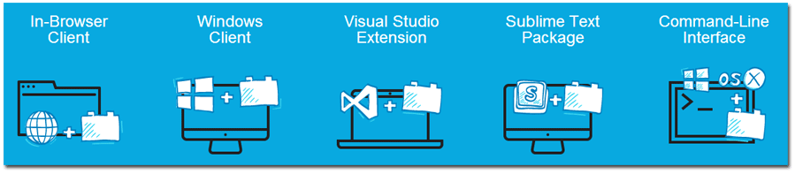
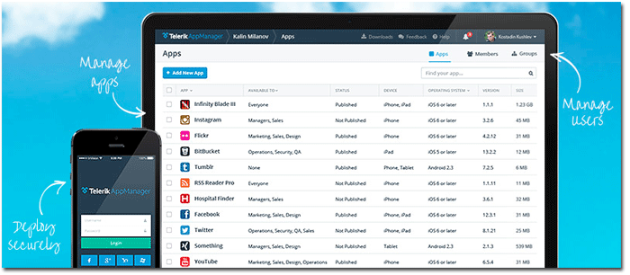
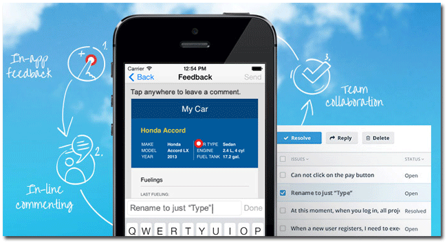

## Telerik AppBuilder Release: Sharing Projects, Cordova Update, NativeScript Preview, and More

Coming right off the heels of our [last release](http://blogs.telerik.com/appbuilder/posts/14-06-17/telerik-appbuilder-wp8-improvements-typescript-support-kendo-ui-updates-mobile-chrome-apps-and-more), where we shipped extensive Windows Phone 8 improvements, full TypeScript support, our device simulator for Mac, and much more - we return today with another new big release announcement! [Telerik AppBuilder](http://www.telerik.com/appbuilder) today includes support for Cordova 3.5, the ability to share projects between all of our client tools, a sneak peak into how you can start using AppBuilder to develop truly native mobile apps, performance improvements for the in-browser client, and more!

Let's dive right into the updates (but don't forget the detailed [release notes](http://docs.telerik.com/platform/appbuilder/release-notes/v2-3) as well):

### Sharing Projects Across AppBuilder Clients

One of the most-requested features we have had from our customers is the **ability to easily share a project between the existing AppBuilder client tools**. With this release you may now initiate a project in the [AppBuilder extension for Visual Studio](http://www.telerik.com/appbuilder/visual-studio-extension) at work, push those changes to your code repository, and open that same project up in your [in-browser client](http://www.telerik.com/appbuilder/in-browser-client) at home (and vice-versa). The same goes for our [Windows client](http://www.telerik.com/appbuilder/windows-client), [Command Line Interface](http://www.telerik.com/appbuilder/command-line-interface), and [Sublime Text package](http://www.telerik.com/appbuilder/sublime-text-package) - you can switch back and forth between all of our IDE options without worrying about any conflicts arising from using different tools!

### Cordova 3.5 Update

As part of our quest to continually deliver you the latest Cordova (a.k.a. PhoneGap) framework, **we are pleased to announce support for Cordova 3.5**. We spend a lot of time testing, testing, and testing again every new release that comes from the Cordova team. We want to make sure that your experience with Cordova and AppBuilder is flawless - this means not only testing the framework itself, but just as importantly testing all of the core plugins that have been updated as well. *Unsure of which core plugins you need in your AppBuilder project? [Check out this blog post](http://developer.telerik.com/featured/which-core-phonegapcordova-plugins-do-i-need/) that goes over all of the core Cordova plugins.*

If you're curious about what is new with Cordova, the past few Cordova updates have been focused on bug fixes and maintaining feature parity across platforms. In addition, [3.3](http://cordova.apache.org/announcements/2013/12/16/cordova-330.html) and [3.4](http://cordova.apache.org/announcements/2014/02/20/cordova-340.html) brought support for additional mobile platforms such as Ubuntu Touch, Amazon Fire OS, and Firefox OS. Do you have a strong need to publish to one of these platforms? If so, be sure to reach out to us in the [AppBuilder feedback portal](http://feedback.telerik.com/Project/129).

Finally along with this update comes the time to deprecate some old versions of Cordova. This release of AppBuilder officially deprecates 2.0, 2.2, and 2.4.

### Mac Users: Debug on Device with the Command Line Interface

Our [Command Line Interface (CLI)](http://www.telerik.com/appbuilder/command-line-interface) continues to improve with every release - this time Mac users now have ability to debug apps on a connected device. Now instead of just using the device simulator (which is available to our Mac users as well!) you may take your development workflow a step further by working out any issues you have on your actual mobile devices.

### Additional Telerik Platform Integrations

As you may know, Telerik AppBuilder is one big part of the [Telerik Platform](http://www.telerik.com/platform). With this AppBuilder release we are also highlighting integrations with two relatively new services:

The AppBuilder CLI now supports publishing to [Telerik AppManager](http://www.telerik.com/appmanager), which is our solution for secure internal app distribution to your testers and end users.

We also offer easy one-click integration with [Telerik AppFeedback](http://www.telerik.com/appfeedback) which is a fantastic way to gather in-app feedback from your testers! For more details on enabling AppFeedback in your project, [check out these docs](http://docs.telerik.com/platform/appbuilder/working-with-telerik-platform/bind-appfeedback-project).

### Native Apps with JavaScript

**In case you missed it, last week we announced a game changer in mobile app development: [NativeScript](http://www.telerik.com/nativescript).** The NativeScript framework is our solution for developers who want to build 100% native mobile apps with JavaScript (or TypeScript). Not only are the apps native, but they are also cross platform (supporting iOS, Android, and Windows Universal) and support 100% of the native APIs on the day those APIs are released. And later this year NativeScript will be made completely open source!

**With Telerik AppBuilder and NativeScript you will be able to develop true native cross-platform mobile apps!**

If you are interested (and who wouldn't be!?) you can [sign up for the early preview](http://www.telerik.com/nativescript-insiders-signup) (although space is highly limited). Otherwise be sure to check out some [recent blog posts](http://developer.telerik.com/category/products/nativescript/) and read up on the [FAQ](http://www.telerik.com/nativescript/faq).

### What's Next?

We always have something up our sleeves for the next AppBuilder release! In July we have a giant release planned that builds on the core of AppBuilder - we'll have more to share as we get closer to the release date. In the meantime, take a look at the [AppBuilder feedback portal](http://feedback.telerik.com/Project/129) to make sure your mobile development needs are heard loud and clear.