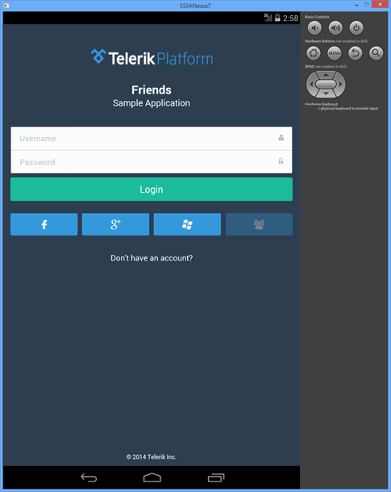
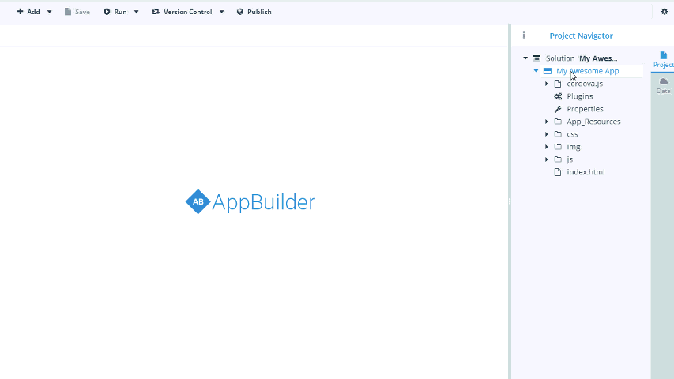

## Telerik AppBuilder Release: Native Emulator Support, Bower Package Manager, and New Project Templates

Less than a month after our [most recent major release](http://blogs.telerik.com/appbuilder/posts/14-07-02/telerik-appbuilder-release-sharing-projects-cordova-update-nativescript-preview-and-more), the Telerik AppBuilder team is back with another feature-packed upgrade. This week we released a variety of new features and improvements including the ability to access native device emulators, integration with the Bower package manager, new "getting started" Kendo UI project templates, and plenty more.

For the complete details, read on! As usual, you should consult our [release notes](http://docs.telerik.com/platform/appbuilder/release-notes/v2-4) for the most detailed overview of what is new.

### Support for Native Emulators

The AppBuilder device simulator is truly best in class. It provides an incredibly accurate representation of iOS, Android, and Windows Phone 8 devices. However, we all know that when reality strikes in hybrid mobile development, it's usually because of device-specific quirks which can be difficult to simulate. And while you can easily test on physical devices you have in-hand, you can't easily test on devices you don't have. **This is why we are proud to announce the availability of accessing native device emulators in the AppBuilder clients!**

Available today in the AppBuilder Windows Client and Visual Studio Extension, developers may now run their app on any [Android Virtual Device](https://developer.android.com/tools/devices/index.html) or [Windows Phone 8 emulator](http://msdn.microsoft.com/library/windows/apps/ff402563(v=vs.105).aspx) that is installed locally (access to the Xcode iOS Simulator for our Mac users is coming soon!). Do you have a customer reporting a problem on a Nexus 7 and you don't have one to test? Not a problem, just create a virtual device and target that device from AppBuilder.

You can even use LiveSync to iterate through changes and take advantage of the AppBuilder on-device debugging as you are working on your bug fixes and updates! *Tip: If you want better performance with your Android Virtual Devices, install the [Intel Hardware Accelerated Execution Manager (HAXM)](https://software.intel.com/en-us/android/articles/intel-hardware-accelerated-execution-manager).*

### Bower Package Manager

Installing and maintaining JavaScript libraries and frameworks is not the walk in the park it may have been at one point. All too often there are dependencies upon dependencies that you have to manage when upgrading or installing new frameworks. Luckily [Bower](http://bower.io/) came about and the heavy lifting is now handled for us. Bower is a self-described "package manager for the web" that tracks new versions of your components and manages dependencies and updates for you.

In our last release we introduced a new package manager for Kendo UI. We are now extending this functionality to allow you to take advantage of Bower components as well!

### New Starter Templates

You asked for it and we are happy to provide! Starting with this release we have a set of new, simplified, starter [Kendo UI](http://www.telerik.com/kendo-ui) templates for your AppBuilder projects. Instead of creating a new project and then spending 10 minutes deleting code you don't want, we now provide streamlined project templates including:

- **Kendo UI Blank** (a truly blank template with Kendo UI Core and Kendo UI TypeScript declaration files)
- **Kendo UI Drawer** (a simple Kendo UI template with drawer navigation)
- **Kendo UI TabStrip** (a simple Kendo UI template with tabstrip navigation)

Where are the jQuery Mobile and Kendo UI data visualization templates? They haven't gone far - these are now maintained in the "Demo Apps" section.

### And Much More

Like every other Telerik AppBuilder release, it can be hard to focus on just a few features to talk about. Rest assured we are continually focusing on the core value of AppBuilder and improving our infrastructure, fixing bugs, and adding productivity enhancements. Some additional highlights from this release include:

- **Adding `console.log` functionality for Windows Phone 8.** Debugging hybrid apps on WP8 can be a challenge and one of the most glaring deficiencies is the lack of access to the console log. Luckily for you our engineering team came up with a way for you to access this within AppBuilder!
- **Android LiveSync issues resolved.** We have resolved a host of LiveSync and performance-related issues with our Companion App for Android. Be sure to grab the latest version of the Companion App from [Google Play](https://play.google.com/store/apps/details?id=com.telerik.AppBuilder&hl=en).
- **The AppBuilder CLI now offers support for Linux.** We've heard from hybrid developers on Linux who want to utilize the AppBuilder CLI and starting today we have a solution! Linux users may take advantage of the vast majority of features that our Mac and Windows CLI users have been enjoying for months now, but on their native platform.

### What's Next?

Coming up you can expect some bigger and better integrations with our new [Cordova/PhoneGap Verified Plugins Marketplace](http://plugins.telerik.com/), some new innovative solutions for managing build configurations and plugin variables, and much more that we can't divulge quite yet. In the meantime, be sure to [consult our feedback portal](http://feedback.telerik.com/Project/129) and give a "like" to any features you want to see in future releases!