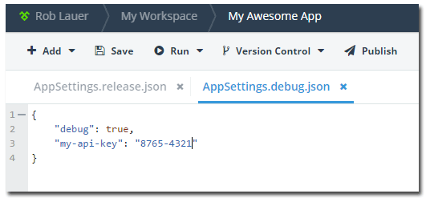
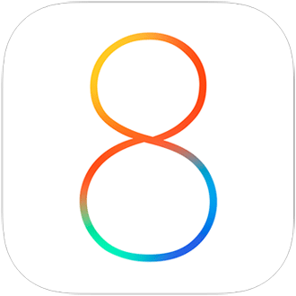
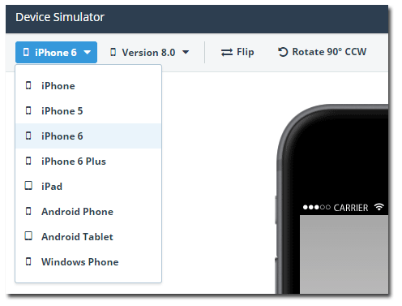

## Telerik AppBuilder October Release: iOS 8 Support, Device Simulator Improvements, and Build Configurations

This month we are happy to announce another great Telerik AppBuilder release! This release has a laser focus on developer productivity. We are adding features such as build configuration support for your JavaScript and Cordova plugin variables, updates to iOS 8 support, and the first in a series of updates to our popular device simulators.

Let's get right to the details! (Don't forget to check out the [full release notes](docs.telerik.com/platform/appbuilder/release-notes/v2-6) for all of the detailed changes and bug fixes.)

### Updates Since Last Release

A few important issues have been resolved since our last AppBuilder release, and we wanted to take a moment to make sure you were aware of them and what, if anything, you need to do:

- **Security issue in older versions of Cordova:** We [released a hotfix](http://blogs.telerik.com/appbuilder/posts/14-09-17/telerik-appbuilder-hotfix-for-cordova-3.5-on-android) that includes Cordova 3.5.1 for Android and recommend that everyone update their Android apps ASAP.
- **Release of iOS 8:** We made sure that on day one your apps worked well on iOS 8. We have additional improvements to announce in this release.
- **Issues with publishing iOS apps:** Apple threw us a curve ball, but we [resolved publishing issues](docs.telerik.com/platform/appbuilder/release-notes/v2-5-2) a couple of weeks ago.

On to our regularly scheduled updates...

### Build Configuration Support

One of the most common requests we hear from customers is the ability to better manage JavaScript variables and Cordova plugin variables as part of their build configurations (i.e. debug and release). Imagine needing to use one API key for testing/debugging, yet another for production/release, and so on. Previously you had to manually manage this process, but now **we are happy to announce support for managing this variables across build configurations!**

Related to this, we now support managing plugin variables from plugins installed with our package manager from the [Verified Plugins Marketplace](http://plugins.telerik.com/)!

### iOS 8 Support

As mentioned previously, Telerik AppBuilder works great with iOS 8 apps today. Our [Companion Apps](http://www.telerik.com/appbuilder/companion-app) have been updated to better support iOS 8 and we have upgraded our build servers in preparation for our next release, where we will include the iOS 8 SDK as part of our cloud build process, grant you access to the bleeding edge versions of Cordova, and (as soon as it's supported and stable) allow you to target the new, faster, WKWebView for your iOS apps!

### Device Simulator Updates

We've been working hard to update the plumbing for our device simulator, so I'm happy to announce the first in a series of updates to this important part of AppBuilder. In this release, we are providing you with additional iPhone 6 device sizes in the simulator. **You may also customize your own devices** - helping you to stay on top of the absolute latest device trends! We've also added numerous usability improvements, such as the addition of a circular cursor to better mimic touch events.

In the next AppBuilder release we are going to be building upon this big time. Keep watching the blogs for more details.

### What Else?

- Our [Companion App for Android](https://play.google.com/store/apps/details?id=com.telerik.AppBuilder&hl=en) now has a built-in QR code scanner, making it easier to use than ever before.
- Publish your Windows Phone 8 apps directly to [Telerik AppManager](http://www.telerik.com/appmanager) from the AppBuilder IDEs.
- Our [Command Line Interface](http://www.telerik.com/appbuilder/command-line-interface) now supports adding/removing plugins, installing plugins from the Verified Plugins Marketplace, and TypeScript compilation.
- Numerous usability and design improvements across all of our tools.
- Pesky bugs fixed, like your .abproject file in Visual Studio not being added to source control.

### What's Next?

This is just the start. We've been doing a lot of work behind the scenes to make sure the core value of AppBuilder is as robust as ever. In coming releases you'll see more from us regarding our device simulator, expanded support for the latest from iOS/Android/Windows Phone, and an expansion of AppBuilder itself to allow you to target mobile web sites! Big updates are coming so stay up to date on our blogs and remember to ["like" any features on our feedback portal](http://feedback.telerik.com/Project/129) you feel like we may be missing.