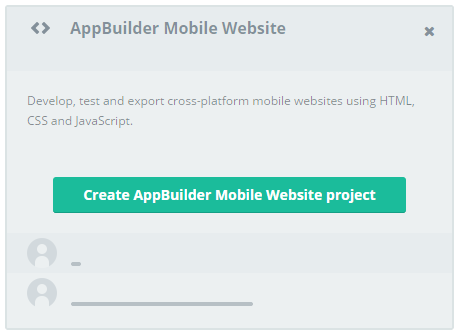
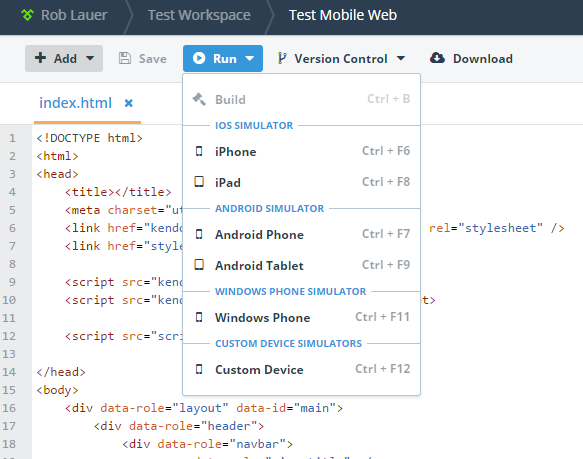
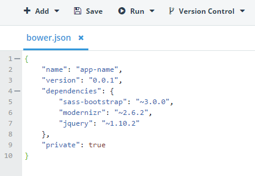
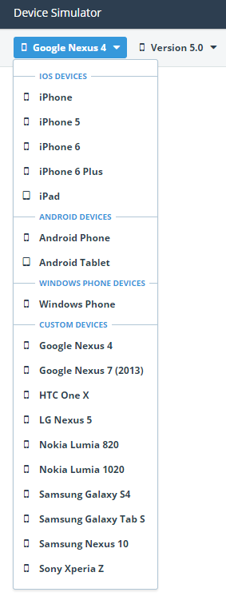

## Telerik AppBuilder December Release: Expanding Your Reach Into Mobile Web

Yes, I know it's January already, but we released a major update to AppBuilder a couple weeks ago and I wanted to make sure you didn't miss the details! While you were sipping on eggnog and avoiding awkward family conversations, we unveiled a new paradigm of AppBuilder - the ability to develop and test apps created for the mobile web. That's not all, we have major updates for hybrid apps as well, so read on for all the details!

> As always, you should consult our [release notes](http://docs.telerik.com/platform/appbuilder/release-notes/v2-7) for even more detailed information.

Let's jump right into the most significant updates in this exciting release:

### Mobile Web Support (Beta)

Clearly the biggest addition in this release is our new support for static mobile web sites. Many of you have commented over the past year on how you love using AppBuilder for hybrid app development, but since you are already essentially creating HTML5 apps, why not expand the reach into mobile web support? We agree and are pleased to offer this support today.

**The vast majority of what you are familiar with in the AppBuilder services don't change at all!** You still have access to our integrated version control capabilities, our device simulator, package manager, and so on. The big difference comes in the publishing step - with the beta of this feature we are allowing you to download your site assets in a zip file, which you may then use to deploy your app. However, in an upcoming release we are going to provide better integrated deployment solutions, so stay tuned!

### Support for Cordova 3.7

We know there are those of you out there who want to stay on the bleeding edge, so we've taken it upon us to start exposing the latest version of Cordova for you to use in your apps. Cordova 3.7 is brought to you as "experimental" - meaning you are free to try it in your apps, with the disclaimer that we will only support the most recent, fully tested, version of Cordova and associated plugins in our Companion Apps (which is currently 3.5).

### Build Configuration Support for Files

In the [last release](http://blogs.telerik.com/appbuilder/posts/14-10-31/telerik-appbuilder-october-release-ios-8-support-device-simulator-improvements-and-build-configurations) of AppBuilder, we brought you the ability to create separate json files that you could use to manage JavaScript variables across debug and release build configurations. We have now extended that support for all files in your project! Simply use the `*.debug.*` syntax for files you only want included in debug builds, and the `*.release.*` syntax for release builds. [Check out our docs](http://docs.telerik.com/platform/appbuilder/build-configurations/overview) for the full details.

### Android 5.0 Lollipop Build and Simulator Support

We now provide full support for Android 5.0 (Lollipop) builds on our Android build servers. This means any custom plugins you are leveraging which require the 5.0 SDKs will now build and function perfectly. We also have simulator support for Android 5.0 within our integrated device simulator.

### Add and Manage Bower Packages with bower.json

For some time now we have provided an integrated package manager that allows you to manage your Kendo UI versions, Bower packages, and Cordova plugins from the [Verified Plugins Marketplace](http://plugins.telerik.com/). For those of you who prefer a closer-to-the-metal approach, we now are exposing access to the `bower.json` file, which allows you to manage your packages and dependencies. You can [follow our docs](http://docs.telerik.com/platform/appbuilder/creating-your-project/add-project-libraries) for full instructions, but I can tell you now that it's pretty darn easy:

- Add `bower.json` in the root of your project (verify that it [complies with the Bower spec](https://github.com/bower/bower.json-spec)).
- Open `bower.json` and make any changes you desire.
- In the **Project Navigator**, right-click `bower.json` and select **Install dependencies**.
- AppBuilder then installs the Bower packages in the `bower_components` folder.
- Reference those code libraries in your project.

### And So Much More!

One can only read so much about a release before your eyes start glazing over :). We have A LOT more in this release to share, so I'll revert to bullet points for easy digestion:

- Support for Windows Phone 8.1 devices in the simulator
- iPhone 6 and 6 Plus icon management
- Numerous updates and improvements to our Companion Apps
- Unified Android permission management across all clients

Finally, we have also added many additional Android and Windows Phone devices to our device simulator!

### What's Next?

2015 is going to be a huge year for us. With the recent [Progress acquisition news](http://www.telerik.com/company/press-releases/2014/12/02/progress-completes-acquisition-of-telerik-and-expands-executive-management-team), we are better positioned than ever to offer you compelling solutions for your native, hybrid, and mobile web development. Later this month we plan on offering our long-awaited iOS SDK 8 build service - and beyond that you can expect regular product updates, [leading up to TelerikNEXT](http://www.telerik.com/teleriknext) - our conference for the Telerik developer community in May. Until then, [let us know on our feedback portal](http://feedback.telerik.com/Project/129) what YOU want to see in AppBuilder!