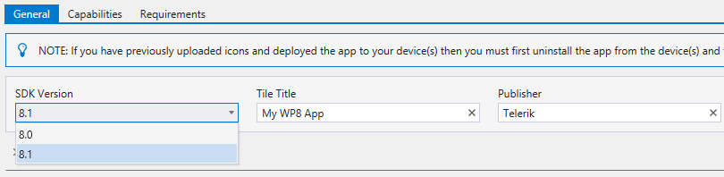

## Telerik AppBuilder February Release: Performance Boosts and Core Value Improvements

It's that time of year here in the northern hemisphere that I find myself repeatedly searching Google for "Costa Rica relocation". However, from a glass-half-full perspective, it is a fantastic time of year to sit with a warm laptop and discover what's new with your favorite piece of the [Telerik Platform](https://platform.telerik.com/)! Let's take a closer look at the latest release of Telerik AppBuilder.

> Before you continue, be sure to [consult the release notes](http://docs.telerik.com/platform/appbuilder/release-notes/v2-8) for all of the details that I'm glossing over in this post.

### Performance Improvements

If you have logged into the Telerik Platform within the last week, you may have noticed a considerable increase in responsiveness. This is because we just completed a massive migration to AWS (Amazon Web Services) for our backend infrastructure. This not only **improves the reliability and performance** of our [In-Browser Client](http://www.telerik.com/appbuilder/in-browser-client), but also has a huge impact on our cloud-based build times (*numbers based on cloud builds of our [Telerik Friends](http://docs.telerik.com/platform/backend-services/samples/friends/friends-sample) sample app*):

- **Android** - 28 seconds to 15 seconds (*47% improvement*)
- **iOS** - 33 seconds to 30 seconds (*10% improvement*)
- **Windows Phone** - 46 seconds to 36 seconds (*22% improvement*)

**You'll also notice a big improvement with version control commands** that you issue from the In-Browser client or Windows client.

### Device Simulator Enhancements

As I've stated [many times](http://blogs.telerik.com/appbuilder/posts/14-10-31/telerik-appbuilder-october-release-ios-8-support-device-simulator-improvements-and-build-configurations) in [past releases](http://blogs.telerik.com/appbuilder/posts/15-01-05/telerik-appbuilder-december-release-expanding-your-reach-into-mobile-web), we are always working on improving our device simulator. This time we are adding support for multi-touch, so you can accurately simulate pinch-to-zoom gestures. Simply hold down the `shift` key and you'll be able to click and drag to simulate a pinch gesture:

<video width="316" height="508" controls="true"><source src="/images/default-source/appbuilder/simulator_28.mp4" type="video/mp4"></video>

### Android Apps Just Got Faster

It's an easy performance tweak that many hybrid developers miss. On Android 4.4+ devices, you can target a modern Chromium webview with your AppBuilder apps. **This means performance improvements on modern Android devices and significantly improved HTML5 support.**

These settings are applied automatically to new AppBuilder projects, but to add this setting to an existing project, [open your Android Manifest](http://docs.telerik.com/platform/appbuilder/configuring-your-project/edit-configuration) and you’ll probably have a line that looks like this:

	<uses-sdk android:minSdkVersion="8" />

You can change that to:

	<uses-sdk android:minSdkVersion="10" android:targetSdkVersion="21" />

This has been around for a while (since Android 4.4 was released), so if you're not doing it now, better late than never!

<blockquote class="twitter-tweet" lang="en">
android:targetSdkVersion=&quot;19&quot; -&gt; one simple change to dramatically boost perf of your hybrid mobile app on Android 4.4 <a href="https://twitter.com/hashtag/chrome?src=hash">#chrome</a> <a href="https://twitter.com/hashtag/phonegap?src=hash">#phonegap</a>
&mdash; Rob Lauer (@rdlauer) <a href="https://twitter.com/rdlauer/status/405079467606806528">November 25, 2013</a></blockquote>

### Support for Visual Studio 2015 and 2013 Community Editions

Everyone is hot and bothered to try out the [Visual Studio 2015 Preview](http://www.visualstudio.com/en-us/downloads/visual-studio-2015-downloads-vs.aspx) from Microsoft - so what better time to update the [AppBuilder extension for Visual Studio](http://www.telerik.com/appbuilder/visual-studio-extension) to support the latest IDE from Microsoft. Plus, if you have been holding off on using AppBuilder in Visual Studio because you don't want to pay for a VS license, now is the time to jump all over the 2013 Community edition!

[Visual Studio Community 2013](http://www.visualstudio.com/en-us/products/visual-studio-community-vs.aspx) is a free version of Visual Studio that provides full support for plugins/extensions. If you currently use the AppBuilder Windows client, I highly recommend you take closer look at our Visual Studio extension and you'll quickly see that everything you can do in our Windows client you can do with our Visual Studio extension (and then some).

### Full Windows Phone 8.1 Support

Your Windows Phone apps have worked just fine on Windows Phone 8.1 devices all this time, but we now offer full 8.1 support with this release. That means full build support for the 8.1 SDK and an updated [Windows Phone Companion App](http://www.windowsphone.com/en-us/store/app/appbuilder/0171d46b-b5f2-43d9-a36b-0a78c9692aab).

> To build for Windows Phone 8.1, make sure you are targeting Cordova 3.7+ and target the [appropriate Windows Phone SDK](http://docs.telerik.com/platform/appbuilder/configuring-your-project/project-properties-for-wp8-devices) in your project properties.

### Verified Support for Cordova 3.7

Since the last release of AppBuilder, you've been able to use Cordova 3.7 in an "experimental" state. We have finished our verification of 3.7 and are happy to say it is now an official part of AppBuilder. All of your new projects should now default to 3.7. Since the Apache Cordova team now releases slightly different versions for each platform, when we say "Cordova 3.7" we are really referencing the following platform-specific versions:

- Apache Cordova 3.7.0 for iOS
- Apache Cordova 3.6.4 for Android
- Apache Cordova 3.8.0 for Windows Phone 8

### And Much More...

As usual there is too much to talk about and not enough space. Here is a quick rundown of some of the other goodies we are including with this release:

- [Numerous significant CLI updates](http://docs.telerik.com/platform/appbuilder/release-notes/v2-8#features-and-updates-in-the-command-line-interface-and-the-package-for-sublime-text)
- Improved [NativeScript](http://www.telerik.com/nativescript) support and ability to publish a NativeScript app to [Telerik AppManager](http://www.telerik.com/appmanager) (**don't miss the upcoming [NativeScript webinar](http://www.telerik.com/campaigns/nativescript)!**)
- Kendo UI releases are now marked as "verified" when they have been fully tested to work with AppBuilder
- Filter [Verified Plugin Marketplace](http://plugins.telerik.com/) Cordova plugins by tag
- Improved code editing experience in our In-Browser client

### What's Next from AppBuilder?

We have a laser focus on [TelerikNEXT](http://www.teleriknext.com/) and are getting some huge features ready to demo there. Get your ticket today to be the first to hear all about AppBuilder and the other amazing things coming from Telerik in 2015!

