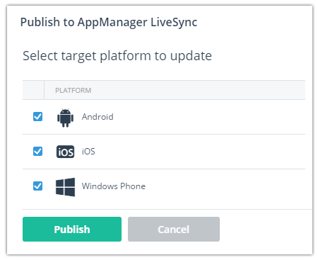
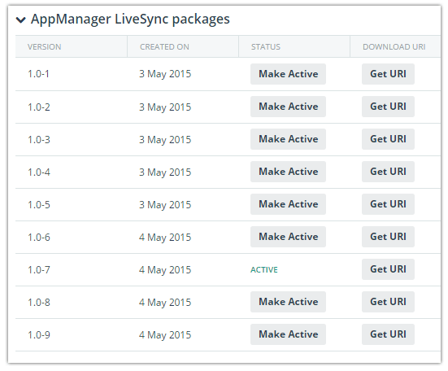
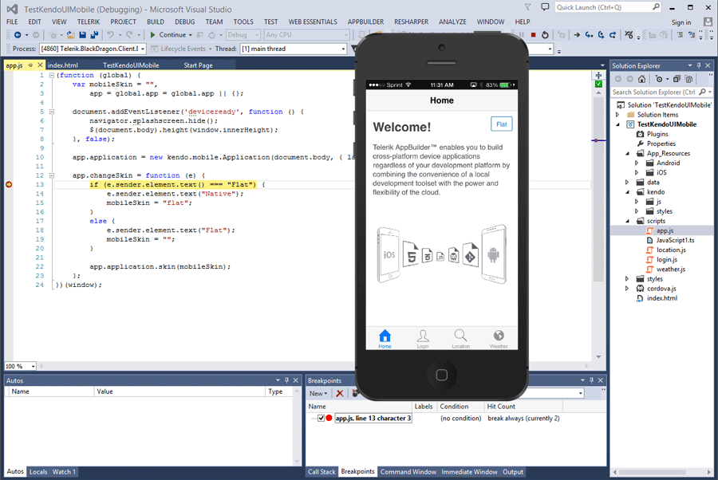
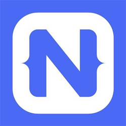
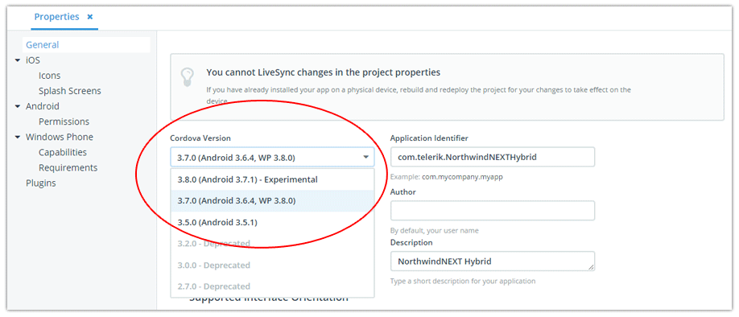
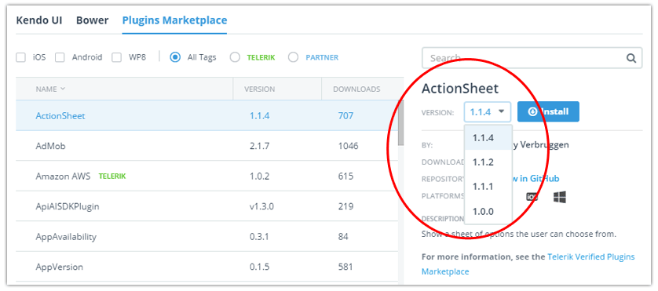
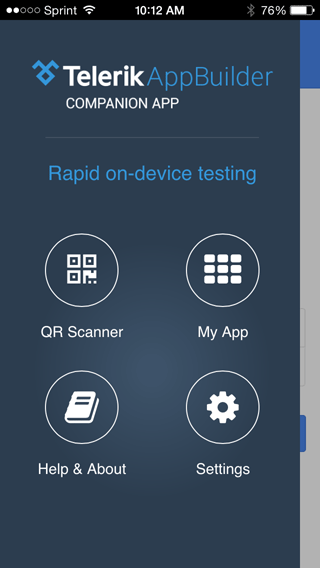

## Telerik AppBuilder May Release: Update a Published App in Seconds

Just last week at [TelerikNEXT](http://www.telerik.com/teleriknext-highlights) we unveiled a host of new features for the entire [Telerik Platform](http://www.telerik.com/platform). Today we will dive into some of the AppBuilder-specific updates. Among these include a new feature we call AppManager LiveSync, which allows you to update a published app in seconds without going through the app store review process!

**Let's get started!**

> Make sure you review the [full release notes](http://docs.telerik.com/platform/appbuilder/release-notes/v2-9) to get all of the details we can't cover here.

### AppManager LiveSync

You've known and loved LiveSync in AppBuilder for years as a feature that lets you immediately view HTML, CSS, and JavaScript changes without rebuilding and reloading the app on your device. We've extended this idea from a development-only feature to a full production-level concept. With AppManager LiveSync enabled, you can send updates to already published apps and your users will be prompted to install the update in seconds, not in days or weeks like you're used to.

It gets even better though, because with Telerik AppManager, you can easily switch between published versions. So if there is a problem with the latest package you just released, you can easily revert to the most recent functioning one:

And for those of you who leverage AppBuilder LiveSync, we now allow you to programmatically call a LiveSync action (yes, in code!) by calling: `livesync.sync()`. Likewise you can enable/disable LiveSync globally by calling the `livesync.enable()` or `livesync.disable()` methods.

### Visual Studio Debugging with Breakpoints

Users of our [AppBuilder extension for Visual Studio](http://www.telerik.com/appbuilder/visual-studio-extension) will be more than happy to hear we now support full on-device debugging for iOS and Android! Debugging works for both NativeScript and hybrid Cordova apps - allowing you to set breakpoints in the code editor, evaluate/watch variables, and observe the console log. You can also leverage the `step in`, `step out`, `step into`, and `step over` commands in Visual Studio.

### NativeScript Updates

**For those of you who haven't heard the news, [NativeScript](https://www.nativescript.org/) allows you to develop truly native mobile apps by using JavaScript and CSS (and the apps are cross-platform to boot).** We of course provide full support for NativeScript in the Telerik Platform.

AppBuilder today supports development of NativeScript 0.10 apps. In this release we added the ability to publish your awesome new native apps to [Telerik AppManager](http://www.telerik.com/appmanager) and the iOS and Android app stores!

### Cordova Updates

We now support Cordova 3.8 as an "experimental" release and provide full support for Cordova 3.7 across the AppBuilder clients. In addition, we are removing and deprecating some older versions of Cordova that you should no longer be targeting:

- Deprecated support for Cordova 2.7, 3.0, and 3.2
- Removed support for Cordova 2.0, 2.2, and 2.4
- All project templates have been updated to Cordova 3.7

Please update your hybrid apps by choosing a more modern version of the framework from the **Properties** screen:

**I know what you want to ask: "When will we see support for Cordova 4.0 for Android?".** Great question, and I'm happy to say we'll have something to share with you very soon - including the ability to target the faster and more powerful [Crosswalk](https://crosswalk-project.org/) web view on Android!

### AppBuilder Package Manager Updates

The AppBuilder package manager has seen some significant improvements this time around. Along with a re-designed wizard interface, we now allow you to choose a specific version of any Cordova plugin from our [Verified Plugins Marketplace](http://plugins.telerik.com/cordova):

### Mobile Web Deployment

For those of you leveraging AppBuilder for mobile web development, we now provide you with the ability to publish your site via FTP. And there is much more coming regarding our mobile web story in coming releases!

### Best of the Rest

As with most of our releases, we have way more to talk about than we have space. Here are some more highlights:

- We now provide full support for IE and Firefox browsers
- Our [Command Line Interface](http://www.telerik.com/appbuilder/command-line-interface) has been updated with usability and doc improvements - along with updated commands to create and develop projects with [Screen Builder](http://www.telerik.com/screenbuilder) (i.e. `appbuilder create screenbuilder`)
- The Kendo UI Designer in our In-Browser Client and Windows Client has been updated to support remote views
- We now have a new unified user experience across all of the [AppBuilder Companion Apps](http://www.telerik.com/appbuilder/companion-app):

### What's Next?

We have big plans for the rest of 2015. We have heard you loud and clear regarding your desire for Cordova 4.0 and Crosswalk. We also know you want support for Windows Universal apps. And yes, Apple Watch support! We are warming up some big surprises above and beyond these in the coming months, so stay tuned. And in the meantime, please let us know what YOU would like to see in the Telerik Platform on our [feedback portal](http://feedback.telerik.com/Project/129)!