## Building an Apple Watch App with the Telerik Platform

We are well into the first generation of wearable devices and, while the jury is still out on its success, Apple is leading the charge with the [Apple Watch](http://www.apple.com/watch/). While it's obvious that the wearable movement has only just begun (and we are far from having a critical mass of useful apps), there are many of you who have that next great wearable app idea. If you'd like to learn how to build your own Apple Watch app today - using the Telerik Platform and the web skills you know and love - sit tight because we are going to do just that.

**Ready? Let's get started!**

### Step 1: Get a (free) Telerik Platform account

If you haven't already, [sign up](https://platform.telerik.com/#register) for a free 30 day trial of the [Telerik Platform](http://www.telerik.com/platform). Why Telerik Platform? In short, it helps make mobile development easier. By providing a robust set of mobile-focused tools and services that work with your favorite IDE, the Telerik Platform enables you to create hybrid AND native cross-platform mobile apps using only HTML, CSS, and JavaScript.

After you sign up, come back here when you are ready!

### Step 2: What can we do with Apple Watch?

Before we can start building an app, we need to be aware of what we can and can't do today with Apple Watch. Leveraging Telerik's own [Cordova plugin for Apple Watch](http://plugins.telerik.com/cordova/plugin/applewatch), we can work with glances, notifications, and a large variety of UI widgets:

#### Glances

A glance is a quick summary of some basic information from your app. These read-only snippets are invoked by swiping up on the device. You may want to show the user their current location, a weather forecast, or a brief preview of other data they need to interact with. Tap on a glance to open up the corresponding watch app.

#### Notifications

We all know what push notifications are, and the same concept exists for Apple Watch. If your iPhone is unlocked, you'll get push notifications on your iPhone. Otherwise you'll receive those notifications on your Apple Watch. Swipe down on the Apple Watch to see unread notifications.

#### App Pages and UI Widgets

As of this writing, the Apple Watch SDK (WatchKit) doesn't allow us to dynamically create UI elements, but the Telerik plugin gets around this by pre-populating a series of app pages with a large variety of UI widgets - and you can easily show and hide them as needed!

Here is a visual summary of all the UI widgets we can customize and use:

<table>
<tr>
	<td><b>Switch</b> 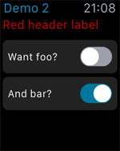</td>
	<td><b>Slider</b> 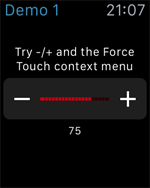</td>
	<td><b>Map</b> 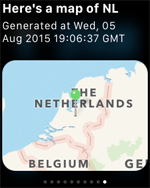</td>
</tr>
<tr>
	<td><b>Context Menu</b> 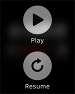</td>
	<td><b>Image and Label</b> 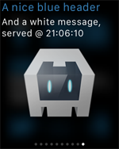</td>
	<td><b>Table</b> 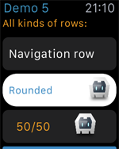</td>
</tr>
<tr>
	<td><b>User Input Button</b> 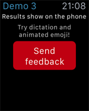</td>
	<td><b>Action Button</b> 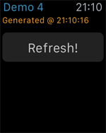</td>
	<td><b>Navigation Buttons</b> 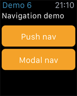</td>
</tr>
</table>

> When trying to wrap your head around building a hybrid Apple Watch app, it's easiest to think of the app purely as an extension of an existing iOS app. Everything you see on the watch is going to come from a standard hybrid Cordova app built using HTML, CSS, and JavaScript.

**Now that we know what we can do, let's build an app!** Today we are going to clone an existing Apple Watch demo app that shows us how to:

1. Create a variety of glances on the watch.
2. Allows the user to tap on the glance (which sends them to the app).
3. And in the app show some examples of UI widgets that allow the user to interact with the watch.

### Step 3: Clone and configure our Apple Watch App

I'll be using [Telerik AppBuilder](http://www.telerik.com/appbuilder) (part of the Telerik Platform) to create this app. AppBuilder leverages Cordova (a.k.a. PhoneGap) to let you use your web skills to create mobile apps that are installed natively on your iOS, Android, and Windows Phone devices. **This means you don't have to write any native code to write an Apple Watch app!**

I'm going to be using Visual Studio 2015 (and the [AppBuilder extension for Visual Studio](http://www.telerik.com/appbuilder/visual-studio-extension)) for development, but you can follow these same basic instructions if you are using the AppBuilder [In-Browser Client](http://www.telerik.com/appbuilder/in-browser-client), [native Windows Client](http://www.telerik.com/appbuilder/windows-client), or [Command-Line Interface](http://www.telerik.com/appbuilder/command-line-interface) + [Sublime Text](http://www.telerik.com/appbuilder/sublime-text-package).

#### Step 3a: Clone the sample app

In Visual Studio, open up the **Team Explorer** panel, click the **Manage Connections** button, and then the **Clone** link. Once done, you should be prompted with a final window like this:

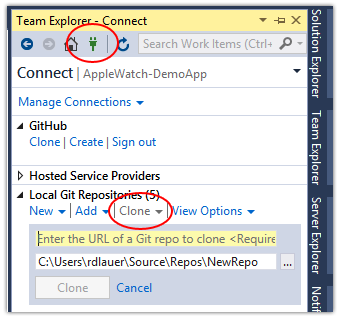

> Cloning a GitHub repo in our other AppBuilder clients is even easier - when creating a new project just choose to "Clone repository" and enter the URL specified below.

Note: You don't *have* to clone this sample app, you can always create a new AppBuilder project and [consult the plugin docs](http://plugins.telerik.com/cordova/plugin/applewatch) yourself of course!

Next, enter the following URL into the yellow shaded input field: `https://github.com/Telerik-Verified-Plugins/AppleWatch-DemoApp` and click **Clone**.

Once the repo has been cloned, simply go to **File -> Open -> Project/Solution** and select the **.abproject** file inside of the cloned directory. This will open up the directory as an AppBuilder project:

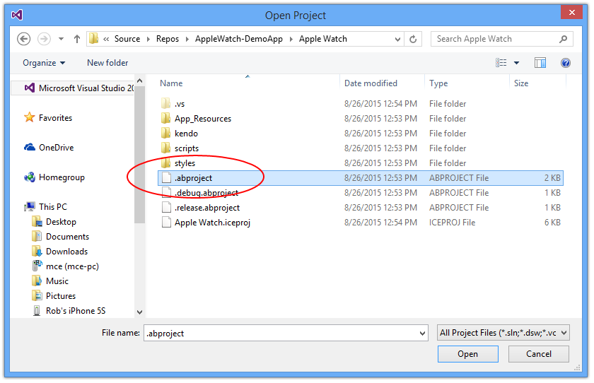

#### Step 3b: Enable the Apple Watch Plugin and Configure iOS Properties

Most of the configuration-related steps are taken care of for us when cloning the sample app. However, it's good practice to go through them and verify that everything is as it should be!

First, we need to enable the Apple Watch plugin. Using the **APPBUILDER** menu, click on **Manage Packages**:

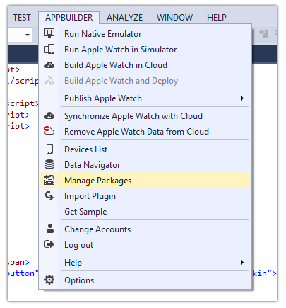

> The AppBuilder Package Manager can also be found by right-clicking the project name in all of the AppBuilder clients.

Navigate to the **Plugins Marketplace** tab and click to install the Apple Watch plugin if it isn't already:

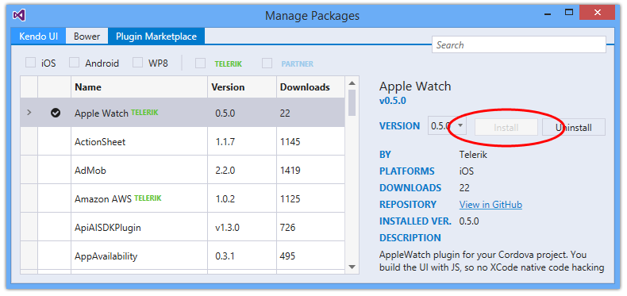

Next up, let's make sure our iOS properties are in order. Double click **Properties** in your solution and navigate to the iOS tab. Make sure you choose a **Deployment Target Version** >= iOS 8.2:

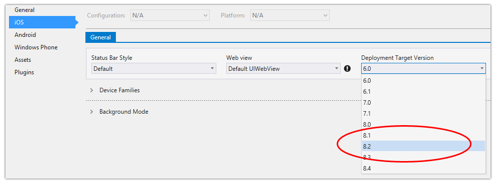

Back in the **General** tab, make sure you are also targeting Apache Cordova 3.5.0 or greater. You'll also notice in the **Assets** tab you can even create icons for your Apple Watch app from one 1024x1024 source png!

**That's it for configuring AppBuilder!** If you get stuck or are having trouble with Visual Studio, an easy shortcut is to [click here and load this sample app into the AppBuilder web client](https://platform.telerik.com/#appbuilder/clone/https%3a%2f%2fgithub.com%2fTelerik-Verified-Plugins%2fAppleWatch-DemoApp).

### Step 4: Set up iOS Provisioning Profiles

Configuring your provisioning profiles and certificates for iOS can be a certain type of hell for mobile developers. That being said, I am here to hold your hand through this arduous process!

Apple Watch bundles consist of three components: a host app running on your iOS device, a watch extension which takes care of the communication between the iOS device and the Apple Watch, and a watch app running on the Apple Watch. **You must configure an App ID and a provisioning profile for each component.** The provisioning profiles must be of the same type (development vs distribution) and must share the same certificate.

#### Step 4a: Register your Apple Watch device id

To install an app on your Apple Watch, you need to register its UDID in the [iOS Member Center](https://developer.apple.com/membercenter) (and yes, this requires you to have a $99/year Apple developer account).

The other gotcha is that in order to discover your Watch's UDID,  you have to connect it to a Mac running Xcode. Make sure your Watch is paired with your phone, connect it to a Mac, open Xcode, browse to Window, then to Devices. Click on your phone and your paired watch will appear, allowing you to copy the full UDID like so:

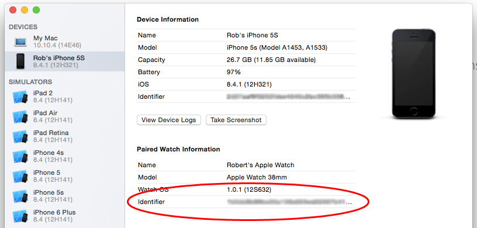

Once you have the UDID simply add it as new device in the iOS Member Center.

#### Step 4b: Create a new App ID

Still in the iOS Member Center, go ahead and create a new App ID. The App ID will need the following set up:

- An explicit app id (bundle id). Enter something unique in the form of "com.mycompany.mywatchapp".
- Under **App Services** make sure you check to enable **App Groups**. We will come back to App Groups in a minute.

**Important!** Back in the AppBuilder properties for your app, be sure to enter this bundle id as the **Application Identifier**:

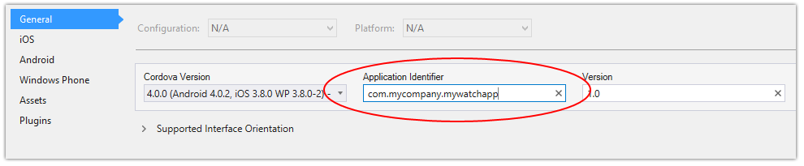

#### Step 4c: Create a new App Group

Back in the iOS Member Center, go to **App Groups** and create a new one. The ID of the app group MUST use the bundle id you just used when creating a new app id, for instance: "group.com.mycompany.mywatchapp".

Now, return to the App ID you just created in the last step. Edit it, then edit the App Groups, and choose the App Group you just created.

#### Step 4d: Create some more App IDs and Provisioning Profiles

I know, it's ridiculous, but you have to create two more App IDs:

- Create an App ID called "com.mycompany.mywatchapp.watchkitextension" and link it to the same App Group you just created.
- Create another App ID called "com.mycompany.mywatchapp.watchkitapp". This doesn't need an App Group, but it doesn't hurt if you do add it.

Next up, provisioning profiles!

For **each** App ID you created (three in total), you need to create a new *development* Provisioning Profile. **For each profile, be sure to include at least your Apple Watch and the paired iPhone when it asks for devices!** 

When you are finished, export/download all of the provisioning profiles.

#### Step 4e: Import the Provisioning Profiles in AppBuilder

In Visual Studio, access the **APPBUILDER** menu and choose **Options**. Click the **Mobile** tab and expand the **iOS** option. Choose **Mobile Provisions** and import all three provisioning profiles. When you are done it should look something like this:

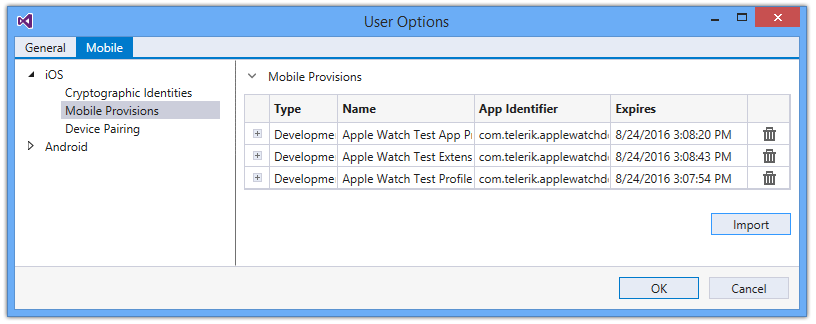

> If you struggled at any point in this step, be sure to [consult our docs](http://docs.telerik.com/platform/appbuilder/code-signing-your-app/configuring-code-signing-for-apple-watch-bundles/index) on configuring code signing for Apple Watch bundles.

Painful? Yes. But we are done with the messy configuration and can now deploy our app to the Apple Watch!

### Step 5: Deploy and test the Apple Watch app

With the current version of AppBuilder, you have to deploy your Watch app to a physical Apple Watch to test it. In the future we will allow you to [deploy to the iOS Simulator](http://developer.telerik.com/featured/using-xcode-ios-simulator-hybrid-mobile-apps-telerik-appbuilder/) if you don't happen to have a watch!

Go ahead and plug your iOS device to your PC to make sure Visual Studio can deploy the app directly to it. From the **APPBUILDER** menu, choose **Build and Deploy**. This will build your app in the cloud and magically deploy it to your iPhone and your Apple Watch!

**And...success!?!?**

If everything worked, you should be able to open the app on your iPhone and interact with your Apple Watch (just like in this recording, made on my ever-useful iPhone 3GS!):

<video width="320" height="420" controls>
	<source src="applewatch-demo.mp4" type="video/mp4">
</video>

### Step 6: Did it work? Learn from some mistakes others have made...

If you run into a problem, odds are the error is related to all of those App IDs, App Group, and/or Provisioning Profiles you had to create. The most common errors you will see when deploying your app to your Apple Watch are:

- **Failed to install [app], error: Application Verification Failed.** This can mean many things, but most likely means that you forgot to assign both your iPhone and your Apple Watch devices to all three of your provisioning profiles. You may have also forgotten to assign your App Group to the App IDs. Or you may just be missing one of the Provisioning Profiles in AppBuilder. Run through step 4 above again, just to be sure.
- If you are using Visual Studio, AppBuilder tries to pick the correct provisioning profile for you when building the app. If you have conflicting profiles (i.e. a wildcard profile like "com.telerik.*" that matches your Apple Watch profiles of "com.telerik.applewatch") be sure to delete the conflicting one.
- **Invalid Bundle - No Apple Watch Binary.** Usually this just means you have to restart your Apple Watch and then try installing the app from within the Apple Watch app on your iPhone.

### Step 7: Profit!

When you're ready to publish your app to the iOS app store, you'll need to create a new set of *distribution* provisioning profiles and import those in AppBuilder. More about publishing directly to the app stores is [available in our docs](http://docs.telerik.com/platform/appbuilder/publishing-your-app/distribute-production/publish-ios).

**Now you have the basic skills for creating an Apple Watch app!** The wearable gold rush has barely even started, so be the first to create that next great wearable app. Sound off in the comments with your results and good luck!