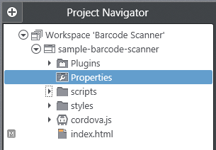
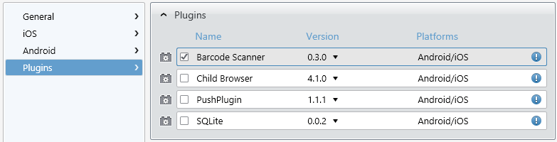

## Go QRazy with the Barcode Scanner Plugin

They are everywhere: QR codes are plastered on practically every piece of marketing material you see these days. And while consumer acceptance of actually scanning QR codes is relatively low (estimated at 19% at the beginning of 2013), the usage is rising at a steady pace. What if you are creating a hybrid mobile app with Icenium and want to add barcode/QR code scanning (or in some cases even add the ability to create your own QR code)? Lucky you because there is a Cordova plugin for that - and it's included as part of Icenium!

The utility of the barcode cannot be denied. There is really no easier way to provide information to a user in an easy to use, machine-readable format. QR codes especially excel at this as they are unmatched in their ability to start a large amount of data but also quickly be readable by even a very old mobile device.

In case you're not quite sure just what a QR code is, here you go (and yes you can safely scan this one - it will just send you to Wikipedia!)

In this post we'll go over how you can integrate the Barcode Scanner plugin into your next Icenium project. We'll cover how you scan for codes (and what to do with the data) and also how to allow your users to create their own QR codes! If you're the curious type, you can look at the documentation for the Barcode Scanner implementations for [iOS](https://github.com/phonegap/phonegap-plugins/tree/master/iOS/BarcodeScanner) and [Android](https://github.com/phonegap/phonegap-plugins/tree/master/Android/BarcodeScanner).

### Types of Barcodes

There are a wide variety of barcodes that you may scan with this plugin. They do vary based on whether you are scanning with an iOS or an Android device.

**Android Compatibility:**

* QR_CODE
* DATA_MATRIX
* UPC_E
* UPC_A
* EAN_8
* EAN_13
* CODE_128
* CODE_39
* CODE_93
* CODABAR
* ITF
* RSS14
* PDF417
* RSS_EXPANDED

**iOS Compatibility:**

* QR_CODE
* DATA_MATRIX
* UPC_E
* UPC_A
* EAN_8
* EAN_13
* CODE_128
* CODE_39

Odds are the only code types you really care about are QR codes and UPC (which are supported by both), but this is still a good reference.

So how do we actually set up an app to scan a barcode? Lets walk through an easy example by first starting a new project in Graphite:

### Initial Setup and Configuration

You can go ahead and create a new project from the Graphite Dashboard (or use an existing project, either way is fine). If you aren't familiar with the Graphite IDE, take a look at the multi-part [Deep Dive into Icenium Graphite](http://www.icenium.com/community/blog/icenium-team-blog/2013/04/05/diving-into-icenium-graphite-part-1-of-3) series.

The first thing I'm going to do is include the Barcode Scanner plugin in my app. Navigate to your project properties by double-clicking on the **Properties** option in the **Project Navigator**.

Navigate to the **Plugins** pane and check the box next to the **Barcode Scanner** plugin. Save your changes and that's it - the plugin is ready to be used in your project!

### Scanning Barcodes

Let say we are developing an app that needs to be able to scan QR codes and act on the data returned from the scan. How would we accomplish this? The Barcode Scanner plugin does most of the heavy lifting for us, but lets walk through the code it will take to get us there.

Lets start with some simple HTML:

    <button class="button" id="btnScan">Scan</button>
    

We want to wire this up so that when the button is clicked, we pull up the scanner and the results of the scanner are inserted into the "result" div element. We need some simple JavaScript to accomplish this:

	$("#btnScan").click(function (){
		window.plugins.barcodeScanner.scan(
			function(result) {
				if (!result.cancelled) {
	                $("#result").text(result.format + " | " + result.text);
				}
			}, 
			function(error) {
				console.log("Scanning failed: " + error);
			});
	});

The key parts are the **result.format** and **result.text** properties. The format is going to provide us with the type of code that was scanned. The text will provide us the data hidden in the code. For example, if you were to scan the code included at the top of this post, the result would be: **QR_CODE | http://en.m.wikipedia.org** - which tells us that this is a QR code and it is a URL to the mobile wikipedia site.

At this point it is up to you to decide what to do with the data. If it's a URL, maybe you spawn an [InAppBrowser](http://docs.phonegap.com/en/2.4.0/cordova_inappbrowser_inappbrowser.md.html) and automatically redirect them to the URL. If it's a UPC code maybe you use that to look up the product using [Amazon's web services](http://aws.amazon.com/).

### Encoding Barcodes

What if you want to allow your users to create their own barcodes? Well it just so happens that this capability is built in to the Barcode Scanner plugin as well. *One big catch though - it's only available for Android!*

We can create another simple example based on the "Scanning Barcodes" example above. Here is our simple HTML:

	<input type="text" id="txtEncode" />
    <button class="button" id="btnEncode">Encode</button>

In this case we are going to take whatever is entered in the **txtEncode** input element and create a QR code from it.

	$("#btnEncode").click(function (){
	    window.plugins.barcodeScanner.encode(
	            BarcodeScanner.Encode.TEXT_TYPE,
	            $("#txtEncode").val(), 
	            function(success) {
	                console.log("Encoding success: " + success);
	            }, function(fail) {
	                console.log("Encoding failed: " + fail);
	            });
	});

This will present the user with a QR code which they may then take a screen capture of to use as they please or even show the code to another device for them to scan directly.

### Conclusion

The Barcode Scanner plugin is a really easy plugin to integrate with your Icenium projects. If you ever have the need to scan and/or encode a barcode, this is your best bet to do so easily and reliably. I hope this is useful to anyone starting out with developing hybrid mobile apps with Icenium!