# Building Hybrid Apps For Windows Phone 8

In today's software world, we have no shortage of choices when it comes to developing applications. Even in the limited scope of Windows Phone development, there are choices galore. Do you develop a native Windows Phone app? Do you take a hybrid approach? How about Xamarin? Should we use ChocolateChip UI? (Yeah, that's actually [a thing](http://chocolatechip-ui.com/).) WHAT DOES IT ALL MEAN!?

To help you wade through this complexity, in this article, we'll take an in-depth look at one of these approaches: hybrid. Specifically, we'll look at why you would want to build hybrid, and how to do it. Let's start by looking at where hybrid can be a good fit.

### Why Hybrid?

Hybrid development, popularized by [PhoneGap](http://phonegap.com/), refers to a technique for building an application using Web technologies—HTML, CSS, and JavaScript—and deploying it as a native application. (It can appear in app stores, and do app-y things—like push notifications.) The primary appeal of hybrid is that, unlike native development, you can author applications using a single codebase that can deploy to multiple platforms. In the context of Windows Phone apps, this means the same app you develop for Windows Phone can also reach iOS and Android users.

Another benefit of hybrid is that the code you're writing—HTML, CSS, and JavaScript—is familiar and open. Unlike native development, where few companies have an existing Objective C (iOS) or Java (Android) skill set, most shops have developers proficient in the Web stack. And the Web stack itself is developed in the open, so you don't have to worry about being tied to one company's proprietary APIs.

But these apps aren't limited to the capabilities of the Web. Because hybrid apps run in a native container, projects like [Apache Cordova](http://cordova.apache.org/) provide access to device APIs that are not accessible via the Web alone—APIs like the accelerometer, contacts, and even push notifications.

Hopefully that gives you an idea of what hybrid is and why you might want to use it. But enough talk, let's see how you actually build a hybrid app.

### Starting a Hybrid Windows Phone App

Although there are many ways you build a hybrid app, including [using the PhoneGap CLI, or AppBuilder's in-browser editor](http://tech.pro/blog/1704/2-ways-to-get-started-with-phonegapapache-cordova), in this article we're going to focus on building a hybrid application directly within Visual Studio using [Telerik AppBuilder's Extension for Visual Studio](http://www.telerik.com/appbuilder/visual-studio-extension). If you don't have the extension installed and want to follow along, you can [download it from the Visual Studio Gallery](http://visualstudiogallery.msdn.microsoft.com/d486edc5-aae3-4ad9-84c1-578efc0a32ed).

With the extension installed, the **FILE** --> **New** --> **Project...** menu now has the options shown in the screenshot below. You have a few templates you can choose between, but for now let's go with the Kendo UI Mobile template.

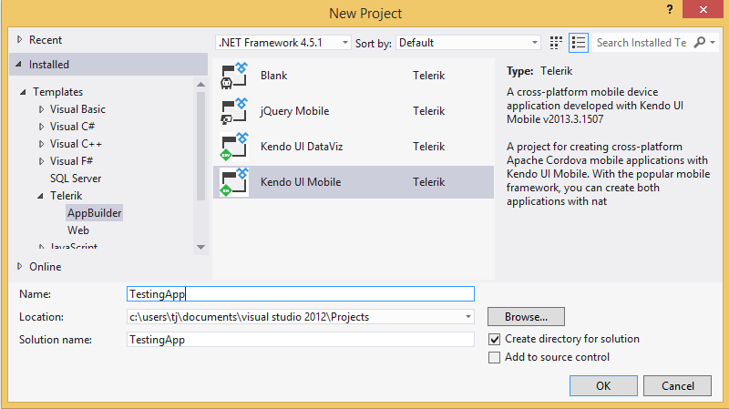 New project screen showing the template options">

This generates a boilerplate project with the files shown below.

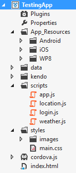

Your next question may be, how do we see what this new project actually looks like?

### Simulating a Windows Phone

AppBuilder contains a device simulator for testing hybrid apps that you can run directly within Visual Studio. To do so, select the **Run [Project Name] in Simulator** option from the **APPBUILDER** menu.

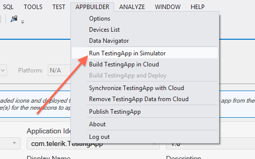

Within the simulator, you can see how your application will appear on various devices, as well as some more advanced functionality, such as mocking a device's location, network, and contacts. You can even debug your application using Chrome's Dev Tools.

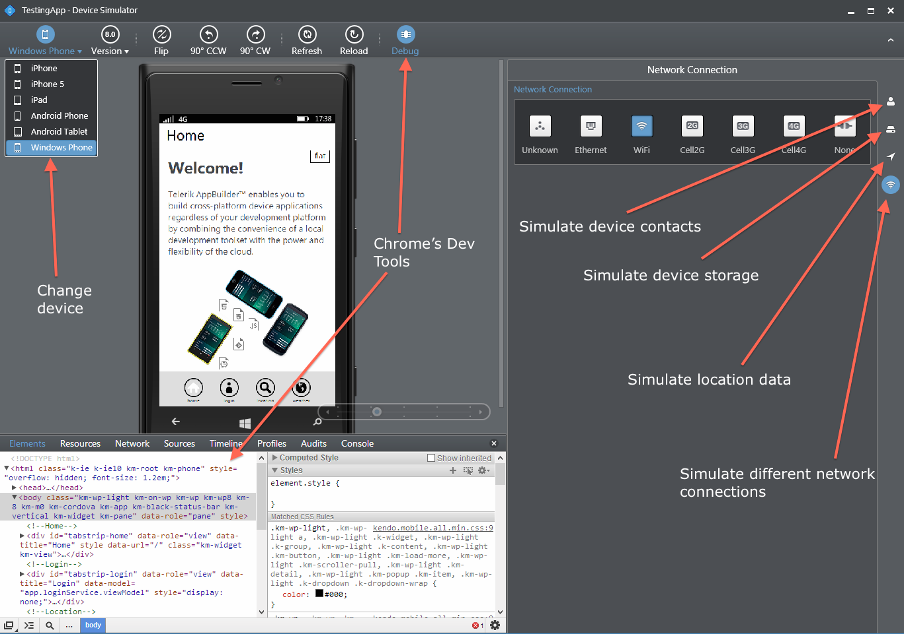

But wait? *Chrome's* Dev Tools? Isn't this a *Windows* Phone app?

Yes it is. But remember this a *simulator*, and while AppBuilder's simulator does try to mimic the native platform—by doing things like providing accurate dimensions and user-agent strings—it's no substitute for testing a real Windows Phone application on a real Windows Phone. But don't worry—AppBuilder makes it easy to do that too.

### Building Windows Phone Apps

At this point, we have our sample application, and we played around with it in the simulator, but we need to see it on a real device. To do so, let's head back to the **APPBUILDER** menu, and this time we'll pick **Build [Project Name] in Cloud**.

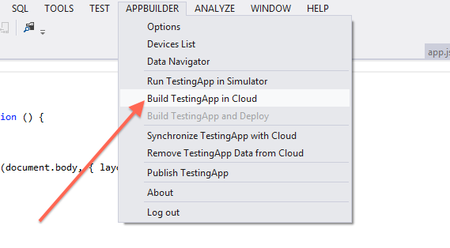

After selecting that option, you'll see the following dialog that allows you to build your application for iOS, Android, or Windows Phone.

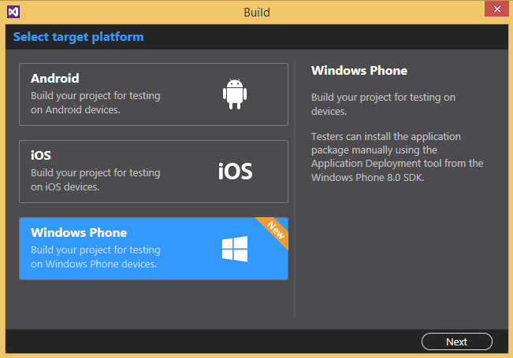

After selecting Windows Phone, AppBuilder performs the Windows Phone build for you in the cloud, and returns a built .xap file.

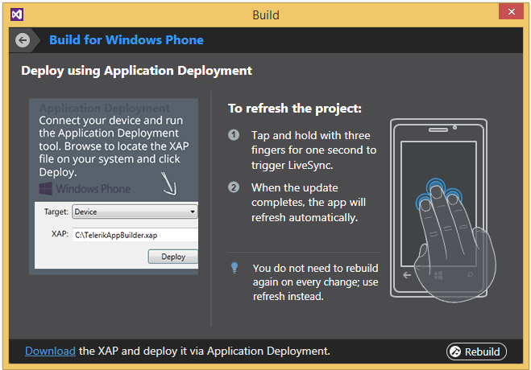

We now have a built .xap file on our local machine, but not on our actual Windows Phone device. The dialog in the above screenshot says that we need to use the *Application Deployment tool*, but what is that? And how do we use it?

### Getting the App on a Device

Before we get to the Application Deployment tool, there are a few prerequisites you must complete before you'll be able to test your app on a device.

* You must own a Windows Phone (hopefully, this one is obvious).
* You must have a [Microsoft account](http://windows.microsoft.com/en-US/windows-live/sign-up-create-account-how).
* If you want to deploy apps to the Windows Phone Store, you must additionally have a [Microsoft developer account](http://dev.windowsphone.com/join). Without a developer account, you can still register a single device for testing, but you cannot publish the apps you build.
* Your device must be [unlocked and registered](http://msdn.microsoft.com/en-us/library/windowsphone/develop/ff769508(v=vs.105).aspx#BKMK_UsingtheWindowsPhoneDeveloperRegistrationTool).
* You must download and install the [Windows Phone SDK](https://dev.windowsphone.com/en-us/downloadsdk).

These steps can be slightly overwhelming, but if you do Windows-based development there's a good chance you have completed a few of these steps already. And it's worth noting that these steps aren't unique to hybrid Windows Phone apps; you have to go through the same steps for any Windows Phone development.

When you do have all this done, it's time to run the Application Deployment tool we referred to earlier. The tool itself is [an executable located within the Windows Phone SDK](http://msdn.microsoft.com/en-us/library/windowsphone/develop/ff402565(v=vs.105).aspx#BKMK_tool), located at `C:\Program Files (x86)\Microsoft SDKs\Windows Phone\v8.0\Tools\XAP Deployment\XapDeploy.exe`.

Run the executable and you'll see the following screen.

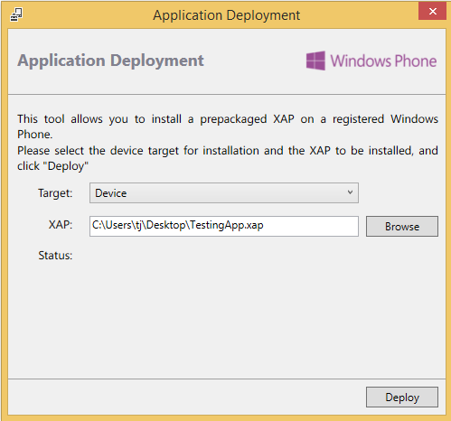

Here you'll want to connect your Windows Phone device to your PC, select the AppBuilder-built .xap file, and click Deploy. When it finishes, head over to your device and checkout the list of all apps.

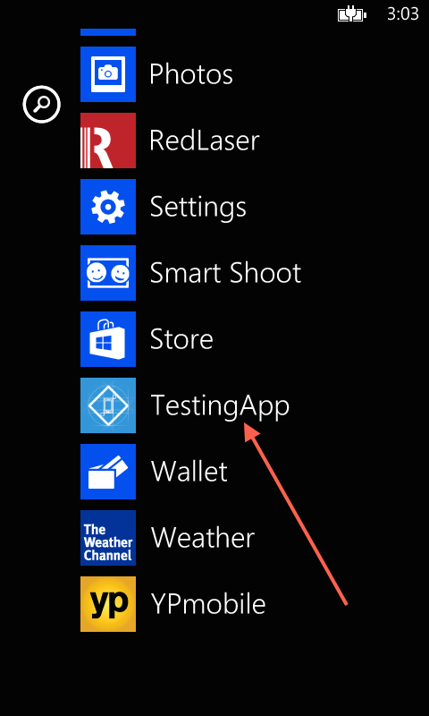

Success! But now that we have an app on the device, what do we do next?

### Developing Hybrid Windows Phone Apps

We've seen how to start an app, simulate it, and get it onto a device—but we've yet to touch on the most important thing: the actual development of the app. But really, there's not a whole lot new to talk about here. Remember that a hybrid app is still a Web app, so you have the full power of the Web at your disposal. You can use [Kendo UI Mobile](http://demos.telerik.com/kendo-ui/mobile/overview/index.html), [jQuery Mobile](http://jquerymobile.com/), or any Web-based tool you need to do your thing.

> If you're looking for a good walkthrough on how to build a hybrid application from scratch, Burke Holland has an excellent article on [structuring hybrid mobile applications](http://blogs.telerik.com/blogs/14-03-27/structuring-hybrid-mobile-applications).

What *is* unique to hybrid is the ability to access native device features that are not available to the Web, and the canonical library to perform this is [Cordova](http://cordova.apache.org/). If you head over to [Cordova's documentation](http://cordova.apache.org/docs/en/edge/guide_support_index.md.html#Platform%20Support) (or look at the chart below pulled from it), you can see a list of the APIs available on each supported platform.

> Confused about the difference between PhoneGap and Cordova? Checkout [Jim Cowart's article that demystifies the project names](http://blogs.telerik.com/appbuilder/posts/13-03-26/demystifying-apache-cordova-and-phonegap).

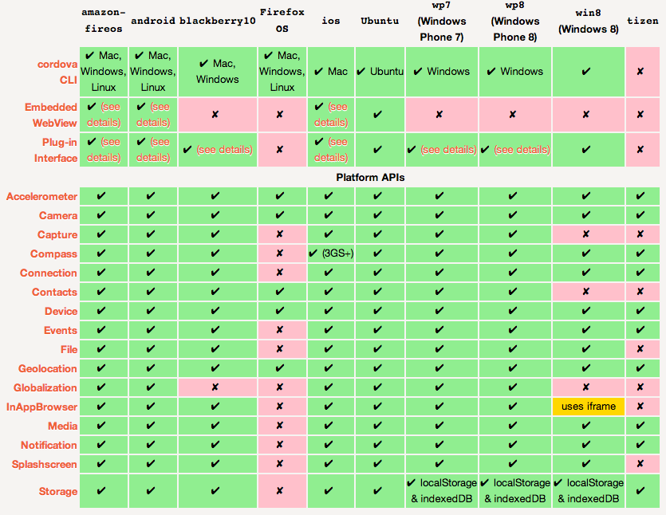

AppBuilder automatically adds Cordova to each new project for us, so we can use any of Cordova's APIs directly in our JavaScript code. For example the following creates a native dialog message.

```
navigator.notification.alert( "A native message", function () {
    // I'm a callback
}, "The title", "The button" );
```

This appears as follows on our Windows Phone testing app.

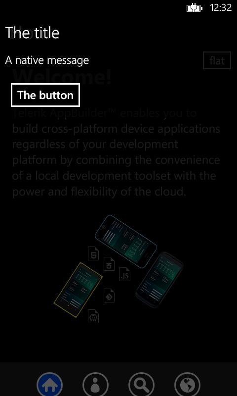

What's cool is that this is a native dialog, not a Web-based one; and all we had to do is invoke a built-in function to use it.

> Need a native API that isn't an official Cordova API? The Cordova project maintains a repository of third-party plugins available at <http://plugins.cordova.io/>. You can even [write your own](http://cordova.apache.org/docs/en/edge/guide_platforms_wp8_plugin.md.html#Windows%20Phone%20Plugins).

### Yeah, But What About the Back End?

You can still have one, but there's one very important criterion: the back end must be accessible over the Web. If you think about it this makes sense. iOS speaks Objective C, Android speaks Java, Windows Phone speaks C#, and BlackBerry does [something](http://developer.blackberry.com/platforms/).

The point being, the only language all these platforms speak is the Web—so if you want to write your back end in another language you can, but it has to run on your own server, and you must expose it via a web-based API. If you don't know how to do that don't worry. We have some guides that can help you out:

<ul>
	<li>
		<a href="https://www.youtube.com/watch?v=fAnlUo50DXk">Build Cross-Platform Mobile Apps Using Visual Studio and .NET</a> by <a href="https://twitter.com/csharpfritz">Jeff Fritz</a><br>
		A Webinar that walks through creating a hybrid app in Visual Studio and connecting it to back-end data.
	</li>
	<li>
		<a href="http://blogs.telerik.com/appbuilder/posts/13-11-26/using-asp.net-web-api-services-in-mobile-apps">Using ASP.NET Web API Services in Mobile Apps</a> by <a href="https://twitter.com/ifandelse">Jim Cowart</a><br>
		Walks through how to integrate Web API services into hybrid apps.
	</li> 
</ul>

The other option you have is to use a Backend service instead of writing your own. Basically this means that, instead of hosting data on your own servers, you store it with an external provider—kind of like a database in the cloud. Jim Cowart has an [excellent article on what to look for in a BaaS](http://www.developereconomics.com/finding-right-baas/) (Backend as a Service), and discusses some of the more popular options.

### Wrapping Up

If you're looking to develop a Windows Phone app, developing it as a hybrid app can be an appealing option. Specifically, the following are the key advantages of a hybrid Windows Phone app:

* You can target iOS and Android with the same codebase.
* You can leverage existing Web skills.
* You can access native device APIs through Cordova.
* You can develop directly within Visual Studio.

That being said, hybrid isn't for everyone. If you're not interested in building for multiple platforms (i.e. you only need a Windows Phone app), and you have an existing .NET skill set, you will likely be better off sticking with native Windows Phone development. But if you do need to target multiple platforms, hybrid applications provide an elegant means to reach these audiences using a single Web codebase.
