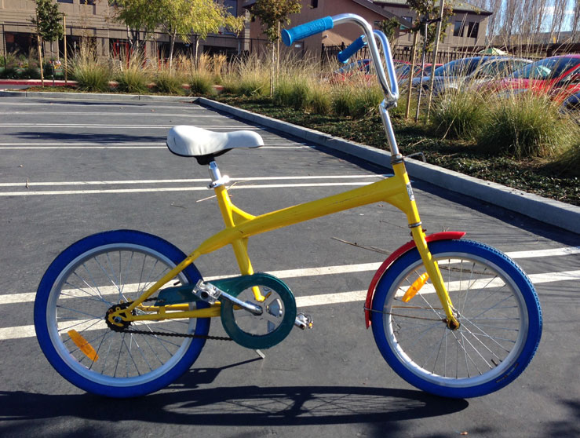

## Live from Chrome Dev Summit 2013

Last week the Chrome team held their annual [Chrome Dev Summit](http://developer.chrome.com/devsummit) on the Google campus in beautiful Mountain View, California. I had the privilege of attending the conference and speaking with some Chrome engineers about what we're going to see out of Chrome on the desktop, mobile devices, and within Android.

And yes, there are [Google bikes](http://www.businessinsider.com/here-are-the-crazy-colorful-bikes-google-employees-ride-around-campus-hq-2013-7). How else are you going to get around on campus?

### Conference Intro

What is relatively unique with the Chrome Dev Summit (and maybe a growing trend?), is that there was only one track for all attendees. Each session was limited to about 30 minutes - enough time to whet our appetites, but not enough to bore us!

Before I get into the details, I have to admit that I went into this conference a little concerned that I was going to be served a too-large serving of the Chrome kool-aid. Thankfully, the outcome was quite the opposite. Almost every mention of a new feature was accessorized with what the other major browser vendors are doing in the same space. There were even a few instances where, say, Firefox was actually ahead of Chrome, and the Chrome engineers were legitimately EXCITED about that! It was a very refreshing attitude and another reminder of how the Open Web will continue to deliver across all platforms and browsers.

So what were the highlights of the conference for me? Please read on, but before you do, if you want to get the full story of what went on at Chrome Dev Summit 2013, I invite you to watch the entire conference on YouTube: [Day One](http://www.youtube.com/watch?v=1aPR43fhIWk) and [Day Two](http://www.youtube.com/watch?v=jiXVpj3QKZQ).

### Day One

**Build Mobile Apps with Chrome WebView** - [Matt Gaunt](https://twitter.com/gauntface) did a great summary of what we can look forward to with Android 4.4 (KitKat) and the highly anticipated [replacement of the Android WebView](https://developers.google.com/chrome/mobile/docs/webview/overview) with Chrome. PhoneGap (and Icenium!) developers take note, as this is the biggest thing to hit the hybrid mobile development world in a while!

**Network Connectivity: Optional** - [Jake Archibald](https://twitter.com/jaffathecake) gave a highly entertaining talk on the science (art?) of offline access with mobile devices.

**#perfmatters: Tooling Techniques for the Performance Ninja** - [Colt McAnlis](https://twitter.com/duhroach) evangelized the heck out of what can and should be done on the tooling side (read that: Chrome Dev Tools) to improve the performance of our web applications. Intense talk, but effective :)

**#perfmatters: 60fps Layout and Rendering** - Since I am all about mobile performance (and you kind of have to be in today's hybrid development world), I was especially excited to hear what [Tom Wiltzius](https://plus.google.com/103238735625031210015/) and [Nat Duca](https://plus.google.com/+NatDuca/posts) would have to show us. I wasn't disappointed as we learned a lot about what we can do to bring about a [jank free](http://jankfree.org/) world.

**Polymer: Declarative, Encapsulated, and Reusable Components for the Web** - My favorite talk of the conference, [Eric Bidelman](https://twitter.com/ebidel) gave a great overview of [Google's Polymer project](http://www.polymer-project.org/). What is Polymer you ask? Well, it's a new library from Google that provides a level playing field for all modern browsers to use many of the technologies behind [Web Components](http://css-tricks.com/modular-future-web-components/). I highly recommend reading up on Polymer (I know I will) as it could be part of the next standard in modern client-side application development.

**Dart for the Modern Web Developer** - I'm not a huge [Dart](https://www.dartlang.org/) fan (I blame my C# bias), but this was an informative talk by [Kasper Lund](https://plus.google.com/+KasperLund/posts) and [Seth Ladd](https://twitter.com/sethladd) that described what is new with Dart 1.0. No mention of [TypeScript](http://www.typescriptlang.org/) that I recall, but both are worth looking into if you want to provide yourself with some additional structure when developing client-side applications.

### Day Two

**#perfmatters: Instant mobile web apps** - Another talk with the popular [#perfmatters](https://twitter.com/search?q=%23perfmatters&src=hash) hashtag, [Bryan McQuade](https://twitter.com/bryanmcquade) gave us a nice overview of mobile performance and what we can do to decrease the perceived load time of our mobile apps. You mean to tell me serving static HTML is faster than having the server render it first? Funny the lessons we forget over time!

**DevTools for Mobile** - [Paul Irish](https://twitter.com/paul_irish) gave one of the more impressive talks on the Chrome Dev Tools and what upcoming features will be available for mobile. How about remote debugging and device emulation in the browser? Crazy good stuff here folks - these are the kinds of features that will shave days, if not weeks, off of our development and debugging time.

**Optimizing your Workflow for a Cross-Device World** - Matt Gaunt gave another nice talk focusing on testing on devices. Not only that, but he showed us how we will see changes on our devices without going through the cumbersome delete cache/refresh/reload workflow.

**Breakout Sessions** - The last part of the conference was split up into a variety of breakout sessions. I attended the [Polymer](http://www.polymer-project.org/) session as I'm especially curious to see where this technology leads us. While slightly dismayed that Polymer is only in a "pre-alpha" stage (although I'm not sure what that really means coming from Google!), I have my eyes trained on this library.

### Conference Summary

At least to the casual attendee, the conference went off without a hitch. There wasn't a single talk where I didn't get at least one useful tidbit that applies to web and mobile development. We are going to be seeing some exciting things coming out of the Chrome team over the next few months. (In the meantime, grab the latest [Chrome Canary](https://www.google.com/intl/en/chrome/browser/canary.html) build if you want to be on the bleeding edge.) It is clear that the Chrome team believes rising waters float all boats, so I look forward to seeing what is next from Chrome, Firefox, Internet Explorer, Opera, Safari, and all the rest.