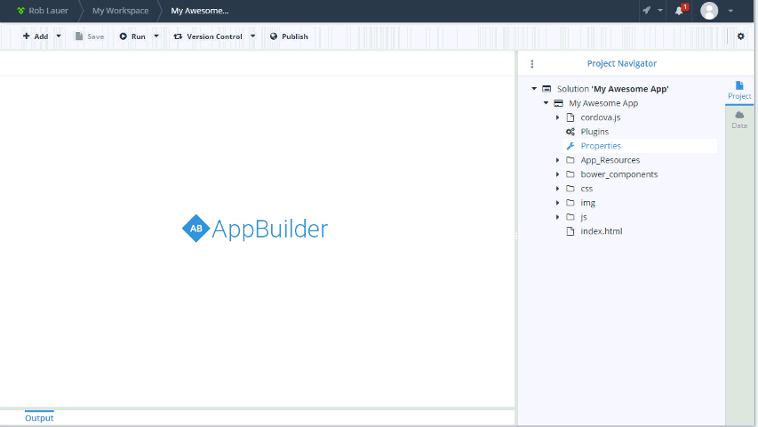

## Telerik AppBuilder Hotfix for Cordova 3.5 on Android

A variety of [security issues](http://cordova.apache.org/announcements/2014/08/04/android-351.html) were found in the latest Cordova bits for Android. Version 3.5.1 was recently released which fixes these bugs - and is included in AppBuilder as well. Please note that this new version only affects Android apps (iOS and Windows Phone 8 app are not impacted by this release).

### What Do I Need To Do?

**If you are building an app for Android and are currently targeting Cordova 3.5.0**, you should re-build and re-publish those apps ASAP. If you are using Cordova 3.2 or earlier, you are not affected by these security issues. However, now is a good time to upgrade to the latest version of the framework.

**Note that the version number you see in the AppBuilder clients will remain at 3.5.0 even though the fix has been applied (but is tagged as "Android 3.5.1" for clarity).** This is because a new version was not released for iOS and Windows Phone 8 at this time.

### How Do I Upgrade Cordova?

*Using a version of Cordova < 3.5? Read on:*

If you are using the [In-Browser client](http://www.telerik.com/appbuilder/in-browser-client), [Windows client](http://www.telerik.com/appbuilder/windows-client), and/or the [Visual Studio extension](http://www.telerik.com/appbuilder/visual-studio-extension) - simply double click on your project **Properties** and choose the Cordova version you would like to target from the dropdown menu provided:

If you are using the [Sublime Text package](http://www.telerik.com/appbuilder/sublime-text-package) and/or our [Command-Line Interface](http://www.telerik.com/appbuilder/command-line-interface), just use this command to migrate your app to the latest Cordova framework:

`$ appbuilder prop set FrameworkVersion 3.5.0`