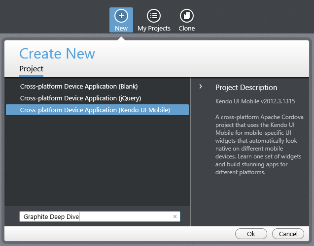
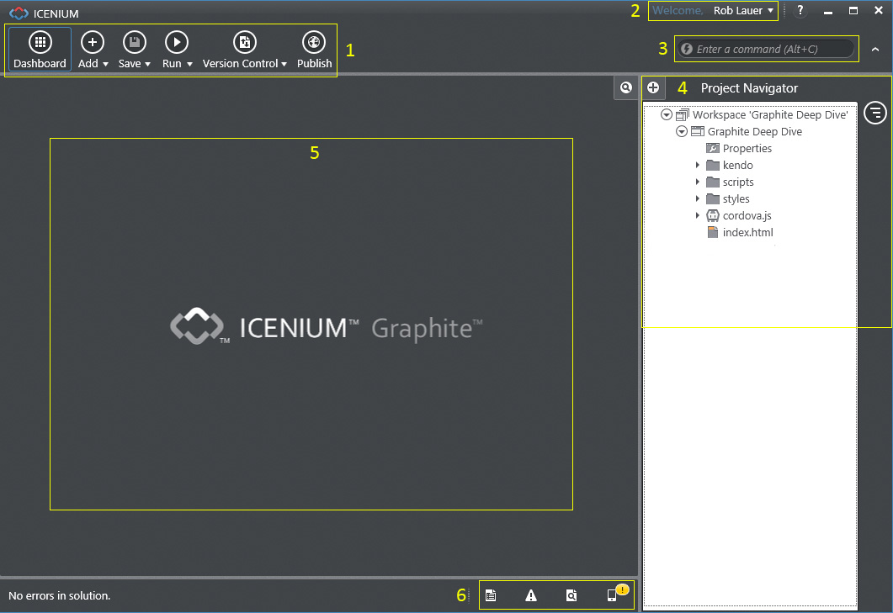
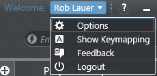
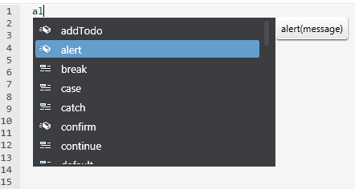
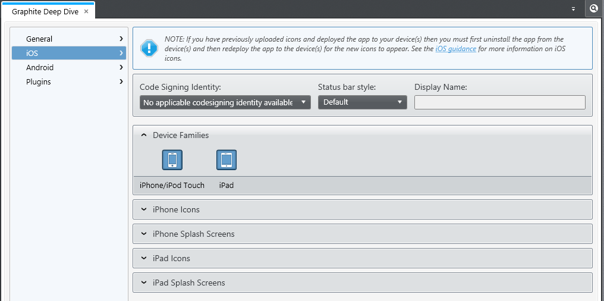
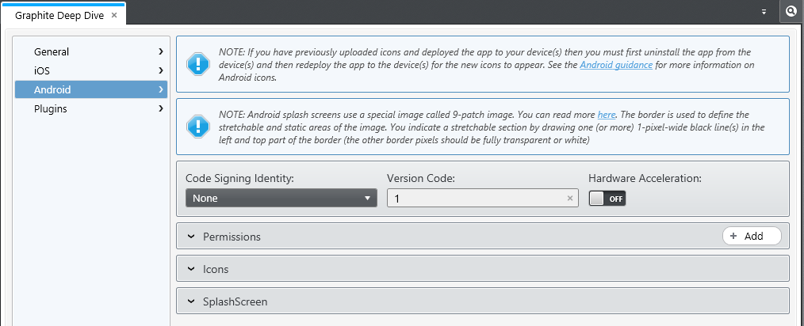
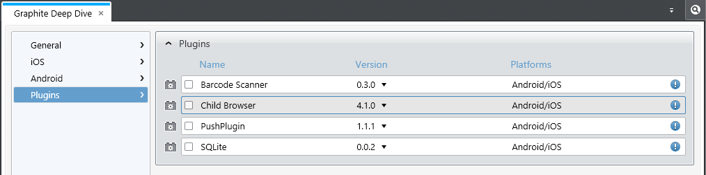

## Diving Into Icenium Graphite - Part 1 of 3

As a new user of Icenium, you probably want to start writing some code and developing the next great hybrid mobile application. Luckily for you, there are two IDE options that ship as part of Icenium: Graphite and Mist. While Mist is a lightweight HTML5-based IDE (run from your browser), Graphite is a full desktop application usable by Windows and Mac (via Parallels or VMWare).

In this series of posts, I hope to show you in detail what amazing things you can do with Graphite. We will do this together by walking through nearly every step of the app development, debugging, testing, and publishing process. If you haven't already, I highly recommend you take a look at Burke Holland's post [What is Icenium, Really?](http://www.icenium.com/community/blog/icenium-team-blog/2013/03/28/what-is-icenium-really-) if you would like to get a high-level overview of Icenium before you continue.

For the rest of you, lets start our deep dive into Icenium Graphite!

### Installing and Logging In

Installing Graphite is as easy as navigating to the [Get Started](http://www.icenium.com/get-started) page on the Icenium web site, agreeing to the Terms of Use (you read it before agreeing, right?), and clicking the now-enabled "Download" button. Once Graphite is installed, you will be prompted to login with your choice of five(!) authentication providers (Telerik, Facebook, Google, Yahoo!, and Microsoft's Live ID).

Remember that since your Icenium projects and settings are saved in the cloud, you will need to have a network connection to login and work on your projects. This also means you can switch from Graphite to Mist and back again without losing any changes to your projects!

*Each time you log in to Graphite, you will automatically download the latest version (if necessary) - so there is never a need for you to check for a new version or reinstall the application.*

### Creating Your First Project

After successfully logging in, you will be presented with a prompt to create a new project (or if you are an existing user - a prompt to open an existing project). Either way, lets start by choosing one of the three new project options:

* **Cross-platform Device Application (Blank)** -- this is a basic project template that includes a simple "Hello World" Cordova app.
* **Cross-platform Device Application (jQuery)** -- this project template utilizes the [jQuery Mobile](http://jquerymobile.com/) framework and includes a more comprehensive "Hello World" app implementation.
* **Cross-platform Device Application (Kendo UI Mobile)** -- this project template utilizes the [Kendo UI Mobile](http://www.kendoui.com/mobile.aspx) framework and also includes the same robust "Hello World" app implementation.

*Please note that all of the above templates use Apache Cordova (a.k.a. PhoneGap). Confused about PhoneGap vs Cordova? Jim Cowart [explains the difference](http://www.icenium.com/community/blog/icenium-team-blog/2013/03/26/demystifying-cordova-and-phonegap)).*

For the purpose of this series, I am going to choose the "Kendo UI Mobile" project template - simply because I plan on creating both iOS and Android versions of my app and would like to retain the native UI automatically for both apps.

Now that we have created our project (and everything has been saved in the cloud) lets look more closely at the Graphite Workspace.

### The Graphite Workspace

Graphite was built to be as intuitive and user-friendly as possible. That being said, I'd like to spend a little time getting accustomed to the elements that comprise the Graphite Workspace. The numbers in the image above correspond to the numbered elements below:

1. **Main Menu** - The main menu gives you quick access to the **Dashboard** (where you may access all of your projects), **Add** new folders or files, **Save** changes, **Run** your app on a device or simulator, access to **Version Control** functions, and **Publish** your app. Don't worry, we will go through the nuts and bolts of these functions later on.

2. **Your Name** - Your name is actually a drop down list that includes **Options** (which we will dive into in the next section), **Show Keymapping** (a handy cheat sheet for all of the available Graphite keyboard combinations), **Feedback** (we LOVE feedback!), and **Logout**.

3. **Enter a Command** - This is a handy utility that allows you to quickly access nearly every command available in Graphite.

4. **Project Navigator** - If you are a Visual Studio, Eclipse, or Web Storm user (among other IDEs) you will quickly recognize this as a standard hierarchical display of your project assets (HTML, JS, CSS, and images).

5. **Code Editor** - Simply: where you write your code. Included in the Code Editor is automatic code completion, refactoring, code analysis, and more cool features that we will look at more closely when we start writing our app.

6. **Bottom Toolbar** - For lack of a better term, the bottom toolbar provides you with quick access to:
	* **Output** (includes the Graphite Log and Device Simulator Log - both of which will be helpful when debugging)
	* **Errors** (both real-time code analysis errors and build errors)
	* **Find Results** (the results from your searches)
	* **Devices** (displays any iOS or Android devices you have attached to your computer)

*Tip: If you want to conserve some screen space, you can click on the upward-facing arrow to the right of the "Enter a command" dialog AND the icon directly to the right of your Project Navigator. This will expand the space made available for the Code Editor.*

Now that you at least have an idea of what is going on in Graphite, I would like to spend some time digging into some of the provided user options:

### Configuring Your User Options

Click on your name and choose "Options" from the list provided. This will open up the comprehensive list of User Options available in Graphite.

#### Mobile Tab

By default you are placed on the **Mobile** tab. This tab provides you with the ability to attach one or more provisioning profiles. What is a provisioning profile? Why do I care about this? Great questions! A provisioning profile is simply a file that links developers and devices to an authorized iOS developer account - and enables said devices to be used for testing. You will only care about this if you are planning on testing on an iOS device that is physically attached to your computer. You can skirt around this issue by using [Icenium Ion](https://itunes.apple.com/bg/app/icenium-ion/id527547398?mt=8) which lets you remotely test new builds on iOS devices.

#### Advanced Tab

This is where you will find all of your detailed configuration options. Remember that since you are using a cloud-based IDE, any changes you make to your settings will automatically show up if you use Graphite on another computer! In the interest of keeping this as succinct as possible, I'd like to point out what I think are some of the more important advanced user options to be aware of.

**Code Style -> CSS/HTML/JavaScript**

Under "Code Style" you have the ability to customize indentation, spacing, and positions of curly braces for your project files (HTML, CSS, and JavaScript). *This is your IDE - go crazy and personalize Graphite to match your style!*

**Code Style -> Common -> File Header Text**

This is a particularly useful option if you want to attach some common language in the header of your scripts. Right click in a JS file and choose "Code Commands" then "Introduce Header" to see an example. You may want to use this to include copyright or licensing information.

**Code Analysis**

Those of you familiar with products such as [ReSharper](http://www.jetbrains.com/resharper/) or [JustCode](http://www.telerik.com/products/justcode.aspx) will find the built-in code analysis an incredibly useful tool. In real-time you will be shown potential syntax errors without having to do a full build of your project. Now, you may want Graphite to be more or less stringent on what it flags as an error versus a warning (or maybe not show it at all). In the **Code Analysis -> Warnings** section you are able to set these options on each type of potential error in your code.

**Visual Features**

Those of you familiar with JustCode will be used to seeing a visual aid appear every time there is a code analysis error or warning. You may turn this off if you want, but it's a nice way to see a visual representation of the issue at hand.

#### General Tab

If you are coming from a Visual Studio world, you are probably addicted to Intellisense - and that's not a bad thing. Graphite comes with automatic code completion and defaults to the JustCode style of making you to click ctrl-space to get your auto completion options. However, under the **Code Completion** option, there is a check box to "auto list members". I recommend you check this, but do whatever you feel is comfortable.

### Project Properties

Itching to get started with development? So am I! But first I'd like to show you just a few more settings that are relevant to the development process.

Open up the **Properties** window (the first item underneath your project name in the Project Navigator). Most of the items in the properties window are self-explanatory, but I'll go over some of them here just in case:

#### General

The **General** tab allows you to specify the version of Cordova that your project will utilize. Unless you require an older version (maybe because of a plugin or some other incompatibility) we recommend sticking to the latest Cordova release.

The **Application Identifier** is the unique internal identifier of your app, in reverse URL notation. You should use an identifier that corresponds to your local organization to keep it as unique as possible (i.e. "com.yourdomain.app"). In the iOS world this identifier will become part of your App ID while in Android this will be the package identifier. Code signing and publishing is probably the one place that trips up mobile app developers the most, so don't be ashamed if you don't understand this process or what this means right now. We will cover code signing and publishing in more detail in a later post.

**Version** is the publicly-visible version number of your app.

**Supported interface orientation** will let you specify whether or not you want users to be able to rotate your app and display the content in horizontal and/or vertical positions.

#### iOS

The **Code Signing Identity** setting here is specific to iOS and is a combination of your cryptographic identity (your iOS developer identity) and a mobile provision. Again, we will cover everything related to code signing in a later post.

You have the ability to specify the color or the iOS status bar when your app is open by choosing an option under **Status Bar Style**.

What are you going to call your app? You may enter the name of the app (the name that will be visible to your users) in the **Display Name** box.

You may specify which types of iOS devices your app can be installed on by choosing iPhone and/or iPad under **Device Families**.

Relevant **Icons** and **Splash Screens** are specified in the proceeding sections of the iOS tab. *Your app will not be eligible for submission to the app store unless you have the appropriate icons and splash screens saved for each device type that you are supporting.* In addition, if you want your app to run on the iPhone 5, you MUST add an iPhone 5 splash screen.

#### Android

Android has it's own **Code Signing Identity** that we will cover in a later post. There is also a **Version Code** that must be incremented each time you publish a new version.

**Hardware Acceleration** on Android is a bit of a contentious issue that deserves a little additional explanation here. When you read "acceleration" you probably assume this equates to better performance and a better experience for your users. And yes, this can be the case. However, sometimes Android hardware acceleration causes problems with Cordova apps. Users commonly report screen-redrawing issues or partial screen redrawing problems where a user touch is required to display the missing page (Google Maps can choke on it as well). This all being said, it is definitely worth experimenting with as it can provide you with a performance boost. Just test well!

Each Android app must notify the user which device capabilities the app will require before it is installed. This is where the **Permissions** come into play. By default, Graphite includes a list of the most commonly used permissions. If you don't need the permission, delete it from this list! Users may get concerned by the quantity of permissions an app requires and you could see decreased installations if you are asking for more permissions than are actually necessary. If you require permissions that are not already on the list (or one that you previously deleted) use the "Add" button.

Just like with iOS, you will want to specify your **Icons** and **Splash Screen**. The 9 patch splash screen can be confusing, so I recommend you keep it simple and use Google's own [Android Asset Studio](http://android-ui-utils.googlecode.com/hg/asset-studio/dist/index.html) to create your own.

#### Plugins

We are getting to the fun stuff now! **Plugins** add functionality to your app that doesn't exist in the base Cordova implementation. As of Icenium version 1.3, we allow you to easily include four of the most popular plugins:

1. **[Barcode Scanner](https://github.com/Icenium/sample-barcode-scanner)** allows you to integrate QR code, UPC code, and data matrix code scanning in your app.

2. **[Child Browser](https://github.com/Icenium/sample-childbrowser)** gives you the ability to display an external web site within the context of your app (but in a new window).

3. **[PushPlugin](https://github.com/Icenium/PushPlugin)** helps you to implement push notification functionality in your apps.

4. **[SQLite](https://github.com/Icenium/sample-sqlite)** is a lightweight relational database that you can use to efficiently query, store, and display data for the users of your app.

If you have any experience adding a Cordova plugin to an iOS or Android app in the past, you will appreciate this "check it and forget it" approach. Don't believe me? Take a look at a really well done tutorial on integrating the [Barcode Scanner plugin on Android](http://www.mobiledevelopersolutions.com/home/start/twominutetutorials/tmt3). You'll see there are many steps and many opportunities for error - and this is only for one platform!

### Conclusion And What To Expect Next

If you have made it this far, I hope you have learned more about the Graphite IDE - what it is, what it can do, and how you can customize it to suit your needs. In the next post I will dive deeper into the actual development process by creating a real hybrid app using [Kendo UI Mobile](http://www.kendoui.com/mobile.aspx)!

  
<strong>About the Author</strong> <a target="_blank" href="http://roblauer.me" rel="author">Rob Lauer</a> is a web and hybrid mobile app developer living in Madison, WI. He works as a Developer Advocate for Telerik focusing on <a href="http://icenium.com" target="_blank">Icenium</a> and <a href="http://kendoui.com" target="_blank">Kendo UI</a>. Rob is <a target="_blank" href="http://twitter.com/rdlauer">@rdlauer</a> on Twitter.

