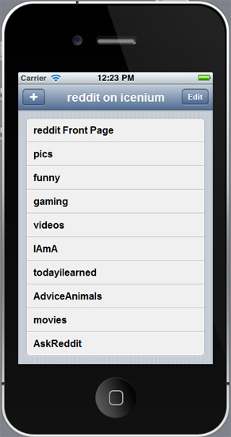
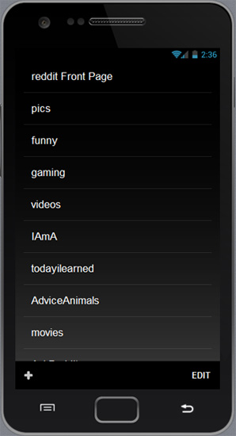
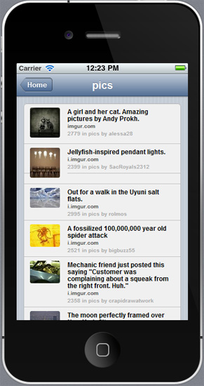
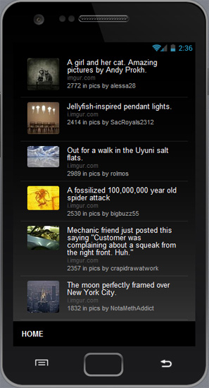
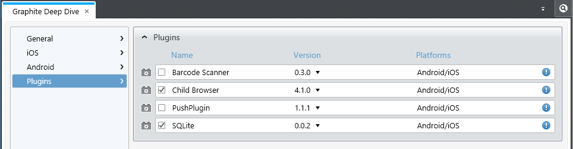
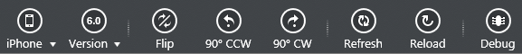
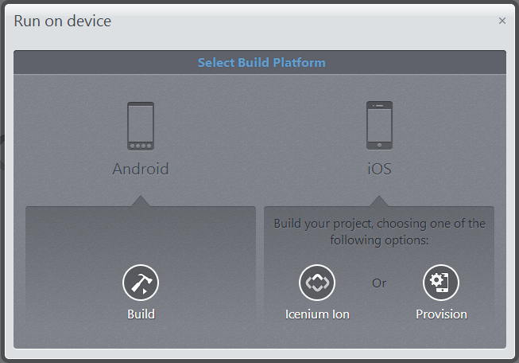
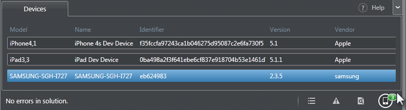
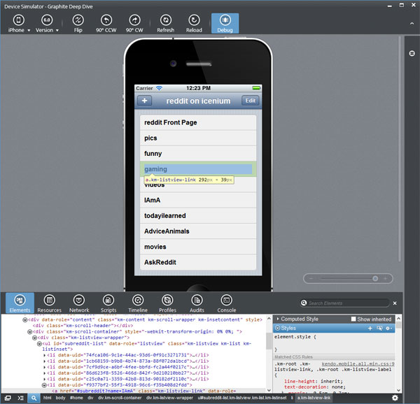

## Diving Into Icenium Graphite - Part 2 of 3

If you have been following the [Diving Into Icenium Graphite](http://www.icenium.com/community/blog/icenium-team-blog/2013/04/05/diving-into-icenium-graphite-part-1-of-3) series, you are already at least somewhat familiar with the Graphite IDE - what it is and how to customize it to suit your needs. If not, take a moment to read the first post, we can wait. Done? Great! Part two of the series is going to focus less on what Graphite is and more about what **you** can do with Graphite. Together we are going to develop a hybrid mobile app that you could publish to the Apple App Store and Google Play.

The app that we develop is going to highlight a few features of [Kendo UI Mobile](http://www.kendoui.com/mobile.aspx) and utilize some Cordova plugins built into Icenium. By the end of this article you will hopefully see how easy it is to build your own hybrid mobile app using the same languages and frameworks you use to write robust web sites. Lets get started!

### The Idea and The Implementation

Every great mobile app needs a great idea behind it, and what better way to demonstrate the power of Icenium than to create a fun app based on the ultimate informative time-waster: Reddit. First we need to scope out the features of our "Reddit on Icenium" app:

1. Display a list of default subreddits (categories) to our users.
2. Allow our users to add and remove subreddits from this list.
3. Tap a subreddit to show the top 25 posts in that category.
4. Allow the user to view the content behind each post in a browser window.

Equally as important as defining what is in scope, we should also take a moment to discuss what is out of scope for this project. Due to time constraints we are going to exclude the Reddit staples of user authentication, voting, and comments. I know, what is the use of building this app without being able to vote up a cat meme?

When we build this app we are essentially building a Single Page Application (SPA). A SPA is a type of web application that never requires the user to navigate off of the initial "index.html" page. All of the resources and page views are loaded dynamically, giving a more desktop-like feel to your app. In addition, we are going to keep this app simple and minimize dependencies on third party libraries. Instead we are going to focus on what is included in Icenium, such as:

1. **jQuery**
2. **Kendo UI Mobile** (although we could also use [jQuery Mobile](http://jquerymobile.com/))
3. **SQLite Plugin**
4. **ChildBrowser Plugin**

Now that we know what we are building and what tools we have at our disposal, lets get into the nuts and bolts of building our app.

*All of the code presented here is available on GitHub at [https://github.com/rdlauer/icenium-reddit](https://github.com/rdlauer/icenium-reddit).*

### Developing Your Hybrid Mobile App

Create a new project in Icenium by navigating to your **Dashboard** and choosing **New -> Cross-platform Device Application (Kendo UI Mobile)**.

*If you want to skip copying and pasting all of this code, you could choose "Clone" instead and enter the URL to the [GitHub repository](https://github.com/rdlauer/icenium-reddit) in the "Repository Uri" field. This will pull in a copy of the most recent version and you can follow along that way.*

Lets take a look at our application assets and start writing some code:

### HTML

Remove everything that is in your default index.html document and paste in the following code. This is our boilerplate HTML5 Cordova app template with a couple of commented-out references to our ChildBrowser and SQLite plugins (more on those later).

	<!DOCTYPE html>
	<html>
	    <head>
	        <title></title>
	        <meta name="viewport" content="width=device-width, initial-scale=1.0, maximum-scale=1.0, user-scalable=no" />
	        <meta charset="utf-8" />

	        
	        <!--
	        
	        
	        -->
	        
	        
	        
	        

	        <link href="kendo/styles/kendo.mobile.all.min.css" rel="stylesheet" />
	        <link href="styles/main.css" rel="stylesheet" />
	    </head>
	    <body>
	
	        
	        
	    </body>
	</html>

Everything else should make at least some sense to you. At the bottom we initialize our Kendo UI Mobile app and specify the default "slide" transition. In its current state this app isn't going to do anything because we haven't added any [mobile views](http://demos.kendoui.com/mobile/view/index.html).

#### Home View

 

Our **home view** is where our users will see all of their subreddits and have the ability to add/remove items. Now, paste this code in your body:

    <!-- home view (list of subreddits) -->
    

        
        <header data-role="header">
            

                
                reddit on icenium
                <a data-role="button" data-click="toggleDeleteButtons" data-align="right" class="toggleButton">Edit</a>
            

        </header>
        
        <ul id="subreddit-list"></ul>
        
        <ul data-role="actionsheet" id="subreddit-add">
            <input type="text" placeholder="Subreddit Name" id="txtNew" />
            <li><a href="#" data-action="addSubReddit">Add Subreddit</a></li>
        </ul>
       
    

Our home view is just a div element with a **data-role** attribute = **view**. This is how we declare it as a Kendo UI Mobile view. In addition, there is a **data-init** attribute = **getSubReddits**. This means when our view is first initialized (first viewed), we are going to execute the "getSubReddits" JavaScript function.

The header element has a div with a **data-role** of **navbar**. This is the navigation bar of our app. Inside of our navigation bar we have an "add" button that will allow us to use the [Kendo UI Mobile ActionSheet](http://demos.kendoui.com/mobile/actionsheet/index.html) to add a new subreddit. There is also a **view-title** which is the title of our navigation bar. Finally we have an edit button that toggles the display of the delete buttons next to each subreddit.

Underneath our header element we have two unordered lists. One of which will become a [Kendo UI Mobile ListView](http://demos.kendoui.com/mobile/listview/index.html), the other will become an ActionSheet.

Finally you'll want to paste in a [Kendo UI Template](http://demos.kendoui.com/web/templates/index.html) which will let us take advantage of the built-in Kendo UI templating engine:

    <!-- home view (kendo template for subreddit list) -->
    

When we get to binding our data source, we will use this template to show our users the name of each subreddit along with a button to remove the subreddit from our list.

We're almost done with our HTML! As you can probably tell we are trying to keep our HTML as simple as possible and leave the heavy lifting to the Kendo UI framework.

#### SubReddit View

 

We have one more view and one more template to add. These will allow us to view individual subreddits and the posts themselves:

    <!-- subreddit view (list of top 25 subreddit submissions) -->
    

        
        <header data-role="header">
            

                <a data-align="left" data-role="backbutton">Home</a>
                
            

        </header>
        
        <ul id="subreddit-data"></ul>
       
    

    
    <!-- subreddit view (kendo template for top 25 subreddit submissions) -->
    

Take a moment to look over this code. You'll see in the header we are adding a back button with **data-role="backbutton"** and in the template we have a div with a **data-role** attribute of **touch**. This allows us to tie into [Kendo UI Mobile's touch events](http://demos.kendoui.com/mobile/touch/index.html) and respond to a user's tap to bring up a ChildBrowser window of the linked web site.

And that's it for your HTML!

### CSS

In the interest of preserving time (and assuming that you already know enough CSS to gloss over this part) I'm only going to provide you a link to the **main.css** file that will go in your **styles** directory: [get the CSS here](https://github.com/rdlauer/icenium-reddit/blob/master/Graphite%20Deep%20Dive/styles/main.css).

Now that we have our HTML and CSS, lets finish our app by bringing it all together with our JavaScript assets.

### JavaScript

Our **db.js** JavaScript file is where we make gratuitous use of [SQLite](http://www.sqlite.org/) in our app. In reality, we could make this app simpler by not using SQLite and sticking to raw JSON and Local Storage. However, since we're showing off features of Icenium as well, this is a nice thing to learn for when you need the power of SQLite.

Copy all of this code and paste it as **db.js** in your **scripts** directory:

	var sqlite = function () {
		var defaultData = {
			subreddits: [
				{"name": "reddit Front Page"},
				{"name": "pics"},
				{"name": "funny"},
				{"name": "gaming"},
				{"name": "videos"},
				{"name": "IAmA"},
				{"name": "todayilearned"},
				{"name": "AdviceAnimals"},
				{"name": "movies"},
				{"name": "AskReddit"}
			]
		};
	    
		// initialize and create our default table
		var init = function() {
			if (window.sqlitePlugin !== undefined) {
				sqlite.db = window.sqlitePlugin.openDatabase("reddit");
			}
			else {
				// For debugging in simulator fallback to native SQL Lite
				//console.log("Using built-in SQL Lite");
				sqlite.db = window.openDatabase("reddit", "1.0", "reddit on icenium demo", 200000);
			}
	        
			sqlite.db.transaction(function(tx) {
				// create our table if it doesn't already exist
				tx.executeSql("CREATE TABLE IF NOT EXISTS subreddit (id INTEGER PRIMARY KEY AUTOINCREMENT, name TEXT)", []);
	            
				// check to see if we already have records in our table - it not, populate with default values
				tx.executeSql("SELECT * FROM subreddit", [],
							  checkSubRedditCount,
							  logError);
			});
		}
	    
		var checkSubRedditCount = function (tx, rs) {
			var self = this;
	        
			if (rs.rows.length == 0) {
				$.each(defaultData.subreddits, function(index, data) {
					self.sqlite.insertRecord(data.name);
				});
			}
	        
			getSubReddits(); // load our home view with our newly inserted list of subreddits
		}
	    
		var logSuccess = function(tx) {
			console.log("SQLite Query Executed: " + tx);
		}
	    
		var logError = function(tx, e) {
			console.log("SQLite Error: " + e);
		}
	    
		var insertRecord = function(name) {
			sqlite.db.transaction(function(tx) {
				tx.executeSql("INSERT INTO subreddit (name) VALUES (?)", [name],
							  logSuccess,
							  logError);
			});
		}
	    
		var deleteRecord = function(id) {
			sqlite.db.transaction(function(tx) {
				tx.executeSql("DELETE FROM subreddit WHERE ID=?", [id],
							  logSuccess,
							  logError);
			});
		}
	    
	    var selectAllSubReddits = function(fn) {
	        sqlite.db.transaction(function(tx) {
	            tx.executeSql("SELECT * FROM subreddit ORDER BY id", [],
	                          fn,
						      logError);
		    });
	    }   
	
		return {
			init: init,
			logSuccess: logSuccess,
			logError : logError,
			insertRecord: insertRecord,
			deleteRecord: deleteRecord,
	        selectAllSubReddits: selectAllSubReddits
		}
	}();

In this file you will see examples of inserting, selecting, and deleting records with SQLite. In addition you can see how we initialize our SQLite database and create a database table using a default set of data.

At this point our app still can't "do" anything. We have our UI and our data access layer complete, but we haven't brought everything together. This all happens in our app.js file. Create this as **app.js** in your **scripts** directory:

	// Wait for PhoneGap to load
	document.addEventListener("deviceready", onDeviceReady, false);
	
	// PhoneGap is ready
	function onDeviceReady() {
		navigator.splashscreen.hide();
		sqlite.init(); // initialize the database
	}
	
	// get a list of subreddits for our home view from our sqlite database
	function getSubReddits() {
		var render = function (tx, rs) {
			var d = $.parseJSON(convertRStoJSON(rs));
			$("#subreddit-list").kendoMobileListView({
				dataSource: d,
				template: $("#subreddit-list-template").html(),
	            style: "inset"
			});
		}
	    
		if (sqlite.db) {
			sqlite.selectAllSubReddits(render);
		}
	}
	
	// get the top 25 submissions for the specified subreddit
	function getSubRedditData(e) {
	    var name = e.view.params.name;
	    $("#subreddit-data-navbar").data("kendoMobileNavBar").title(name); // set the title in the nav bar
	    
	    if (name == "reddit Front Page") {
	        name = "";
	    } else {
	        name = "r/" + name + "/";
	    }
	    
	    $.getJSON("http://www.reddit.com/" + name + ".json?jsonp=?", function(data) { 
			$("#subreddit-data").kendoMobileListView({
				dataSource: data.data.children,
				template: $("#subreddit-data-template").html(),
	            style: "inset"
			});
	    });
	}
	
	function toggleDeleteButtons() {
	    if ($(".toggleButton").text() == "Edit") {
	        $(".delete").show();
	        $(".toggleButton").text("Done");
	    } else {
	        $(".delete").hide();
	        $(".toggleButton").text("Edit");
	    }
	}
	
	function openExternalURL(e) {
	    var url = e.touch.target[0].attributes[2].nodeValue;
	    if (window.plugins && window.plugins.childBrowser) {
	        window.plugins.childBrowser.showWebPage(url);
	    } else {
	        console.log(url);
	    }
	}
	
	function addSubReddit() {
	    if ($("#txtNew").val().length == 0) return;
	    sqlite.insertRecord($("#txtNew").val());
	    $("#txtNew").val("");
	    // refresh our listview with the new data
	    var listView = $("#subreddit-list").data("kendoMobileListView");
	    listView.refresh();
	}
	
	function removeSubReddit(e) {
	    var data = e.button.data();
	    sqlite.deleteRecord(data.id);
	    $("a[data-id='" + data.id + "']").closest("li").remove();
	}
	
	function convertRStoJSON(rs) {
		var arr = [];
	    for (var i = 0; i < rs.rows.length; i++) {
	        arr.push(rs.rows.item(i));
	    }
	    return JSON.stringify(arr);
	}

Lets go over some of the highlights of **app.js** to avoid any confusion:

**onDeviceReady** is executed when Cordova is initialized, informing us that we now have access to Cordova functions. This is where we will initialize our SQLite database.

**getSubReddits** will execute a database query to select all of the subreddits from our SQLite table. In turn we are converting the recordset to JSON and binding that to our Kendo Mobile ListView ("subreddit-list" in our home view).

**getSubRedditData** is passed the name of our subreddit, sets the title of our view to the subreddit name, makes a call to Reddit, and displays the top 25 posts in the selected subreddit.

**openExternalURL** is how we use the ChildBrowser plugin to display a web browser in our app context. *Notice that we are checking if window.plugins returns true. The Graphite Simulator cannot execute Cordova plugins, so we have to work around them in our code. In this case we are outputting the URL to the console for testing purposes.*

**addSubReddit** and **removeSubReddit** are pretty self-explanatory. These support the addition and removal of subreddits from our database table.

Finally **convertRStoJSON** is a function used to convert our recordset to JSON format since the Kendo UI DataSource does not natively support SQLite recordsets.

###Plugin Configuration

Now we need to add the ChildBrowser and SQLite plugins to our app. Open up your app **Properties** (either right-click on your project name in the **Project Navigator** or double-click on the Properties item). Choose the **Plugins** menu option and check the boxes next to ChildBrowser and SQLite. Save your properties and you should then see a new "Plugins" directory show up in your Project Navigator.

We already added references to the two JavaScript files that support these plugins, but left them commented out. Why you ask? The Graphite Simulator does not support Cordova plugins, so we need to leave those references out and account for the lack of support in our code (which we have already done). When you are ready to test on a mobile device, simply uncomment those two lines and test away.

### And We're Done!

Assuming we have done everything correctly, you should now have a fully functional mobile app that we can test with the Graphite Simulator or your mobile devices. Remember that since we are using Kendo UI Mobile, the UI of our app will **automatically** change based on the device it is displayed on. So if we are using an iOS device you will see the iOS look and feel and if you are on Android you will see the Android look and feel (same goes for Windows Phone 8 and Blackberry).

### Testing Your Hybrid Mobile App

During real development you will, of course, be testing throughout the entire process. In our case we'll test our completed app using the available Icenium testing options: the **Graphite Device Simulator** and physical mobile devices. You will most likely use the Graphite Device Simulator during the early phases of development. It provides you with the ability to quickly test your UI and functionality on both iOS and Android devices and OS versions. However, we all know that simulators can only do so much - and your final testing should always be done on the devices themselves. Lets quickly go over both types of testing now:

#### Graphite Device Simulator

You may initiate the Graphite Simulator at any time by pressing F5 or going to the **Run -> In Simulator** main menu option. By default you will see an iPhone 4/4S device running your app in iOS 6. You can switch to a different device and/or a different OS version by using the appropriate menu options at the top of your screen.

You also have the ability to see how your app reacts when the device is flipped over 180 degrees or turned by 90 degrees in either direction.

The simulator also has **Refresh** and **Reload** buttons which allow you to refresh your current view or reload the entire app. This leads us to the next great feature of Icenium Graphite, **LiveSync**. LiveSync allows you to see changes made to your app in real-time without having to rebuild and deploy the project. This includes changes not only to your UI (HTML/CSS) but also any JavaScript modifications. Make a change to any asset in your project and you will see the change reflected almost instantly.

The simulator also has a full-featured **Debug** menu that allows you to access the developer tools, which we will discuss later on when we dive into debugging.

#### Mobile Device Testing - Icenium Ion

[Icenium Ion](http://www.icenium.com/overview/ion) is a convenient way to test your app on an iOS device without going through the provisioning steps otherwise required with a physically-connected device.

1. [Install Icenium Ion](https://itunes.apple.com/bg/app/icenium-ion/id527547398?mt=8) from the App Store.
2. Open the browser-based IDE, [Icenium Mist](http://www.icenium.com/get-started), log in, and open your project.
3. Use the "Run" menu and choose "On Device". You will then be presented with the following screen:

1. Choose **Icenium Ion** and scan the provided QR Code with your [favorite QR scanning app](https://itunes.apple.com/us/app/qr-reader-for-iphone/id368494609?mt=8).
2. Your app will then automatically open up on your device, without you having to set up your iOS provisioning!

Once your app is running on your device you can use it just like you would use any other app. Make a change to the code? Simply hold three fingers down on the app and it will automatically go out and download the latest version available. How simple is that!?

#### Mobile Device Testing - Physical Device

Another way to test your app is to physically connect an iOS or Android device to your computer. Simply connect your device and, provided you have the correct drivers installed, you can choose a device and start testing your app. *Please note that if you are testing on an iOS device, you must have a provisioning profile set up for the device. We will cover this area in the next post in this series.*

### Debugging Your Hybrid Mobile App

While you are using the Graphite Simulator, you have access to some very powerful debugging tools. Choose the **Debug** menu option in the simulator and your developer tools will pop up at the bottom of your screen. If this looks familiar to you, it is because Graphite is using the same developer tools you use when you debug with the Chrome web browser!

You have the ability to inspect your source code using the **Elements** panel as if it were a standard web site. The **Resources** panel allows you to view any databases you have created or to inspect Local Storage. **Network** is where you can view downloaded resources to see if anything there is impacting your app performance. **Scripts** allows you to debug your JavaScript. **Console** is a key to diagnosing problems in your app.

There is plenty more to see and do with the debugging tools. For a more in-depth look I suggest [reading up on the Chrome Developer Tools](https://developers.google.com/chrome-developer-tools/).

### Conclusion and What To Expect Next

We did it. We built a hybrid mobile app with Icenium and Kendo UI Mobile. We tested it using the built-in Graphite Simulator and on our mobile devices. Finally, we learned a little about the debugging options available in the simulator. What is next? Our last post in this series will look into the murky waters of provisioning/code signing, take a closer look at the built-in version control options, and learn about publishing your app to the Apple and Google Play app stores!
