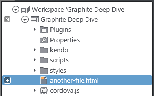
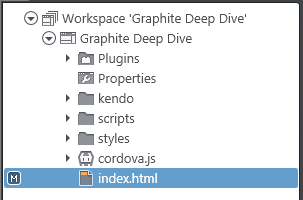
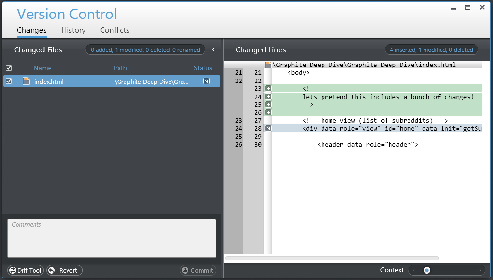
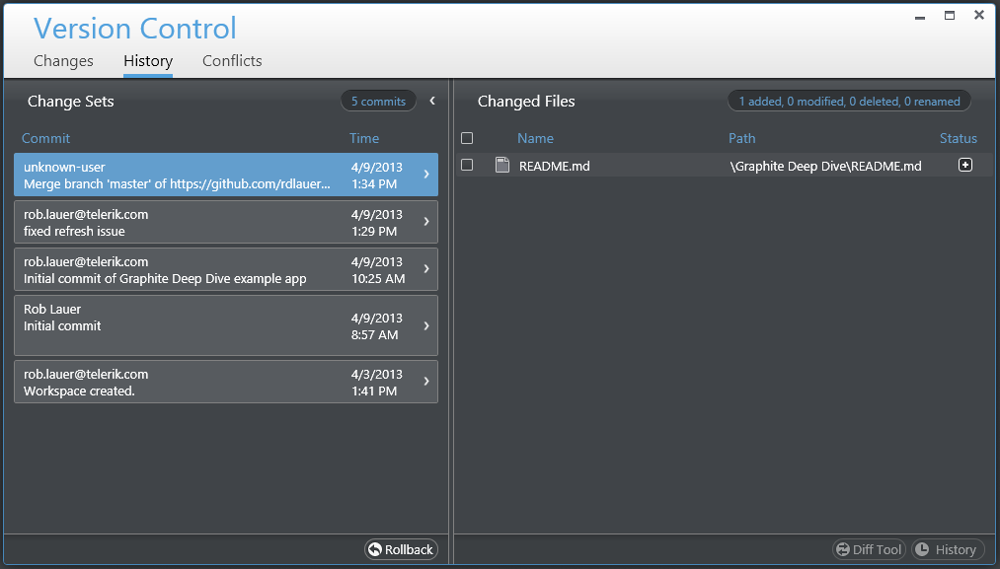
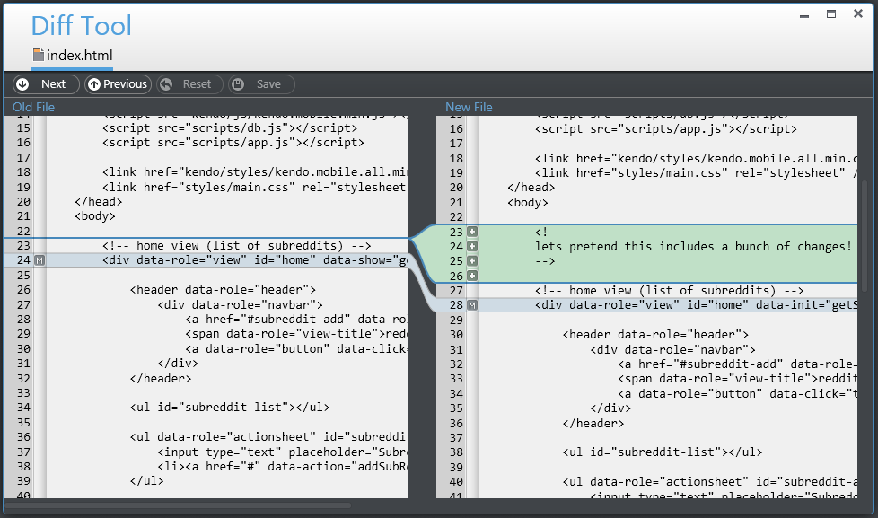
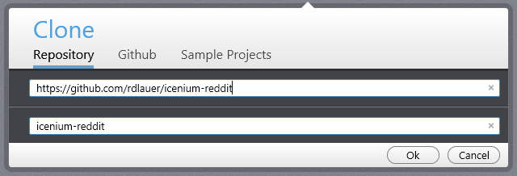
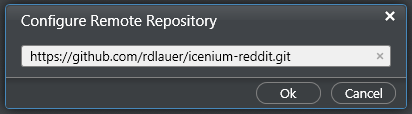
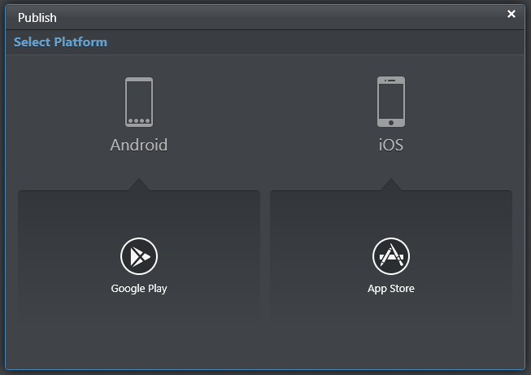

## Diving Into Icenium Graphite - Part 3 of 3

The third and final part of our Diving Into Icenium Graphite series is going to focus on rounding out our knowledge of the Graphite IDE and looking more closely at some fantastic features baked into Icenium. We're also going to look at the occasionally confusing, often maddening, provisioning and code signing processes - and finally, show you how to publish your app on the Apple App Store and Google Play.

Missed either of the first two parts of the series? No worries - you can catch up with [Part 1](http://www.icenium.com/community/blog/icenium-team-blog/2013/04/05/diving-into-icenium-graphite-part-1-of-3) and [Part 2](http://www.icenium.com/community/blog/icenium-team-blog/2013/04/11/diving-into-icenium-graphite---part-2-of-3) and meet us back here when you are done.

I need to take a moment to mention that I missed a very important debugging feature in my last post. If you are testing on an iOS 6 device, you can take advantage of debugging your code within Graphite as it is being executed on your device (the device must be provisioned). All you need to do is enable the **web inspector** in Mobile Safari's options. Take a look at [this video](http://screencast.com/t/uJLxaqSA4) to see the feature in action!

At this point in the game we understand what the Graphite IDE is and what it can do. Thanks to [Burke Holland](https://twitter.com/burkeholland) we know just [what Icenium is](http://www.icenium.com/community/blog/icenium-team-blog/2013/03/28/what-is-icenium-really-). And last week we built, tested, and debugged a hybrid mobile app with Graphite. So where do we go from here?

### Maintaining Your Hybrid Mobile App with Version Control

Every developer worth their weight knows that you need to integrate some type of version control into your development process. The choices today are endless, but [Git](http://en.wikipedia.org/wiki/Git_(software)) has become arguably the most popular system in use today. Services like [GitHub](https://github.com/) and [BitBucket](https://bitbucket.org/) use Git and offer powerful, yet user-friendly, interfaces. We know that version control is important, but how do we integrate version control in our Icenium apps?

One of the many great features of Icenium is the fact that version control is configured for you by default. The moment you create a new project, all of your project assets are automatically committed to Icenium's Git-based cloud version control service. Lets take a closer look at this service and what you need to do to take advantage of it:

#### Adding a New File

When you add a new file to your project, a small plus (+) icon appears next to it - which tells us the file has not yet been committed to the repository.

#### Modifying an Existing File

Making a change to an existing file and saving it will cause a small (M) icon to appear next to your file in the Project Navigator. This denotes a file that has been altered but whose changes have not yet been committed.

#### Committing Your Changes

You've added some files and modified some files, now it is time to commit those changes to the remote repository for safe keeping. To initiate a commit, you need to access the **Version Control** window - which is done via the main menu Version Control option (or via the context menu by right clicking on your project name).

You'll notice that this window shows us both code that we have ADDED (green highlight) and code we have MODIFIED (blue highlight). From here you merely need to add a comment that explains the change(s) and press the **Commit** button. This window also provides you the ability to access the **Diff Tool** - which lets you to see the differences between your current file and the most recently committed version.

The **History** panel gives you a comprehensive list of all commits made to this project - with the ability drill down to see which files were impacted. You may even do a diff on historical versions of your files.

The **Conflicts** panel is used to resolve differences between your local project and the remote repository. You may examine the file differences and choose to use the local version, remote version, or manually edit the differences yourself. You may also use the **Merge Tool** to assist you with merging any changes.

#### Comparing Files

We briefly touched on this ability already, but I wanted to point out an even easier way to access the diff tool. Simply right-click on a file with pending changes in the Project Navigator, choose **Version Control** and then **Compare with Latest Version**. Very handy.

#### Using a Different Git Provider

Maybe you already have an account on GitHub or BitBucket. In this case you can still tie into those services through Icenium! Lets briefly discuss how you can link these up:

**Cloning a Repository**

Via the **Dashboard**, the **Repository** panel allows you to enter the URL of a remote repository. Icenium will clone that repository and set up the assets as a new project. In this same window, the **GitHub** panel ties into your GitHub account and provides you a list of your repositories from which to choose. Finally, the **Sample Projects** panel allows you clone one of many pre-built sample Icenium projects (the full list of sample projects is also available on [Icenium's GitHub account](https://github.com/Icenium)).

**Configure Remote Repository**

Another way to integrate an existing remote repository is to configure one directly using the **Configure Remote Repository** feature. Using the **Version Control** main menu option, choose **Configure Remote Repository**. Enter the URL for your repository and attempt a push by choosing **Push** from the Version Control menu. You may have to authenticate with your provider.

*The **[Icenium Docs](http://docs.icenium.com/icenium-mobile-app-development/using-icenium-graphite/integrated-version-control/integrated-version-control)** do a really great job of explaining all of the version control features in even more detail.*

So now you have seen how useful the built-in version control features are with Icenium Graphite. We're going to switch gears now and peer into the murky waters of provisioning and code signing! (Can you feel the excitement?!)

Arguably the one area that trips up the most mobile app developers is understanding device provisioning, certificate management, and code signing. iOS and Android have significant differences in this area as well, so lets start by explaining what all of this is in plain English and what Icenium does to help ease the pain.

### Understanding Code Signing and Provisioning

Code signing ensures that your app has not been modified in any way before it is installed on a device. This is important for guaranteeing the integrity of your app and verifying that you (the developer) are identified with your app. Once an app is signed, your device can detect any changes to the app - malicious or otherwise.

Why do we care about code signing? Well, we need to care if we are going to test our app on a connected iOS device or if we plan on publishing our app in the App Store. So is it important? Yes. Is it confusing? It can be. Thankfully Apple is catching on and has actually done a lot of work to improve the experience of the **Certificate/App ID/Profile** section of the [iOS Developer Center](https://developer.apple.com/devcenter/ios/index.action).

A **Development Provisioning Profile** associates developers with the apps they are working on, along with one or more devices used to test the apps. Simply put, it is a series of device ids, certificates, and an App ID (you may also utilize a wildcard app id and use that id in multiple profiles). When an app is signed using a profile, the app may only be installed on the devices specified in the profile.

Now you may be asking, what actually IS an iOS code signature? A code signature consists of the following three parts:

1. A unique identifier for the app - which is usually a series of characters provided by Apple combined with your reverse URL identifier (i.e. "ABCEFG123456.com.yourdomain.yourapp").
2. A collection of hashes of parts of your app's source code.
3. A digital signature, which signs the collection of hashes to guarantee its integrity.

Clear as mud right? Luckily for you the Icenium docs hold a lengthy, but useful, tutorial for [creating and installing a provisioning profile and certificate for iOS](http://docs.icenium.com/working-with-devices/apple-ios-devices/how-to-create-and-install-your-developer-provisioning-profile-and-certificate). This will take you from zero to testing your app on your local device in 60 seconds (ok, maybe more like 30 minutes).

The same concepts apply to code signing on Android. However, the process is even easier and is actually part of the publishing process outlined in the next section.

### Publishing Your Hybrid Mobile App to the App Stores

Finally, the moment of truth. You are ready to release your app to both the iOS and Android app stores. A lot of work has been done within the Graphite IDE to make the publishing step significantly less painful than it normally is. For both iOS and Android publishing, you never have to even leave Graphite (except to upload your signed app file - the apk - to Google Play).

On the main menu, press the **Publish** button and choose your platform. All you need to know about the process from here is held in another lengthy, but equally useful, tutorial for [publishing your apps in Graphite](http://docs.icenium.com/icenium-mobile-app-development/using-icenium-graphite/publish-wizard/publish-wizard) in the Icenium docs. In future posts we will dig much deeper into this process, but this gets you where you need to go without too much talk!

Before we wind things up (and I thank you if you've made it this far with me!) I'd like to briefly discuss the approval processes, because they are significantly different.

### Google Play Approval Process

What is great for developers (and potentially bad for consumers) is that Google's approval process is entirely automated. Google appears to take the stance that once an app's integrity has been verified (i.e. it's not going to blow up someone's Android device) then it's up to the developer to put out a quality product. Let the market decide whether or not an app is worthwhile. Therefore, provided you have done everything correctly (and Icenium makes sure that you have!) you should expect approval of your app within hours.

Why is this potentially bad for consumers? There is no manual verification of app functionality. Developers could easily lie or put out a sub-standard product. Granted, Google will pull an app if there are any problems, but the onus is really on the consumer to discover and report these issues.

### Apple App Store Approval Process

Apple, on the other hand, goes to the extreme of manually verifying the UI, UX, features, and functionality of your app. On top of the automatic app integrity checks that are performed, Apple employs individuals whose jobs revolve around manually reviewing new and updated apps. This is great for consumers as they can be confident that the app they are installing has already gone through a rigorous approval process. On the other hand, this can be bad news for developers as the guidelines utilized by these reviewers are verbose and at times difficult to understand.

Take a second to familiarize yourself with Apple's [App Store Review Guidelines](https://developer.apple.com/appstore/resources/approval/guidelines.html). What's that? Didn't make it all the way through? I can't blame you. At the very least you should gloss over Apple's [iOS Human Interface Guidelines](https://developer.apple.com/library/ios/#documentation/UserExperience/Conceptual/MobileHIG/Introduction/Introduction.html). If you're not the patient type, you are going to have a difficult time learning everything that Apple wants you to know about what they want in an app.

Just know that your app **probably will get rejected at some point**. Don't get discouraged if this happens. It usually doesn't mean you have to re-write your entire app, you just need to make some tweaks to conform to the guidelines. In a future post we'll talk more about tips and tricks to make sure your iOS approval process is as smooth as possible.

Finally, people always ask, "how long will the process take?". My experience has ranged from 2-3 weeks for new apps and 2-5 days for updates. Your mileage may vary, as they say.

### Conclusion

This post took you beyond writing an app and went over the version control features built into Icenium Graphite. We also went over code signing and the app publishing processes. Finally we discussed the approval processes and what to expect (especially from Apple). I sincerely hope you enjoyed this series and learned a little bit more about [Icenium Graphite](http://www.icenium.com/get-started)!