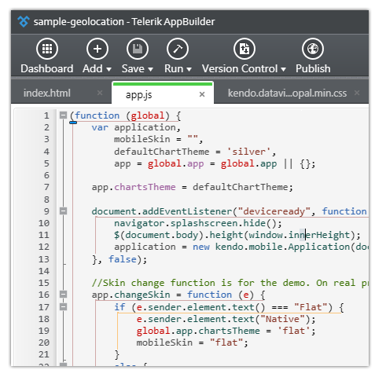
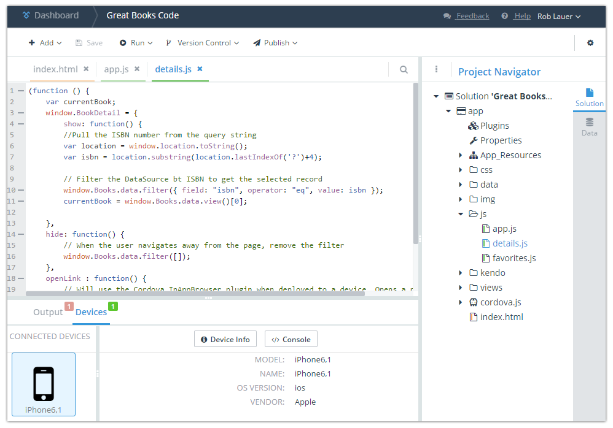

## End of an Era for Telerik AppBuilder Windows Client

When Icenium was announced three years ago, it ushered in a new era of tools and services for the modern mobile developer. As a strictly cloud-based service, Icenium had to appeal to our existing .NET-focused developers (primarily working on Windows PCs) - but at the same time address the emerging needs of JavaScript developers everywhere. Hence the idea was born to provide two cloud-based solutions for developing hybrid mobile apps: Mist and Graphite. It will soon be the end of an era for one, but also an amazing new beginning!

### Icenium? Mist? Graphite?

For those of you relatively new to the [Telerik Platform](http://www.telerik.com/platform) world, Icenium was the name of our **I**ntegrated **C**loud **E**nvironment - a new and groundbreaking way to develop mobile apps in the cloud. Icenium eventually became [Telerik AppBuilder](http://www.telerik.com/appbuilder) (a key component of the Telerik Platform), just as "Mist" became the AppBuilder [In-Browser Client](http://www.telerik.com/appbuilder/in-browser-client) and "Graphite" became the AppBuilder [Windows Client](http://www.telerik.com/appbuilder/windows-client) as you know them today.

### The Problem and The Solution

Without a doubt, our native Windows Client has been wildly successful. Even today a huge percentage of Telerik Platform use starts with the Windows Client. However, we heard from you that there was a problem. We were effectively neglecting Mac developers by having only a native Windows client for AppBuilder. We quickly realized that we needed a solution for Mac developers. We also faced the reality that creating yet another native client to build, test, and maintain was not realistic.

After thorough research, we decided the best solution would be to create a new cross-platform desktop client that could be used on Mac and Windows. Aside from sharing the same code base, this new client would also share a similar UI with our In-Browser Client, making the transition from browser to desktop as seamless as possible. This is how our idea for a new project was born, codenamed "Proton".

### Windows Client is Dead, Long Live the Desktop Client!

I'm pleased to say that we are currently in a public beta of "Proton" (or "Desktop Client" as you will know it in 2016!). The initial feedback received from customers has been great, and we will have a lot more to say about the new Desktop Client in the coming weeks and months.

**Are you interested in being part of the public beta? If so, you can download the beta for [Windows](https://platform.telerik.com/appbuilder/downloads/proton/win) or [Mac](https://platform.telerik.com/appbuilder/downloads/proton/osx) and kick the tires!**

*In the meantime, existing Windows Client users should remember two things:*

1. The Windows Client you use today is still 100% supported!
2. We will not replace the Windows Client with the new Desktop Client until it is literally a better experience for developing apps.

Long story short, we aren't leaving anybody out in the cold. While it is the end of an era for the Windows Client you know today, it's the beginning of a new era for a robust cross-platform Desktop Client for the Telerik Platform that will only improve your app development experience!

