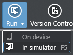
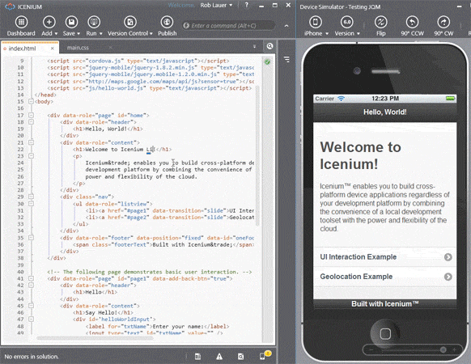
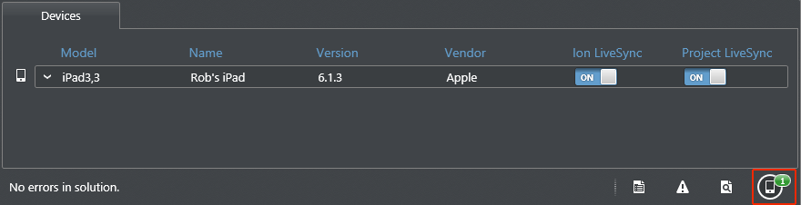
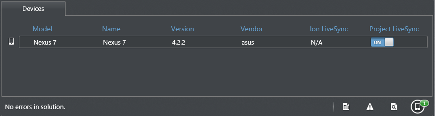

## Icenium LiveSync - Real Time Testing and Debugging

As a web developer you undoubtedly spend your day writing code and reloading your browser window to see the result of your labors - repeat ad nauseum. What if I told you this was an unnecessary relic that is no longer an issue with hybrid mobile app development? What if you could edit any of your app assets (be they HTML, JavaScript, or CSS) and those changes would be instantly visible on your test device? Well hold on to your pants because I'm going to let you in on what is actually not a secret at all: Icenium LiveSync.

### What's the fuss all about?

LiveSync is a patented technology from Telerik that is incorporated in the [Graphite and Mist Icenium IDEs](http://www.icenium.com/get-started). LiveSync enables developers to see changes they make in real-time in both the Icenium Device Simulator and any connected mobile devices. There is no need to rebuild and redeploy the project; nor is there a need to reload the project on the devices. **Simply put: you make a change and that change is instantly reflected on the device or simulator.**

It doesn't take long for a developer to see how this can make an iterative development process much less painful. Consider the time you spend tweaking CSS alone - edit, save, go to browser, reload page, repeat. It's easy to appreciate the convenience LiveSync provides.

Since LiveSync is part of Icenium, lets see how we interact with it through the eyes of the integrated Icenium Device Simulator, an iOS device (iPad 3), and an Android tablet (Nexus 7).

### LiveSync within the Icenium Device Simulator

The first thing you need to know is that LiveSync is **always enabled** when you are using the integrated simulator. There are no settings to mess with, it just works! Lets take a quick spin through a Graphite project and see LiveSync in action:

- Open up a project in [Graphite](http://www.icenium.com/get-started) (new project or existing, doesn't matter).
- From the main menu, choose Run -> In Simulator (or press F5).

At this point, all you have to do is open any project asset (HTML, JavaScript, or CSS), make a change, and save. Like magic - the change is instantly reflected in the simulator! You didn't even have to reload or refresh.

### LiveSync on iOS (iPad 3)

While the simulator is a great tool, nothing compares to testing your app on a real device. In this example I'm going to use an iPad 3, but the same process applies for any iOS device. Please note that connected iOS devices have to be provisioned to run LiveSync (an alternative for iOS testing without provisioning is [Icenium Ion](http://www.icenium.com/community/blog/icenium-team-blog/2013/04/25/the-beauty-of-icenium-ion)). The bonus to having a provisioned device is that you can tap into the debugging tools along with LiveSync.

If you need a 5 minute tutorial on provisioning your iOS device for testing, read on. If your device is already provisioned, you can safely skip to the "Using LiveSync in iOS" section below.

#### Provisioning Your iOS Device

- Navigate to the [Apple Developer Member Center](https://developer.apple.com/membercenter/index.action).
- Click on the link provided under the **Certificates, Identifiers & Profiles** heading.
- Go to **Devices** and then add a new device. (You will need the UDID from your device. I like the free [UDID+ app](https://itunes.apple.com/us/app/udid+/id385936840?mt=8).)
- If you need a new development certificate, add one at this time. Generate the CSR from Graphite: **Options -> General -> Certification Management -> Create Certification Request)**. Upload this CSR as requested when you create a new certificate on the Apple Developer Member Center web site.
- Create a new provisioning profile, choosing the device and certificate you just created.
- Back in Graphite, go to **Options -> Mobile -> iOS -> Import** to import the provision.
- Done!

That's the view from 10,000 feet. This was not meant to be a comprehensive tutorial for setting up a device provision, but it should get you well on your way.

#### Using LiveSync in iOS

Now that our device is provisioned, you can plug it in and should now see a small green "1" in the footer menu of Graphite. This denotes that you have one device that is eligible for testing.

To run your app on the device, just go to the main menu and choose **Run -> On Device**. That's it! Test away and notice how when you make ANY change in your code and save it, the change will be reflected on your device. Just awesome.

*But wait, there's more!*

At this point we not only have LiveSync enabled, we can also tap into the **Safari Web Inspector** to use the Graphite debugging tools while the app is running on an iOS 6 device! Go to your iOS Settings and choose **Safari -> Advanced -> Turn Web Inspector On**, then follow these instructions:

- Open up the app you are testing on your device.
- In Graphite, expand your mobile device pane (click on the device icon in your footer menu).
- Expand the **Web Inspector** option and expand your project (if you don't see the arrow to expand these, make sure the app is running on your device and you have the Safari Web Inspector turned on).
- Double click on the file name presented.

The debugger should now open and you can debug the app just like it's in the simulator - except now you're on a real device and can see how your app reacts to changes you make in real time!

### LiveSync on Android (Nexus 7)

As with iOS, there are a couple of initial setup hoops you have to jump through to test an app on your Android device. Again, these are just one-time configuration steps for each Android device you use:

#### Enable USB Debugging

The instructions for enabling USB debugging are different for every version of Android. The Android [docs for testing on hardware](http://developer.android.com/tools/device.html) contain some instructions that you should follow to access the **Developer Options**:

> On most devices running Android 3.2 or older, you can find the option under Settings > Applications > Development.
> On Android 4.0 and newer, it's in Settings > Developer options.
> Note: On Android 4.2 and newer, Developer options is hidden by default. To make it available, go to Settings - About phone and tap Build number seven times. Return to the previous screen to find Developer options.

After you enable the Developer Options you still have to turn USB debugging on. Go back to your Android settings and choose **Developer Options**. On this screen you will want to turn on **USB debugging**.

#### Drivers

We've enabled USB debugging, so your computer should now recognize the device. If Windows automatically recognizes and installs the correct drivers for you: awesome, but more likely you'll need to find and install the appropriate ADB (Android Debug Bridge) drivers. In my case I'm dealing with a Nexus 7 ([drivers here](http://www.asus.com/Tablets_Mobile/Nexus_7/)).

Once you have your device drivers installed you should be good to go! Make sure you check your device for any prompts that may ask you to enable USB debugging and/or authorize your computer to connect to your device.

#### Using LiveSync in Android

Now that our device is configured, we can deploy our app by using the **Run -> On Device** command from the main menu just like with iOS. You should see that **Project LiveSync** is enabled in your mobile device pane. You can now see LiveSync in action on your Android device!

### Conclusion

The more you use Icenium and develop hybrid mobile apps, the more you will appreciate the utility of LiveSync. Icenium was built around the idea of creating a better experience for hybrid mobile app developers, and LiveSync fits in perfectly as a fantastic mechanism to test and debug in real time. As always, [we love to hear your feedback](http://feedback.telerik.com/Project/87), so please let us know what you think about LiveSync or any other Icenium feature.