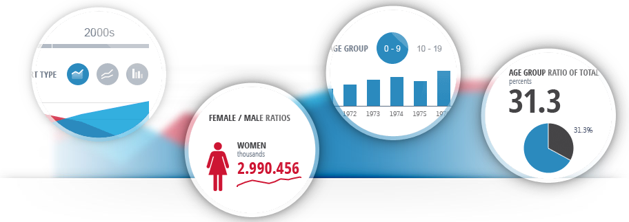
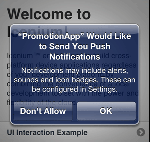

## The Icenium 1.5 Release is Here!

It has been an exciting few weeks here at Telerik as we have a new Icenium release to share with you! Icenium v1.5 was officially released on May 8th and I'm here today to walk you through all of the new features and enhancements. Whether you are a new or an existing user of Icenium, you will quickly gain an appreciation for our rapid release schedule of new versions. Since Icenium is a cloud-based service, you can rest assured that everything you use has already been updated to the latest version! The full Icenium v1.5 release notes are available [here](http://docs.icenium.com/release-notes/v1-5).

Here is a list of highlights from this most recent version. We'll look at each of these points in more detail.

* [Kendo UI DataViz Integration](#dataviz)
* [Dedicated Support and Updated Documentation](#support)
* [Pricing Details Released](#pricing)
* [General Icenium Updates and Fixes](#general)
* [Icenium Everlive Preview](#everlive)

Without further ado, lets take a dive into the latest Icenium bits:

### Kendo UI DataViz Integration

Any [Kendo UI](http://www.kendoui.com/) fans out there? I know there are, which is why we have now included a [Kendo UI DataViz](http://www.kendoui.com/dataviz.aspx) starter template! For those of you who haven't heard of Kendo UI DataViz, it is an HTML5-based charting system that allows you to develop amazing charts, dashboards, and other data visualizations. Kendo UI DataViz fully supports mobile browsers, which makes it an obvious choice for data-rich hybrid mobile apps. Kendo UI DataViz is included with the [Professional](http://www.icenium.com/pricing) and [Ultimate](http://www.icenium.com/pricing) accounts (see the "Pricing Details" section below for more information on our new pricing plans).

### Dedicated Support and Updated Documentation

We are proud to announce the availability of dedicated support for Icenium! Developer support has always been a proud tradition of Telerik and our support for Icenium is no different. With a [Professional](http://www.icenium.com/pricing) or [Ultimate](http://www.icenium.com/pricing) account you will now have access to our personal support ticket system (with turnaround times of 24-48 hours). In addition, we still have the [Icenium Forums](http://www.icenium.com/community/forums) that are free for everyone to use.

We are also excited about our completely revamped documentation! The entire [Icenium Docs](http://docs.icenium.com/) site has been updated to include new tutorials, a more intuitive navigation scheme, and updates to existing content. Our docs will always be a work in progress as we continually strive to improve our online documentation.

### Pricing Details Released

The next time you log into Icenium your account will be automatically transferred to a 30-day trial of Icenium Ultimate. During this trial period you will be able to choose one of our new annual or monthly subscription offerings. Have no fear - if your free trial expires, your code will still be available for you to download at any time. Take a look at our [new pricing plans](http://www.icenium.com/pricing) which start at $16/month.

### General Icenium Updates and Fixes

#### PushPlugin Updated

There were some significant bugs in the previous version of PushPlugin, so we made it a priority to get this new version out to you as soon as possible. If you haven't used PushPlugin yet, it's a Cordova plugin that allows you to send push notifications to your iOS and Android users. There is a [nice tutorial](http://www.icenium.com/community/blog/icenium-team-blog/2013/04/17/push-notifications-with-cordova-icenium) on the Icenium blogs as well.

#### Kendo UI Mobile and jQuery Mobile Updates

Both Kendo UI Mobile and jQuery Mobile have been updated to their latest released versions. For more detailed information on these releases you can take a look at the [Kendo UI Mobile](http://www.kendoui.com/mobile/whats-new/release-notes/q1-2013-mobile.aspx) and [jQuery Mobile](http://jquerymobile.com/blog/2013/02/20/jquery-mobile-1-3-0-released/) release notes.

#### Updates to Graphite

- **Redesigned and Improved Run On Device Dialog:** The updated Run On Device dialog lets you select a device on which to deploy your app.
- **Insert and Overwrite modes in the Code Editor:** You can switch between insert and overwrite mode in the Code Editor by pressing *Insert*.
- **Project filtering:** When you want to clone a sample app, you can filter the available projects by typing in the Search text box.
- **Edit Cloud Code:** You can edit cloud code for your Icenium Everlive projects (more information about Icenium Everlive below).
- **Show Cloud Code Log in the Logs Pane:** You can review requests made to Icenium Everlive for your project in the Logs pane.

#### Updates to Mist

- **Rename Workspace and Project:** You can now rename your current workspace and/or project.
- **Set active build configuration:** You can choose between Debug and Release build configurations. This setting respectively enables and disables LiveSync for builds issued from the Run On Device dialog.
- **Delete Android splash screens:** You can now remove custom Android splash screens.
- **Project Filtering:** When you want to open an existing project or clone a sample app, you can filter the available projects by typing in the Filter text box.
- **Improved context menus:** Context menus show the keyboard shortcut for an operation, if any.

### Icenium Everlive Preview

Last, but certainly not least, is the integration of **Icenium Everlive Cloud Services**. Icenium Everlive is a  Backend-as-a-Service (BaaS) solution that helps you to create hybrid mobile apps that consume cloud-based services. At a very high level, Icenium Everlive helps you with things like user management, data storage (database in the cloud!), server-side cloud code (server-side data validation!), and email notifications.

Icenium Everlive provides you with [RESTful services](https://en.wikipedia.org/wiki/Representational_state_transfer#RESTful_web_APIs) to consume all of your custom objects (you may consider these your "database tables in the cloud"). In addition, the comprehensive built-in user management allows you to manage users and apply user-level permissions to these custom objects. Icenium Everlive also **allows for file storage** so you can store BLOB-type data in your custom objects (like video files, images, and other large documents). More information about Icenium Everlive can be found [here](http://www.icenium.com/product/everlive).

Icenium Everlive is a very exciting addition and we look forward to talking to you more about this service through future blog posts and tutorials. In the meantime, enjoy the preview and continue to [send us feedback](http://feedback.telerik.com/Project/87)!

### Conclusion

I sincerely hope you enjoy the latest updates to Icenium. Our team has listened to your feedback and has worked hard to respond to your requests - and will continue to do so for each upcoming release!

PS. Don't forget about the [Icenium May release keynote](http://www.icenium.com/blog/icenium-team-blog/2013/05/07/icenium-may-release-keynote-may-29th.-register-now-) coming up on May 29th.