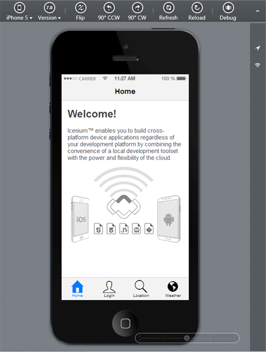
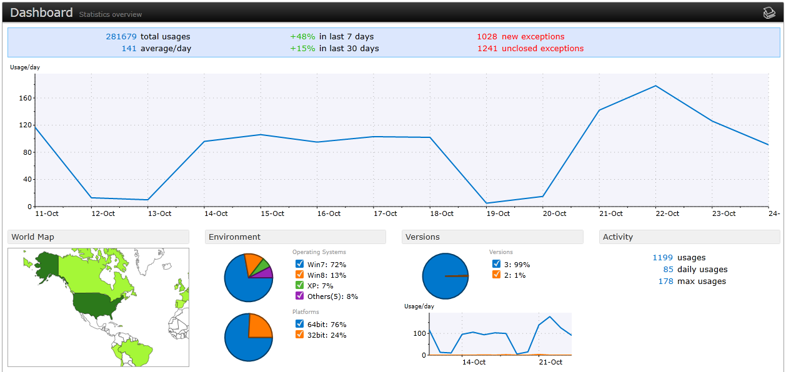

## Latest Release of Icenium - iOS 7 Support, Visual Studio Extension Updates, and App Analytics

A little more than one month ago, we announced the release of the new [Icenium Extension for Visual Studio](http://cdn.icenium.com/live/vs/Icenium.vsix). Following up such a successful release was a daunting task, but I think you'll be as amazed as I am at what we have for you today. Starting right now, Icenium is shipping with full support for iOS 7 - and the latest release of our Visual Studio extension contains numerous updates to help complete the hybrid mobile development story within Visual Studio. And last, but not least, we are happy to announce integration with Telerik's new application analytics solution: [EQATEC](http://www.telerik.com/analytics).

### Overview of this Release

- [Full Support for iOS 7](ios7)
- [Updates to the Icenium Extension for Visual Studio](vs)
- [Cordova Core/Integrated Plugin Support](cordova)
- [Kendo UI Mobile Designer Enhancements](kendoui)
- [Application Analytics with EQATEC](eqatec)

Now if you love new releases as much as I do (and the features that come with them), you'll want me to skip the chatter and get right to them! So without further ado, here is what you can expect out of the latest release of Icenium:

### Full Support for iOS 7

One of the most requested features across the suite of Icenium tools has been to add full support for iOS 7. This was a logical addition that we are proud to formally announce! Starting today with the [Icenium Extension for Visual Studio](http://www.icenium.com/product/visual-studio-extension), the Windows-based [Graphite](http://www.icenium.com/product/graphite) client, and the browser-based [Mist](http://www.icenium.com/product/mist) client, iOS 7 is fully supported. What does this actually mean to you as a developer though?

- The Icenium Device Simulator has an iOS 7 option (along with older versions of iOS and Android)
- [Icenium Ion](http://www.icenium.com/blog/icenium-team-blog/2013/04/25/the-beauty-of-icenium-ion) has been updated to work with iOS 7
- The [Kendo UI Mobile](http://www.kendoui.com/mobile.aspx) templates have been updated to support iOS 7 (including the new iOS 7 theme and transitions - see this [Kendo UI Mobile release post](http://www.kendoui.com/blogs/teamblog/posts/13-09-10/ios-7-support-available-today.aspx) for more information).

These updates will really help when you're ready to push a new version of your hybrid mobile app to iOS 7 users. This is doubly important as over 70% of iOS users are now on iOS 7 (compared to 25% on iOS 6 and 5% on older versions of Apple's mobile OS).

### Updates to the Icenium Extension for Visual Studio

A lot of work has been done to help complete the hybrid mobile app development story within Visual Studio. While our first release of the Icenium Extension for Visual Studio was a resounding success, we were missing some core features that long-time Icenium users have come to expect. With this release we have filled many of those gaps:

- Added support for both Visual Studio 2010 and 2013.
- LiveSync is now fully supported in Visual Studio.
- You may now debug your app on a connected iOS device.
- Along with debugging in iOS, you can deploy to both iOS and Android devices.
- The iOS and Android "publish to app store" wizards are now included.
- You may use QR code deployment with Icenium Ion.
- You may now log data from the device to the Visual Studio output window (console).
- You may now customize your app configuration and manifest files.

There is a lot going on with this new release! You can expect future blog posts from us to highlight many of these new features. But for now, download the [Icenium Extension for Visual Studio](http://cdn.icenium.com/live/vs/Icenium.vsix) and try it out for yourself. If you already have the extension installed, you should be prompted to update it automatically from within Visual Studio.

### Cordova Core/Integrated Plugin Support

Starting with this version of Icenium, you may now turn on and off both core and integrated plugins on an as-needed basis for each project. If you're confused as to what this means, don't worry. Starting with Cordova 3.0, the core Cordova framework was trimmed down and actually ships without ANY plugins. 

That's right, even "core" features such as geolocation, camera access, and file storage have been separated out and need to be installed separately. In previous versions of Icenium we kept all of those core plugins installed by default. With this version, though, you can actually pick and choose which plugins you want to use in your hybrid mobile app - along with integrated plugins such as [SQLite](http://www.icenium.com/blog/icenium-team-blog/2013/05/28/adding-dynamic-data-with-the-sqlite-plugin), [Barcode Scanner](http://www.icenium.com/blog/icenium-team-blog/2013/07/03/using-the-barcode-scanner-plugin-with-icenium), and [Push Notifications](http://www.icenium.com/blog/icenium-team-blog/2013/04/17/push-notifications-with-cordova-icenium).

### Kendo UI Mobile Designer Enhancements

Our Mist and Graphite users have been enjoying the Kendo UI Mobile Designer, and it keeps getting better. With this release we are adding support for non-visual and invisible widgets like Layouts, ActionSheets, and PopOvers. By adding these widgets to the design palette, integrating them with your Kendo UI Mobile app just got that much easier.

### Application Analytics with EQATEC

In case you missed the news, Telerik just released a brand new analytics solution called [EQATEC](http://www.telerik.com/analytics)! Mobile app developers who are looking to add analytics support to their apps should take a good look at EQATEC. Adding it to your Icenium project couldn't be easier as well, as it is available as an integrated plugin that can be enabled directly within any Icenium IDE.

But why should you use EQATEC when there are other analytics offerings available? Great question! EQATEC not only supports traditional analytics but also provides developers the ability to monitor the stability of their apps and receive emailed error notifications that can include a full stack trace. Imagine the support tickets you can avoid with such up-to-date notifications!

EQATEC is free to get started (you can track one application for free, forever). It's also included if you have a [DevCraft Ultimate](http://www.telerik.com/purchase.aspx) license. More information is available on the [EQATEC web site](http://www.telerik.com/analytics).

### What's Next

What's next for Icenium is really up to you! Check out our [feedback portal](http://feedback.telerik.com/Project/87) to let us know what features are most important to YOUR hybrid mobile app development experience. In the meantime, enjoy the latest release of Icenium!

