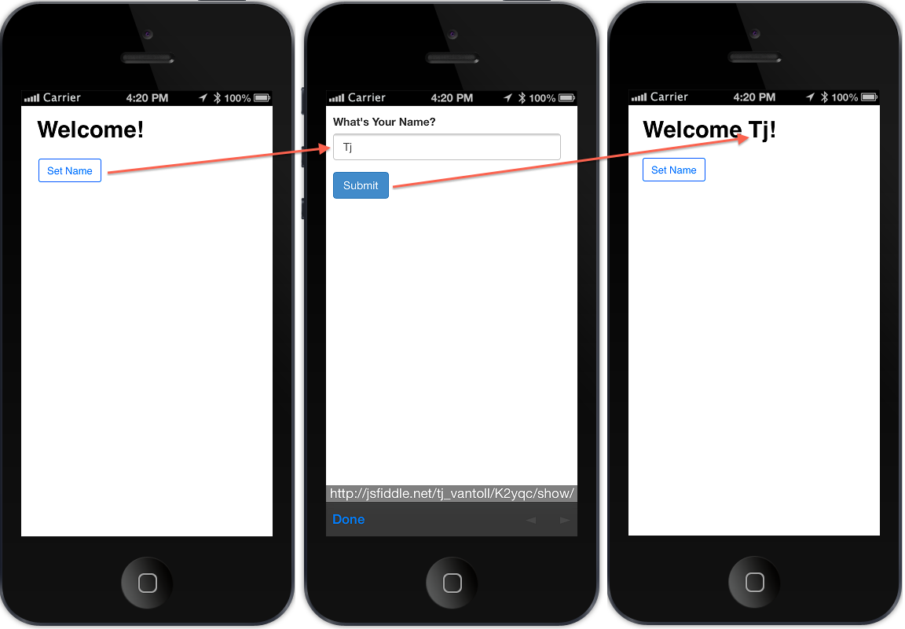

### Cross Window Communication With Cordova's InAppBrowser

Cordova's [InAppBrowser plugin](http://cordova.apache.org/docs/en/edge/cordova_inappbrowser_inappbrowser.md.html) does as its name implies: opens a new browser window within the current app. This gives you the powerful ability to access web content without needing to embed it within the app itself.

While Cordova provides plenty of options to configure how this browser works, there are no built in APIs that let you directly pass data back and forth between the app and the InAppBrowser window.

In this article we'll take a look at a workaround to make this possible. To explain the workaround, we first have to take a quick look at how InAppBrowsers work.

### The InAppBrowser Plugin

Creating an InAppBrowser is as simple as calling `window.open()` with the URL to open and the string `"_blank"`. The following loads [http://docs.icenium.com/](http://docs.icenium.com/) in an InAppBrowser.

	window.open( "http://docs.icenium.com", "_blank" );

*Note: The second argument to `window.open()` is the [target](http://docs.webplatform.org/wiki/html/attributes/target). `"_blank"` tells the browser to always open the URL in a new window/tab.*

Cordova's `window.open()` takes a third argument to set options on the opened window. The options are listed on [InAppBrowser's API documentation](http://cordova.apache.org/docs/en/edge/cordova_inappbrowser_inappbrowser.md.html), and many are specific to Android and iOS. For instance the following opens [http://docs.kendoui.com](docs.kendoui.com) and allows you to scale the viewport on iOS.

	window.open( "http://docs.kendoui.com", "_blank", "EnableViewPortScale=yes" );

The call to `window.open()` returns an object with a number of methods. For instance the following opens Kendo UI's documentation in a new window then closes it five seconds after it loads.

    var win = window.open( "http://docs.kendoui.com", "_blank", "EnableViewPortScale=yes" );
    win.addEventListener( "loadstop", function() {
        setTimeout(function() {
            win.close();
        }, 5000 );
    });

Showing documentation is actually a great use case for the InAppBrowser plugin. Users get quick access to help content right within the app itself.

But many use cases are not so simple. Suppose we want the user to fill out a form in our InAppBrowser window and pass some data back. If you look over InAppBrowser's methods you'll see that there is nothing related to passing data. So how can we make that happen?

### Passing Data From an InAppBrowser

Personally, I thought this would be an easy problem to solve. I could just use `window.opener` and [`postMessage`](https://developer.mozilla.org/en-US/docs/Web/API/Window.postMessage) and I'd be fine.

What I didn't know is InAppBrowser window is not a true [DOM `window` object](https://developer.mozilla.org/en-US/docs/Web/API/Window). Therefore the typical DOM properties such as `opener`, `innerHeight`, `innerWidth`, and so forth are not available.

InAppBrowser's window does have an [`executeScript()`](http://cordova.apache.org/docs/en/edge/cordova_inappbrowser_inappbrowser.md.html#executeScript) method that lets you execute JavaScript in the opened window. For instance the following performs an alert in the opened window after it loads.

    var win = window.open( "http://icenium.com", "_blank", "EnableViewPortScale=yes" );
    win.addEventListener( "loadstop", function() {
        win.executeScript({ code: "alert( 'hello' );" });
    });

You can even provide a callback to retrieve values from the opened window. For example the following alerts <icenium.com>'s `innerHTML` after it loads in an InAppBrowser.

    var win = window.open( "http://icenium.com", "_blank", "EnableViewPortScale=yes" );
    win.addEventListener( "loadstop", function() {
        win.executeScript(
            { code: "document.body.innerHTML" },
            function( values ) {
                alert( values[ 0 ] );
            }
        );
    });

Executing JavaScript in the InAppBrowser window lets us retrieve data from it, but there's still a problem: we don't know when to run `executeScript()`.

For example, if you're displaying a form, how do you know when the form is submitted? To illustrate this problem - and to show the solution - I build a small app that collects the user's name from an InAppBrowser.

### An Example: Collecting the User's Name

The app is a simple [Kendo UI Mobile](http://www.kendoui.com/mobile.aspx) application with a button to load an InAppBrowser.

	<!DOCTYPE html>
	<html>
	<head>
	    <title>InAppBrowser Tester</title>
	    <meta charset="utf-8">
	    <meta name="viewport" content="width=device-width, initial-scale=1">

	    <link href="kendo/styles/kendo.mobile.all.min.css" rel="stylesheet">
	    <link href="styles/main.css" rel="stylesheet">

	    
	    
	    
	</head>
	<body>
	    

	        

	            <h1>Welcome!</h1>
	            <button data-role="button" data-click="app.setName">Set Name</button>
	        

	    

	    
	</body>
	</html>

The opened window is a simple form that gathers the user's name, shown below.

<iframe width="100%" height="300" src="http://jsfiddle.net/tj_vantoll/K2yqc/embedded/result,html,js.css" allowfullscreen="allowfullscreen" frameborder="0"></iframe>

The challenge here is: how do you listen for form submissions in the *child* window? The InAppBrowser's window object has an [`addEventListener()` method](http://cordova.apache.org/docs/en/edge/cordova_inappbrowser_inappbrowser.md.html#addEventListener), but that only works with Cordova's events - specifically `loadstart`, `loadstop`, `loaderror`, and `exit`.

The answer is to use one of web developers' favorite hacks: polling. If we put the `executeScript()` call in a loop, we can continuously check for a status change in the child window.

First we'll alter our child window's form to store the user's name in `localStorage` on submit.

	$( "form" ).on( "submit", function() {
	    localStorage.setItem( "name", this.name.value );
	});

Then, we'll alter our app to continuously check for the name in the child window's `localStorage`.

    var win = window.open( "http://jsfiddle.net/tj_vantoll/K2yqc/show", "_blank",
      "EnableViewPortScale=yes" );

    // Once the InAppBrowser finishes loading
    win.addEventListener( "loadstop", function() {

        // Clear out the name in localStorage for subsequent opens.
        win.executeScript({ code: "localStorage.setItem( 'name', '' );" });

        // Start an interval
        var loop = setInterval(function() {

        	// Execute JavaScript to check for the existence of a name in the
        	// child browser's localStorage.
            win.executeScript(
                {
                    code: "localStorage.getItem( 'name' )"
                },
                function( values ) {
                    var name = values[ 0 ];

                    // If a name was set, clear the interval and close the InAppBrowser.
                    if ( name ) {
                        clearInterval( loop );
                        win.close();
                        $( "h1" ).html( "Welcome " + name + "!" );
                    }
                }
            );
        });
    });

The updated workflow is shown in the image below.

For reference the full source of this sample is shown below.

	<!DOCTYPE html>
	<html>
	<head>
	    <title>InAppBrowser Tester</title>
	    <meta charset="utf-8">
	    <meta name="viewport" content="width=device-width, initial-scale=1">

	    <link href="kendo/styles/kendo.mobile.all.min.css" rel="stylesheet">
	    <link href="styles/main.css" rel="stylesheet">

	    
	    
	    
	</head>
	<body>
	    

	        

	            <h1>Welcome!</h1>
	            <button data-role="button" data-click="app.setName">Set Name</button>
	        

	    

	    
	</body>
	</html>

I know what you're thinking: isn't this overkill just to pass some strings? Yes it is. But unfortunately this is the only option I know of to retrieve data from an InAppBrowser.

Luckily, Cordova is aware of this problem and has a [feature request open](https://issues.apache.org/jira/browse/CB-4897) to allow cross window communication using `postMessage`. Hopefully this will be resolved in a future release of the library.