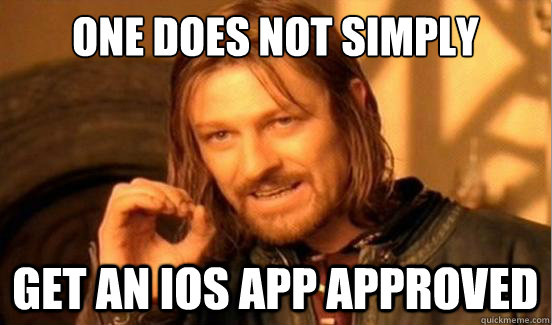

## iOS App Store Approval Tip and Tricks

If you are a Constant Reader of the Icenium blog - or if you have ever attempted to submit an app to the iOS App Store - you are acutely aware of Apple's unique app review process. What should be one final simple step in the development process has turned into a source of significant frustration and confusion for many mobile developers. In this post I hope to provide some guidance on what to avoid when developing and publishing any iOS app (be it native or hybrid).

In my last [Diving into Icenium Graphite](http://www.icenium.com/community/blog/icenium-team-blog/2013/04/18/diving-into-icenium-graphite---part-3-of-3) post, I went over in some detail the approval processes for both the Apple and Google Play app stores. If you're like me and too lazy to go back and read that, I'll quickly summarize them for you here:

### Google Play App Store Approval Process

Google's approval process for new app submissions appears to be entirely automated. Once an app's integrity has been verified, it usually shows up in the Google Play app store within hours. For developers the upside is that almost anything you submit, regardless of the content or performance of the app, will probably get approved. For consumers this is not ideal as they don't have the confidence that the app has gone through a rigorous testing process which verified the user experience and functionality of the app.

### Apple iOS App Store Approval Process

Apple, on the other hand, takes a completely different stance. Apple not only has automated tests, but they also employ reviewers who manually verify the UI, UX, features, and functionality of the apps. These are people trained on Apple's stringent [App Store Review Guidelines](https://developer.apple.com/appstore/resources/approval/guidelines.html) and [Human Interface Guidelines](https://developer.apple.com/library/ios/#documentation/UserExperience/Conceptual/MobileHIG/Introduction/Introduction.html). (You'll need an Apple developer account to get to that first link.)

This is usually a bit of a downer for developers, as it puts significantly more work on their plates to conform to Apple's standards - which are verbose and at times difficult to comprehend. Occasionally the reviewers make mistakes as well: be it approving an app that shouldn't have been or, more frustratingly, rejecting an app for an invalid reason.

### How Can We Improve this Process?

Hybrid mobile apps occasionally get a bad rap as being more difficult to get approved in the iOS app store versus their native counterparts. While that statement is debatable, there are numerous issues you need to be aware of when attempting to submit any app to Apple. One big advantage you have in using Icenium for your hybrid mobile app development is that Icenium takes care of all of the Xcode configurations and settings you normally need to do when publishing an app - this is a huge time saver that can save your app from an automated rejection.

I'm going to be frank: **your app probably will get rejected at some point**. But don't get discouraged if this happens. It doesn't mean you have a bad app nor does it mean you have to re-write your entire app. You probably (hopefully) just need to make some tweaks to conform to Apple's guidelines.

Lets take a look at what I consider some of the top reasons Apple could reject your iOS app:

### Top Ten (or so) Reasons for iOS App Store Rejection

Rejection is hard, and it's even harder not to take it personally. Remember asking Susie out to prom in High School? You were a Freshman and she was a Senior? Yeah, that didn't work out so well. I feel your pain buddy. And while I can't help out the awkward 14 year old in you, I can provide some guidance on what to avoid when writing an app for iOS. Some of these points are broad, others more specific, most may even be considered common sense, but my best advice is to use this as a quick checklist while you are gathering requirements and planning your app development strategy.

1. **Don't copy the functionality of an existing app.** We are all standing on the shoulders of giants to a certain extent, so it's ok to take an idea and improve upon it. However, if you copy an app verbatim, you will most likely find yourself going to prom alone, er, I mean getting rejected by Apple.

2. **Make your app relevant and useful** to a relatively broad population. Apple will not approve an app that is targeted to a very specific or limited audience. For example, if you develop an app that is ONLY meant to be used by your local pickup basketball team, you're gonna have a bad time.

3. If you are taking in-app payments, please don't try to take someone's money without using **Apple's In-App purchasing API**. This is a guaranteed rejection. [And yes, there's a Cordova plugin for that](https://github.com/phonegap/phonegap-plugins/tree/master/iPhone/InAppPurchaseManager).

4. Apple tends to make really pretty images and icons, don't they? Well, **don't get tempted to use them**. While you might think Apple would be flattered by this, they most definitely are not, and will reject you if you copy icons that are not meant to be re-used in an app.

5. **Be a miser when it comes to downloading data within your app.** Keep in mind that many of your users are on limited cellular data plans and won't appreciate the fact that you are downloading 5MB of data every time you open the app. There are no specific guidelines from Apple, but you should be safe if you keep your downloads to a minimum.

6. **Don't rely on an always-connected device.** If your app crashes or otherwise doesn't function because it doesn't have a network connection, it probably won't get approved.

7. It can be tempting to tease with a "beta" or "demo" version of an app. Apple forbids these types of apps, so it is best to **stay away from using this kind of title** in your app description.

8. If your app **takes longer than 10 seconds to initially load**, it won't get approved. And yes, this is a good sign that you are probably doing something wrong anyway!

9. **Don't abuse the iOS file system.** Since iOS 5.1, Apple doesn't allow apps to save data to the device that normally gets backed up by iCloud (without the user's permission). Instead, save this data to the device's cache. You can use Local Storage (which uses the cache), but just be aware that anything saved here may be overwritten.

10. I can't stress this enough: **don't violate the [Human Interface Guidelines](https://developer.apple.com/library/ios/#documentation/UserExperience/Conceptual/MobileHIG/Introduction/Introduction.html)**! Apple has very specific directions on the sizes and locations of buttons/icons/navigation bars/etc. Violate these by a few pixels and you may find yourself in rejection land. (However, if you use [Kendo UI Mobile](http://www.kendoui.com/mobile.aspx) a good portion of this has been taken care of for you!)

11. **Avoid downloading external scripts.** There is A LOT of confusion out there regarding the concept of downloading content/scripts within your app at runtime. Apple's own guidelines state, "Apps that download code in any way or form will be rejected". This is unfortunately vague, as one could interpret that as being HTML/CSS and JavaScript as well. My advice is to stay away from downloading/executing JavaScript in your app - I would definitely avoid CDNs especially as your app will be more performant keeping everything on the file system.

12. Keep the size of your app (the final .ipa file) **down to a manageable size**, most likely under 50MB. If you have multiple image assets, consider utilizing [lossy compression](http://pngmini.com/) on your JPEGs and PNGs.

13. **Don't go crazy with the vibration function.** Vibrations should ONLY be used for alerts. You will annoy your users, but more importantly, your users won't see your app in the first place if you abuse this privilege.

14. Maybe most important of all, though, is that **an app is an app because it can't be a mobile web site**. I know, I hear you! But Apple cares about this and as hybrid mobile app developers you have to be very aware of this too, since you ARE developing with the HTML5 stack. If it looks and feels like a web site, it probably won't pass the review.

*Also remember that you are dealing with real people who sometimes make real mistakes.* Case in point: I previously submitted an app that was rejected for storing data in an inappropriate location (specifically, they thought we were storing data in a place that normally gets backed up in iCloud). I had to inform my reviewer that they were incorrect, that we were in fact storing the data appropriately (supported with documentation of course). They then promptly approved the app!

### Conclusion

Navigating the iOS app store approval process can be a harrowing adventure. Apple's guidelines are thorough and confusing, yet constantly evolving and maturing. They have put themselves in a precarious position to not only review apps for user experience, but also for content (leading to some relatively infamous moral judgments on app content). I strongly encourage existing iOS developers to take a good hard look again at the [App Store Review Guidelines](https://developer.apple.com/appstore/guidelines.html) which provides a much more comprehensive list of the dos and don'ts.

I hope what I've described to you today doesn't frustrate you, but rather informs you on what relatively simple steps you can take to avoid iOS app store rejection. Take it all with a grain of salt though, as your mileage may vary!

