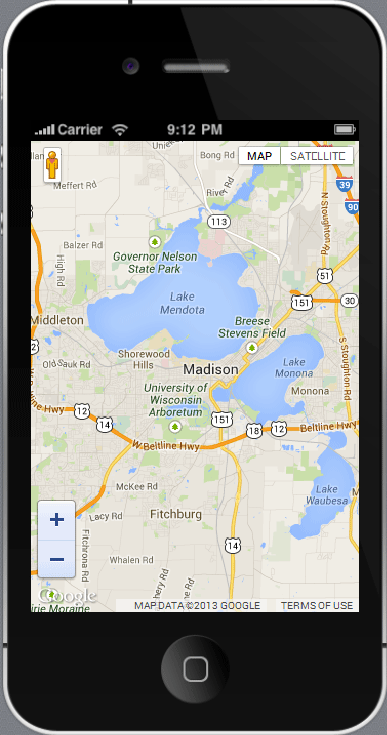
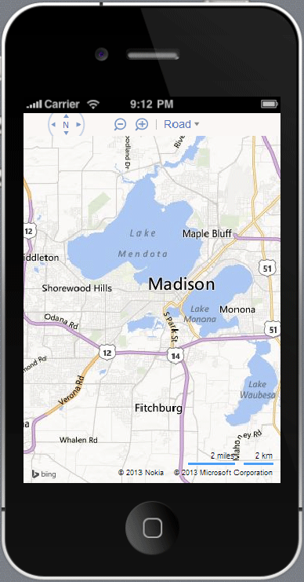
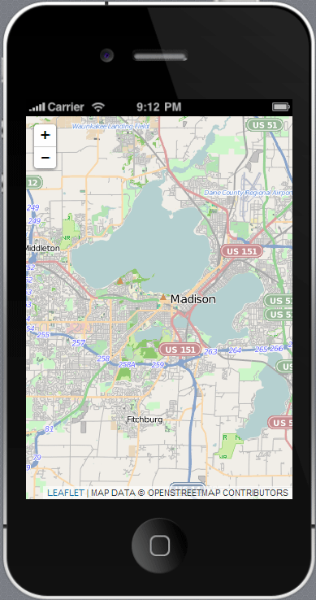
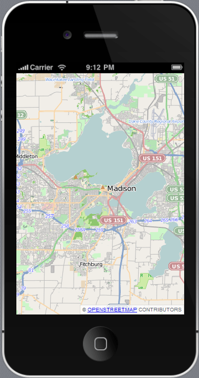
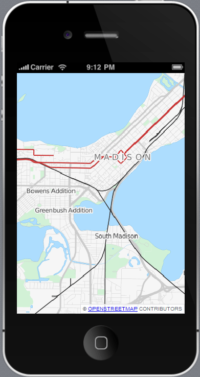
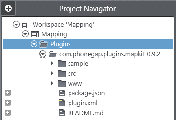
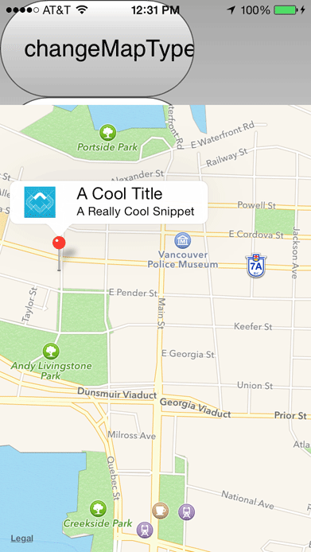

## Mobile-Friendly Mapping Options for PhoneGap/Cordova Apps

One of the first and most enduring features of mobile devices was, and continues to be, mapping. The ability to locate yourself on a map with the tap of a finger, anywhere in the world, has arguably influenced adoption of smartphones and tablets as much as any other feature. As map consumers, we have seen a dramatic shift in the web-based mapping landscape over the years. From MapQuest and Yahoo to Google Maps and the OpenStreetMap project, maps have become more informative and interactive than ever before. And as web and mobile developers with so many options available to us, where do we even begin? What considerations do we have to take into account for our HTML5 hybrid mobile (PhoneGap/Cordova) apps? What about tapping into native device mapping frameworks?

In this post I will summarize some of the more popular options for displaying maps in your hybrid mobile apps. With each option I'll provide specific instructions on how to quickly implement each solution. As an added bonus we will examine a custom Cordova plugin in Icenium - which helps to make native map frameworks available to your hybrid mobile apps.

Let's get started!

### The Competitors

The scope of this post is going to focus on how to quickly implement five different mobile-friendly mapping solutions:

- [Google Maps](#google)
- [Bing Maps](#bing)
- [Leaflet](#leaflet)
- [Kendo UI DataViz](#kendoui)
- [Custom Cordova Mapping Plugin for iOS and Android](#plugin)

The first four (Google, Bing, Leaflet, and Kendo UI) are all web-based options, which of course fits nicely into the development style of hybrid mobile apps. Using a custom Cordova plugin, on the other hand, allows you to tap into the raw performance of native mapping frameworks.

### Setup Tasks in Icenium

If you are going to follow along with the code samples provided in this article, you'll want to add some very simple markup and styles to your application that will be shared amongst the four web-based implementations. I'm going to assume that you have already set up a blank Cordova project in Icenium. If not, take a look at the quick start up guides for using Icenium with [Mist](http://docs.icenium.com/getting-started/app-in-minutes-with-mist) (our web-based IDE), [Graphite](http://docs.icenium.com/getting-started/app-in-minutes-with-graphite) (our native Windows IDE), or the [Visual Studio Extension](http://docs.icenium.com/getting-started/app-in-minutes-with-vsix).

**HTML:** We'll need a place to draw our maps, so we can add a placeholder to our main index.html file:

	

**CSS:** Let's add some basic styling to our app to make sure our map fills out the entire canvas:

    

**JavaScript:** Finally, we need to wire everything up with a single JavaScript function that initializes our map:

    function initializeMap() {
        // this is where the custom code will go for each mapping implementation
    }

...and this **initializeMap** function will be called when Cordova fires the **deviceready** event:

	document.addEventListener('deviceready', initializeMap, false);

Now let's take some time to examine each option, perform a quick implementation, and compare ease of implementation, functionality, and performance:

### Google Maps

- Ease of Implementation: 
- Functionality: 
- Performance: 

Google's venerable mapping offering, arguably the most popular web-based solution available today, was among the first to provide a robust API for developers to add maps to their own web sites and applications. Adding Google Maps to your hybrid mobile app is easy, assuming you are relatively comfortable with JavaScript.

Let's see how quickly we can get a functioning Google Maps implementation in place.

The first step is to add a reference to the Google Maps API:

	

Wait, let's back up a step. Before you can really do anything with Google Maps, you'll need an API key. Yes, Google Maps are free to use, but Google does want to track usage and be able to notify you if you go over any usage limits. Follow the instructions [here](https://developers.google.com/maps/documentation/javascript/tutorial#api_key) to get your own API key, if you don't have one already.

Got it? Great! Go ahead and replace **API_KEY** in your script tag with the key you were provided. Also, what is the **sensor** property that we are setting to **true**? This is going to indicate to the API whether or not we are using a sensor (such as a GPS locator) to determine the user's location.

We need complete our existing **initializeMap** function to wire everything up to initialize our Google map:

    function initializeMap() {
        var mapOptions = {
            center: new google.maps.LatLng(43.069452, -89.411373),
            zoom: 11,
            mapTypeId: google.maps.MapTypeId.ROADMAP
        };
        var map = new google.maps.Map(document.getElementById("map"), mapOptions);
    }

That's all the code we need to display a map. Simple, no?

If you run your app in the integrated device simulator in Icenium, you should see something like this. A map of my fair city: Madison, Wisconsin:

*Note: Apple is a stickler about making sure your maps contain relevant copyright information. So no matter how you size your map on the canvas, make sure the copyright data shows up in the bottom right-hand corner and is not cropped!*

So this map is pretty cool, but what else can we do to expand on the basic functionality? One commonly used feature is to **add pins or markers** to your map:

    var marker = new google.maps.Marker({
        position: new google.maps.LatLng(43.069452, -89.411373),
        map: map,
        title: "This is a marker!",
        animation: google.maps.Animation.DROP
    });

And yes, there is so much more you can do with the [Google Maps JavaScript API](https://developers.google.com/maps/documentation/javascript/tutorial):

- Create more [complex marker icons](https://developers.google.com/maps/documentation/javascript/examples/icon-complex)
- Draw [lines or polygons on your map](https://developers.google.com/maps/documentation/javascript/examples/polyline-simple)
- Add real-time [traffic information](https://developers.google.com/maps/documentation/javascript/examples/layer-traffic)
- Even integrate with Google's [Street View service](https://developers.google.com/maps/documentation/javascript/examples/streetview-simple)

 Be sure to consult the full Google Maps API docs to get a better idea of the full scope of what can be accomplished.

**What about performance?** If there is a weakness in utilizing Google Maps in PhoneGap, it's that it does suffer from the map being hosted inside of an iOS/Android WebView. When compared to using a native mapping app on your device, the Google Maps JavaScript API (while perfectly functional)  does show some lag in scrolling and loading new map tiles. Google Maps can also get weighed down if you apply too many pins/markers.

**Overall:** The Google Map implementation is easy to use and provides enough functionality to appease almost any hybrid mobile app developer.

### Bing Maps

- Ease of Implementation: 
- Functionality: 
- Performance: 

There is plenty of argument of using Bing vs Google in the context of search, but what about mapping? Bing Maps are generally considered to be on par with Google Maps, but let's put Bing to the test.

If you are going to use Bing Maps, you'll want to utilize their JavaScript API (the [Bing Maps AJAX Control, Version 7.0](http://msdn.microsoft.com/en-us/library/gg427610.aspx) API to be specific).

Just like with Google Maps, Bing requires you to get a key (called a **Bing Maps Key**) in order to use their API. Not a problem. For most of us, this probably means requesting a free basic key [here](http://www.microsoft.com/maps/create-a-bing-maps-key.aspx).

Once you have your key, we can get a simple map set up, just like we did for the Google Maps implementation. Go ahead and add the following script tag to your HTML doc:

	

And again, we're going to wire everything up in the **initializeMap** function with some JavaScript that looks amazingly similar to the Google Maps API:

    function initializeMap() {
        var mapOptions = {
            credentials: "YOUR_BING_MAPS_KEY",
            mapTypeId: Microsoft.Maps.MapTypeId.road,
            center: new Microsoft.Maps.Location(43.069452, -89.411373),
            zoom: 11
        };
        var map = new Microsoft.Maps.Map(document.getElementById("map"), mapOptions);
    }

When viewed in the Icenium device simulator, your Bing map should look something like this:

What else can you do with Bing Maps? How about:

- Display [real-time traffic](http://msdn.microsoft.com/en-us/library/jj953497.aspx) data
- Draw [lines/polygons](http://msdn.microsoft.com/en-us/library/hh921950.aspx) on your map
- Numerous [search options](http://msdn.microsoft.com/en-us/library/hh868061.aspx) including by address, geocoding, and reverse geocoding

IMO, the Google vs Bing mapping battle, at least feature-wise, is probably a draw.

**What about performance?** By far the single most surprising takeaway I have from writing this article is the fact that Bing maps *actually feel native*. There is a not only a noticeable difference in scrolling around an existing map tile, but loading new map tiles is extremely responsive as well. It also doesn't matter what type of map I'm loading (road, aerial view, bird's eye, or any other [map type](http://msdn.microsoft.com/en-us/library/gg427625.aspx)), all seem to be equally responsive inside a PhoneGap container.

**Overall:** I was pretty blown away by the performance of Bing Maps in my PhoneGap app. Combined with the extensive feature offerings that are on-par with Google, it feels like an easy choice so far. We're not done yet though!

### Leaflet (using OpenStreetMap Tiles)

- Ease of Implementation: 
- Functionality: 
- Performance: 

[Leaflet](http://leafletjs.com/) bills itself as "a modern open-source JavaScript library for mobile-friendly interactive maps", and it's difficult to refute that statement. When I first heard about using Leaflet with [OpenStreetMap](http://www.openstreetmap.org/) (OSM) map tiles I had my doubts. How could a free, user-populated map possibly match up with industry heavyweights like Google and Microsoft? I was wrong to be a doubter and was subsequently blown away by the breadth of information and detail displayed in OSM-generated maps.

Take, for example, the University of Wisconsin, which recently switched from Google to OSM for its [campus map](http://maps.wisc.edu/). Due to the open nature of OSM, the University of Wisconsin was able to supply detailed information for all of its buildings and campus landmarks, making it a much more rich experience for its users.

**How does Leaflet compare to Google and Bing though?** Since Leaflet has focused its efforts on the mobile experience, one would expect better performance. Sometimes in our world when performance is increased, functionality suffers - and to a certain extent Leaflet does fall victim to this. However, Leaflet does bring with it most basic features you've come to expect from Google and Bing, making it a very viable option for most uses.

Let's see how quickly we can get up and running with Leaflet and compare its basic functionality with Google and Bing:

After you have downloaded the CSS and JavaScript assets from the [Leaflet web site](http://leafletjs.com/download.html), you'll want to add a reference to them in your index.html:

    <link rel="stylesheet" type="text/css" href="leaflet.css" />
    

Once again, we'll initialize our map in the **initializeMap** function when Cordova's deviceready event is fired:

    function initializeMap() {
        var map = new L.Map('map');

        var osmUrl = 'http://{s}.tile.openstreetmap.org/{z}/{x}/{y}.png';
        var osmAttrib = 'Map data © OpenStreetMap contributors';
        var osm = new L.TileLayer(osmUrl, { attribution: osmAttrib });

        map.setView(new L.LatLng(43.069452, -89.411373), 11);
        map.addLayer(osm);
    }

Provided we have done everything correctly, this will render the following map in the Icenium device simulator:

**But where do I get my map tiles?** A key difference with Leaflet is that we need to tell it where to get its map tiles (or "tile layer"). As mentioned previously, in our case we are using OpenStreetMap tiles, but there is nothing stopping us from using tiles created by another entity (a popular alternative is [CloudMade](http://cloudmade.com/)).

**Performance-wise, what do we get out of Leaflet?** My subjective measures of mapping performance (notably with scrolling in an existing tile and loading new tiles) shows that Leaflet is at least on par with Google, if not slightly better. Your mileage may certainly vary, especially based on how quickly your remote map tiles can be retrieved.

**Overall:** The Leaflet + OpenStreetMap combination shines in its simplicity. The downside, however, is that it's not going to be as feature-rich as the competition. For most users, though, Leaflet will provide what you need (polygons, markers, pop-ups are all available). If you need even more advanced mapping capabilities and want to use OpenStreetMap tiles, I recommend you take a look at the [OpenLayers](http://openlayers.org/) project.

### Kendo UI DataViz

- Ease of Implementation: 
- Functionality: 
- Performance: 

If you're not familiar with [Kendo UI DataViz](http://www.kendoui.com/dataviz.aspx), it's a feature-rich data visualization JavaScript library that builds off of the core [Kendo UI](http://www.kendoui.com/) JavaScript framework. With the latest release of Kendo UI DataViz, a beta version of a map widget was added.

Since Kendo UI DataViz has always been focused on creating rich visualizations of your data, it was an easy decision to include mapping support. The Kendo UI DataViz map widget supports third party tile services like OpenStreetMap (just like Leaflet). It's important to note too that the Kendo UI DataViz map widget **is still in beta**! We are soliciting your feedback to help make it better - be sure to sound off on the [feedback portal](http://feedback.kendoui.com/forums/127393-kendo-ui-feedback).

Like our other mapping options, let's stick to the basics and see how quickly we can get up and running with Kendo UI DataViz.

Note: If you don't already have a Kendo UI DataViz license, you can [download a free trial](http://www.kendoui.com/download.aspx).

Go ahead and add a reference to the Kendo UI JavaScript and CSS assets in your HTML doc:

    <link href="kendo.common.min.css" rel="stylesheet" />
    <link href="kendo.silver.min.css" rel="stylesheet" />
    <link href="kendo.dataviz.min.css" rel="stylesheet" />
    
    

Since Kendo UI is a jQuery-based framework, we'll initialize our map when jQuery's ready event is fired:

    $(function() {
        $("#map").kendoMap({
            center: [43.069452, -89.411373],
            zoom: 11,
            layers: [{
                type: "tile",
                urlTemplate: "http://tile.openstreetmap.org/#= zoom #/#= x #/#= y #.png",
                attribution: "&copy; <a href='http://osm.org/copyright'>OpenStreetMap</a> contributors"
            }]
        });
    });

Provided we have done everything correctly, this will render the following map in the Icenium device simulator:

Now, you may be saying to yourself, "This looks EXACTLY like the Leaflet implementation!". Well, it should since both implementations are using OpenStreetMap tiles! How about we swap in some [OpenCycleMap](http://www.opencyclemap.org/) tiles instead (these are OSM-based map tiles that show bicycling routes instead of roads). We just change our **urlTemplate** property to:

	http://tile2.opencyclemap.org/transport/#= zoom #/#= x #/#= y #.png

...and we generate a great start to a cycling map like so:

**What else can you do with the Kendo UI DataViz map widget?** We can create [markers and overlays](http://docs.kendoui.com/api/dataviz/map#configuration-markers) and utilize GeoJSON to create geographic visualizations like Choropleth maps, heat maps, and cartograms. Take a look at the [comprehensive demo](http://demos.kendoui.com/dataviz/map/index.html) and the [Kendo UI docs](http://docs.kendoui.com/api/dataviz/map) for more detailed API usage.

**Overall:** Considering the Kendo UI DataViz map widget is still in beta, it offers a feature set that is almost on-par with Leaflet. If you are an existing Kendo UI customer or even considering Kendo UI, it is definitely a mapping option worth consideration (and based on the history of Kendo UI, will almost certainly outshine the competition in future releases!).

### Custom Cordova Mapping Plugin for iOS and Android

- Ease of Implementation: 
- Functionality: 
- Performance: 

Up until now we have focused on web-based mapping options - and these are all fine and good. Web-based frameworks allow you to get up to speed quickly and give your users a reasonably good experience navigating a map. But what if you don't like the occasional lag you see with web-based maps in a hybrid mobile app? What if performance is king in your world? Luckily for you, there are a few custom Cordova plugins that allow you to tap in to the native mapping features available in iOS and Android.

In this section we are going to look at one of those custom plugins, the [MapKit plugin for iOS and Android](http://plugins.cordova.io/#/com.phonegap.plugins.mapkit).

This is one of the more intriguing Cordova mapping plugins because out of the box is supports both the iOS (Map Kit) and Android (Google Maps) native mapping frameworks. And since one of the primary motivators for developing hybrid mobile apps is cross-platform compatibility, this is an easy choice.

Now, before you get too excited, it's not all roses in the custom plugin world! Unfortunately with this Cordova plugin, for every bit of performance you gain, you lose a fair amount of functionality. This is because we are relying on third parties to translate the native Apple and Google APIs into JavaScript.

**Installation:** Since this plugin follows the [PlugMan specification](http://cordova.apache.org/docs/en/3.0.0/plugin_ref_spec.md), it's fairly easy to integrate it with our existing app in Icenium.

Go ahead and download the plugin source from [plugins.cordova.io](http://plugins.cordova.io/#/com.phonegap.plugins.mapkit). Extract everything from that archive and add it to a new directory inside of the **Plugins** directory in your Icenium app. When you're all done, the directory structure should look something like this:

With our plugin installed, at this point we're going to take the easy way out and simply copy the relevant assets from the **sample** directory inside of our plugin source. Specifically that means copying the following resources:

	/sample/index.html
	/sample/js/index.js
	/sample/css/index.css

Once you have all of the assets copied over in your IDE, you can plug in your iOS device, choose **Run -> Build and Deploy**. If you have a provisioned iOS device attached, you can run the app directly on the device. Otherwise you can use [Icenium Ion](http://www.icenium.com/blog/icenium-team-blog/2013/04/25/the-beauty-of-icenium-ion) to test your build.

Provided everything was installed correctly, you should get the following output on your device after you tab the overly huge "show map" button:

And there it is, access to the native Apple Map Kit framework from within your hybrid mobile app!

We already know that we are somewhat limited with this plugin. **But functionality-wise what does that actually mean?** Thankfully the plugin authors did add the ability to add pins/markers to our map. You can create an array of pins like so:

	var pins = [
	            {
	                lat: 49.28115,
	                lon: -123.10450,
	                title: "A Cool Title",
	                snippet: "A Really Cool Snippet",
	                icon: mapKit.iconColors.HUE_ROSE
	            },
	            {
	                lat: 49.27503,
	                lon: -123.12138,
	                title: "A Cool Title, with no Snippet",
	                icon: {
	                  type: "asset",
	                  resource: "www/img/logo.png", //an image in the asset directory
	                  pinColor: mapKit.iconColors.HUE_VIOLET //iOS only
	                }
	            },
	            {
	                lat: 49.28286,
	                lon: -123.11891,
	                title: "Awesome Title",
	                snippet: "Awesome Snippet",
	                icon: mapKit.iconColors.HUE_GREEN
	            }
	        ];

...and add them to your map with this line of JavaScript:

	mapKit.addMapPins(pins, function() { console.log('addMapPins success'); }, function() { console.log('addMapPins error'); });

What's nice is that you can assign **success** and **error** callback functions (in our case we are just outputting messages to the console).

**What else?** Unfortunately that's about it. As previously mentioned, we are relying on a third party to implement all of the native API features. So for now, we are limited to displaying a map at a specified location and adding pins.

**Overall:** This Cordova mapping plugin, while fairly easy to implement, is lacking in advanced mapping features that we have come to expect from web-based mapping options like Google and Bing. If, however, performance is absolutely critical and you don't need any additional features, it is well worth your consideration.

### Conclusion

There is no doubt that adding a mapping component is an easy way to add value to a hybrid mobile app. Considering the three most relevant factors in choosing a mapping solution - ease of implementation, functionality, and performance - the clear winner from this author's perspective is Bing Maps. Personally, I never expected a web-based mapping solution could possibly challenge native in performance - not to mention being significantly easier to implement. Good luck with your PhoneGap/Cordova app development with Icenium and hopefully this has brought you one step closer to bridging the gap between hybrid and native apps!

