## Using the Android Emulator with Hybrid Mobile Apps and Telerik AppBuilder

Starting with a [recent release](http://blogs.telerik.com/appbuilder/posts/14-07-31/telerik-appbuilder-7-31-14-release-native-emulator-support-bower-package-manager-and-new-project-templates) of Telerik AppBuilder, you now have the ability deploy your hybrid mobile apps directly to any native emulators you have installed. This means that you no longer need to access scores of physical devices to properly test your app - you can now test and debug directly on emulators that perfectly mimic real devices. In this three part series, I'll go over everything you need to know about optimizing your experience with the Android, iOS, and Windows Phone emulators.

This first post is going to focus on Android. We'll talk about how to set up your environment, create virtual devices, optimize for speed, and how we access these from AppBuilder. We'll also take a look at a great alternative to the stock Android emulator.

**Let's get started!**

- [Setting up Your Android Emulator Environment](#android)
- [Setting up Your Genymotion Emulator (optional)](#genymotion)
- [Using Android Emulators with Telerik AppBuilder](#appbuilder)

### Setting up Your Android Emulator Environment

The Android emulator is part of the Android SDK from Google. If you have the SDK installed already, great. You can probably skip ahead. If not, don't fear, I have waded through the depths of Android SDK management for you and am happy to provide the simplest getting started instructions possible.

*Please note that these instructions are nearly identical for Mac and Windows (I've made a few Windows-specific notes below).*

#### JDK and Android SDK Installation

The only dependency on the Android SDK installation is having a valid Java Development Kit (JDK) installed. You can [download your flavor of JDK](http://www.oracle.com/technetwork/java/javase/downloads/index.html) from Oracle. Go ahead and install that, I can wait :).

Next up is the Android SDK installation. Unfortunately there are a lot of choices here. If you are already using [Eclipse](http://developer.android.com/sdk/installing/index.html?pkg=adt) or want to try out the new [Android Studio](http://developer.android.com/sdk/installing/index.html?pkg=studio), there are SDK-specific flavors for you. For the purposes of this article though, I'm going to keep it simple and install the stand-alone SDK tools.

1. Navigate to [developer.android.com/sdk](http://developer.android.com/sdk/index.html)
2. Scroll to the bottom of the page and click on **View All Downloads and Sizes**
3. Scroll to the bottom (again) and choose your platform under **SDK Tools Only** (for Windows, choose the "recommended" installer)

Phew. I don't know about you but I'm exhausted already.

**Windows users:** Go ahead and install the Android SDK using the default options. When the installation is complete, you should be asked if you want to open up the **Android SDK Manager**, which you should do. If you instead chose to NOT open up the Android SDK Manager, you can always do so via the terminal/command prompt by issuing the `$ android` command.

If you get an error when opening up the Android SDK Manager the first time, try using a new command prompt window (run as Administrator) and use the `$ android` command.

**Mac users:** Unzip the Android SDK and copy the directory to an appropriate location on your machine. Open up your terminal and navigate to the **tools** directory and execute the `$ ./android` command to bring up the Android SDK manager.

#### Android SDK Manager

The next step is to install the appropriate Android platform SDK tools and system images. By default the Android SDK Manager is going to want you to install the latest tools and images for the most recent version of Android (which at the time of this writing is "Android L" - basically Android vNext). That's fine, but if you want to trim down your installation, you really only need a few things from the latest production Android release, **Android 4.4.2 (API 19)**.

Place check marks next to the following options underneath the Android 4.4.2 (API 19) category:

- SDK Platform
- ARM EABI v7a System Image
- Intel x86 Atom System Image

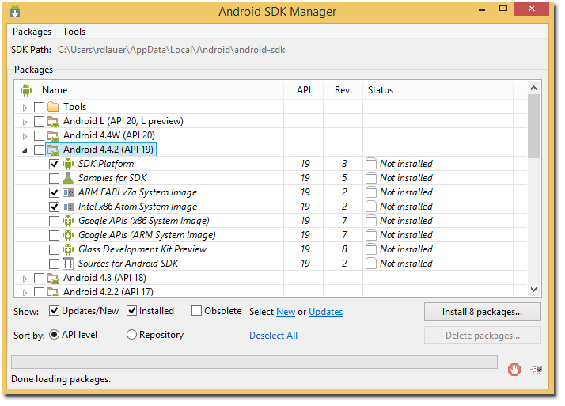

Wait, why am I having you install TWO system images? Mostly because I want you to have two on hand. The Intel system image is the one you will most likely be using, the ARM EABI image is our fallback option. We'll get to that in a minute.

Go ahead and install these updates. I'll still be here when you are done.

#### The Beauty of Intel HAXM

At this point you should have a fully functional Android emulator environment. We're not *quite* done though because if we were to start the emulator with the stock virtual devices, you might throw your laptop into the river and give up on life entirely. Luckily for us, Intel is here to save the day.

Provided you are running on a relatively modern machine with an Intel chip that supports Intel VT-x, EM64T, and Execute Disable Bit functionality, you can take advantage of Intel's Hardware Accelerated Execution Manager (HAXM). HAXM dramatically speeds up your Android emulator environment to a point where it makes it actually usable. The proof is in the pudding, which I'll get to shortly.

Go ahead and [download Intel HAXM](https://software.intel.com/en-us/android/articles/intel-hardware-accelerated-execution-manager) and install it (yes, it's available for Mac and Windows).

**Note for Windows users:** If you have Hyper-V enabled, you will need to disable it to use HAXM. To do so, go into *Programs and Features*, then access *Turn Windows features on or off*, and disable your Hyper-V options as shown below. A reboot may be required.

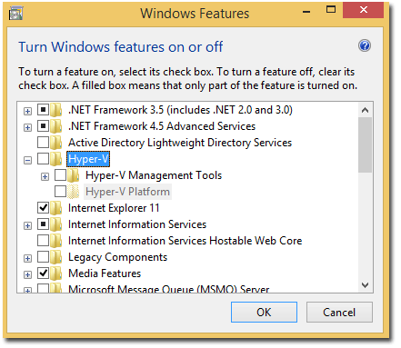

#### Managing our Android Virtual Devices

Great, so we have the Android SDK installed and we (hopefully) have Intel HAXM installed to speed things up. Now it's time to set up the first of our many Android Virtual Devices (AVD). We do so using the **AVD Manager**, which you can access from a command prompt on Windows using `$ android avd` or the terminal on Mac using `$ ./android avd`.

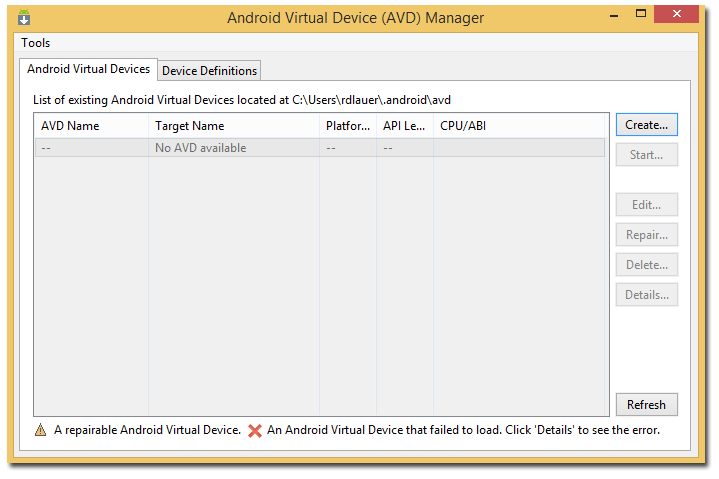

From here we are going to create a new virtual device. Feel free to copy the device I've created below to get up and running with a [Google Nexus 4](http://www.google.com/intl/all/nexus/4/).

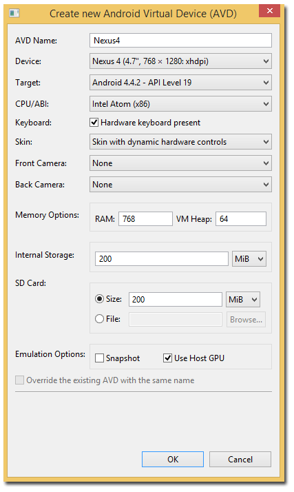

There are two important performance-related options to make sure you don't miss when creating an AVD:

-  If you have Intel HAXM installed, choose the **Intel/Atom x86** option under CPU/ABI.
-  Under "Emulation Options", check **Use Host GPU** which will give you additional performance improvements by using your computer's video card (GPU).

You'll also want to make sure you have allocated space for an SD card (100-200 MB should be fine), which is required when deploying an app from AppBuilder to an Android emulator.

#### The Intel HAXM Difference

Now that you have created your first Android Virtual Device, feel free to boot it up by highlighting the image in your AVD Manager and clicking on the **Start...** button. Your virtual device should boot up in seconds. If not, check for any errors or warnings in the AVD Manager console.

For reference, a cold boot of my Nexus 4 using Intel HAXM was ready to go in **18 seconds** (on a fairly standard laptop). The same cold boot for the exact same Nexus 4 image took **2 MINUTES AND 14 SECONDS** without Intel HAXM!

### You Want To Go Faster? Try Genymotion!

What's that? You can't get Intel HAXM to work? You aren't running on an Intel chip? Or you don't want to go through the full Android SDK installation?

[Genymotion](http://www.genymotion.com/) is an alternative Android emulator that is available for free for non-commercial use (and with [reasonable paid plans](https://shop.genymotion.com/index.php?controller=order-opc) for commercial usage). The Genymotion emulator provides a host of advantages over the stock Android emulator:

- No messy installation procedures (just one executable to install)
- Access to numerous additional device definitions
- Speed, speed, speed! *(A cold boot of the same Nexus 4 emulator took 19 seconds, almost exactly the same as our Intel HAXM image.)*

After downloading and installing Genymotion, you'll be prompted to install your first virtual device:

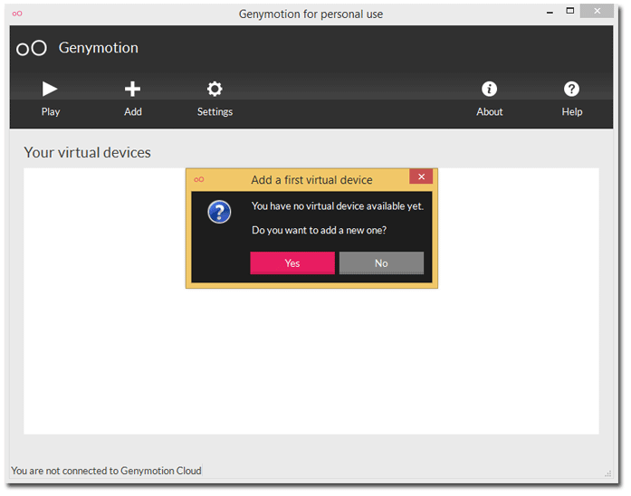

Let's go ahead and create a new virtual device to mimic the Nexus 4 device we created earlier. To do this we can choose **Google Nexus 4** from the **Device model** dropdown provided.

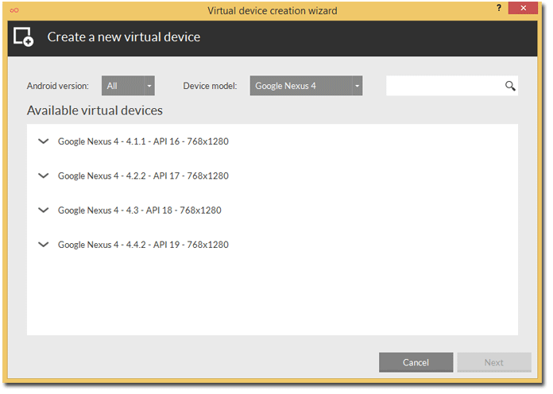

Hit the play button, and just like that we have our Nexus 4 emulator running in no time at all!

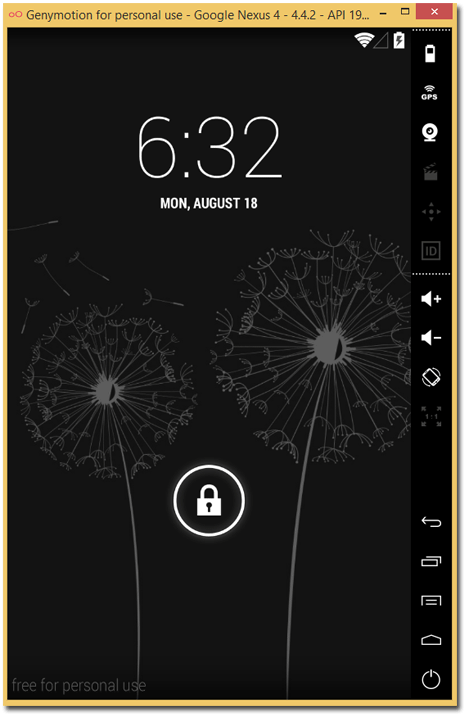

### Using Android Emulators with Telerik AppBuilder

How do we actually integrate these emulators with AppBuilder? As mentioned at the beginning of this post, we recently released a new version of AppBuilder that supports running your app inside of a native emulator.

To show this off, I'm going to go ahead and use the [AppBuilder Windows client](http://www.telerik.com/appbuilder/windows-client) and open up one of my projects. With a project open, I can now boot up and access my native emulators.

#### Booting Up an Android Virtual Device

If you want to run your app on an Android Virtual Device that we set up at the beginning of this post, simply access the **Run** menu in AppBuilder and choose **Native Emulator**:

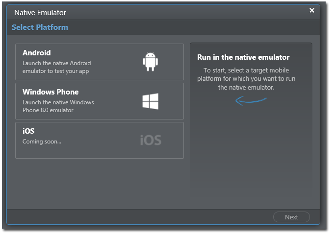

For the purposes of this article, we are going to choose Android. We are then presented with a list of Android Virtual Devices that we have already configured. (There is a button that allows you to access the AVD Manager should you need to.)

Choose the device you want to run your app on, and click **Launch Emulator**:

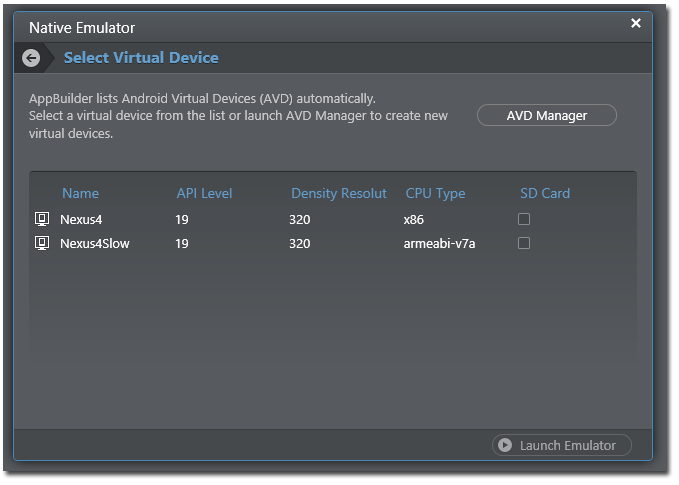

#### Booting Up a Genymotion Device

AppBuilder doesn't integrate with the Genymotion UI to launch new emulators yet, but to start up an Android emulator, simply start up your Genymotion application, choose your device, and hit **Play**.

#### Running Your App in the Emulators

Now that we have an Android Virtual Device and/or a Genymotion device running (yes you can use multiple emulators at once!), the way we get our AppBuilder app on an emulator is the same either way. Your emulators will show up as connected devices - EXACTLY as if you had plugged in a physical device to your machine!

To run your app, go back to the **Run** menu and choose **Build and Deploy**. Your app will be built in the cloud and automatically deployed to all connected devices AND emulators that are running!

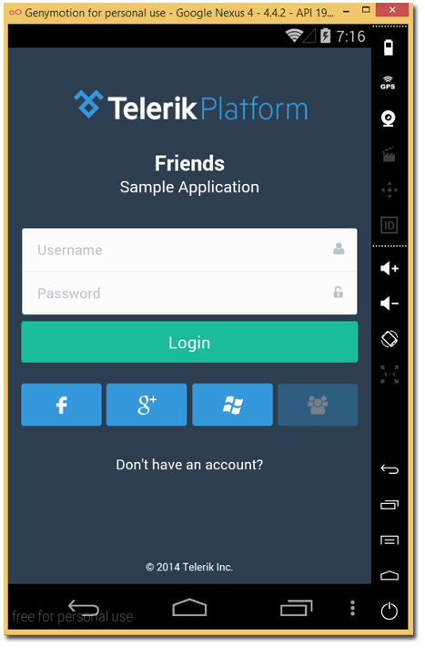

#### Debugging Your App and LiveSync

As with a physical device, you may use the integrated AppBuilder debugging tools to debug your app: inspect UI elements, check for network latency issues, profile your app, and view the console.

You can also take advantage of LiveSync to automatically see changes that you make in any HTML, CSS, or JavaScript assets reflected IMMEDIATELY on your devices and emulators!

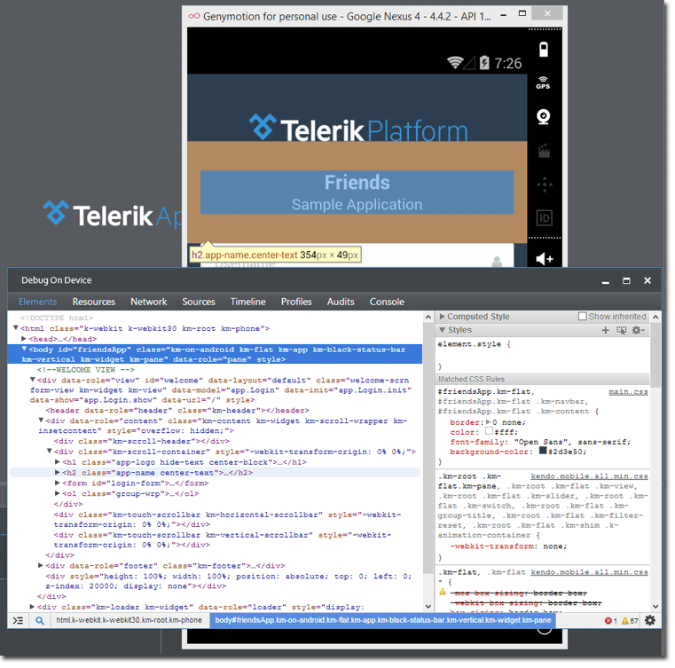

### What's Next?

In the next part of this series, we will tackle the same topic, but focus on using the Windows Phone 8 emulator. The third and final part of this series will look at the Xcode iOS Simulator and how you can access the iOS Simulator from Windows or Mac!