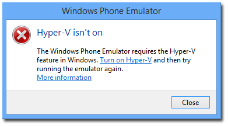
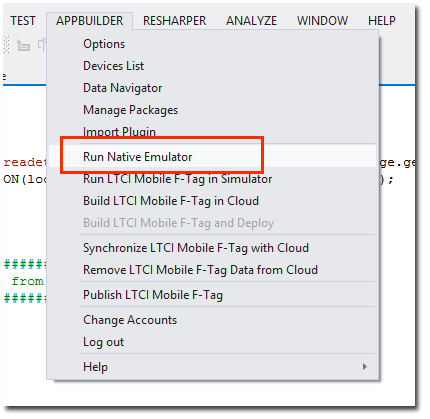
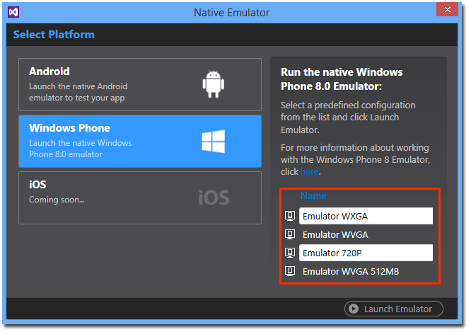
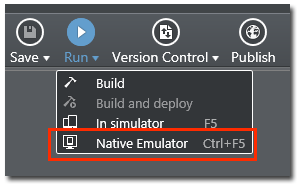
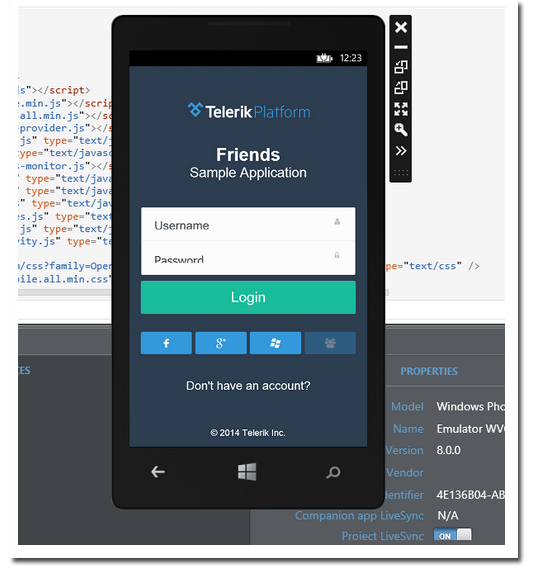

## Using the Windows Phone 8 Emulator with Hybrid Mobile Apps and Telerik AppBuilder

The Windows Phone 8 platform is widely considered, at best, a strong third option in mobile app development and, at worst, a reasonable consideration. Most often an afterthought of iOS or Android development, Windows Phone has steadily seen a small increase in marketshare and deserves it's fair share of investment in terms of debugging and testing tools. When we test Cordova WP8 apps today, we are usually relying on webkit-based simulators that are tweaked to mimic mobile IE - which is why testing on real devices and native emulators is even more important than on other platforms.

As part of a series where we discuss how to get up and running with the iOS, Android, and Windows Phone native emulators for hybrid mobile development, today we are going to dig into the Windows Phone 8 emulator. Not only will we cover how to install and configure our emulator, but we'll also see how easily we can use it in conjunction with [Telerik AppBuilder](http://www.telerik.com/appbuilder).

> If you are interested in learning more about the Android emulators, be sure to [read the first part of this series](http://developer.telerik.com/featured/using-android-emulator-hybrid-mobile-apps-telerik-appbuilder/).

**Let's get started!**

- [Setting up Your Windows Phone 8 Emulator Environment](#wp8sdk)
- [Using the Windows Phone 8 Emulator with Telerik AppBuilder](#appbuilder)

### Setting up Your Windows Phone 8 Emulator Environment

The Windows Phone 8 (WP8) emulator is part of the Windows Phone 8 SDK, which is a free download from Microsoft. The exact SDK installation we are going to focus on is available [here](http://go.microsoft.com/fwlink/p/?LinkId=265772). You may notice this is the 8.0 SDK and not the 8.1 SDK. At the time of this writing, the latest version of Cordova (3.5) does not offer official support for Windows Phone 8.1 apps. This should change shortly though.

Before you jump ahead and install the WP8 SDK, I want to caution you that there are some additional requirements to run the WP8 emulator:

- You must be running Windows 8 Pro or Enterprise
- You must be on a 64-bit machine (x64)
- Your computer must be capable of running [Hyper-V](http://en.wikipedia.org/wiki/Hyper-V)

Normally all three of these are not issues with modern computers, but it's worth verifying your system just to be sure!

#### The Hyper-V Catch-22

If you have been following along with the [Android emulator guide](http://developer.telerik.com/featured/using-android-emulator-hybrid-mobile-apps-telerik-appbuilder/), I made specific mention of *disabling* Hyper-V on Windows machines to allow you to take advantage of Intel HAXM and speed up your emulators. However, this presents a bit of a catch-22 in that you need Hyper-V enabled to use the Windows Phone 8 emulator. If you don't enable Hyper-V and try to run the WP8 emulator, you'll hit an error like this:

Thankfully, [Scott Hanselman has a nice post](http://www.hanselman.com/blog/SwitchEasilyBetweenVirtualBoxAndHyperVWithABCDEditBootEntryInWindows81.aspx) on how to most efficiently switch between these two environments.

If you've gotten this far, it's time to install the SDK you downloaded. Go ahead and get a cup of coffee (or three) while the installer runs :). After your installation is done, there isn't anything else you have to do to configure your emulators - the next step is to try them out in AppBuilder!

### Using the Windows Phone 8 Emulator with Telerik AppBuilder

Telerik AppBuilder makes it very easy to develop your cross-platform hybrid app with cloud-based tools and build services. And testing? Aside from the built-in device simulator (which works great with Windows Phone 8 apps) we can also test our apps on the WP8 emulator of course!

**Using the AppBuilder extension for Visual Studio?** If you are developing with the [AppBuilder extension for Visual Studio](http://www.telerik.com/appbuilder/visual-studio-extension), simply go to the `APPBUILDER` menu in Visual Studio and select the `Run Native Emulator` option.

This will bring up the Native Emulator dialog where you can choose to run your app against the Windows Phone emulator - and then choose which of the four default devices you would like to use:

> Aside from the four default WP8 emulator devices, you can install SDK updates that give you access to more device definitions that focus on Windows Phone OS updates. Take a look at the [Windows Phone SDK archives](http://dev.windows.com/en-us/develop/download-phone-sdk) and look for any of the 8.0 SDK downloads that include "emulators" in the title.

**Using the AppBuilder Windows Client?** Starting up a native emulator using the [AppBuilder Windows client](http://www.telerik.com/appbuilder/windows-client) is much the same as in Visual Studio. To access the Native Emulators dialog, simply go to the `Run` menu and choose `Native Emulator`:

#### Launch Emulator

Regardless of which AppBuilder client you are using, the next step is the same. Simply click on the `Launch Emulator` button to bring up the emulator of your choice. The selected emulator will boot up in a few seconds. You can then use the `Build and Deploy` command to deploy your app to the emulator - exactly as if it were a physical device! (Note: An upcoming version of AppBuilder will handle the `Build and Deploy` step for you after you launch the emulator.)

> If you find your emulator is stuck on the "Windows Phone OS is starting" message when you boot it up for the first time, you may have to uninstall the SDK, reboot, and re-install it.

#### The End Result

When you run your hybrid mobile app in the WP8 emulator in AppBuilder, you not only get to see how your app looks and responds on a WP8 device, but you also get to take advantage of LiveSync. This technology allows you to view any changes made in your app in real time on any physical device or native emulator. Now you don't have to re-build your app every time you make a change. Just tweak some code and the change is reflected instantly on the device!

### What's Next?

The final part of this series will focus on using Xcode's iOS Simulator - which you'll be able to access from both Mac and Windows machines!