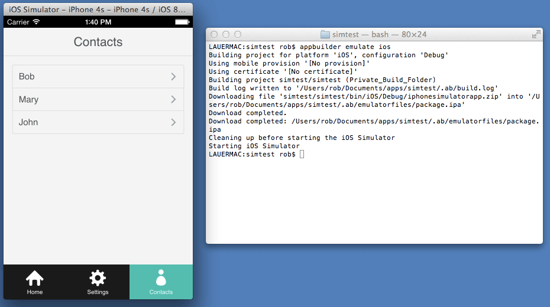
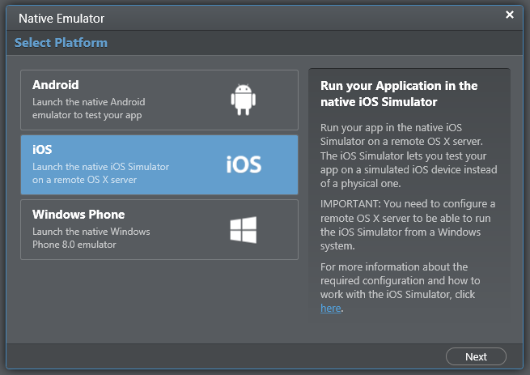
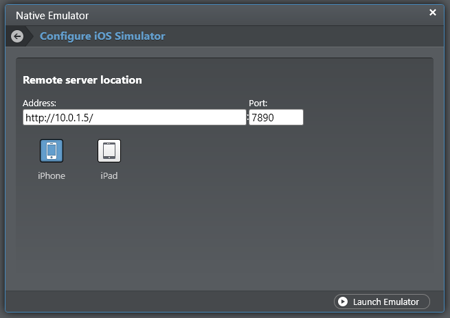

## Using the Xcode iOS Simulator with Hybrid Mobile Apps and Telerik AppBuilder

Hybrid mobile developers have been blessed with ever-improving testing and simulation tools. Telerik AppBuilder customers are no exception, as they have come to rely on a best-in-class simulator experience along with the ability to test on physical devices and, more recently, access to native device emulators for iOS, Android, and Windows Phone. In this final post of a three part series, I'll go over everything you need to know about testing your hybrid mobile app in the Xcode iOS Simulator - whether you are on Windows or Mac OS X.

> Curious about the earlier posts in this series? Learn more about testing your apps with the [Android emulators](http://developer.telerik.com/featured/using-android-emulator-hybrid-mobile-apps-telerik-appbuilder/) and the [Windows Phone 8 emulator](http://developer.telerik.com/featured/using-windows-phone-8-emulator-hybrid-mobile-apps-telerik-appbuilder/).

One of the biggest advantages of using Telerik AppBuilder is the ability to create iOS apps without a Mac. But what if you do have access to a Mac? Maybe you are a regular Mac user - or are a Windows developer who happens to have access to a Mac? Either way, the door is open for you to take advantage of Xcode's iOS Simulator and accurately emulate virtually any iOS device.

**Let's get started!**

- [Testing on the iOS Simulator from a Mac](#mac)
- [Testing on the iOS Simulator from a Windows PC](#windows)
- [Troubleshooting Connectivity](#troubleshooting)

### Testing on the iOS Simulator from a Mac

If you're developing on a Mac and want to test your hybrid mobile app in the iOS Simulator, the solution to your problem couldn't be much easier! Before we get to running your app, there are a few prerequisites you'll need to make sure are installed first:

- [Xcode](https://developer.apple.com/xcode/downloads/) - make sure you have Xcode installed, as the iOS Simulator is part of the Xcode distribution. It's a very large (but free) download.
- [ios-sim](https://www.npmjs.org/package/ios-sim) - this package allows you to launch iOS apps into the iOS Simulator from the command line. Install it via the terminal with `$ npm install -g ios-sim`.
- [AppBuilder CLI](https://www.npmjs.org/package/appbuilder) - if you don't already have it installed, you'll want to install the command line interface for AppBuilder. Install it via the terminal with `$ npm install -g appbuilder`.

Everything installed? Great. I'm going to assume you already have a hybrid mobile app ready to test.

> If you don't have an app ready to test, check out TJ VanToll's post on [getting started with hybrid development and the AppBuilder CLI](http://developer.telerik.com/featured/getting-started-appbuilder-cli/).

In the terminal, navigate to your app directory and execute this command: `$ appbuilder emulate ios`.

**And there it is!** The iOS Simulator will start up and your app will be loaded automatically. In a future release we will provide the ability to LiveSync changes to your iOS Simulator, but in the meantime, just re-run the `$ appbuilder emulate ios` command to see your updates reflected.

### Testing on the iOS Simulator from a Windows PC

Now it's not exactly earth-shattering to run an iOS app on a Mac using the iOS Simulator, but it gets a little more interesting doing so from a Windows PC! Before we get started, you will have to install the same set of prerequisites (on your Mac) that Mac users have to install:

- [Xcode](https://developer.apple.com/xcode/downloads/)
- [ios-sim](https://www.npmjs.org/package/ios-sim) - Install it via the terminal with `$ npm install -g ios-sim`.
- [AppBuilder CLI](https://www.npmjs.org/package/appbuilder) - Install it via the terminal with `$ npm install -g appbuilder`.

> Your Windows PC needs to be able to access your Mac, so you need to verify that they are on the same network (or at least verify that there are no firewalls or other network issues between the two computers).

Next up, you'll need to configure your Mac:

- Verify and record the IP address of your Mac ([instructions](http://support.apple.com/kb/ht5897)).
- In the terminal, run: `$ appbuilder remote <port>` where "port" is the number of an [open port](http://support.apple.com/kb/PH10793) on your Mac.

Return to your Windows PC:

- Open up your AppBuilder [Windows client](http://www.telerik.com/appbuilder/windows-client) or [Visual Studio extension](http://www.telerik.com/appbuilder/visual-studio-extension).
- Choose **Run -> Native Emulator** (if using the Windows client) or **AppBuilder Menu -> Run Native Emulator** (if using the extension for Visual Studio).
- Choose **iOS**.

In the **Address** box, enter the network address of your Mac in the form of `http://192.168.32.22` or `http://mymac`. In the **Port** box, enter the port number you specified earlier. Finally, select a target device and click **Launch Emulator**.

At this point your iOS Simulator will start on your Mac and your app will be loaded for you. Just like with the Mac implementation, in a future release we will provide the ability to LiveSync app changes to your iOS Simulator. For now though, simply re-run your app in the native emulator to see your updates.

### Troubleshooting Connectivity

Accessing a computer across the network can be tricky, so we'd like to provide you with a couple of tips to smooth the way:

- Make sure that the port number you specify on your Mac is open and that any firewalls allows traffic on the selected port. Try a [port scan](http://support.apple.com/kb/PH10793) to look for any conflicts.
- If you want to use a port in the range of 0 to 1023, run the `remote` command using sudo. For example: `$ sudo appbuilder remote 443`.

Hopefully this series has helped you learn more about the power of using native device emulators with your hybrid mobile apps. Look for continuing improvements in upcoming Telerik AppBuilder releases!

