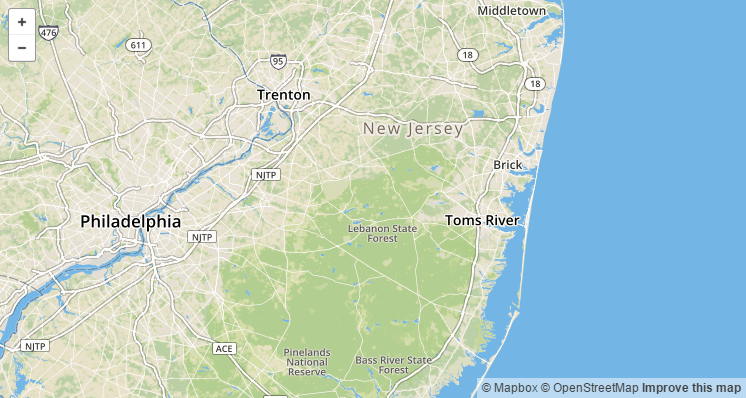
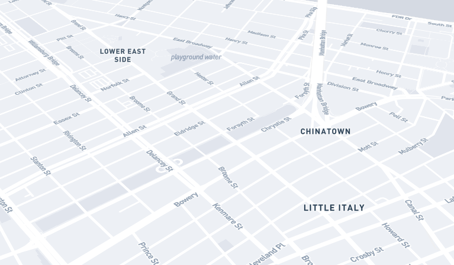
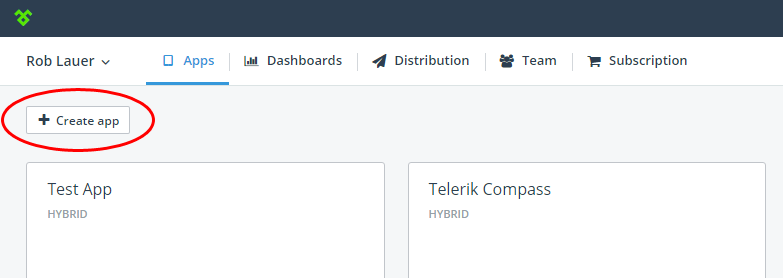
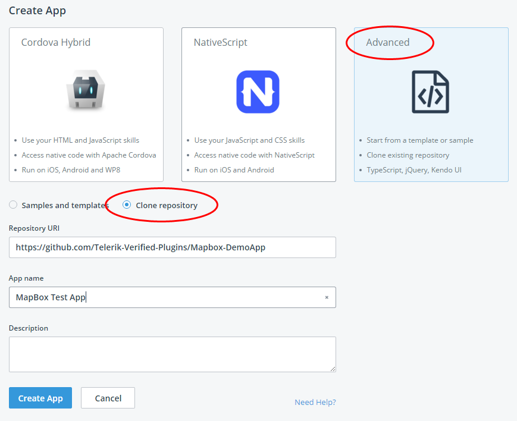
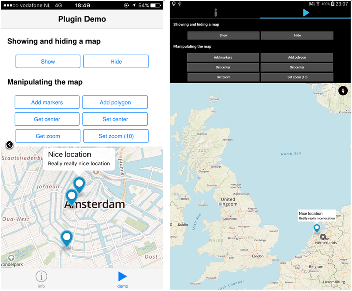

## Native Mobile Maps from Telerik and Mapbox

I'm going to hazard a guess that one of the first things you did with your first smartphone was pull up a map, swipe around, and be more-than-slightly amazed at holding a virtual world in your hand. As mapping has matured in the browser, our mobile mapping apps have matured as well - from Google ruling the roost to a more competitive landscape today with Apple, Google, and Microsoft sharing success. As mobile app developers, we need to create ever more engaging apps, and adding a map is critical in some cases. And today we bring you a fantastic new mapping option for both hybrid and native app developers: [Mapbox](https://www.mapbox.com/).

### Yesterday's Hybrid Mapping Options

Hybrid app (meaning [Cordova/PhoneGap](https://cordova.apache.org/)) developers have been creating apps with mapping features from a variety of sources, but they have mostly been re-purposing straight web-based solutions, nothing truly native. While [Google Maps](https://developers.google.com/maps/documentation/javascript/?hl=en), [Bing Maps](https://www.bingmapsportal.com/isdk/ajaxv7), [Leaflet](http://leafletjs.com/), and [Kendo UI's mapping features](http://demos.telerik.com/kendo-ui/map/api) all have their merits, none of them provide a truly native experience.

> For a slightly dated (but still mostly valid) comparison of hybrid mapping options, take a look at [this blog post](http://www.telerik.com/blogs/mobile-friendly-mapping-options-for-phonegap-cordova-apps).

### Today's Hybrid AND Native Mapping Solution

Today I'm pleased to announce a new partnership between Telerik and Mapbox which brings you two native mapping plugins for iOS and Android based on Mapbox technology: [Mapbox for Cordova](http://plugins.telerik.com/cordova/plugin/mapbox) and [Mapbox for NativeScript](http://plugins.telerik.com/nativescript/plugin/mapbox).

> NativeScript is Telerik's open source framework for developing truly native mobile apps using JavaScript and CSS. You can learn more at [nativescript.org](https://www.nativescript.org/).

**Before we get into "how" we use these plugins, let's first take a look at the "why":**

*Why should you leverage a solution from Mapbox as opposed to industry heavyweights Google or Microsoft?* Valid question, to which I propose three responses:

1. Performance
2. Open Source Maps (and Code)
3. Ease of Use

### Performance

When you're talking about hybrid mapping vs native mapping, there is not much of a comparison. Hybrid maps are rendered on a WebView which is notorious for performance issues (warranted or not). Often times it is best to take the hybrid aspect out of the conversation entirely when possible (and economical).

Mapbox uses on-device vector rendering using OpenGL. Data is delivered to the device and precisely rendered in real-time. Everything is hardware accelerated and fully optimized for mobile, which results in smooth, fast maps.

Vector maps are also roughly 1/4 the size of traditional raster implementations, which means greater performance in low-bandwidth environments.

### Open Source Maps (and Code)

Mapbox's solutions are fully [open source](https://github.com/mapbox). Likewise Telerik's Cordova plugin and NativeScript plugin are both open source as well (MIT licensed).

It's also important to note that Mapbox leverages [OpenStreetMap (OSM)](https://www.openstreetmap.org) map tiles. Why is this important? OSM is, surprise, open source! Meaning you get far more detailed map tiles, updated more frequently, and available in far more countries than those supported by Apple, Google, or Microsoft.

### Ease of Use

It's one thing to offer up a native mapping solution, but it's another to make it easy to use. With our Cordova and NativeScript plugins, we have abstracted the difficult parts of leveraging a map into a series of very simple commands:

### Getting Started with Mapbox

Your first step is to [sign up with Mapbox](https://www.mapbox.com/studio/signup/) for free. After registration, navigate to **Account > Apps > New token**. Copy your "Default Secret Token" as that is what you'll need during plugin installation.

With that completed, you can set up a [free 30 day trial for the Telerik Platform](http://www.telerik.com/platform). While you don't *need* Telerik Platform to create a mobile app, it does make developing hybrid and native mobile apps much easier by providing:

- Instantly available development environment (no SDK management)
- Numerous device simulators and emulation options (with integrated debugging)
- Use any JavaScript framework you want (from Kendo UI to Ionic, we have you covered)
- Create an iOS app from Windows (you don't need a Mac)

**With your Mapbox and Telerik Platform accounts created, you can now try out the [Cordova plugin](http://plugins.telerik.com/cordova/plugin/mapbox) or the [NativeScript plugin](http://plugins.telerik.com/nativescript/plugin/mapbox)!**

Both plugins have full-fledged sample apps (see the either the [Cordova](https://github.com/Telerik-Verified-Plugins/Mapbox-DemoApp) or [NativeScript](https://github.com/EddyVerbruggen/nativescript-mapbox-demo) sample app implementations). You can then *clone these apps* inside of the Telerik Platform by logging in and:

**...clicking on the "Create app" button:**

**...and then choosing "Advanced" and "Clone Repository" (making sure you paste in the URL of the sample app you'd like to clone):**

Using the Telerik Platform you can then immediately [run the app on a connected device](http://docs.telerik.com/platform/appbuilder/cordova/running-on-devices/running-on-connected-devices/deploy-connected) to see the plugin in action:

### Cordova Code Samples FTW!

Don't want to dive head-first into a sample app? That's ok. If you just want to see how easy it can be to embed a native map into your Cordova app with code, here is how you show a map:

	Mapbox.show(
	  {
	    style: 'emerald', // light|dark|emerald|satellite|streets , default 'streets'
	    margins: {
	      left: 0, // default 0
	      right: 0, // default 0
	      top: 316, // default 0
	      bottom: 50 // default 0
	    },
	    center: { // optional, without a default
	      lat: 52.3702160,
	      lng: 4.8951680
	    },
	    zoomLevel: 12, // 0 (the entire world) to 20, default 10
	    showUserLocation: true, // your app will ask permission to the user, default false
	    hideAttribution: false, // default false, Mapbox requires this default if you're on a free plan
	    hideLogo: false, // default false, Mapbox requires this default if you're on a free plan
	    hideCompass: false, // default false
	    disableRotation: false, // default false
	    disableScroll: false, // default false
	    disableZoom: false, // default false
	    disablePitch: false, // disable the two-finger perspective gesture, default false
	    markers: [
	      {
	        lat: 52.3732160,
	        lng: 4.8941680,
	        title: 'Nice location',
	        subtitle: 'Really really nice location'
	      }
	    ]
	  },
	
	  // optional success callback
	  function(msg) {
	    console.log("Success :) " + JSON.stringify(msg));
	  },
	
	  // optional error callback
	  function(msg) {
	    alert("Error :( " + JSON.stringify(msg));
	  }
	)}

...and here is how you add a marker to your map:

	Mapbox.addMarkers(
	  [
	    {
	      lat: 52.3602160, // mandatory
	      lng: 4.8891680, // mandatory
	      title: 'One-line title here', // no popup unless set
	      subtitle: 'Infamous subtitle!' // can't span multiple lines, so keep it short and sweet
	    },
	    {
	      ..
	    }
	  ]
	);

...and there are plenty more code samples where these came from in the [Cordova plugin documentation](http://plugins.telerik.com/cordova/plugin/mapbox).

### NativeScript Code Samples FTW!

These days we can't talk about Cordova without also talking about the native equivalent, NativeScript. Here is how you show a Mapbox map with NativeScript (look familiar?, it should, because it's still just JavaScript!):

	mapbox.show({
	  accessToken: 'YOUR_API_ACCESS_TOKEN', // see 'Prerequisites' above
	  style: 'emerald', // light|dark|emerald|satellite|streets , default 'streets'
	  margins: {
	    left: 40, // default 0
	    right: 40, // default 0
	    top: 450, // default 0
	    bottom: 40 // default 0
	  },
	  center: { // optional without a default
	    lat: 52.3702160,
	    lng: 4.8951680
	  },
	  zoomLevel: 9.25, // 0-20, default 0
	  showUserLocation: true, // default false - requires location permissions on Android which you can remove from AndroidManifest.xml if you don't need them
	  hideAttribution: false, // default false, Mapbox requires this default if you're on a free plan
	  hideLogo: false, // default false, Mapbox requires this default if you're on a free plan
	  hideCompass: false, // default false
	  disableRotation: false, // default false
	  disableScroll: false, // default false
	  disableZoom: false, // default false
	  markers: [ // optional without a default
	    {
	      'lat': 52.3732160, // mandatory
	      'lng': 4.8941680, // mandatory
	      'title': 'Nice location', // recommended to pass in
	      'subtitle': 'Really really nice location' // one line is available on iOS, multiple on Android
	    }
	  ]
	}).then(
	    function(result) {
	      console.log("Mapbox show done");
	    },
	    function(error) {
	      console.log("mapbox show error: " + error);
	    }
	)

...and again, for more code samples and to access the plugin itself, take a look at our [NativeScript plugin documentation](http://plugins.telerik.com/nativescript/plugin/mapbox).

### Summary

With this new partnership between Telerik and Mapbox, we are aiming to provide both hybrid and native mobile app developers the ability to embed even more engaging native mapping experiences in their apps. Enjoy and let us know what you'd like to see next from the [Verified Plugins Marketplace](http://plugins.telerik.com/)!