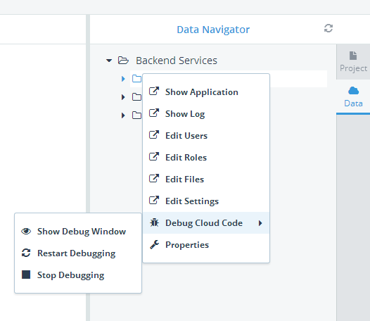
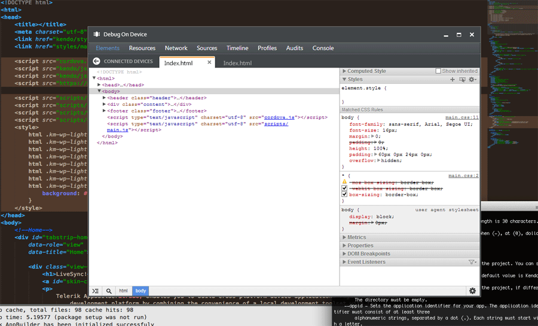
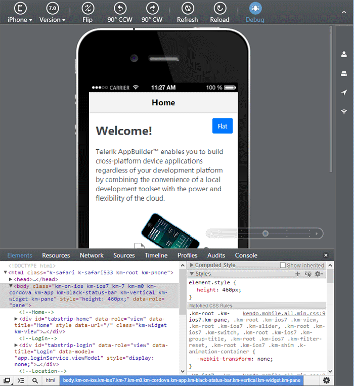

## Telerik AppBuilder Mid-2014 Roadmap

Spring is here! And amid the sense of renewal and positive outlook that a blossoming Spring can bring, we would like to announce the mid-2014 roadmap for [Telerik AppBuilder](http://www.telerik.com/appbuilder). (Those of you in the southern hemisphere can still take advantage of the roadmap as well, even if winter is hastily approaching!)

### How do we plan our roadmaps?

Our roadmaps are meticulously planned using data we gather from you, our faithful customers. We use information gathered from support tickets, one-on-one interviews, surveys, and of course our [feedback portal](http://feedback.telerik.com/Project/129). We do our best to not only maintain what we've already delivered to you, but also innovate and provide you with new features that make you a productive and successful hybrid mobile app developer.

### What can we expect from AppBuilder?

We have A LOT planned for the next few months. By now you know about our support for [Windows Phone 8](http://blogs.telerik.com/appbuilder/posts/14-04-01/building-hybrid-apps-for-windows-phone-8) and an improved experience for Mac developers using the [Sublime Text package](http://blogs.telerik.com/appbuilder/posts/14-04-03/the-telerik-platform-now-with-100-more-sublime-text) and [Command Line Interface](http://www.telerik.com/appbuilder/command-line-interface). Where do we go from here though? Let's take a look:

### Sharing Projects Between AppBuilder Clients

One of the most requested features of AppBuilder is the ability to initiate a project using our [Visual Studio extension](http://www.telerik.com/appbuilder/visual-studio-extension), sync it with the cloud, and then open and edit it within our [in-browser client](http://www.telerik.com/appbuilder/in-browser-client). Well, you'll be able to do that (and more) as we will offer **full compatibility between all of our AppBuilder clients**. You'll be able to start a project with any AppBuilder client and then open and edit that same project with any other AppBuilder client.

### Windows Phone 8 Gets Even Better

We are working towards bringing your Windows Phone 8 development experience up to par with iOS and Android. This means providing you with a [Companion App](http://www.telerik.com/appbuilder/companion-app) for WP8, allowing for QR code distribution of your apps, and allowing you to publish to the [Windows Phone Store](http://www.windowsphone.com/en-us/store) from AppBuilder.

### Cloud Code Debugging

Users of [Telerik Backend Services](http://www.telerik.com/backend-services) will rejoice when they find out that within the AppBuilder clients you will be able to debug [cloud code](http://docs.telerik.com/platform/backend-services/development/cloud-code/introduction) (including setting break points and viewing the output of the cloud code functions). This will make your experience using our Backend Services offering much more flexible and easier than ever to use.

### Mobile Testing Support

Have you ever written unit and functional tests for a hybrid mobile app, but struggled with executing them? We are going to provide full support for not only the [Telerik Mobile Testing](http://www.telerik.com/mobile-testing) plugin, but we will also have a UI that will allow you to write and execute your tests as you need them.

### Debugging on Device with the CLI

Users of our new [Command Line Interface (CLI)](http://www.telerik.com/appbuilder/command-line-interface) will be able to take advantage of not just using our integrated device simulators, but also debugging an app while it is running on a connected device. Set breakpoints, inspect elements, and profile your app while using the CLI!

### Better Support for Kendo UI Mobile and Cordova Updates

Gone are the days when you have to wait for a new AppBuilder release to use the latest and greatest bits from [Kendo UI Mobile](http://www.telerik.com/kendo-ui-mobile). Soon you'll be able to choose which version of Kendo UI Mobile you want to use in your projects - sometimes as soon as the latest version of Kendo UI is released!

Along with the Kendo UI Mobile updates, we are going to update our clients to support the latest and greatest versions of Cordova as quickly as possible.

### Device Simulator for Mac

Last, but certainly not least, we will provide a fully-featured iOS/Android/WP8 device simulator for our Mac users! Developers using Mac OS X and our CLI or Sublime Text package will have access to the same powerful integrated device simulator for quickly iterating, debugging, and testing hybrid mobile apps. (And yes, with Telerik AppBuilder you can develop Windows Phone 8 apps on a Mac!)

### That's Not All...

These are only some of the highlights that you can expect over the next few months. [Stay tuned to the blogs](http://blogs.telerik.com/appbuilder/posts) and please sound off on our [feedback portal](http://feedback.telerik.com/Project/129) if you have other ideas for new AppBuilder features to share!