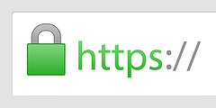
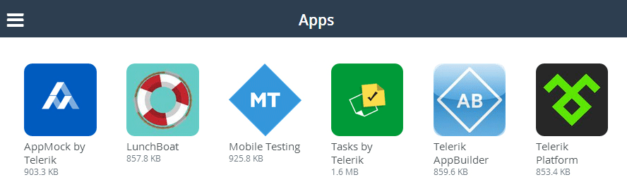

## Securing a PhoneGap/Cordova Hybrid Mobile App

Unbeknownst to many PhoneGap/Cordova developers, the HTML/JavaScript/CSS assets that make up your mobile app are not compiled or otherwise obfuscated when the final app package is built. Unlike the true native bits of the app (i.e. the Cordova framework and custom plugins), which do get compiled into byte code, the core HTML5 assets exist, as they are delivered, inside the app package.

Did I scare you? Hopefully not, as there are numerous ways to better secure your hybrid mobile app, keep your secrets secret, and hide your intellectual property from prying eyes. Let's get started!

### Keep Your Secrets Out of the Code

Maybe this is common sense, but it's an important point: If something doesn't need to be in your app's codebase and you don't want people to find it, then **don't put it in the code**. Treat your hybrid app just like it's a mobile web site. Assume the worst. Assume people are going to crack open the app and examine the contents, just like they can right-click to view source today.

**What are some strategies we can use to keep sensitive bits out of our code?** Any sensitive business logic should be executed on the server. This is rule number one. Run your logic on the server, and expose the results via an API. This could be an API you write yourself using, for example, an [ASP.NET Web API](http://www.asp.net/web-api) project - or you can let Telerik do the heavy lifting for you by taking advantage of [Telerik Backend Services](http://www.telerik.com/backend-services). Backend Services allows you to create a secure backend for your app that lives in the cloud and includes two features called "Cloud Code for Data" and "Cloud Functions":

**[Cloud Code for Data](http://docs.telerik.com/platform/backend-services/development/cloud-code/content-types/introduction)** is best described as a trigger in a traditional relational database. You create functions in JavaScript that **live in the cloud** and are executed whenever a data record is created, read, updated or deleted. For example, you could use cloud code for validating a request like so:

	Everlive.Events.beforeCreate(function (request, context, done) {
	    var email = request.data.Email;
	    var isValid = email && Everlive.Validation.validateEmail(email);
	    //check whether the email is not null and whether it is valid
	    if (!isValid) {
	        Everlive.Response.setErrorResult('The "Email" field must be a valid email address.', 131, 500);
	    }
	    done();
	});

But the options with Cloud Code for Data are really endless.

**[Cloud Functions](http://docs.telerik.com/platform/backend-services/development/cloud-code/cloud-functions/introduction)** are JavaScript functions, also hosted in the cloud, that are executed only when you call them. Once you write a Cloud Function, it's available via a URL and can even accept parameters and return values.

### Secure Your JavaScript

If sensitive code just has to be in your app, make sure you are securing your JavaScript as best you can. By its nature, JavaScript is not compiled - so the best we can do is obfuscate it to the point where it is as unreadable as possible. Before you submit your app to the app stores, **minify your JavaScript assets with [Uglify](https://github.com/mishoo/UglifyJS2)**. Or even take it to the next level with a paid service like [JScrambler](https://jscrambler.com/en/), which goes beyond obfuscation and provides more active protection of your JavaScript assets.

Note that in [Telerik AppBuilder](http://www.telerik.com/appbuilder), you can specify that certain files themselves exist only in debug or release configurations. So if you are testing an app, use un-minified/obfuscated resources with the `*.debug.*` syntax, as in `myapp.debug.js`. Likewise, you can include more secure (minified/obfuscated) resources with the `*.release.*` syntax, like `myapp.release.js` for when you publish to the app stores.

Not only can you manage your debug/release files in the AppBuilder IDEs, you can also automate the process using the [AppBuilder CLI](http://www.telerik.com/appbuilder/command-line-interface) and [Grunt](http://gruntjs.com/). [TJ VanToll](https://twitter.com/tjvantoll) has a [great example](https://github.com/tjvantoll/city-search-challenge/blob/master/Gruntfile.js) on using these tools to automate minification (with Uglify) and builds (with AppBuilder).

### Load JavaScript Remotely

Another viable strategy is to not even include your JavaScript assets in your app, but rather load them remotely when the app starts up:

	

However, this isn't very secure as a quick scan of your source code will reveal the true source. A better implementation would be to load your remote JavaScript via a secure API that first authenticates your user:

	$.ajax({
	    type: "POST",
	    url: "https://my-remote-endpoint.com/authenticate", // authenticate your user
	    data: { username: username, password: password }, // use the authentication parameters that are best for you
	    success: function (e) {
	        // check for a successful authentication, and if so, load the script reference returned from your api
	        $.getScript(e.scriptUrl);
	    }
	});

You could supplement this on the server side by also making sure that only mobile browsers are trying to access this API. And while it's VERY easy for someone to spoof a user agent, it can't hurt to add an additional check on the server. For example, in an ASP.NET Web API, you could use the following two lines of code to make sure only iOS/Android/WP8 web views are accessing your API:

	var userAgent = Request.Headers.UserAgent.ToString();
	if (!userAgent.Contains("Mobile Safari") && !userAgent.Contains("IEMobile")) return;

> Keep in mind that this is hardly future-proof either, as the new version of IE (a.k.a. Spartan) names [every browser except itself](https://twitter.com/triblondon/status/558161890741092352) in the user agent string!

**When necessary, secure all of your API calls!** Ideally, your app would request a key from your server once a user has authenticated themselves successfully. This key could then be passed back to every API call you make, validated on the server, and handled appropriately. The scope of what is required to handle this is not difficult, but due to time and space restrictions, I'll have you [look at this post](http://billpatrianakos.me/blog/2013/09/12/securing-api-keys-in-a-client-side-javascript-app/) that outlines the process very well.

### Transmit Data Securely

It's not just about securing your JavaScript to protect your IP, it's also about **securely transmitting data** between your app and the server. As a rule of thumb, all outgoing requests should be handled via SSL/https - this is a no-brainer!

However, it doesn't stop there. In order to prevent possible "man-in-the-middle" attacks, use a Cordova plugin like [Secure HTTP](http://plugins.telerik.com/plugin/secure-http) to provide true SSL pinning.

### Store Data Securely

If you are storing sensitive data in your app, it's best to do so in the most secure way possible. By default, [localStorage](http://diveintohtml5.info/storage.html) sandboxes the data only for your app - it's not accessible by any other app on the device:

	// save some data!
	localStorage.setItem('key', 'value');

	// get some data!
	var myStuff = localStorage.getItem('key');

On iOS, you can take advantage of the security provided with KeyChain by using the [KeyChain plugin](http://plugins.telerik.com/plugin/keychain) to encrypt data at rest on your device:

	// prepare some variables
	var servicename = 'MY_PASSWORDS';
	var key = 'TELERIK_PLATFORM_PASSWORD';
	var value = 'LetMeIn!'; // fake of course :D
	
	// prepare the callback functions
	function onSuccess (msg) {alert(msg)};
	function onError (msg) {alert(msg)};
	
	// store your password in the Keychain
	new Keychain().setForKey(onSuccess, onError, key, servicename, value);
	
	// get your password from the Keychain
	new Keychain().getForKey(onSuccess, onError, key, servicename);
	
	// remove your password from the Keychain
	new Keychain().removeForKey(onSuccess, onError, key, servicename);

Finally, if you are using [SQLite](http://plugins.telerik.com/plugin/sqlite) as an offline database, you may want to look at a solution such as [SQLCipher](https://www.zetetic.net/sqlcipher/) to encrypt the database. Again, in this scenario, it may be worth considering using a backend data service such as Telerik Backend Services to ensure the security of your data at rest.

### Keep Your App Out of the Hands of the Public

If you don't want to risk your app being in the hands of anyone who might try to hack it, then use a service like [Telerik AppManager](http://www.telerik.com/appmanager) to host your own private app store. **This provides you with 100% control over who has the ability to install your app** - and gives you the convenience of cross-platform app distribution for iOS, Android, and Windows Phone.

### Limit Your Exposure

What else can you do to help secure your hybrid mobile apps? There are numerous other strategies you can use to help limit your exposure to security threats:

**1) Reduce the core Cordova plugins you use.** In case of a zero day exploit of a Cordova plugin, it's best to limit plugin access to only those your app really needs.

**2) Avoid Android 2.3 (Gingerbread) at all costs.** Gingerbread is widely considered to be the most insecure version of Android and is no longer supported by Google. The easiest way to avoid Gingerbread is to set your minSdkVersion higher than 10 in your [Android Manifest](http://docs.telerik.com/platform/appbuilder/configuring-your-project/edit-configuration):

	<uses-sdk android:minSdkVersion="11" android:targetSdkVersion="21" />

**3) Use the InAppBrowser for all external web sites.** The [InAppBrowser](https://github.com/apache/cordova-plugin-inappbrowser/blob/master/doc/index.md) Cordova plugin uses the device's native browser security model and keeps the remote content separate from your app.

**4) Hide app content when switching between apps.** Use the [PrivacyScreen plugin](http://plugins.telerik.com/plugin/privacyscreen) to help your users hide app content when switching between apps on iOS or Android.

**5) Use iOS Touch ID.** If you're developing for iOS 8, you can provide users with a secure authentication mechanism by using the [Touch ID cordova plugin](http://plugins.telerik.com/plugin/touch-id).

### Full App Encryption

Last, but definitely not least, is the nuclear option. It is technically possible to modify Cordova to encrypt all of your HTML/CSS/JS assets as they are stored on the device, and then decrypt them at runtime. An oft-referenced tutorial to do so on iOS [may be found here](http://oleksiy.pro/2012/12/27/cordova-ios-security/), but your mileage may vary.

### Summary

When it comes to security, nothing is 100%. The goal is to get as close to that number as possible though. Start by limiting your exposure and putting as much sensitive data and logic on your (secured) server as possible. From there, work through the list provided and make sure you are doing your best to secure your hybrid mobile apps.