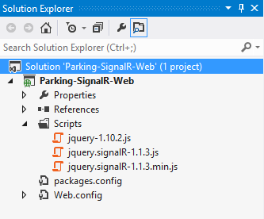
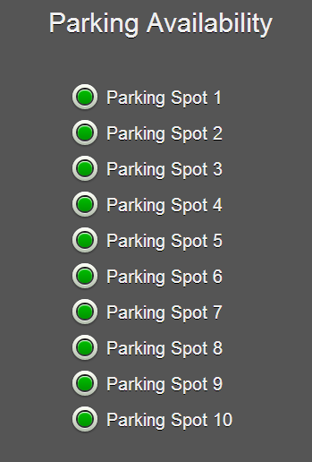

## Real-Time Reporting with SignalR, Kendo UI DataViz, and Icenium Part 1

**This is part one of a two-part post. The second part is now available [here](http://www.icenium.com/blog/icenium-team-blog/2013/10/24/real-time-reporting-with-signalr-kendo-ui-dataviz-and-icenium-part-2).**

The ability to instantly deliver data to your clients is an engaging concept that has opened the web up to real-time communications, reporting, and charting. We have had options for a few years now - be it through [Comet](http://en.wikipedia.org/wiki/Comet_(programming)), [WebSocket](http://en.wikipedia.org/wiki/WebSocket), [SSE](http://en.wikipedia.org/wiki/Server-sent_events), or even AJAX long polling. However, support varies dramatically for each of these methods with each browser and browser version. This is where new projects such as Microsoft's open source [SignalR](http://signalr.net/) step in. In this post we're going to talk about how to leverage the ability to instantly deliver data to multiple mobile apps simultaneously - and visualize that data with some rich charting tools available as part of [Kendo UI DataViz](http://www.kendoui.com/dataviz.aspx).

### But What Exactly is SignalR?

I'm glad you asked! [SignalR](http://signalr.net/) is an open source library from Microsoft that allows ASP.NET developers to take advantage of the WebSocket API. With it's intuitive syntax and ease of use, SignalR is perfect for beginners to get up and running with real-time application communication. SignalR also falls back on other communication technologies in case WebSocket isn't available, which makes it even more useful when dealing with the wide variety of browsers in use today. The best way for me to wrap my head around SignalR is by thinking of a wheel where your SignalR server-side implementation is the hub and all of your clients are the spokes.

If you're curious as to how SignalR decides which transport method to use, take a look at [this informative Stack Overflow thread](http://stackoverflow.com/questions/16983630/how-does-signalr-decide-which-transport-method-to-be-used).

Now, if you're turned off by the fact that SignalR is ASP.NET-only, don't be. Only the server side portion has to be written in .NET, while the client can be written in any language or framework. There are also alternatives to SignalR such as [Socket.IO](http://socket.io/) if you would prefer a Node-based solution instead.

### And Kendo UI DataViz?

If you're not familiar with Kendo UI, you may be wondering just what [Kendo UI DataViz](http://www.kendoui.com/dataviz.aspx) is all about. Well, Kendo UI DataViz is a data visualization library that is part of the Kendo UI family. If you ever need to display data using gorgeous rich charts or graphs, Kendo UI DataViz is worth looking into. Many people don't realize that Kendo UI DataViz fully sports mobile devices as well (and even has backwards compatibility with browsers such as IE7!).

Now what if we could leverage the real-time capabilities of SignalR with a reporting library like Kendo UI DataViz - in an iOS and Android mobile app to boot? That's exactly what we are going to take a look at with this series of posts. We are going to build a hybrid mobile app with Icenium that consumes real-time data and shows off these features. Let's get to the fun stuff.

### The Problem and The Solution

Let's pretend that we own a small parking lot. We have ten parking spots available and want to create a mobile app that our prospective customers can use to see if there are any spaces available. We will do this by building two small applications: one is a web form that allows us to mark parking spots as available or occupied; the other is a hybrid mobile app that our clients will use on their smartphones to quickly check for available spots (in real-time!).

So, we know what the problem is and have a good idea of our proposed solution. Let's see how quickly we can build a solution using the tools we have already outlined.

### Configuring the Server Side

The first thing we're going to do is build a really simple server-side SignalR hub with Visual Studio. We'll start by creating a new web site using the "ASP.NET Empty Web Site" template. This is going to give us an empty project with only a web.config file to keep us company. The next step is to include SignalR in our app. Luckily it is available as a [NuGet](http://www.nuget.org/) package - which makes adding and maintaining external libraries and frameworks a snap in Visual Studio.

Open the **Package Manager Console** in Visual Studio and enter:

	Install-Package Microsoft.AspNet.SignalR

This will download SignalR and all of its dependencies in your project. The one thing I don't like is that an older version of jQuery is included here, so I'm going to go ahead and grab the [latest 1.x version of jQuery](http://jquery.com/download/) and replace the existing jQuery files in my **Scripts** directory. At this point your project should look something like this:

Before we get into writing any code, there are a couple of other simple tasks to take care of. Add a new **Global Application Class (Global.asax)** to your project. Inside the **Application_Start** method add this:

	RouteTable.Routes.MapHubs(new HubConfiguration { EnableCrossDomain = true });

This registers the default route for accessing your SignalR hub. We set the **EnableCrossDomain** property to true because our mobile app clients are not going to be on the same domain as the server.

You will also need to add two additional namespaces to your Global.asax:

	using System.Web.Routing;
	using Microsoft.AspNet.SignalR;

Next up is for you to make an optional change to your **Web.config**. You may add this to the system.webServer section of your Web.config file. Why would we want to do this? Under certain configurations of IIS, extensionless URLs may not be processed by the .NET framework and instead are passed through to IIS - which will result in a 404.

    <system.webServer>
        <modules runAllManagedModulesForAllRequests="true"/>
    </system.webServer>

Please note that this could change functionality to your existing web application (if you are adding SignalR to an existing site). However, if you are throwing 404 errors when testing your SignalR hub, you may want to try this solution.

That's it, let's write some code!

### Implementing our SignalR Hub

Go ahead and add a new class to your project. Let's call the class **ParkingHub** and paste in the following code:

    public class ParkingHub : Hub
    {
        public void UpdateParkingAvailability(string s)
        {
            Clients.All.broadcastMessage(s);
        }   
    }

For the scope of the application we are writing, this is literally all of the C# code that we need to write! You'll notice that our ParkingHub class implements Microsoft.AspNet.SignalR.Hub, which allows us to create methods that communicate with our SignalR client connections. Our **UpdateParkingAvailability** method simply accepts a string (in this case JSON) and in turn, broadcasts that exact string to all connected clients. We'll see how this fits into our hybrid mobile app later.

Provided everything was done correctly, that's all we have to do on the server side!

### Implementing our Web Form

We need to create a basic web form that will allow our parking attendant to mark which parking spots are available or occupied. No sweat. In order to keep this simple, I'm going to create this web form inside of the same SignalR project that we just created. However, you can definitely create this as a completely separate project if you like!

Add a new **index.html** file to your project. You can paste in the following snippet which will be the extent of our application:

	<!DOCTYPE html>
	<html>
	<head>
		<title>Parking Availability</title>
		<link rel="stylesheet" type="text/css" href="Styles/parking.css" />
	    
	    
		
	    
	    
	</head>
	    <body>
	        
	        <h1>Parking Availability</h1>
	        
	        
	
	        

	
	    </body>
	</html>

There is a fair amount of going on here, so let's walk through the important parts:

We have a reference to our stylesheet (which I'm not going to post here, but which IS available in the [github repo](https://github.com/rdlauer/Parking-SignalR-Web/blob/master/Parking-SignalR-Web/Styles/parking.css) for this project). We have a reference to the **jQuery** and **SignalR** libraries that were added to our project. We also have a reference to the full **Kendo UI** framework (if you need a trial copy, [download it here](http://www.kendoui.com/download.aspx)).

The **parking.js** asset is something we'll be creating in a bit. Finally we have a reference to something on my local machine - looks like it has to do with SignalR. What's up with this?

SignalR automatically creates a javascript proxy hub for us to download inside of our consuming applications. In order to access this, you simply point your script tag to **http://yourwebsite.com/signalr/hubs**. In my case, I'm simply publishing my SignalR app to localhost, which is why I'm pointing it there. In a production instance, this tag would be changed to reflect the location of my app on the production server.

The next ever-so-slightly tricky part of this app is the [Kendo UI template](http://demos.kendoui.com/web/templates/index.html). If you're not familiar with javascript templates, they allow you to quickly render HTML - usually bound to a datasource of some sort. In our case, we are simply looping over our template ten times (because we have ten parking spots!) to display the HTML contained inside of our template. IMHO this is cleaner and easier to manage than having distinct chunks of HTML code repeated ten times.

Finally, we need to add a javascript asset that is going to run our application. Add **parking.js** to your Scripts directory and include the following code:

	$(function () {
	
	    // generate the html inside of our template
	    var template = kendo.template($("#template").html());
	    $(".content").html(template);
	
	    // add an event handler to the change event of our checkboxes
	    $(":checkbox").change(function () {
	
	        // create an array of available parking spots
	        var availableSpots = [];
	
	        $('input:checked').each(function () {
	            availableSpots.push(parseInt(this.value));
	        });
	
	        // connect to our signalr hub and broadcast the parking data
	        var parking = $.connection.parkingHub;
	
	        $.connection.hub.start().done(function () {
	            parking.server.updateParkingAvailability(JSON.stringify(availableSpots));
	        });
	        
	    });
	});

The inline comments give away what is going on here, but basically we are binding our Kendo UI template to generate the ten distinct sections to mark a parking spot as available or occupied. We are then assigning an event handler to our checkboxes that will allow us to send a new message to our SignalR hub each time a checkbox is changed. Our hub will then broadcast that message to all of our clients (this is where the **UpdateParkingAvailability** method comes into play from our **ParkingHub** class). Note the camel casing of our method and how it changed from "UpdateParkingAvailability" in C# to "updateParkingAvailability" in javascript - this is an easy part to miss!

That's it! At this point you should be able to publish this application to an IIS server. When you point your browser at the application, it should look like this:

Nothing fancy here. Just a list of heavily styled checkboxes (thanks to [Kushagra Agarwal](http://cssdeck.com/labs/css-checkbox-styles)) to give us a good visual representation of whether or not each parking spot is filled (hint: green = available).

### What's Next?

In this post we have positioned ourselves nicely to create a hybrid mobile app that consumes the data we are generating from the web form and SignalR. In the next post we will dive into Icenium and create the most important part of the project - the hybrid mobile app. Check back next week for the exciting conclusion - and in the meantime, be sure to try out the latest [Icenium Extension for Visual Studio](http://cdn.icenium.com/live/vs/Icenium.vsix) bits and sound off on our [feedback board](http://feedback.telerik.com/Project/87) if you have any comments.