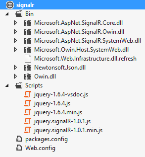
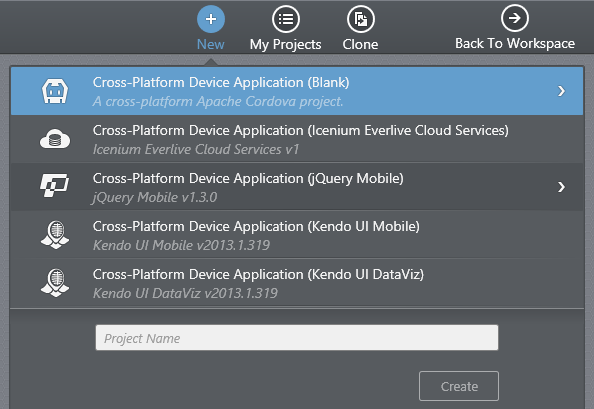
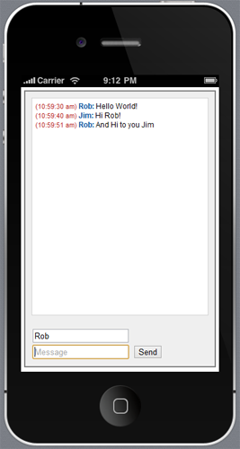

## Build a Real-Time App using Icenium and SignalR

[WebSocket](http://en.wikipedia.org/wiki/WebSocket) is a popular topic in the web world these days - especially in the context of real-time communication between a client and server. A relatively new kid on the block, WebSocket has quickly replaced technologies like Comet and Ajax Polling as the go-to API for developers to integrate real-time communications in their applications. So what is WebSocket, what does it have to do with this SignalR thing, and what does any of this have to do with building hybrid mobile apps with Icenium? All good questions, so lets get started.

### WebSocket and SignalR

At its most basic, WebSocket is an HTML5 API that enables a browser and server to communicate in a bi-directional manner, without polling by the client. Allowing the client and server to communicate in this way opens up a world of possibilities for client/server applications (think real-time chat, games, reporting, anything that requires frequent updates from the server). So what does this have to do with SignalR?

[SignalR](http://signalr.net/) is an open source library from Microsoft that allows ASP.NET developers to take advantage of the WebSocket API. With it's intuitive syntax and ease of use, SignalR is perfect for beginners to get up and running with real-time app development. SignalR also falls back on other communication technologies in case WebSocket isn't available, which makes it even more useful when dealing with the wide variety of browsers and versions in use today. The best way for me to wrap my head around SignalR is by thinking of a wheel where your SignalR server-side implementation is the hub and all of your clients are the spokes.

If you're turned off by the fact that SignalR is ASP.NET-only, don't be. Only the server side has to be written in .NET, while the client can be written in any language or framework. There are also alternatives to SignalR such as [Socket.IO](http://socket.io/) if you would prefer a Node-based solution instead.

At this point we have a general idea of what these technologies are and what we could do with them. Lets build a real-time chat app using Icenium to show off how easy it is to get up and running with SignalR.

### Configuring the Server Side

The first thing we're going to do is create a new web site using the "ASP.NET Empty Web Site" template in Visual Studio. This is going to give us, obviously, an empty project with only a web.config file to keep us company. The next step is to include SignalR in our app. Luckily it is available as a NuGet package - which makes adding and maintaining external libraries and frameworks a snap in Visual Studio.

Open the **Package Manager Console** in Visual Studio and enter:

	Install-Package Microsoft.AspNet.SignalR

This will download SignalR and all of it's dependencies in your project. At this point your project should look something like this:

Before we get into writing any code, there are a couple of other simple tasks to take care of. Add a new **Global Application Class (Global.asax)** to your project. Inside the **Application_Start** method add this:

	RouteTable.Routes.MapHubs(new HubConfiguration { EnableCrossDomain = true });

This registers the default route for accessing your SignalR hub. We set the **EnableCrossDomain** property to true because our mobile app clients are not going to be on the same domain as the server.

You will also need to add two additional namespaces to your Global.asax:

	<%@ Import Namespace="System.Web.Routing" %>
	<%@ Import Namespace="Microsoft.AspNet.SignalR" %>

Next up is for you to make an optional change to your **Web.config**. You may add this to the system.webServer section of your Web.config. Why would we want to do this? Under certain configurations of IIS, extensionless URLs may not be processed by the .NET framework and instead are passed through to IIS - which will result in a 404.

    <system.webServer>
        <modules runAllManagedModulesForAllRequests="true"/>
    </system.webServer>

Please note that this could change functionality to your existing web application (if you are adding SignalR to an existing site). However, if you are throwing 404 errors, you may want to try this solution.

That's it, lets write some code!

### Implementing Our SignalR Hub

Go ahead and add a new class to your project. Lets call the class **ChatHub** and paste in the following code:

	using Microsoft.AspNet.SignalR;
	
	public class ChatHub : Hub
	{
	    public void Send(string name, string message)
	    {
	        Clients.All.broadcastMessage(name, message);
	    }    
	}

For the scope of the application we are writing, this is literally all of the code that we need to write. You'll notice that our ChatHub class implements Microsoft.AspNet.SignalR.Hub, which allows us to create methods that communicate with our SignalR client connections. Our **Send** method simply accepts a name and a message and in turn broadcasts the name and message to all connected clients. We'll see how this fits into our hybrid mobile app shortly.

Provided everything was done correctly, that's all we have to do on the server side! At this point you may build and publish your app to a publicly available IIS server so our client mobile app can connect to it.

### Setting Up the Icenium Project

Lets create a new hybrid mobile app project in Icenium using the Graphite IDE. If you aren't yet familiar with the Graphite IDE, take a look at the multi-part [Deep Dive into Icenium Graphite](http://www.icenium.com/community/blog/icenium-team-blog/2013/04/05/diving-into-icenium-graphite-part-1-of-3) series. In this case I'm just going to create a new blank project.

Our HTML view for this app is going to be quite simple, but there are a couple of additions I would like to point out.

	<!DOCTYPE html>
	<html>
	<head>
	    <title></title>
	    <meta name="viewport" content="user-scalable=no, initial-scale=1, maximum-scale=1, minimum-scale=1, width=device-width, height=device-height, target-densitydpi=device-dpi" />
	    <link rel="stylesheet" type="text/css" href="css/main.css" />
	    
	    
	    
	    
	    
		
	</head>
	<body>
	    

	        

	         
	        <input type="text" id="txtName" placeholder="Name" />
	         
	        <input type="text" id="txtMessage" placeholder="Message" /> <input type="button" id="btnSend" value="Send" />
	    

	</body>
	</html>

I've added a few JavaScript assets to my project:

* **jQuery**
* **SignalR** JavaScript library (you can get this from your ASP.NET project)
* A reference to the auto-generated **SignalR hub script** on your server (the "yourwebsite.com" script)
* **Moment.js** library (for easily manipulating dates - [download here](http://momentjs.com/))
* **app.js** (the main application code)

The rest of the HTML is quite simple. We have a container that holds a DIV element where our chat history will go. We have a couple of input elements that allow us to specify our name and the message we want to broadcast to all connected clients.

### The Application Code

All of the app magic is going to happen in our **app.js** file - and I think you'll appreciate how easy it is to implement SignalR on the client side:

	document.addEventListener("deviceready", onDeviceReady, false);
	
	function onDeviceReady() {
	    $(function () {
	
	        $.connection.hub.url = "http://yourwebsite.com/yourapp/signalr";
	        var chat = $.connection.chatHub;

	        $.connection.hub.start().done(function () {
	            $('#btnSend').click(function () {
	                chat.server.send($('#txtName').val(), $('#txtMessage').val());
	                $('#txtMessage').val('').focus();
	            });
	        });

	        chat.client.broadcastMessage = function (name, message) {
	            var d = new Date();
	            var txt = $('#txtChat');
	            txt.html(txt.html() + "(" + moment().format('h:mm:ss a') + ") " + name + ": " + message + " ");
	            txt.animate({ scrollTop: txt[0].scrollHeight}, 1000);
	        };
	        
	        $('#txtName').focus();
	    });
	};

Lets walk through the imporant parts of this code so we make sure we understand what is going on here.

As with any Cordova application, we are going to add an event listener to tell us when Cordova has been loaded and the device is ready - which then calls the **onDeviceReady** function. Next, we specify the URL of our SignalR hub - which will be the location of your ASP.NET web application, with "/SignalR" appended to the end.

	$.connection.hub.url = "http://yourwebsite.com/yourapp/signalr";

We are then calling a function after our connection to the SignalR hub is started. This is going to tell our app that when the send button is clicked, deliver the name and message to the SignalR hub:

	chat.server.send($('#txtName').val(), $('#txtMessage').val());

Finally we are defining a function that will accept the broadcasted message from our SignalR hub. Our DIV dlement is populated with the most recently sent message (and automatically scrolls to the bottom of the div if the content starts to expand beyond the size that we have outlined.

You'll notice that our **chat.client.broadcastMessage** syntax matches the **Clients.All.broadcastMessage(name, message);** in our ChatHub.cs class in the ASP.NET project.

That's it! Our HTML is complete, our JavaScript is complete, lets clean it up with some nice looking CSS.

### CSS

Nothing revolutionary here, but we do want to present our chat client in an interface that should be relatively familiar to users of most IM clients.

	.container {
	    background-color: #efefef;
	    border: 2px solid #808080;
	    padding: 10px;
	    margin: 5px;
	}
	
	#txtChat
	{
	    font-family: Helvetica;
	    font-size: 9pt;
	    background-color: #fff;
	    border: 1px solid lightgrey;
	    padding: 5px;
	    height: 340px;
	    overflow: scroll;
	}
	
	.name
	{
	    color: #16569e;
	    font-weight: bold;
	}
	
	.date
	{
	    color: #b83030;
	    font-size: 8pt;
	}

And we're done! Lets run the app in the simulator to see the results:

Now it's fine and all to see this work inside the simulator, but to really get the most out of this exercise you should either connect a device or use [Icenium Ion](http://www.icenium.com/blog/icenium-team-blog/2013/04/25/the-beauty-of-icenium-ion). As soon as you have more than once device connected (you can even use the simulator as one of your clients!) you'll see that your messages are instantly broadcasted to all of your clients. Amazing!

### Conclusion

I hope you saw today how easy it is to get up and running with SignalR and Icenium. We have merely scratched the surface of what SignalR can provide, but it's clear that the utility of real-time communication across all clients - web, native, and hybrid mobile - can be an effective tool for your next mobile development project!