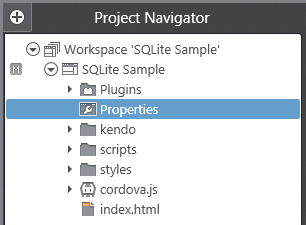
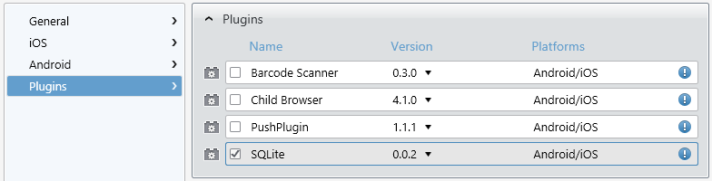

## Adding Dynamic Data with the SQLite Plugin

I'll admit it, backend development can occasionally be intimidating. Often times frontend developers are more concerned with the UI or UX of their web site or app and leave the heavy data lifting to the backend developers. However, in a short amount of time I'm going to show you how you can leverage the power of a relational database inside your hybrid mobile app.

If the words "database" or "SQL" strike fear into your heart, or even if you are somewhat comfortable in this realm, this is the blog post for you. Databases are the foundation of every data-driven app out there. And while you can certainly write an amazing app without knowing any SQL, I'm here to show you how you can simply and easily set up and manage a lightweight, but very powerful, database within your own hybrid mobile app using the Cordova SQLite plugin.

### SQLite? What's This All About?

If you are writing a hybrid mobile app and want to store, manage, and retrieve data in an efficient and reliable manner, SQLite is for you. There are certainly alternatives (like cloud storage), but you can't deny the raw speed of dealing with data locally (not to mention the offline experience). So what exactly is SQLite? As explained on the [SQLite web site](http://www.sqlite.org/), SQLite is:

> ...a software library that implements a self-contained, serverless, zero-configuration, transactional SQL database engine.

This means that we have at our disposal a powerful relational database that is easy to set up and doesn't require a server to run. The database is created within your app and runs within the context of your app. In no time you can have a database running that stores anything from plain text to binary data (images, documents, etc).

### Cordova SQLite Plugin

Luckily for us, a group of kind-hearted individuals created a plugin for Apache Cordova that makes setting up and interfacing with a SQLite database relatively painless. Even better is the fact that Icenium includes built-in support for the Cordova SQLite plugin! This means that the initial configuration for your app is about as difficult as checking a box.

While not a mandatory step, you may be curious to read more about the Cordova SQLite plugin. There is separate documentation for the [iOS](https://github.com/brodyspark/PhoneGap-SQLitePlugin-iOS) and [Android](https://github.com/brodyspark/PhoneGap-SQLitePlugin-Android) versions.

At this point we know what SQLite is, so lets walk through what we'll need to do to set up the plugin in our Icenium project and show some simple examples to interface with the SQLite database.

### Initial Setup and Configuration

Go ahead and create a new project from the Graphite or Mist Dashboard. I am going to assume you have a certain familiarity with one of the two Icenium IDEs, but if you don't, no problem! Take a look at the multi-part [Deep Dive into Icenium Graphite](http://www.icenium.com/community/blog/icenium-team-blog/2013/04/05/diving-into-icenium-graphite-part-1-of-3) series.

The first thing I'm going to do is include the SQLite plugin in my app. Navigate to your project properties by double-clicking on the **Properties** option in the Project Navigator.

In your project properties, navigate to the **Plugins** pane, check the box next to **SQLite**, and then hit the save button. That's it! Your project is now configured to use the SQLite plugin.

### Creating the SQLite Database

When your mobile app initializes, you're going to want to create your SQLite database. To do this we are going to add an event listener that will execute a JavaScript function when Cordova has told us that the device is ready:

	document.addEventListener("deviceready", init, false);
	
	var app = {};
	app.db = null;
	      
	app.openDb = function() {
	    if (window.sqlitePlugin !== undefined) {
	        app.db = window.sqlitePlugin.openDatabase("My Database");
	    } else {
	        // For debugging in simulator fallback to native SQL Lite
	        app.db = window.openDatabase("My Database", "1.0", "Cordova Demo", 200000);
	    }
	}

	function init() {
		app.openDb();
	}

At this point we have a SQLite database that is ready for us to use!

### Creating a Database Table

We have a blank SQLite database, but we need a place to insert some records. An important note about SQLite - it is different from other relational databases in that it does not enforce data types. So, in theory, you could insert text into an integer column. From the [SQLite FAQ](http://www.sqlite.org/faq.html):

>This is a feature, not a bug. SQLite uses dynamic typing. It does not enforce data type constraints. Any data can be inserted into any column. You can put arbitrary length strings into integer columns, floating point numbers in boolean columns, or dates in character columns. The datatype you assign to a column in the CREATE TABLE command does not restrict what data can be put into that column. Every column is able to hold an arbitrary length string. (There is one exception: Columns of type INTEGER PRIMARY KEY may only hold a 64-bit signed integer. An error will result if you try to put anything other than an integer into an INTEGER PRIMARY KEY column.)

Lets create a simple table with a few columns. We're going to add on to our code up above by adding a new method for creating a table:

	app.createTable = function() {
		app.db.transaction(function(tx) {
			tx.executeSql("CREATE TABLE IF NOT EXISTS MyTable (id INTEGER PRIMARY KEY ASC, text_sample TEXT, date_sample DATETIME)", []);
		});
	}

In this situation we created a table called "MyTable" that has three columns:

* **id** is an integer and is the primary key of the table
* **text_sample** is just a string with a TEXT data type
* **date_sample** is a date/time column with a DATETIME data type

We can add this to our init function to create the table as soon as our database is created.

	function init() {
		app.openDb();
		app.createTable();
	}

We have a database, we have a table, but we don't have any data. Lets look at inserting some new records:

### Inserting a New Record

	app.insertRecord = function(t) {
		app.db.transaction(function(tx) {
			var cDate = new Date();
			tx.executeSql("INSERT INTO MyTable(text_sample, date_sample) VALUES (?,?)",
						  [t, cDate],
						  app.onSuccess,
						  app.onError);
		});
	}

This example shows us how we can pass a parameterized query to the SQLite engine. If you remember, we created the **id** field as a primary key integer, so that column will be auto-incremented each time a new record is inserted. We will pass the variable **t** into the function which will get inserted in the **text_sample** column. Finally we create a new JavaScript date object and pass that in as the current date/time to the **date_sample** column.

You'll also notice that we have two other functions called, **app.onSuccess** and **app.onError**. You can probably guess that those are called when the result of the insert was successful or if it failed. For now you can just log those to the console like this:

	app.onSuccess = function(tx, r) {
		console.log("Your SQLite query was successful!");
	}

	app.onError = function(tx, e) {
		console.log("SQLite Error: " + e.message);
	}

### Updating an Existing Record

Once we have data in there, we're probably going to want to update it at some point.

	app.updateRecord = function(id, t) {
		app.db.transaction(function(tx) {
			var mDate = new Date();
			tx.executeSql("UPDATE MyTable SET text_sample = ?, date_sample = ? WHERE id = ?",
						  [t, mDate, id],
						  app.onSuccess,
						  app.onError);
		});
	}

If you understood the **insertRecord** function, this one should make sense as well. We're simple updating the record with data we are passing, and we are identifying the record by passing the id number. Again we are calling the **app.onSuccess** and **app.onError** functions.

### Deleting an Existing Record

You should be getting the hang of it by now (especially if you are at all familiar with SQL!). Deleting a record is just as easy - and oh so powerful:

	app.deleteRecord = function(id) {
		app.db.transaction(function(tx) {
			tx.executeSql("DELETE FROM MyTable WHERE id = ?",
						  [id],
						  app.onSuccess,
						  app.onError);
		});
	}

### Selecting Records/Querying the Database

We've gone over how to get data into the database, updated, and removed. Lets look at how we can select data from the database to use in our app. In this example we'll query our table and take that recordset to convert it to JSON, as that is usually easier for us to deal with.

    app.selectAllRecords = function(fn) {
        app.db.transaction(function(tx) {
            tx.executeSql("SELECT * FROM MyTable ORDER BY id", [],
                          fn,
                          app.onError);
        });
    }

This is a little different, as we have to send a callback function (the variable **fn**) along to do something with the data after the query is executed. Here is an example of how you could call the above query and do something with the data:

	function getAllTheData() {
	    var render = function (tx, rs) {
			// rs contains our SQLite recordset, at this point you can do anything with it
			// in this case we'll just loop through it and output the results to the console
			for (var i = 0; i < rs.rows.length; i++) {
				console.log(rs.rows.item(i));
			}
	    }

		app.selectAllRecords(render);
	}

We can of course, create far more complicated queries using joins across multiple tables. The great thing is that SQLite SQL syntax is ANSI-compliant, which means the same SQL you use with MySQL, Oracle, SQL Server, etc should work unaltered with SQLite (assuming that you aren't using any platform-specific functions). There are however some [notable omissions](http://www.sqlite.org/omitted.html).

### Conclusion

We've gone over how we can easily include a SQLite database in an Icenium project. We've also seen examples of how to insert, update, delete, and select data from the database. You can also use the Icenium SQLite sample as a way to start your next project - it contains everything we discussed and a little more to get you on your way. I hope you've seen how easy it is to use a SQLite database with your next Icenium project! 