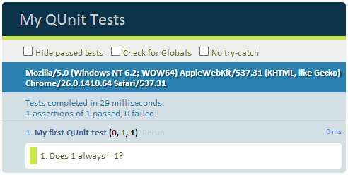
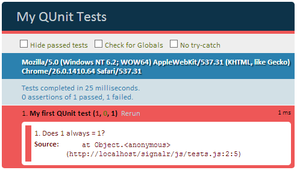
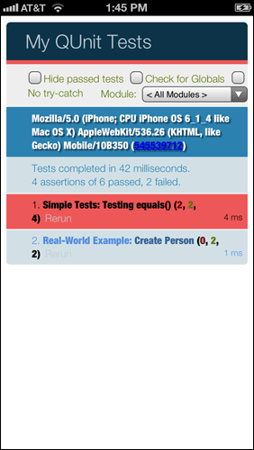

## How I Learned to Stop Worrying and Love Testing JavaScript 

I don't know about you, but I always hated testing. I'd rather make a change, reload my browser, click a button, see if it worked - and if so, move it to production! This all changed when I started relying more and more on things outside of my control - like remote data sources or frameworks and libraries that update every month instead of every year. It only takes a single four hour session of tracking down a bug (which turns out to be a change to some data that you have no control over) to realize that adding simple automated tests to all of your code is a valuable and worthwhile time commitment. In this post I hope to give you test-hating developers a reason to start looking into some JavaScript test frameworks.

This post is going to focus on [QUnit](http://qunitjs.com/) (simply because it has been around a while and is relatively well known), but there are plenty of others (like [Jasmine](http://pivotal.github.io/jasmine/) and [Mocha](http://visionmedia.github.io/mocha/)) that are getting a lot of press these days. My advice: stick with what you are comfortable. QUnit is a nice testing framework because it has a low barrier to entry and is pretty easy to wrap your head around. Some of the other frameworks may be more powerful and feature rich, but that's up to you to decide.

I'm also going to take this one step further and not only show you how to use QUnit, but also how to integrate this into an Icenium project, so you don't have to use any other resources to run your tests.

### So What Exactly is QUnit?

QUnit is a unit testing framework maintained and used by the jQuery Project - which they happen to use to test jQuery, jQueryMobile, and jQuery UI. Without a doubt this is one of the more established testing frameworks out there and, just like jQuery, it is open source and free to use as you please.

An important, but often understated point, is that your tests are only as good as you are at writing them. Sure you could write one test that encapsulates all of the functionality for your app, but if it fails, good luck finding the source. Likewise you could go crazy writing unit tests for practically every line of code you write, but that's not realistic given limited time and budgets you are probably working with. The key is to strike a balance and write simple tests for areas that you as the developer have identified as potential sources of bugs or those which have significant dependencies on external libraries/frameworks.

If you are a total beginner to automated testing of your JavaScript, then the rest of this post is for you. I'm going to show you the basics of QUnit using some simple examples, and then get into some more real-world examples using an existing Icenium project. So without further ado, lets begin!

### Up and Running with QUnit in 5 Minutes

Lets go over some really simple examples of how to set up and use QUnit. The first thing we'll need is some HTML to house our tests. Here is a minimal example of what you need - and it should be pretty self-explanatory for any web developer:

	<!DOCTYPE html>
	<html>
	<head>
	    <title>My QUnit Tests</title>
	    <link rel="stylesheet" href="css/qunit-1.11.0.css">
	    
	    <!-- the tests we write will go here! -->
	    
	</head>
	<body>
	    

	    

	</body>
	</html>

You'll see that we have added a reference to the QUnit CSS and JS assets available from the web site (there is also a CDN if you so desire). From here on out, all of the tests we write are going to live in the **tests.js** file.

The core of QUnit is the idea of **assertions**. These are functions built into QUnit that allow us to test the result of a certain statement or function. The simplest assertion is probably **ok()** which requires only one argument. If said argument is true, we pass the test, otherwise we fail:

	test("My first QUnit test", function () {
	    ok(1 == 0, "Does 1 always = 1?");
	});

Go ahead and save that test function in your **tests.js** and load up your HTML file in a browser. You should see something like this:

There are a few things I want you to notice in our test function. First is that **test** is what QUnit uses to construct a test case. We are then passing in **"My first QUnit test"** as the name of the test. We are utilizing the **ok()** assertion to test if 1 equals 1. Finally we are passing a string of **"Does 1 always = 1"** which allows us to describe the individual assertion (you can have multiple assertions in one test). Lets look at the same test, but look at what happens if it fails (I'm just going to change a 1 to a 0):

You can see that when a test fails, the failure is extremely obvious and well-documented. So now that we have written our first test, lets look a little deeper into the types of assertions that we can use to write additional tests.

### QUnit Assertions

There are eight different assertions you may use when writing your tests:

* **ok()** passes a test if the first parameter results in a true (this is what we did above)
* **equal()** passes a test if the first two parameters are equal (not strict, so comparing 1 to "1" passes)
* **strictEqual()** passes a test if the first two parameters are equal (strict, so comparing 1 to "1" does NOT pass - it checks the value AND type of the parameters)
* **notEqual()** passes a test if the first two parameters are not equal (not strict, so comparing 1 to "1" does NOT pass)
* **notStrictEqual()** passes a test if the first two parameters are not equal (strict, so comparing 1 to "1" passes)
* **deepEqual()** passes a test if two objects are equal, but it goes a step further to do a deep recursion comparison which is useful for comparing arrays, complex objects, dates, or functions
* **deepNotEqual()** is the opposite of deepEqual() and will pass if the deep recursion does not match in any way
* **throws()** passes a test if the function we are testing throws an exception

Lets go through a few simple examples using a couple of the more common assertions:

### equal() and strictEqual() Examples

As stated above, an **equal()** assertion will pass if both parameters passed to the test are equal (using the "==" comparison operator). This is just a value check, so if there is a type difference (comparing integer to a string for example) the test will still pass. If you want to check the type as well you should use the **strictEqual()** assertion.

	test("Testing equals()", function() {
		equal(1, 1, "Pass!" );
		equal("1", 1, "Pass!" );
		equal(0, 1, "Fails!" );
		equal(null, 1, "Fails!" );
	});

If we run the same test using **strictEqual()** in place of **equal()** we will get slightly different results:

	test("Testing equals()", function() {
		strictEqual(1, 1, "Pass!" );
		strictEqual("1", 1, "Fails!" ); // this one is different!
		strictEqual(0, 1, "Fails!" );
		strictEqual(null, 1, "Fails!" );
	});

At this point you have a rough idea of how QUnit works and how you can write some simple tests. These examples so far are all well and good, but in reality we're going to be writing tests that utilize functions in our application and not necessarily testing if the number 1 always equals the number 1.

### Real-World Example

In my real-world app, I have a defined an object that is a person - and a person is just a first and last name:

	var model = model || {};
	
	model.Person = function (data) {
	    data = data || {};
	    
	    this.firstName = data.firstName || '';
	    this.lastName = data.lastName || '';
	
	    this.getFullName = function () {
	        return this.firstName + ' ' + this.lastName;
	    };
	};

So how do we go about testing this chunk of code? In my case I want to write two tests: one to check to make sure a person I add is actually a person object and the second to make sure the data that I pass is populating the correct properties. Therefore I would write the following test:

	test("Create Person", function () {
	    // create the test person
	    var p = new model.Person({ firstName: 'Rob', lastName: 'Lauer' });
	
	    // run the tests on this person
	    ok(p instanceof model.Person, 'Person I created is a member of model.Person');
	    equal(p.getFullName(), 'Rob Lauer', 'getFullName() returned the correct name');
	});

### Grouping Your Tests

At some point you will probably have a ginormous number of tests to support your application. In this case it's actually quite easy to group your tests together in a logical manner. This is where the **module** QUnit function comes into play:

	module("Simple Tests");  
	test("Testing equals()", function() {
		equal(1, 1, "Pass!" );
		equal("1", 1, "Pass!" );
		equal(0, 1, "Fails!" );
		equal(null, 1, "Fails!" );
	});

	module("Real-World Example");
	test("Create Person", function () {
	    // create the test person
	    var p = new model.Person({ firstName: 'Rob', lastName: 'Lauer' });
	
	    // run the tests on this person
	    ok(p instanceof model.Person, 'Person I created is a member of model.Person');
	    equal(p.getFullName(), 'Rob Lauer', 'getFullName() returned the correct name');
	});
  
In this case I have two modules, one for each sample provided above. When you run these tests you'll see that these are grouped together for easy readability.

So you have seen an overview (a 10,000 foot overview!) of QUnit and how valuable it can be for your JavaScript development story. What does any of this have to do with hybrid mobile apps an Icenium? Great question!

### QUnit and Icenium

Running unit tests in a desktop browser is one thing, but running the same tests on an real mobile device can be something completely different. iOS and Android web views are both based on the WebKit engine, however, their implementations are slightly different and occasionally can produce unexpected results. Plus there are other variables involved with the DOM of a mobile app that you may otherwise not see in a desktop browser test. So how do we run these same tests in an Icenium project?

In my case I'm simply going to add all of the QUnit assets (CSS and JavaScript) and my "test.html" file along with my "tests.js" file to my Icenium project. If I run my Icenium project as it is, the tests won't be picked up, because your device is going to start on "index.html". What to do? In my case, I'm simply going to rename my base "index.html" to something else, and rename my QUnit tests "test.html" to "index.html". Now run the project on your device and you will see the results of your test, just like that.

### Conclusion

We have only just scratched the surface. Actually, we barely even scratched the surface. There is so much that you can and should do with testing, but I hope I at least showed you how useful testing can be. Whether you go with QUnit or one of the more increasingly popular frameworks like Jasmine or Mocha, once you start writing tests you will find that the code you write for your application starts to make more sense and maybe even becomes more modular, readable, and functional.